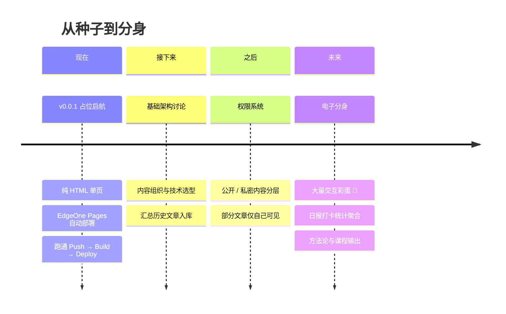

<div align="center">

# 🌌 Blog-YuSheng

**羽升 · 我的电子分身 · 从一颗种子开始生长**

[](https://github.com/AIMFllyYS/Blog-YuSheng)
[](#)
[](https://edgeone.cloud.tencent.com/pages)
[](#-一个诚实的说明)

*这不只是一个博客，这是我留给未来的一份持续更新的自我。*

**网址**：https://blog.yusheng.email · **联系**：contact@yusheng.email

</div>

---

## 🧭 它为什么存在

> 在写下第一行博客之前，先写下它为什么存在。

<table>
<tr>
<td width="50%" valign="top">

### 📈 01 · 记录 — AI 成长轨迹

记录我在 AI 领域的成长经历：从基础架构的分析与摸索开始，
逐步汇总过去写过的内容，让每一步都有迹可循。

`#成长日志` `#AI` `#内容汇总`

</td>
<td width="50%" valign="top">

### 🔒 02 · 私密 — 权限与边界

这个博客首先是**写给我自己的**，所以它必须有价值。
它会记录我过去的很多事情，未来会有权限系统 ——
**有的文章只有我自己能看**。

`#对内价值` `#权限控制`

</td>
</tr>
<tr>
<td width="50%" valign="top">

### 📚 03 · 沉淀 — 方法论输出

当理解足够深，个人经历会被梳理成一套**方法论**，
甚至一套**课程** —— 从记录自己，到帮助大家。

`#知识沉淀` `#课程化`

</td>
<td width="50%" valign="top">

### 🌊 04 · 生活 — 思考与日常

想法、思考的成长、每日日报与打卡统计……
这些内容我随时可以回看，甚至**交给智能体去看** ——
它就是我的另一个**电子分身**。

`#日报` `#打卡` `#电子分身`

</td>
</tr>
</table>

---

## 🗺️ 生长路线



> ⚠️ **架构声明**：当前只做产品层面的简单决策，技术架构会随能力成长而重构。
> 但该有的设计，从第一天就要有。

---

## 🚀 部署链路

本仓库通过 **腾讯云 EdgeOne Pages** 自动部署：

```
git push origin main
      │
      ▼
EdgeOne Pages 监听仓库变更
      │
      ▼
读取 edgeone.json（静态站点，无需构建）
      │
      ▼
分发至全球边缘节点 ⚡
```

| 文件 | 作用 |
|------|------|
| `index.html` | 占位单页 —— 星空粒子 / 打字机 / 3D 卡片 / 彩蛋系统 |
| `edgeone.json` | EdgeOne Pages 部署配置（静态托管 + 缓存与安全头） |
| `README.md` | 你正在看的这份宣言 |

---

## 🥚 彩蛋区

这个博客的信条之一：**一定要有很多很多的彩蛋**。占位页里已经埋了 3 + 1 个：

<details>
<summary>🖱️ 彩蛋一 · 提示：有一张卡片和别的不太一样……</summary>

<br>

在首页找到那张 **🔒 虚线边框** 的卡片，点它一下。

> 🗝️ *你会窥见一角秘密。但真正的秘密，藏在未来的权限系统之后。*

</details>

<details>
<summary>🌱 彩蛋二 · 提示：左上角的名字，敲一敲会醒</summary>

<br>

对着页面左上角的 `YU·SHENG` Logo **连点 5 次**。

> *种子被你敲醒了。*

</details>

<details>
<summary>🌈 彩蛋三 · 提示：老玩家都懂的那串按键</summary>

<br>

在页面上输入 `↑ ↑ ↓ ↓ ← → ← → B A`

> *Konami Code！整片星空会为你变色。*

</details>

<details>
<summary>👀 隐藏款 · 提示：真正的开发者会打开那个东西</summary>

<br>

按 `F12` 打开控制台看看。

> *有些秘密写在代码里。*

</details>

---

## 😴 一个诚实的说明

<details>
<summary>为什么 v0.0.1 只是一个占位页？（点开看一个抽象的理由）</summary>

<br>

> 就很离谱：因为中午吃完饭很困，所以决定先发布这个占位网站，
> 保证自动化部署流程是 OK 的，然后去睡觉。
> 顺便在额度刷新前把当天的模型额度用完。
>
> 对，就是这么抽象的原因。但种子已经种下了。🌱

</details>

---

<div align="center">

**© 2026 羽升 YuSheng**

*一颗会长大的种子 · 用 ♥ 与困意写于一个午后*

</div>
