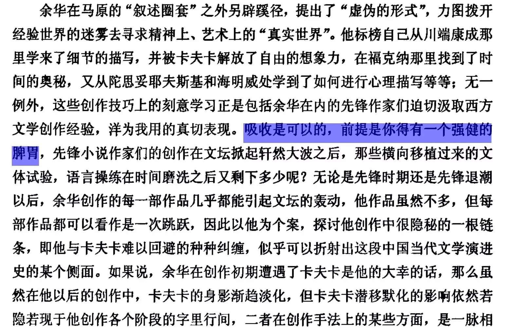

# 吸收，是消化而不是堆砌

感悟 - 吸收

写于25-12-26 关于"吸收"的感悟随笔

个人理解主要是吸收固然重要，但同时要对学到的东西进行筛选，内化再改进，就好比恰饭（混合物），总归是经过体内消化循环后去其糟粕留其精华（主要大分子物质），精华最终也是被人体吸收（氨基酸葡萄糖等小分子）后再次重组为身体物质（蛋白质，多糖等等）

打个比方，以学习剪辑为例，b站各种大佬好比西方文学（属于是先走一路，有过一些特殊艺术手法的积淀），最初学习可能学习混剪/拉片风格（余华早期受川瑞康成细节化描绘情感和场景极深），随后又学习图形转场类视频（打开剪映，主要的模板都是这种）（余华随后受卡夫卡关于荒诞形象反差方式反映社会现实很深），之后你又学习到视频不能只靠剪辑，还有镜头很重要，因此你又学习如何拍摄镜头，譬如跳切，硬切，升格镜头，快闪镜头等等（余华受福克纳关于打乱时间线影响也很深），而后来，你又了解到剪辑时文字配音贴纸等等元素排版也很重要，于是你又一次学习相关技巧（余华受海明威“冰山理论”简洁有力的直接影响）

而如果只是知道这些技巧，只是普通吸收并没有内化理解，譬如只是东拼西凑剪辑手法，首先，失去视频表达内容的核心以及拍给谁看（文章主旨和受众），便会失去灵魂，这个视频纵使形式华丽，但并无意义；其次，核心要想清，譬如拍视频前没搞清楚视频脚本（文章大纲），纵使寓意再深远，谁能看懂？；再者，也是刚刚提到"吸收理解"，每个技巧是点，剪辑时不从混剪风格中明白最基础的剪辑时间轴（混剪一点就是快速闪过各种画面，本质是视频时间属性的影响）和基础的关键帧的原理（透过剪辑形式这个现象，关键帧是带动剪辑所有动画的根基），若不从图形动画类视频剪辑中明白蒙版的核心，若不从镜头运镜中知晓视频镜头画面的重要性以及经典的表现手法（其实单单这里就很复杂，也可以按照上文这个思路拆分），若不去理解所谓贴纸文字类属于排版设计的本质（不是因为大家贴什么类型贴纸去贴，而是为了平衡画面或增添元素等服务于主旨的原因，不是因为什么文字好看或常用而贴什么文字，而是不同文字要讲求适合契合主题与画面，不同类的字体有不同用途），若只知道滤镜而不知道本质是调色（譬如可以多多了解一些最基础的概念，如影阶、色彩曲线等等）那么你很难因为理解而自发<text-mark tone="thesis" effect="fluorescent">从视频目的与受众出发</text-mark>，用自己的内化的理解内容，自下而上地搭建整个视频内容，进而整个视频浑然天成，自成一体（对标当有了充分的写作技巧，便有能力从主旨出发，完全凭借自己撰写真正好的文章，而非只是借用各种手法，但这些手法本身不适合文章）

<html-embed id="understanding-layers" src="./embeds/understanding-layers/index.html" title="点开手法，看它背后的理解" height="620">
原文把混剪追问到时间轴与关键帧，把图形动画追问到蒙版，把贴纸文字追问到排版，把滤镜追问到调色。
</html-embed>

而个人认为，这种内化理解也是不断向下的过程，譬如用上面这套逻辑，你分析剪辑，那么随着你理解越多，专业知识越多，可能你下次就会用这套逻辑单单分析剪辑中的调色，下次就再精细化，分析调色中的影阶（亮度，曝光，饱和，黑白灰，鲜艳度等）

因此就像理解知识要内化清楚，<text-mark tone="thesis" effect="fluorescent">变成你自己的</text-mark>，才能真正推动你的创新，并且内化内容越多，量变引起质变，突破你自己的临界点，由此无限进步。

个人的一点点拙见，希望对大家有帮助，也希望剪辑方面的分享也对大家有帮助！
