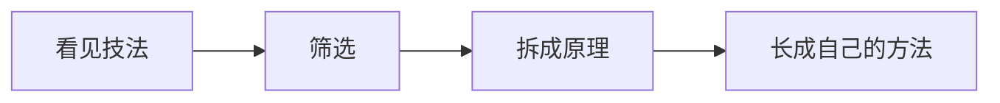

# 吸收，是消化而不是堆砌

写于 25-12-26，关于「吸收」。和当天另一篇《回归本真》不是同一篇。

吸收固然重要，但要对学到的东西筛选、内化、再改进。好比吃饭：混合物进了身体，去其糟粕留其精华，精华被拆成氨基酸和葡萄糖，再重组为蛋白质和多糖。

以剪辑为例。B 站上的大佬像西方文学，先走了一路，有特殊手法的积淀。最初学混剪、拉片（像余华早期受川端细节化描绘的影响），随后学图形转场（打开剪映，模板大多是这种），再明白视频不能只靠剪，镜头很重要，于是学跳切、硬切、升格、快闪，后来又发现文字、配音、贴纸的排版同样关键。

若只是知道这些技巧，没有内化，东拼西凑：

- 没搞清拍给谁看、要表达什么，形式再华丽也没有灵魂；
- 拍前没有脚本，寓意再深，谁能看懂；
- 不从混剪里明白时间轴和关键帧，不从图形动画里明白蒙版，不从运镜里明白画面，不从贴纸文字里明白排版是为了主旨而不是好看，只知道滤镜不知道调色——就很难从目的与受众出发，自下而上搭出浑然的片子。

内化是不断向下的。今天用这套逻辑分析剪辑，下次可能只分析调色，再下次只分析影阶：亮度、曝光、饱和、黑白灰、鲜艳度。理解变成自己的，才能推动创新；内化越多，量变引起质变，突破临界点。一点点拙见，希望对大家有帮助。
