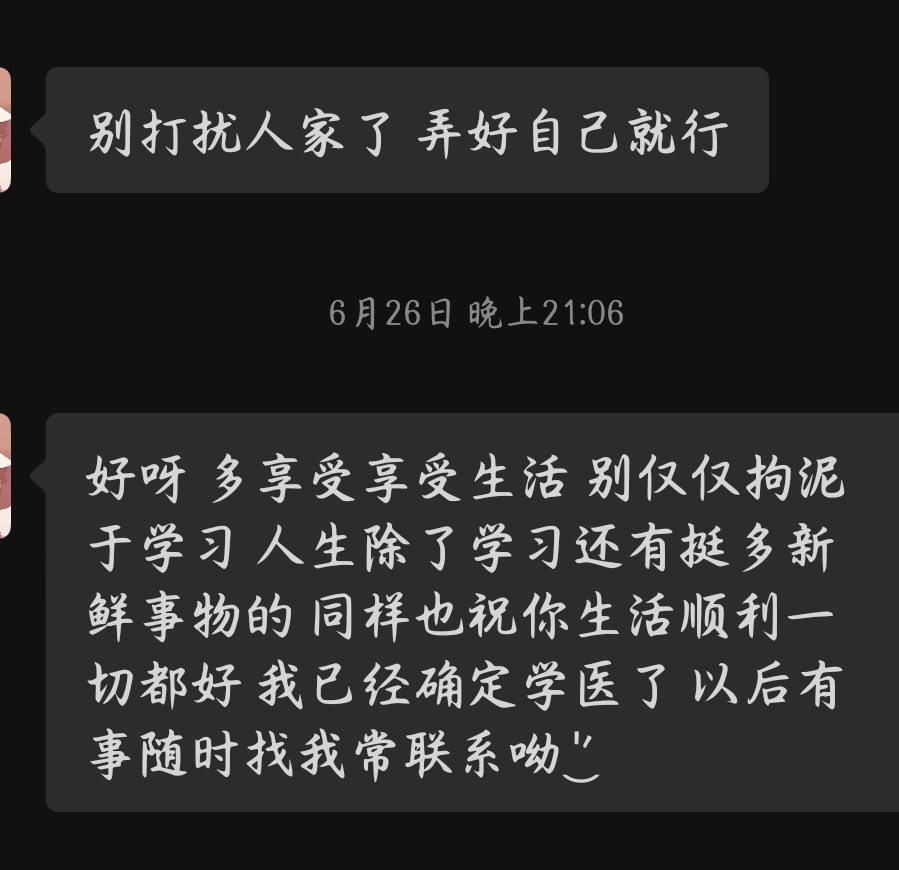
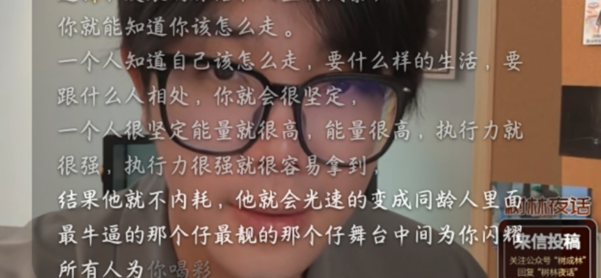

# 《恶意》观后感

《恶意》观后感

写于25-7-8

这部电影让我感触最深的，不只是当今网络时代舆论的反思"射出去的箭，终究会回到自己身上！"；还有两方面，一个是网上对这部电影评价方面繁多，既有可圈可点之处，也在某些方面不尽如人意，不同观点真的能开拓很多思维，最重要的是，没有哪个评论是完全正确的，也没有哪个批评是不值得我们反思的。

另一方面，这部电影也是我的一个契机吧，个人而言，也是以前过于内向了，社交几乎趋近于0，进地瓜群以后真的也是认识到了很多uu，真正见到了各种各样的人，也才真正地开始融入地球这个社会（之前缺乏的常识真的太多了），而也与此带了很多新问题（这里就不具体展开了），还好随着这部电影情节推进，个人心中某些疑问真的就豁然开朗了，人生态度也逐渐有了新的建设吧。

电影中，实质上就是一些善人，即使可能曾经做过一些错事，最终仍是遵循着心中的善，可结果酿造了种种悲哀。（具体感悟就放在下面照片里）

我个人因为一些家庭原因，平时一些小事很容易自我内耗，自我怀疑，常常莫名其妙的焦虑，有时理性过渡去分析种种问题，到头来总归会汇入感性长河，在无法寻得的答案中迷失，只留得无尽孤独与悲伤罢。

我个人也总是容易和他人的种种不易共情，比如老师讲课，我总会过渡为台下纪律担忧，父母艰难地拉扯我长大，而我总是因为想到父母的种种艰辛，不愿去面对父母，甚至不愿去接受他们，真的，我也一直自责自己不能去真心关照他们，即使帮父亲去工地干活，帮母亲去做家务，心中总是会有一些抵触。

再比如和同学聊天，我也总是害怕找不到共同话题，害怕冷场，害怕他人的不在意与忽视，曾经自以为找到了方法，便开始过度去迎合讨好他人，甚至不留余力地去所谓的关系，可无奈的是，高三那段时间一直帮着同学（其实帮助的方面真的很多，而我因此自我内耗的时间更多，我也真的不想去回忆了，我也真的很累），用着自习时间，出了很多题，看着打了很多卡，处处让着对方，最终结果总是因为一些小事争吵，随着曾经的种种授课计划的失败，对方成绩毫无气色，仍是倒数，而自己也是成绩一路下滑，当时本就压力大，对方忽冷忽热的态度搞的自己最后一段时间几近崩溃，很多东西都想不明白。现在来看，主要也是因为当初投入太多，对方和我成绩都是不升反降，最终对方内心过于愧疚，便用冷淡的态度面对我，来寻求一些安慰。实际上最后这段时间我们心理真的都不好受，直到高考后很久... ...再后来，个人就有些不太愿意去帮助别人，说话做事总是犹犹豫豫的，一些事情也老是逃避，我真的太害怕曾经的那种忽视与冷淡了，高考前的那段段时间，之前种种伤真的是刻在心灵深处的。

看电影后，也说不出是哪个片段，一瞬间，似乎看到了外面的一层世界，曾经那些好似心灵受到伤实际上就是我自己对个人思维的束缚罢，之前总于过于狭隘，眼前所见过少，便找不到方向，只是随着高考这条暗流漂泊无依地行进着。"<text-mark tone="thesis" effect="fluorescent">人生除了学习还有很多新鲜事物</text-mark>"，诚哉斯言。

而也许，我真的不应该去嫌弃自己这一言难尽的心理，因为个人原因，我给他人添麻烦的时候不在少数，而我也自认很多时侯，我也总能有着超乎寻常的耐心和担忧，我过去能真的地去感谢缘分，感谢身边每一个人，每一件事，即使是跌跌撞撞。可是扪心自问，在逐步与他人交往中，兴许是我的逐步的自我怀疑，故步自封，是我自己的逃避与对一些事的担忧与畏惧，逐渐让我失去了那份真心吧。

也许，当我们于人生转折之处来一场说走就走的旅行，走出曾经的圈子，静下心，偃仰啸歌，品读人生之书（读名著/与他人谈心），并带着心中的那一份赤诚，<text-mark tone="thesis" effect="fluorescent">和过去的自己和解</text-mark>，去接受心中的那份过于泛滥的感情，去仔细品味体会，去寻找自己真的想做的事，让它成为自己的寄托和目标，有着动力方可前行，而前行中，并不会被卡在一个短期视角自我焦虑内耗，这些我真正感悟出来，也恰恰与林子哥所说的不谋而合:

对自己人生的品读与理解，便是来到这世间，最漫长艰苦的任务，也恰是最有趣又平凡的任务，倾注在生命中的每时每刻，连接着曾经的风风雨雨，又指向无穷远的未来。自己几近是生命的全部，更是生命存在的赞歌，因为我们在思考，而思考永不停息，每一个思考，每一份碰撞，每一处心灵的激荡，就是在人生这个乐谱上，弹出的最动人的歌声。兴许某一天，去回忆这一段熟悉而又陌生的旋律，不再是伴随着歌声，情绪无尽的跌落，而是那种重新寻得自我的感怀（兄弟们，这不比deep seek写的好？！！）

而纵观人生，曾经的我们简单而不染尘埃，所思所想，所行所作亦是如此，随着长大，思考逐步的加深，也愈加的复杂，就像电影里那样，每一个人也许真正都是一个善良之辈，但每一个人的心中总有一些自己所不愿面对的，想的复杂，人性便最是复杂，可何不摒弃那些弯弯绕绕，无论如何，但寻求本心，讲求自己的真性情，不担忧恐惧真心的付出，也可以在未来的某一天毫无保留，仅此而已。

思绪至此，与诸君共勉୧꒰•̀ᴗ•́꒱୨
