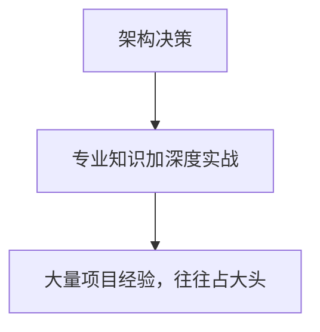
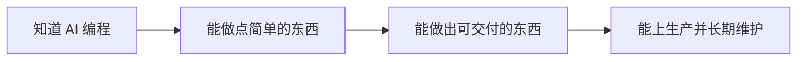
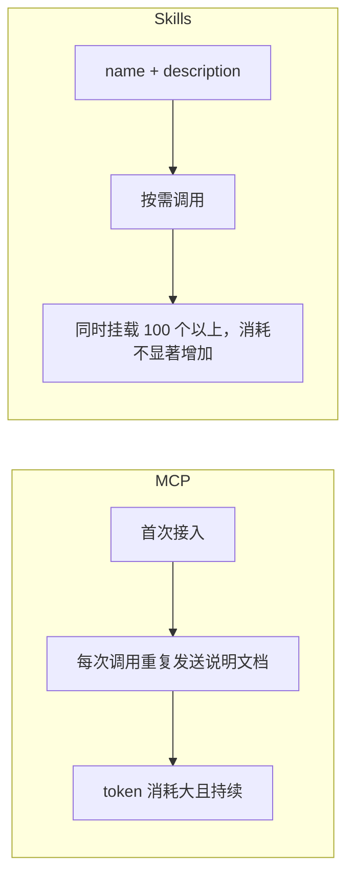

--
schemaVersion: 1
title: AI 编程核心能力体系与工程实践
description: 树成林技术组内部分享下册：从能跑的 demo 到能长期维护的系统，讲耦合、任务拆分、复用与部署常识。
publishedAt: 2026-07-30T00:00:00+08:00
section: fullstack-learning
tags:
  - Agent
  - 架构设计
draft: false
---

# AI 编程核心能力体系与工程实践

这是第二次分享。第一次讲技术组目前的一些问题，说的时候比较激动；冷静下来想一想，肯定有我这个视角分析不到的地方——也许有些内容并不适合直接讲给新手听，这是我当时没有充分考虑到的。上册写在 [AI 技术组发展方向与工程化思维](/blog/ai-coding-engineering-mindset/)。

这一次，我想集中说一个更具体的问题：**如果目标是「大部分单子都能接，并且能对接真正的企业、维持长期合作」，到底需要了解哪些东西？** 这个判断的依据，来自我作为一名基础医学专业的学生，在完全跨专业的情况下，用大半年时间接触 AI 编程、并真正在网安 / 计算机相关企业里做出成果的经历——这不完全是我一个人的结论，也来自我接触到的一些能力很强的计算机博士生和企业从业者的共识。

> 对真正专业的人来说，AI 编程本质上是在用你的软件工程能力去指导 AI 做事情——你不用真的去写代码，但你要知道相关的东西，也要清楚 AI 具体在做什么。
>
> ——语音原述，引自与业内人士交流的共识

## 长期合作的底气从哪里来

大部分人不太敢长期承接总价值较高的大单子。表面原因是「觉得自己知识储备不够」，更深层的原因是：**不清楚结合 AI 能做出的东西边界在哪里，不知道这个东西上线之后会造成什么影响，也不了解背后大体的运行机制。** 心里没底的时候，人可以负责一个周期短的小项目，却很难对一个需要长期维护的项目负责——因为长期项目意味着后面几乎全部时间都要花在维护上。

### 一个真实案例：三端同步的 APP 平台

设想一个「偏大」的项目：一个 APP 平台，网页端、手机端、桌面端三端数据同步。做出一个 demo 很简单，但随着功能越加越多——参考 Kimi 这类功能极其丰富的国内 AI 产品——你会发现即便用再强的模型，到后期也很难再稳定地修复 bug。不是修不了，而是会真切遇到那句程序员老梗：**修一个 bug，冒出三个新 bug**，有时候甚至根本看不出 bug 出在哪。本地跑起来没问题，部署到服务器上用户那边却报错，这在工程实践里是非常正常的现象。

> **为什么会「改一个 bug，冒出三个 bug」**
>
> 大概率是因为代码不够清晰，很多本该拆开的模块被混在了一起，而不是分别放在独立的文件里。这正是下一节要讲的核心问题：**耦合**。

## 高耦合与低耦合：架构决策的第一课

假设一个软件有 A、B、C 三个功能，正常情况下应该分别放在三个独立的文件里，让 AI 能清晰地知道「哪部分代码对应哪个功能」。但 AI 写代码时很容易把这三者堆在同一个地方，于是你改动其中一个，另外两个可能就跟着崩了。这种代码就是 **高耦合**——可维护性很低，改动会「牵一发而动全身」。

<html-embed id="coupling-compare" src="./embeds/coupling-compare/index.html" title="高耦合的意大利面条与低耦合的模块拆分" height="340">
高耦合：A、B、C 堆在一起，改一处全线牵连。低耦合：三个功能分文件、职责单一、改动范围可控。
</html-embed>

想象一个软件有一千多个功能——常见办公软件轻松就能到这个量级。如果功能之间随意混杂，想定位「某个功能对应哪些代码、改动会牵连什么」，会非常费劲，甚至会出现「这个功能本来就有问题，只要改动它，所有项目全崩」的极端情况。这不是危言耸听，而是这类经典程序员梗真实的由来。

低耦合的几条基本要求：

- 代码高复用，不写重复逻辑
- 避免冗余代码
- 代码利于后期维护
- 模块拆分清晰、职责单一
- 单文件不宜过长

这几条规范如果每次都用不同的说法去描述，很容易导致沟通混乱。更好的做法是把整个项目的规范写成文档，让 AI 每次都能同步读取——这就是「以文档驱动」的雏形。

### 架构决策：专业知识加经验

真正能做架构决策，意味着能把一个完整的方案——不管是社群管理草案还是软件系统草案——提前想清楚每一个细节、每一个模块怎么拆分、不同阶段怎么推进，最终落成一份详尽的方案。这项能力需要不断锻炼，也往往需要相关的专业知识；但在前期，更多依靠的是经验，到后期一定是专业知识与经验的结合，而且经验很可能占大头。



## 目标模式与渐进模式

接单场景中一个真实的高效用法：跟 AI 聊上五六个小时，把客户模糊的需求聊清楚，产出一百多条具体计划，然后开启「目标模式」（比如某些工具的 Plan / Auto 模式），用较便宜的模型按计划推进——晚上出门上课，回来时任务大概率已经完成，而且完成质量不错。这套用法有一个前提：**前期要先把模糊需求转译成清晰的工程语言**，能力强一点的人会为此专门写一份 PRD。

> **目标模式最容易踩的坑：无限拆分**
>
> 如果没有清晰的分块验收，AI 在推进复杂任务时会表现得像「芝诺的乌龟」——总觉得自己离目标还差一点，于是不断地把任务再拆细。一个本该分十步走的功能，可能一开始只拆成三步，做到一半发现不行，又拆出两步，如此反复。前期步子迈得太大，会积累大量技术债和代码混乱，越到后期越容易整个崩掉。干了两天却没有任何像样的进展，正是「用力过猛」的目标模式失控的典型信号。

<html-embed id="goal-vs-incremental" src="./embeds/goal-vs-incremental/index.html" title="芝诺乌龟式拆分与小步验收的对比" height="340">
左侧是目标模式失控：拆 3 步、再拆 2 步、永远觉得还差一点。右侧是渐进模式：每次一个简单功能，验收通过再继续。
</html-embed>

### 案例：codex / harness 把「改一个字」做成一件大事

一个常被提到的现象：用某些工具的 harness（如 Codex 系）时，即便任务简单到只是删掉一个字，它也不会直接执行——它会先检查 Git 状态（如果没有 Git，它也会先确认一遍），接着分析需求、列出步骤、写测试代码、跑测试、打开浏览器截图验证……一套流程走下来，明明一分钟能搞定的事，硬生生被拉长。

```text
# 一个「改一个字」任务，在重 harness 下的真实执行链路
1. 检查 Git 状态（或提示未安装 Git）
2. 分析需求、列出步骤
3. 编写测试文件（如 test.ts）
4. 运行测试，确认通过
5. 打开浏览器截图，人工式二次确认
# 而实际只需要：Ctrl+F 定位文字 → 直接改 → 保存
```

> **延伸补充：这不是工具的错，而是「边界感」的问题**
>
> 不了解 AI 简单任务的真实运作方式时，很容易陷入两种极端：要么放任它把简单任务过度复杂化，要么因为嫌麻烦而在系统提示词里把 Git、测试这些「看起来碍事」的能力直接关掉——后者代价更大，下一节会具体展开。多数 IDE 都支持全局查找快捷键（`Ctrl+F`），遇到「只改一个字」这类任务，人工定位往往比等 AI 走完一整套流程更快。

## 新手最容易掉进的坑

### 陷阱一：把不懂的东西直接关掉，等于切断学习通道

一个真实的自我反思案例：最初接触 AI 编程时，误以为所有网站都应该用「HTML 内嵌全部内容」的写法，把本应拆开的结构强行合并，还把这种「自认为正确」的做法强加给 AI，导致 AI 不断按这个错误方向反馈，自己也因此被困在原地、无法进步。

> **更隐蔽的一种版本**
>
> 接触 Git、Skills、MCP 这些概念时，如果因为「暂时用不上、懒得管」，就直接告诉 AI 把它们关掉，看起来项目「变简单了」，实际上是把自己要学的东西全部切断，最终陷入一种「感觉自己什么都会了，实际上什么都不会」的状态。类似地，遇到不了解的架构方式，却坚持只用最简单的单文件 HTML 去写，表面上省心，代价是失去了所有的学习途径。

### 陷阱二：对 AI 输出缺乏求证的习惯

一个需要持续自我提醒的问题：不能默认 AI 输出的每一个字都是对的，即便是经过多次搜索验证的结论，也应该保留一份怀疑和求证的习惯——包括查资料、查论文的时候，也要抱着可以被推翻的态度去看待结果。

### 陷阱三：知其然当作知其所以然的傲慢

另一种容易发生的心理状态是信心逐渐膨胀，觉得自己什么都会了，从而无法清晰、合理地给自己定位——这种傲慢很正常，但需要提醒自己保持谦虚。一个具体的自省：即便已经对接过很多企业、完成过大量单子，也依然会存在「自以为知道、实际上不知道」的知识盲区，尤其容易表现为对不熟悉技术栈的本能排斥。

一次报酬很低（四五十元）、功能极简单（计算 BMI）的接单经历，让人重新意识到自己对某些领域（比如原生安卓 / 小程序开发）其实了解得很有限——从 Java 到 Kotlin 的演进、SDK 与物联网控制指令的打包方式等等，都是此前「本能排斥」而从未认真了解过的领域。这次经历的价值不在时薪，而在于验证了「重视广度」这句话，自己也未必真的做到了。



「知道 AI 编程」、「能用 AI 编程做点简单的东西」、「能用 AI 编程做出可交付的东西」、「能用 AI 编程做出能上生产环境、并长期维护的东西」——这四者之间的差距，远比听起来要大得多。

## 组件库与 SDK：复用是工程的本质

一个非常有代表性的反面案例：从零做一个博客网站，新手常见的推进路径是——先要 Markdown 渲染，再要插入图片，再要思维导图，再要评论区，再要登录功能，再要多人协作编辑……每加一个功能，都让 AI「重新写一遍」。最终会发现一个荒谬的结果：十个内容各不相同的博客页面，每个页面却只对应一份代码，思维导图样式、退出提示这些细节在不同页面里长得还都不一样——一个功能被反复重写十遍，一个原本很简单的博客，硬是堆出了五六万行代码。

<html-embed id="reuse-compare" src="./embeds/reuse-compare/index.html" title="同一个博客项目：手写五到七万行与引入组件库后的几百行" height="320">
从零手写会堆到五到七万行，每个功能重写很多遍；引入富文本、评论、登录等组件库或 SDK 后，往往只需几百行，新增文章常常只要新建内容文件夹。
</html-embed>

问题的核心在于不知道「这一整套东西早已经有人写好了」。带格式的文本渲染、评论系统、登录鉴权、在线协作编辑，这些能力背后几乎都有开源组件库或 SDK：**把组件库下载进项目、引用对应代码**，可能只需要几百行代码就能实现原本要写一万多行才能做到的事情。一旦养成「先找组件库、再考虑手写」的习惯，你会发现复用不仅体现在「少写代码」，更体现在——写完一次之后，以后新增一篇文章，只需要新建一个存放内容的文件夹，不需要再写任何额外代码。

> **对接单的实际意义**
>
> 很多接单需求，本质上是「在一个成熟的开源项目基础上做二次开发」，这完全是合理的路径。它的代价是后期的自定义和维护会更麻烦一些，但用极少的代码、极短的时间、极高的反馈效率去接近目标，这件事本身对接单和交付都非常有利。

### MCP 与 Skills：同样是「能力扩展」，成本差异很大

如果更深入了解会发现，**MCP 不一定是最好的选择**，越来越多软件在转向「Skills + CLI / Agent」的组合方式。原因在于 MCP 的机制：每次加载都会先给 AI 发送一份体量不小的说明文档，AI 每调用一次，都可能要重新传输一次这份说明，非常消耗 token，而且这种消耗往往是「无意义」的。



Skills 的关键设计是 `name` 和 `description` 两个字段——AI 正是通过 description 去判断「什么时候该调用哪个 skill」，而不是把全部内容一次性塞给模型。理解这一层机制之后，即便同时挂载上百个 skills，token 消耗也不会显著增加。

> **延伸补充：理解到这一步，你已经具备做一个小工具的能力**
>
> 一旦搞清楚 Agent 的本质就是「提示词 + 工具调用」（工具可以是网络搜索、写代码、执行命令、调用 Skills 等等），做一个简单的 Agent 类小产品的门槛，其实比想象中低得多——比如一个「Skills 管理器」，市面上已经有人做过类似的产品，这也是一种值得关注的思路。

## 版本管理与协作

版本管理需要简单了解：Git 与 GitHub 的关系是什么，如何通过 GitHub 协作，提交（commit）是什么意思、提交规范是什么，为什么要在不同分支上开发、分支命名和用途的规范是什么，以及分支合并（merge / PR）的基本流程。

> **为什么「不了解 Git」会让 AI 变得很难用**
>
> AI 判断代码是否被修改，依赖的是对比代码前后的哈希值（hash）。如果不了解这个机制，大概率也不会主动去用 Git 版本控制；而不用 Git，AI 就找不到「你过去的代码长什么样」。AI 的上下文并不是一次性把所有代码都记住，而更接近「分片检索」——一旦缺少版本对比的锚点，再强的模型也做不到追溯历史改动，这时候人会很容易陷入「越用越懵」的负反馈循环，尤其是刚入门、身边没人指导的时候。

### 两个经典但值得认真对待的「冷笑话」

热更新（改完代码浏览器自动生效，甚至不用手动刷新）会让人对「保存」这件事变得迟钝——一个常见的排查半天却找不到原因的情况，其实只是「忘了保存文件」。另一种情况是保存了，刷新页面却依然没反应，原因可能是有残留的运行进程 / 缓存产物没有真正应用最新代码，这时候需要 **强制刷新**：

```text
Ctrl + F5              # 常规强制刷新
Ctrl + Shift + R       # 强制清缓存刷新
# 或改用无痕模式 / 更换浏览器排查
```

类似地，改完代码后页面毫无变化，也可能是因为需要重新构建产物——把源代码打包成计算机能识别的二进制文件。这一步对应的包管理器指令也很基础：

```bash
npm run build          # 打包构建产物
# 常见的三大包管理器：npm / pnpm / bun
# 建议新手从 npm 开始，安装 Node.js 时通常会一并装好
```

## 部署与生产环境常识

本地写完代码，是在本地开发服务器上运行；而 **开发环境** 与 **生产环境** 是两回事，很多代码需要同时兼顾两种环境，甚至有些逻辑（比如异常处理机制）只在生产环境才会暴露问题，本地完全复现不出来。一个常见的坑是把只在本地成立的 **绝对路径** 硬编码进代码——路径应该使用相对于当前项目文件夹的 **相对路径**，否则换一个环境就会直接失效。

部署前要搞懂的几个词：

- **域名** 与 **IP** 如何绑定
- **SSL 证书**：为什么网站需要它
- **端口**：本地与线上分别怎么用
- **pm2**：守护进程，保证服务不掉线

打开任何一个开源项目，尤其是 TS / JS 生态里比较活跃的项目，README 会直接告诉你需要安装 Node.js、需要用包管理器安装依赖（可以理解为一个「超大号的组件库」）——这是接手任何陌生项目的第一站。

> **企业级项目最难的议题：数据隔离**
>
> 如果要给企业做 Agent 相关产品，除了跑通功能之外，**数据隔离、生产环境下的并发、系统稳定性** 是必须重视的几个维度，其中数据隔离尤其难做好，也是最容易被新手低估的一环。

## 格式与工具素养

有几种格式建议一定要了解各自的定位：**JSON**、**XML**、**Markdown**、**SVG**。了解完之后，会发现自己对「AI 到底在输出什么」有了明显更清晰的判断力。

| 格式 | 大致定位 |
| --- | --- |
| JSON | 结构化数据交换 |
| XML | 标记式数据描述 |
| Markdown | 轻量级排版语法 |
| SVG | 矢量图形描述 |

专业论文排版通常用 LaTeX，很多公式也是用它渲染的。原因在于：如果用 Word 文档配合 AI 插件去反复调整字号、排版，不仅体验很不稳定，而且相当浪费时间和 token；而如果直接用 LaTeX 来写，线上渲染公式也会顺畅得多。**对任何学生来说，LaTeX 是一定值得专门搜索了解的东西。**

## Agent 的本质：提示词与工具调用

顺着上一节 Skills 的机制往下看，会发现 AI 调用能力的方式，不只局限于调用 Skills——网络搜索、写代码、执行命令，都是「工具」的一种形式。一旦对「搜索」这类工具的实现有了了解，就会发现 **Agent 本质上就是「提示词 + 工具调用」**，原理并不复杂。理解到这一步，把这套理解讲给别人听，就已经具备开发一款简单 Agent 类产品的基础。

> **苏格拉底式追问：一种通用的学习姿势**
>
> 遇到不懂的概念就去追问、去拆解——这个视角几乎可以用在任何地方，用得越多，越会发现很多原本觉得复杂的东西，其实可以被清晰地解释。学习本身，说到底就是「遇到不会的，去问，去发挥自己的学习能力」。

先做设计原型和设计稿，再进入开发；开发过程中遇到任何概念，第一反应应该是去问 AI，把它当作一次深入了解的机会，而不是绕过去。这也是本篇反复强调的一点：广度不需要精通，但每一次「顺手问一句」，都是在为下一次更大的项目积累底气。方向那一层，仍然见 [AI 技术组发展方向与工程化思维](/blog/ai-coding-engineering-mindset/)。

## 尾声

从「能跑起来」到「能长期上线维护」，中间的差距，基本都写在这十二条里。

<html-embed id="twelve-takeaways" src="./embeds/twelve-takeaways/index.html" title="下册十二条最值得带走的结论" height="620">
十二条：边界感、耦合、架构决策、渐进优于冒进、执行层边界感、别切断学习通道、求证习惯、复用是本质、MCP 与 Skills、Git 记忆锚点、生产环境不是开发环境、Agent 不神秘。
</html-embed>

## 附录：给 AI 的说明书

这段提示词的作用：让 AI 读完上册 [AI 技术组发展方向与工程化思维](/blog/ai-coding-engineering-mindset/) 与本篇之后，用 **ELI5**（Explain Like I'm 5，像给完全的新手解释一样）的方式重新讲一遍，并在讲解过程中主动联想、生成一些可以练手的相关小项目；如果你正在做自己的项目，也可以把这段提示词连同你的项目文件一起发给 AI，让它结合这两篇的思路给出更具体的指导。

用法一：直接粘贴给 AI，并附上这两篇（或原来的 PDF 整理稿）。用法二：再接入你自己的项目文件，让 AI 按这个思路指导开发。

```text
# 角色设定
你是一位经验丰富、极其擅长把复杂工程概念讲给完全新手听的技术导师。
接下来我会给你一份/两份材料，来自树成林 AI 社群技术组的两次内部语音分享
整理稿：《AI技术组发展方向与工程化思维分享》（上册）与
《AI编程核心能力体系与工程实践指南》（下册）。

# 你的任务
1. 完整读取并理解这两册内容的核心逻辑：广度优先于深度、可迁移的软件
   工程方法论、耦合与架构决策、目标模式与渐进模式、组件库复用、
   版本管理、部署与生产环境常识、格式素养、Agent 的本质。
2. 用 ELI5 的方式，面向「零基础、完全没写过代码」的读者，
   把书中每一个核心概念重新讲一遍：
   - 先给一个生活化的类比，再落回技术本身；
   - 每讲完一个概念，追加一句「这在实际项目里意味着什么」；
   - 避免堆砌术语，术语第一次出现时用一句话解释清楚。
3. 在讲解每一章内容后，联想并简要给出 1~2 个「新手可以直接上手练习」
   的小项目建议（例如：一个带 Markdown 渲染的个人博客、一个调用
   现成组件库的简易在线协作文档等），说明这个练习具体锻炼了书中
   哪一项能力。
4. 如果用户在这段提示词之外，额外上传了自己的项目文件或代码库：
   请结合本书的方法论（尤其是耦合、复用、版本管理、渐进式任务
   拆分四点），分析该项目当前的结构问题，并给出具体的、分步骤的
   改进建议，而不是泛泛而谈。

# 输出要求
- 全程使用清晰、口语化、循序渐进的中文表达；
- 遇到书中提到但未展开的术语，可以补充你自己的解释，但需要明确
  标注「（这是补充说明，原书未展开）」；
- 结构上按照原书章节顺序讲解，不要打乱逻辑顺序；
- 如果用户追问某一章节的细节，允许脱离 ELI5 风格，转为更专业、
  更深入的讲解。
-- 使用方式：将本段与两册材料一并提供给任意支持长文档理解的 AI 模型 --
```

这段提示词不是要替代阅读本身，而是给那些「读完之后还是有点抽象」的读者，提供一条更快进入状态的路径——尤其适合零基础的新社员，或者想把这个思路套用到自己正在做的具体项目上的同学。
