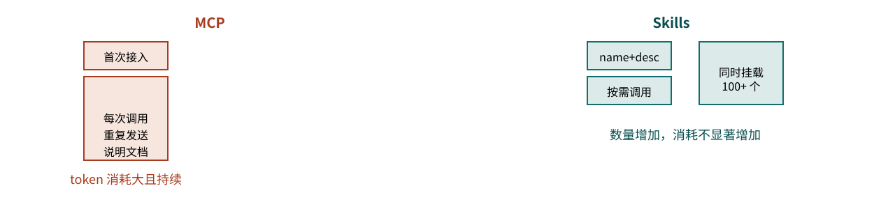

# AI 编程核心能力体系与工程实践

树成林 · AI 社群技术组内部分享

卷二 · 下册

AI 编程
核心能力体系
与工程实践

从"能跑起来的 demo"到"能长期上线维护的系统"，中间隔着耦合设计、任务执行方法论、
组件复用、部署常识与格式素养——这是一份补上这些缺口的实操地图。

整理自 1037Solo（羽升）语音分享
《AI编程核心能力体系与工程实践指南》

树成林 ▸ AI-Native

CONTENTS · 下册目录目录

上册讲的是方向和方法论，本册回到更具体的工程实践层面：
为什么大项目没人敢接、为什么改一个 bug 会冒出三个新 bug、
以及那些真正决定项目能不能"长期活下去"的细节常识。

序 补充与自省 对上一次分享的补充说明与视角限制 05

01 长期合作的底气 为什么大项目没人敢接：认知边界模糊，心里就没底 07

02 高耦合与低耦合 改一个 bug 冒出三个 bug 的真正原因，以及架构决策能力金字塔 11

03 目标模式与渐进模式 芝诺乌龟式的任务拆分陷阱，以及 codex/harness 的真实案例 15

04 新手最容易掉的坑 切断学习通道、过度信任 AI 输出、傲慢陷阱 19

05 组件库与 SDK 从"五六万行代码"到"几百行代码"：复用是工程的本质 23

06 版本管理与协作 没有 Git，AI 就没有可以依赖的记忆锚点 27

07 部署与生产环境 域名、DNS、证书、端口、pm2；以及企业级最看重的数据隔离 29

08 格式与工具素养 JSON / XML / Markdown / SVG，以及 LaTeX 在专业排版中的位置 33

09 Agent 的本质 提示词 + 工具调用；MCP 与 Skills 的取舍；苏格拉底式追问 36

终 尾声与精华提炼 本册十二条最值得带走的结论 39

附 附录：给 AI 的说明书 一段可直接复用的 ELI5 讲解与项目联想提示词 41

## 补充与自省 PREFACE

这是第二次分享。第一次分享讲的主要是技术组目前存在的一些问题，说的时候比较激动，
冷静下来想一想，肯定有我这个视角分析不到的地方——也许有些内容并不适合直接讲给新手听，
这是我当时没有充分考虑到的。

这一次，我想集中说一个更具体的问题：<text-mark tone="thesis">如果目标是"大部分单子都能接，
并且能对接真正的企业、维持长期合作"，到底需要了解哪些东西？</text-mark>
这个判断的依据，来自我作为一名基础医学专业的学生，在完全跨专业的情况下，
用大半年时间接触 AI 编程、并真正在网安/计算机相关企业里做出成果的经历——
这不完全是我一个人的结论，也来自我接触到的一些能力很强的计算机博士生和企业从业者的共识。

对真正专业的人来说，AI 编程本质上是在用你的软件工程能力去指导 AI 做事情——
你不用真的去写代码，但你要知道相关的东西，也要清楚 AI 具体在做什么。
语音原述，引自与业内人士交流的共识

01

Chapter 01 · The Confidence to Commit

长期合作的底气
从哪里来

大部分人不是不敢接大单子，而是不知道 AI 能做出的东西边界在哪、上线后会造成什么影响。

案例：三端同步 APP 项目的复杂度失控

"改一个 bug，冒出三个 bug"是怎么发生的

本地没问题、线上有问题，是正常现象

## 长期合作的底气从哪里来

大部分人不太敢长期承接总价值较高的大单子。表面原因是"觉得自己知识储备不够"，
更深层的原因是：<text-mark tone="thesis" effect="fluorescent">不清楚结合 AI 能做出的东西边界在哪里，不知道这个东西上线之后会造成什么影响，
也不了解背后大体的运行机制</text-mark>。心里没底的时候，人可以负责一个周期短的小项目，
却很难对一个需要长期维护的项目负责——因为长期项目意味着后面几乎全部时间都要花在维护上。

### 一个真实案例：三端同步的 APP 平台

设想一个"偏大"的项目：一个 APP 平台，网页端、手机端、桌面端三端数据同步。
做出一个 demo 很简单，但随着功能越加越多——参考 Kimi 这类功能极其丰富的国内 AI 产品——
你会发现即便用再强的模型，到后期也很难再稳定地修复 bug。不是修不了，
而是会真切遇到那句程序员老梗：<text-mark tone="thesis">修一个 bug，冒出三个新 bug</text-mark>，
有时候甚至根本看不出 bug 出在哪。本地跑起来没问题，部署到服务器上用户那边却报错，
这在工程实践里是非常正常的现象。

<aside-note id="source-note-1" kind="callout">

为什么会"改一个 bug，冒出三个 bug"

大概率是因为代码不够清晰，很多本该拆开的模块被混在了一起，而不是分别放在独立的文件里。
这正是下一章要讲的核心问题：<text-mark tone="thesis">耦合</text-mark>。
</aside-note>

02

Chapter 02 · Coupling \& Architecture

高耦合与低耦合
架构决策的第一课

改一发而动全身的代码，本质上都是同一个问题：该分开的东西，被混在了一起。

高耦合：一个功能出错，全项目崩溃

低耦合：模块拆分清晰，改动可控

架构决策能力 = 专业知识 + 大量实战经验

## 高耦合与低耦合：架构决策的第一课

假设一个软件有 A、B、C 三个功能，正常情况下应该分别放在三个独立的文件里，
让 AI 能清晰地知道"哪部分代码对应哪个功能"。但 AI 写代码时很容易把这三者堆在同一个地方，
于是你改动其中一个，另外两个可能就跟着崩了。这种代码就是<text-mark tone="thesis">高耦合</text-mark>——
可维护性很低，改动会"牵一发而动全身"。

<svg-embed id="source-diagram-02" src="./media/svg/source-diagram-02.svg" title="原稿图示 02" />

图 2-1　高耦合（意大利面条式）与低耦合（模块化）的直观对比

想象一个软件有一千多个功能——常见办公软件轻松就能到这个量级。如果功能之间随意混杂，
想定位"某个功能对应哪些代码、改动会牵连什么"，会非常费劲，甚至会出现"这个功能本来就有问题，
只要改动它，所有项目全崩"的极端情况。这不是危言耸听，而是这类经典程序员梗真实的由来。

<inset-card id="source-card-1" title="原文卡片 01">
#### 低耦合的几条基本要求

<html-embed id="coupling-switchboard" src="./embeds/coupling-switchboard/index.html" title="点选功能：观察耦合的影响范围" height="580">
点选 A、B、C 并切换高低耦合，观察这个简化例子中的潜在改动范围；不是对真实项目的自动诊断。
</html-embed>

- 代码高复用，不写重复逻辑
- 避免冗余代码
- 代码利于后期维护
- 模块拆分清晰、职责单一
- 单文件不宜过长
</inset-card>

<inset-card id="source-card-2" title="原文卡片 02">
#### 为什么要"用术语跟 AI 说"

这几条规范如果每次都用不同的说法去描述，很容易导致沟通混乱。
更好的做法是把整个项目的规范写成文档，让 AI 每次都能同步读取——
这就是"以文档驱动"的雏形。
</inset-card>

### 架构决策：一种需要专业知识 + 经验共同支撑的能力

真正能做架构决策，意味着能把一个完整的方案——不管是社群管理草案还是软件系统草案——
提前想清楚每一个细节、每一个模块怎么拆分、不同阶段怎么推进，最终落成一份详尽的方案。
这项能力需要不断锻炼，也往往需要相关的专业知识；但在前期，更多依靠的是经验，
到后期一定是专业知识与经验的结合，而且经验很可能占大头。

<svg-embed id="source-diagram-03" src="./media/svg/source-diagram-03.svg" title="原稿图示 03" />

图 2-2　架构决策能力金字塔

03

Chapter 03 · Goal Mode vs Incremental Mode

目标模式
与渐进模式

把一个模糊需求直接丢给 AI 长时间自主推进，看似省事，往往是灾难的开始。

芝诺乌龟式的无限拆分

codex / harness 过度执行的真实案例

渐进模式：小步快跑、每步验收

## 目标模式与渐进模式

接单场景中一个真实的高效用法：跟 AI 聊上五六个小时，把客户模糊的需求聊清楚，
产出一百多条具体计划，然后开启"目标模式"（比如某些工具的 Plan/Auto 模式），
用较便宜的模型按计划推进——晚上出门上课，回来时任务大概率已经完成，而且完成质量不错。
这套用法有一个前提：<text-mark tone="thesis">前期要先把模糊需求转译成清晰的工程语言</text-mark>，
能力强一点的人会为此专门写一份 PRD。

<aside-note id="source-note-2" kind="warn">

目标模式最容易踩的坑：无限拆分

如果没有清晰的分块验收，AI 在推进复杂任务时会表现得像"芝诺的乌龟"——
总觉得自己离目标还差一点，于是不断地把任务再拆细。一个本该分十步走的功能，
可能一开始只拆成三步，做到一半发现不行，又拆出两步，如此反复。
前期步子迈得太大，会积累大量技术债和代码混乱，越到后期越容易整个崩掉——
干了两天却没有任何像样的进展，正是"用力过猛"的目标模式失控的典型信号。
</aside-note>

<svg-embed id="source-diagram-05" src="./media/svg/source-diagram-05.svg" title="原稿图示 05" />

图 3-1　目标模式的失控路径，与渐进模式的稳态推进

### 案例：codex/harness 把"改一个字"做成一件大事

一个常被提到的现象：用某些工具的 harness（如 codex 系）时，即便任务简单到只是删掉一个字，
它也不会直接执行——它会先检查 Git 状态（如果没有 Git，它也会先确认一遍），
接着分析需求、列出步骤、写测试代码、跑测试、打开浏览器截图验证……
一套流程走下来，明明一分钟能搞定的事，硬生生被拉长。

\# 一个"改一个字"任务，在重 harness 下的真实执行链路
1\.检查 Git 状态（或提示未安装 Git）
2\.分析需求、列出步骤
3\.编写测试文件（如 test.ts）
4\.运行测试，确认通过
5\.打开浏览器截图，人工式二次确认
\# 而实际只需要：Ctrl+F 定位文字 → 直接改 → 保存

<aside-note id="source-note-3" kind="addon">
延伸补充

这不是工具的错，而是"边界感"的问题

不了解 AI 简单任务的真实运作方式时，很容易陷入两种极端：要么放任它把简单任务过度复杂化，
要么因为嫌麻烦而在系统提示词里把 Git、测试这些"看起来碍事"的能力直接关掉——
后者代价更大，下一章会具体展开。多数 IDE 都支持全局查找快捷键（Ctrl+F），
遇到"只改一个字"这类任务，人工定位往往比等 AI 走完一整套流程更快。
</aside-note>

04

Chapter 04 · Beginner Traps

新手最容易
掉进的坑

把不懂的功能关掉，看似省心，实际上切断了自己所有的学习通道。

陷阱一：把不理解的能力直接关掉

陷阱二：对 AI 输出缺乏求证习惯

陷阱三：知其然当作知其所以然的傲慢

## 新手最容易掉进的坑

### 陷阱一：把不懂的东西直接关掉，等于切断学习通道

一个真实的自我反思案例：最初接触 AI 编程时，误以为所有网站都应该用"HTML 内嵌全部内容"的写法，
把本应拆开的结构强行合并，还把这种"自认为正确"的做法强加给 AI，导致 AI 不断按这个错误方向反馈，
自己也因此被困在原地、无法进步。

<aside-note id="source-note-4" kind="warn">

更隐蔽的一种版本

接触 Git、Skills、MCP 这些概念时，如果因为"暂时用不上、懒得管"，就直接告诉 AI 把它们关掉，
看起来项目"变简单了"，实际上是把自己要学的东西全部切断，最终陷入一种"感觉自己什么都会了，
实际上什么都不会"的状态。类似地，遇到不了解的架构方式，却坚持只用最简单的单文件 HTML 去写，
表面上省心，代价是失去了所有的学习途径。
</aside-note>

### 陷阱二：对 AI 输出缺乏求证的习惯

一个需要持续自我提醒的问题：不能默认 AI 输出的每一个字都是对的，
即便是经过多次搜索验证的结论，也应该保留一份怀疑和求证的习惯——
包括查资料、查论文的时候，也要抱着可以被推翻的态度去看待结果。

### 陷阱三：知其然当作知其所以然的傲慢

另一种容易发生的心理状态是信心逐渐膨胀，觉得自己什么都会了，
从而无法清晰、合理地给自己定位——这种傲慢很正常，但需要提醒自己保持谦虚。
一个具体的自省：即便已经对接过很多企业、完成过大量单子，也依然会存在"自以为知道、
实际上不知道"的知识盲区，尤其容易表现为对不熟悉技术栈的本能排斥。

<aside-note id="source-note-5" kind="callout">

案例：一个 50 元的小程序订单

一次报酬很低（四五十元）、功能极简单（计算 BMI）的接单经历，
让人重新意识到自己对某些领域（比如原生安卓/小程序开发）其实了解得很有限——
从 Java 到 Kotlin 的演进、SDK 与物联网控制指令的打包方式等等，
都是此前"本能排斥"而从未认真了解过的领域。这次经历的价值不在时薪，
而在于验证了"重视广度"这句话，自己也未必真的做到了。
</aside-note>

<aside-note id="source-note-6" kind="callout">

四个层次的真实差距

"知道 AI 编程"、"能用 AI 编程做点简单的东西"、"能用 AI 编程做出可交付的东西"、
"能用 AI 编程做出能上生产环境、并长期维护的东西"——这四者之间的差距，
远比听起来要大得多。
</aside-note>

05

Chapter 05 · Component Libraries \& SDKs

组件库与 SDK
复用是工程的本质

同一个博客项目，从"每次都重写一遍"到"引入组件库"，代码量能差出上百倍。

案例：博客项目从 5-7 万行到几百行

富文本、评论、登录都有现成组件库

MCP 与 Skills 的 token 消耗差异

## 组件库与 SDK：复用是工程的本质

一个非常有代表性的反面案例：从零做一个博客网站，新手常见的推进路径是——
先要 Markdown 渲染，再要插入图片，再要思维导图，再要评论区，再要登录功能，
再要多人协作编辑……每加一个功能，都让 AI"重新写一遍"。最终会发现一个荒谬的结果：
十个内容各不相同的博客页面，每个页面却只对应一份代码，思维导图样式、退出提示这些细节
在不同页面里长得还都不一样——一个功能被反复重写十遍，一个原本很简单的博客，
硬是堆出了五六万行代码。

<svg-embed id="source-diagram-09" src="./media/svg/source-diagram-09.svg" title="原稿图示 09" />

图 5-1　同一个博客项目：手写 vs 引入组件库的代码量对比

问题的核心在于不知道"这一整套东西早已经有人写好了"。带格式的文本渲染、评论系统、
登录鉴权、在线协作编辑，这些能力背后几乎都有开源组件库或 SDK：<text-mark tone="thesis">把组件库下载进项目、
引用对应代码</text-mark>，可能只需要几百行代码就能实现原本要写一万多行才能做到的事情。
一旦养成"先找组件库、再考虑手写"的习惯，你会发现复用不仅体现在"少写代码"，
更体现在——写完一次之后，以后新增一篇文章，只需要新建一个存放内容的文件夹，
不需要再写任何额外代码。

<aside-note id="source-note-7" kind="callout">

对接单的实际意义

很多接单需求，本质上是"在一个成熟的开源项目基础上做二次开发"，这完全是合理的路径。
它的代价是后期的自定义和维护会更麻烦一些，但用极少的代码、极短的时间、
极高的反馈效率去接近目标，这件事本身对接单和交付都非常有利。
</aside-note>

### MCP 与 Skills：同样是"能力扩展"，成本差异很大

如果更深入了解会发现，<text-mark tone="thesis">MCP 不一定是最好的选择</text-mark>，越来越多软件在转向
"Skills + CLI/Agent"的组合方式。原因在于 MCP 的机制：每次加载都会先给 AI 发送一份体量不小的说明文档，
AI 每调用一次，都可能要重新传输一次这份说明，非常消耗 token，而且这种消耗往往是"无意义"的。

图 5-2　MCP 与 Skills 的 token 消耗模式对比

Skills 的关键设计是 name和
description两个字段——AI 正是通过
description 去判断"什么时候该调用哪个 skill"，而不是把全部内容一次性塞给模型。
理解这一层机制之后，即便同时挂载上百个 skills，token 消耗也不会显著增加。

<aside-note id="source-note-8" kind="addon">
延伸补充

理解到这一步，你已经具备做一个小工具的能力

一旦搞清楚 Agent 的本质就是"提示词 + 工具调用"（工具可以是网络搜索、写代码、执行命令、
调用 Skills 等等），做一个简单的 Agent 类小产品的门槛，其实比想象中低得多——
比如一个"Skills 管理器"，市面上已经有人做过类似的产品，这也是一种值得关注的思路。
</aside-note>

06

Chapter 06 · Version Control \& Collaboration

版本管理
与协作

没有 Git，AI 就没有可以对比、可以依赖的"过去"。

commit / branch / merge 的基本规范

Git 与 GitHub 的关系

为什么"没保存""没刷新"是最坑的经典冷笑话

## 版本管理与协作

版本管理需要简单了解：Git 与 GitHub 的关系是什么，如何通过 GitHub 协作，
提交（commit）是什么意思、提交规范是什么，为什么要在不同分支上开发、
分支命名和用途的规范是什么，以及分支合并（merge / PR）的基本流程。

<aside-note id="source-note-9" kind="callout">

为什么"不了解 Git"会让 AI 变得很难用

AI 判断代码是否被修改，依赖的是对比代码前后的哈希值（hash）。
如果不了解这个机制，大概率也不会主动去用 Git 版本控制；而不用 Git，
AI 就找不到"你过去的代码长什么样"。AI 的上下文并不是一次性把所有代码都记住，
而更接近"分片检索"——一旦缺少版本对比的锚点，再强的模型也做不到追溯历史改动，
这时候人会很容易陷入"越用越懵"的负反馈循环，尤其是刚入门、身边没人指导的时候。
</aside-note>

### 两个经典但值得认真对待的"冷笑话"

热更新（改完代码浏览器自动生效，甚至不用手动刷新）会让人对"保存"这件事变得迟钝——
一个常见的排查半天却找不到原因的情况，其实只是"忘了保存文件"。
另一种情况是保存了，刷新页面却依然没反应，原因可能是有残留的运行进程/缓存产物
没有真正应用最新代码，这时候需要<text-mark tone="thesis">强制刷新</text-mark>：

Ctrl\+ F5\# 常规强制刷新
Ctrl\+ Shift\+ R\# 强制清缓存刷新
\# 或改用无痕模式 / 更换浏览器排查

类似地，改完代码后页面毫无变化，也可能是因为需要重新构建产物——
把源代码打包成计算机能识别的二进制文件。这一步对应的包管理器指令也很基础：

npm run build\# 打包构建产物
\# 常见的三大包管理器：npm / pnpm / bun
\# 建议新手从 npm 开始，安装 Node.js 时通常会一并装好

07

Chapter 07 · Deployment \& Production

部署与
生产环境常识

开发环境能跑，不代表生产环境没问题；数据隔离，是企业级项目最难也最重要的议题。

域名 / DNS / SSL 证书 / 端口 / pm2

绝对路径与相对路径

数据隔离、并发、稳定性

## 部署与生产环境常识

本地写完代码，是在本地开发服务器上运行；而<text-mark tone="thesis">开发环境</text-mark>与<text-mark tone="thesis">生产环境</text-mark>
是两回事，很多代码需要同时兼顾两种环境，甚至有些逻辑（比如异常处理机制）只在生产环境才会暴露问题，
本地完全复现不出来。一个常见的坑是把只在本地成立的<text-mark tone="thesis">绝对路径</text-mark>硬编码进代码——
路径应该使用相对于当前项目文件夹的<text-mark tone="thesis">相对路径</text-mark>，否则换一个环境就会直接失效。

<inset-card id="source-card-3" title="原文卡片 03">
#### 部署前要搞懂的几个词

- <text-mark tone="thesis">域名</text-mark>与 <text-mark tone="thesis">IP</text-mark>如何绑定
- <text-mark tone="thesis">SSL 证书</text-mark>：为什么网站需要它
- <text-mark tone="thesis">端口</text-mark>：本地与线上分别怎么用
- <text-mark tone="thesis">pm2</text-mark>：守护进程，保证服务不掉线
</inset-card>

<inset-card id="source-card-4" title="原文卡片 04">
#### README.md 为什么重要

打开任何一个开源项目，尤其是 TS/JS 生态里比较活跃的项目，
README 会直接告诉你需要安装 Node.js、需要用包管理器安装依赖
（可以理解为一个"超大号的组件库"）——这是接手任何陌生项目的第一站。
</inset-card>

<aside-note id="source-note-10" kind="warn">

企业级项目最难的议题：数据隔离

如果要给企业做 Agent 相关产品，除了跑通功能之外，
<text-mark tone="thesis">数据隔离、生产环境下的并发、系统稳定性</text-mark>是必须重视的几个维度，
其中数据隔离尤其难做好，也是最容易被新手低估的一环。
</aside-note>

08

Chapter 08 · Format Literacy

格式与
工具素养

JSON、XML、Markdown、SVG——这四种格式，是和 AI 打交道时绕不开的通用语言。

四种基础格式的定位

LaTeX：专业论文排版为什么要用它

了解越多，越能验收 AI 产出

## 格式与工具素养

有几种格式建议一定要了解各自的定位：<text-mark tone="thesis">JSON</text-mark>、<text-mark tone="thesis">XML</text-mark>、
<text-mark tone="thesis">Markdown</text-mark>、<text-mark tone="thesis">SVG</text-mark>。了解完之后，会发现自己对"AI 到底在输出什么"
有了明显更清晰的判断力。

JSON · 结构化数据交换
XML · 标记式数据描述
Markdown · 轻量级排版语法
SVG · 矢量图形描述

### LaTeX：为什么专业论文排版离不开它

专业论文排版通常用 LaTeX（下文简称 LaTeX），
很多公式也是用它渲染的。原因在于：如果用 Word 文档配合 AI 插件去反复调整字号、排版，
不仅体验很不稳定，而且相当浪费时间和 token；而如果直接用 LaTeX 来写，
线上渲染公式也会顺畅得多。<text-mark tone="thesis" effect="fluorescent">对任何学生来说，LaTeX 是一定值得专门搜索了解的东西</text-mark>。

09

Chapter 09 · The Nature of Agents

Agent 的本质
提示词 + 工具调用

一旦看懂这一层，做一个简单的 Agent 类产品，并没有想象中那么神秘。

Agent = 提示词 + 可调用的工具集合

苏格拉底式追问：最好用的学习方法

遇到不会的，去问；这就是学习本身

## Agent 的本质：提示词与工具调用

顺着上一章 Skills 的机制往下看，会发现 AI 调用能力的方式，
不只局限于调用 Skills——网络搜索、写代码、执行命令，都是"工具"的一种形式。
一旦对"搜索"这类工具的实现有了了解，就会发现 <text-mark tone="thesis">Agent 本质上就是"提示词 + 工具调用"</text-mark>，
原理并不复杂。理解到这一步，把这套理解讲给别人听，就已经具备开发一款简单 Agent 类产品的基础。

<aside-note id="source-note-11" kind="callout">

苏格拉底式追问：一种通用的学习姿势

遇到不懂的概念就去追问、去拆解——这个视角几乎可以用在任何地方，
用得越多，越会发现很多原本觉得复杂的东西，其实可以被清晰地解释。
学习本身，说到底就是"遇到不会的，去问，去发挥自己的学习能力"。
</aside-note>

<aside-note id="source-note-12" kind="callout">

关于开发的整体流程

先做设计原型和设计稿，再进入开发；开发过程中遇到任何概念，
第一反应应该是去问 AI，把它当作一次深入了解的机会，而不是绕过去。
这也是本册反复强调的一点：广度不需要精通，但每一次"顺手问一句"，
都是在为下一次更大的项目积累底气。
</aside-note>

终

EPILOGUE · 尾声

十二条最值得
带走的结论

从"能跑起来"到"能长期上线维护"，中间的差距，基本都写在这十二条里。

01 边界感敢不敢接长期大单，取决于是否清楚 AI 能力边界和上线后的影响面。

02 耦合改一个 bug 冒出三个 bug，根源几乎都是模块该拆没拆。

03 架构决策= 专业知识 + 大量实战经验，经验往往占大头。

04 渐进优于冒进目标模式要建立在清晰的分块验收之上，否则容易陷入无限拆分。

05 边界感（执行层）改一个字的任务，不需要重 harness 走完整流程。

06 别切断学习通道把不懂的功能关掉看似省心，代价是失去继续成长的入口。

07 求证习惯AI 的输出不是每个字都对，保留一份可以被推翻的怀疑。

08 复用是本质组件库和 SDK 能把几万行代码压缩到几百行。

09 MCP vs SkillsSkills 靠 description 按需调用，比 MCP 更省 token。

10 没有 Git 就没有记忆锚点AI 依赖哈希对比历史代码，版本控制是它"记得住"的前提。

11 生产环境不是开发环境数据隔离、并发、稳定性，是企业级项目最容易被低估的部分。

12 Agent 不神秘本质是提示词加工具调用，看懂这层就能自己动手做一个。

AI 工程内参 · 下册
树成林 ▸ AI-Native

附

Appendix · 附赠提示词

给 AI 的说明书
一段可直接复用的提示词

把这两册书交给任意一个 AI，用这段提示词，就能让它用 ELI5 的方式把内容讲给完全的新手听，
并结合你正在做的项目给出具体建议。

用法一：直接粘贴给 AI + 关联本系列 PDF

用法二：接入你自己的项目文件，让 AI 按本书思路指导开发

## 附录：给 AI 的说明书 APPENDIX

这段提示词的作用：让 AI 读完《AI技术组发展方向与工程化思维分享》上下两册的内容后，
用 <text-mark tone="thesis">ELI5</text-mark>（Explain Like I'm 5，像给完全的新手解释一样）的方式重新讲一遍，
并在讲解过程中主动联想、生成一些可以练手的相关小项目；如果你正在做自己的项目，
也可以把这段提示词连同你的项目文件一起发给 AI，让它结合本书的思路给出更具体的指导。

\# 角色设定
你是一位经验丰富、极其擅长把复杂工程概念讲给完全新手听的技术导师。
接下来我会给你一份/两份 PDF 材料，来自树成林 AI 社群技术组的两次内部语音分享
整理稿：《AI技术组发展方向与工程化思维分享》（上册）与
《AI编程核心能力体系与工程实践指南》（下册）。

\# 你的任务
1\. 完整读取并理解这两册内容的核心逻辑：广度优先于深度、可迁移的软件
工程方法论、耦合与架构决策、目标模式与渐进模式、组件库复用、
版本管理、部署与生产环境常识、格式素养、Agent 的本质。
2\. 用 ELI5的方式，面向"零基础、完全没写过代码"的读者，
把书中每一个核心概念重新讲一遍：
\- 先给一个生活化的类比，再落回技术本身；
\- 每讲完一个概念，追加一句"这在实际项目里意味着什么"；
\- 避免堆砌术语，术语第一次出现时用一句话解释清楚。
3\. 在讲解每一章内容后，联想并简要给出 1\~2 个"新手可以直接上手练习"
的小项目建议（例如：一个带 Markdown 渲染的个人博客、一个调用
现成组件库的简易在线协作文档等），说明这个练习具体锻炼了书中
哪一项能力。
4\. 如果用户在这段提示词之外，额外上传了自己的项目文件或代码库：
请结合本书的方法论（尤其是耦合、复用、版本管理、渐进式任务
拆分四点），分析该项目当前的结构问题，并给出具体的、分步骤的
改进建议，而不是泛泛而谈。

\# 输出要求
\- 全程使用清晰、口语化、循序渐进的中文表达；
\- 遇到书中提到但未展开的术语，可以补充你自己的解释，但需要明确
标注"（这是补充说明，原书未展开）"；
\- 结构上按照原书章节顺序讲解，不要打乱逻辑顺序；
\- 如果用户追问某一章节的细节，允许脱离 ELI5 风格，转为更专业、
更深入的讲解。
-- 使用方式：将本段与两册 PDF 一并提供给任意支持长文档理解的 AI 模型 --

<aside-note id="source-note-13" kind="callout">

关于这份附录

这段提示词不是要替代阅读本身，而是给那些"读完之后还是有点抽象"的读者，
提供一条更快进入状态的路径——尤其适合零基础的新社员，或者想把本书思路
套用到自己正在做的具体项目上的同学。
</aside-note>
