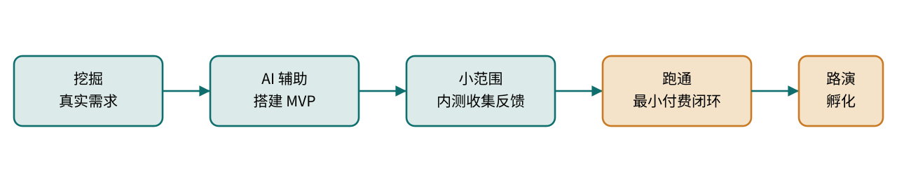

# AI 技术组发展方向与工程化思维

树成林 · AI 社群技术组内部分享

卷一 · 上册

AI 技术组
发展方向
与工程化思维

一份来自一线的口播实录整理：为什么"只做前端页面"走不远，
为什么广度比深度更早决定天花板，以及一个非科班学生如何用一年时间，
把 AI 编程做成可以对接真实企业的能力。

整理自 1037Solo（羽升）语音分享
《AI技术组发展方向与工程化思维分享》

树成林 ▸ AI-Native

CONTENTS · 上册目录目录

本册面向刚进入技术组、或正在摸索 AI 编程接单方向的同学，核心讲一件事：

在"能跑起来"之上，还有"广度""方法论""产品化"三层台阶，它们才是决定你能走多远的东西。

序 写在前面 分享者是谁、为什么要说这些不太中听的话 05

01 深度不是终点 技术组普遍存在的"广度缺口"，以及为什么它比技法更重要 07

02 同质化的方法论 语言学不完，但底层的软件工程思维可以迁移到任何板块 11

03 从中转站到产品 OPC 式独立开发者路径：需求挖掘、MVP、内测、商业闭环 15

04 UI 与 UX 不是一回事 前端好看只是及格线，交互顺不顺手才是产品的命门 21

05 绕不开的基础设施常识 域名、DNS、证书、部署——技术组必须共享的最小词汇表 25

06 模型不是越贵越好 用经验换成本：定位准确时，便宜模型也能打 29

07 从编码到软件工程 先学会指挥，再学会深潜；操作系统与算法导论的位置 33

终 尾声与精华提炼 本册十条最值得带走的结论 37

## 写在前面 PREFACE

大家好，这是一次以录音形式整理的分享，主题是我认为咱们树成林 AI 社群里，
关于 <text-mark tone="thesis">AI 技术组方向</text-mark>——尤其是偏 AI 技术方向的闲鱼接单——目前存在的一些比较大的问题。
这些问题是我这一年多摸索下来真切感受到的，想借这个机会和大家交流一下。

在说具体内容之前，我想先花一点篇幅说明我是谁、做过什么。不是为了自夸，
而是因为接下来的很多判断听起来会有点"刺耳"，如果不先说清楚我的依据来自哪里，
这些话很容易被当成空谈。

投入强度

AI 编程方向约一年经验；最近半年，每天与 AI 协同编程的时长常在 20 小时以上，基本没有中断过。

企业合作

与两家企业保持深度合作，交付过多个 AI 智能体方向的项目。

赛事成绩

国内规模最大的黑客松之一：极限赛道三等奖（连续高强度作战的极限赛制，含金量较高）；

全国大学生计算机应用能力大赛 AIGC 创新赛：省级二等奖；

华中科技大学（985）校级智能体大赛：作为基础医学专业的非科班学生，带队获得决赛三等奖——同组获奖者几乎全部来自计算机、网安等对口专业。

<aside-note id="source-note-1" kind="callout">

为什么要先说这些

不是想强调"我比你们厉害"，而是想说明：接下来这些关于技术组问题的判断，
不是凭空批评，而是踩过路、拿过结果之后回头看到的坑。希望大家带着这份背景，
去评估这些观点是否值得参考，而不是照单全收。
</aside-note>

<aside-note id="source-note-2" kind="addon">
延伸补充

关于"经历先行"的分享方式

用履历建立可信度，是技术分享里很常见也很朴素的做法——听众没有义务无条件相信一个陌生的判断，
先给出"我是在什么位置上说这句话"的坐标，能帮大家更准确地判断这些经验哪些可以直接搬，哪些需要按自己的情况打折扣。
</aside-note>

01

Chapter 01 · Breadth Over Depth

深度不是终点
广度才是护城河

技术组普遍的问题不是"专业知识钻得不够深"，而是对整个技术版图的宽度缺乏认知——把自己焊死在了前端页面上。

为什么"做网站"比"做一张图"复杂得多

计算机是当代最庞大的学科集群之一

前端只是技术版图里很小的一角

## 深度不是终点，广度才是护城河

先说结论：<text-mark tone="thesis" effect="fluorescent">整个技术板块，大家目前的问题不是"钻研得不够深"，而是对技术的广度缺乏基本认知</text-mark>。
这句话需要拆开说。搞 AI 相关方向，不需要在某一个专业知识点上钻研得多深，但你需要对整个技术版图的宽度有基本的了解。

咱们社群里，前端页面做得已经是顶级水平了；AI 生图板块，我认为放到全国比也是数一数二；
AI 视频板块很多人也达到了很高的水准；AI 文案板块更不用说，有林子哥这样的人在带。
这几块都不会有问题，因为都有很厉害的人在把关。真正缺人补的，是 <text-mark tone="thesis">AI 技术方向</text-mark>——
不是"会不会写代码"意义上的技术，而是对"所有基础设施本质上都是软件、都是代码"这件事有没有认知。

### 为什么生图/生视频的"变化性"远低于写代码

AI 生图或生视频，说到底产出物就是一张图、一段视频，构图、摄影、灯光有很多讲究，
但它始终聚焦在一个相对单一的产出形态上。而网站和代码不一样：你的手机是代码，
硬件本质上也和代码脱不开关系，各种云服务平台、SaaS 平台、第三方接口，
学校里的智慧网络、飞书这类办公系统，追根溯源全都是"网站/代码"这件事的不同切面。
对应到高校专业设置上，这背后是网络安全、计算机科学、软件工程、软科等一整个庞大的专业集群，
而生图/生视频对应的专业范围要窄得多。

<svg-embed id="source-diagram-02" src="./media/svg/source-diagram-02.svg" title="原稿图示 02" />

图 1-1　"聚焦型产出"与"计算机学科集群"的规模对比示意

### 真正有技术含量的，是同质化的方法论

世界上的编程语言太多了，没有人能全部学完。真正重要的不是学会某一门语言，
而是通过学一门语言（比如 Python），提炼出一套<text-mark tone="thesis">偏软件工程的通用思维</text-mark>：
错误处理怎么做、高并发压力怎么应对，这些是所有软件都会遇到的经典问题；
换一门语言时，你不一定会写，但要知道该怎么去指挥 AI 写——这本身也是一套方法论。
包括 AI 本身，底层也是代码与计算，很多东西是可以"归一化"理解的。

<aside-note id="source-note-3" kind="callout">

一句话结论

不要只把自己焊死在"前端单页 HTML"上。前端可以是技术组下面单独的一个小组，
但如果想真正把技术组办好，"能把同一套方法论迁移到任何板块"的能力，
才是最核心、最不能绕过去的东西。
</aside-note>

02

Chapter 02 · Transferable Methodology

同质化的方法论
比任何一门语言都重要

工期估算、模型选择、判断 AI 能力边界——这些能力一旦形成，就能跨语言、跨项目复用。

知其然：知道全流程长什么样

接单有底气，来自对边界的清晰认知

软件工程思维先于具体编码技巧

## 同质化的方法论比语言更重要

如果只强调"接单"这件事，一个现实的判断标准是：面对大部分单子，
你是不是对相关领域都<text-mark tone="thesis">有所涉猎</text-mark>——至少知道名字，知道它大概是干什么用的，
不需要理解背后更深的原理。知道的越多，你就越清楚 AI 能干什么、边界在哪里，
也就越有底气去验收 AI 产出的东西，越清楚一个项目的工期、需要投入的时间、
该用什么档位的模型。

AI 是一个杠杆——不管你理不理解一个概念，只要你能提到它、大概知道它是什么，
把这些概念组合在一起交给 AI，AI 就能用很专业的视角把它做出来。
语音原述

### 不要只停留在做一个前端页面

前端页面本身如果没有任何功能，充其量只能算一个展示型官网。真正的产品，
它的价值在于官网背后跑起来的东西——一套能落地、能持续运行的系统。
这也是为什么"技术组"不能等同于"前端组"：前端只是一个可以独立分出去的小组，
而不是整个技术能力的全部。

<aside-note id="source-note-4" kind="addon">
延伸补充

"同质化方法论"具体包含什么

结合分享中反复出现的例子，这套可迁移的方法论大致可以落到几个具体能力上：
错误处理与容错设计、高并发下的稳定性意识、模块拆分与低耦合的直觉、
对"生产环境 vs 开发环境"差异的敏感度，以及最关键的——判断一个需求该交给
AI 自主决策，还是需要人来把关。这些能力一旦建立，换一门语言、换一个项目类型，
基本可以直接复用。
</aside-note>

03

Chapter 03 · From Relay to Product

从中转站到产品
独立开发者的商业闭环

OPC 式路径：把一次性的技术服务，变成可以持续运营、甚至融资孵化的产品。

案例一：教材可视化复习平台

案例二：分子式可视化 AI 对话工具，50 人内测

黑客松与路演：离商业化最近的舞台

## 从中转站到产品：一条 OPC 式路径

大家应该都听说过 OPC（One Person Company，一人公司）。它更多指向的是 AI 编程时代下，
一个人也可以独立做出一整套产品——比如一个工作流平台，或者一个 AI 对话平台。
一个常见的误区是：只把"模型中转站"当成卖货渠道。更完整的做法是把中转站接入到
自己的 AI 平台里，让它成为对外提供服务的一个环节；流程跑通之后，
再考虑成立公司或个体工商户，按规范接入支付、手机号登录等基础设施——
很多正规服务都需要相应的市场主体资质才能继续往下走。

图 3-1　独立开发者商业化路径：从需求到闭环

### 案例一：把教科书变成一套可交互复习系统

期末复习时，数学教材里大段的公式讲解很枯燥，尤其涉及代数几何这类内容。
当时的做法是：让 AI 按书本目录，把每一章内容转成结构化的 Markdown；
再进一步，给每个知识点渲染配套的讲解动画——一本书大概能产出两百多个短视频，
每一个都对应一个知识点。除此之外，还会在关键概念处插入<text-mark tone="thesis">可交互网页</text-mark>：
比如学到正弦函数在 x 轴、y 轴上的叠加变换时，拖动滚动条就能实时看到合成后的波形变化。

这个思路后续被包装成一个产品：用户只需要上传教材，甚至只需要搜书名，
系统就能自动完成解析和转换，快速带用户进入期末复习节奏。

### 案例二：让 AI 真的"画"出化学分子式

另一个项目是同一时期做的 AI 对话产品，解决的是纯文字类 AI 助手的一个真实痛点：
讲函数图像时，它顶多能截图或生成一段代码，而不会真的画一张函数图；
讲化学分子式时，输出的是 CH2这种纯文本表达，
既不直观也不像真实的分子结构。这个项目做到了：讲函数图像时真的渲染出图像，
讲分子式时真的渲染出球棍模型和立体结构。

<aside-note id="source-note-5" kind="callout">

内测结果

在校园论坛发布内测招募后，一次性涌入约 <text-mark tone="thesis">50 名</text-mark>内测用户——
即便当时产品还很不成熟，这也说明"精准踩中一个具体痛点"，比"功能大而全"更容易获得早期验证。
</aside-note>

### 黑客松与路演：距离商业化最近的舞台

类似 Devpost 上的国际大型黑客松，从来不只是一场技术展示活动——现场真的会有大量
投资人和潜在合伙人在看产品。评委不只是打分，很多时候看到中意的项目会当场表达投资意向。
不同高校也普遍设有科创扶持机制：先在校内路演答辩，评审认可后即可进入校内孵化器，
这是一条相对现实的、从"做出东西"走向"做成事业"的路径。

<aside-note id="source-note-6" kind="callout">

反过来看，更重要的是什么

技术只是这条链路上的一环。挖掘用户需求、讲清楚产品故事、做好产品运营和用户沟通，
完全可以拆分给团队里更擅长这些事情的人去做——技术人不需要、也不太可能同时把所有环节都做到最好。
前提只有一个：<text-mark tone="thesis" effect="fluorescent">你要有一套"怎样把产品做出来"的方法论，编程能力可以让 AI 补齐</text-mark>。
</aside-note>

04

Chapter 04 · UI vs UX

UI 与 UX
从来不是一回事

前端做得再花哨，如果要点三四步才能开始对话，也比不过"一句话就能用"的朴素设计。

UI：怎么设计、怎么布局

UX：用户交互体验顺不顺手

产品原型批注：设计师与开发者的接口

## UI 与 UX：产品思维而非展示思维

做产品而不是只做展示，重要的是分清楚两个词：<text-mark tone="thesis">UI</text-mark>偏指前端设计怎么去布局、怎么去呈现；
<text-mark tone="thesis">UX</text-mark>指的是用户交互体验。三种前端放在一起对比会更清楚：

<inset-card id="source-card-1" title="原文卡片 01">
#### 案例 A · 花哨但难用

视觉效果做得很炫，但用户要点三四步才能开始跟 AI 对话。

- UI 分数高
- UX 分数低
- 体验感knock down
</inset-card>

<inset-card id="source-card-2" title="原文卡片 02">
#### 案例 B · 朴素但顺手

界面只是"看得过去"的水平，但一句话就能直接开始对话。

- UI 分数一般
- UX 分数高
- 留存往往更好
</inset-card>

<inset-card id="source-card-3" title="原文卡片 03">
#### 案例 C · 通用商务风

仿照微信、QQ 或 ChatGPT 这类大家熟悉的交互范式——前端未必惊艳，
但足够通用、足够正式、足够商务，用户几乎不需要学习成本。
</inset-card>

<inset-card id="source-card-4" title="原文卡片 04">
#### 怎么选

<html-embed id="ui-ux-route-test" src="./embeds/ui-ux-route-test/index.html" title="亲手试试：展示先行与任务先行" height="650">
两条模拟路径都以开始对话为目标，让读者体验寻找入口和直接完成任务的区别；不模拟任何真实产品，不记录用户数据。
</html-embed>

面向大众、追求快速上手的产品，往往是"通用而不出错"的设计
比"独特但陌生"的设计更容易被更广泛地接受。
</inset-card>

<aside-note id="source-note-7" kind="callout">

前端设计需要打磨的，不只是好看

不管是做编程类项目还是专门做前端设计，专业设计师完全可以结合 AI 更好地完成
应用原型设计。比如产品经理可以先用不带任何真实功能的原型代码，把每个界面都做成"可以点"的状态，
通过点击关系去梳理交互逻辑，再把真正的功能实现交给后续开发——现在甚至可以直接在前端组件上做批注，
批注本身也能成为页面的一部分，这条协作链路值得慢慢打磨。
</aside-note>

05

Chapter 05 · Infrastructure Literacy

绕不开的
基础设施常识

域名、DNS、证书、部署——不需要专业到能手写，但必须知道它们各自在干什么。

为什么大型网站不会只用一个 HTML 文件

服务器部署 vs 平台托管的区别

IDE 的价值：调试、定位、文件结构认知

## 绕不开的基础设施常识

很多人已经会用 AI 编程，但对一些"非技术方向、却是技术方向必不可少"的常识并不了解。
不需要说得很专业，但至少要知道：<text-mark tone="thesis">域名、DNS 解析、证书</text-mark>分别是干什么用的；
<text-mark tone="thesis">部署</text-mark>的本质是什么；用服务器自己部署，和用不同平台做托管部署，
区别到底在哪里。再比如一个很朴素的问题：我们写网站都用 HTML，
那为什么大型网站不能只靠一个 HTML 文件搞定？——这类问题，
用最直白的语言给自己解释清楚，就已经是入门的门槛了。

<aside-note id="source-note-8" kind="warn">

不要闭门造车

很多新手会不自觉地把自己焊死在"前端单页 HTML"上，也没有真正推进到
"AI 编程的边界到底在哪里"这个问题。想做更专业的东西，不能只依赖对话式的 AI 编程工具，
还是要用 <text-mark tone="thesis">IDE（集成开发环境）</text-mark>：打开浏览器看报错、定位到具体组件、
搞清楚哪几个文件是前端组件、哪几个文件是后端逻辑——不需要读懂每一行代码，
但要知道大概"这一片文件是管什么方向的"，这样才能在项目变大后，依然能精准地指挥 AI。
</aside-note>

### 为什么"了解"比"精通"更值得优先投入

一个真实的现象：项目一旦大起来，你必须能跟 AI 说清楚"这一批文件控制前端组件，
那一批文件控制后端逻辑"，才能让 AI 用更低的成本、更快找到问题所在。
换句话说，很多时候不需要能精通每一项基础设施知识，但完全不了解，
会让你在项目变复杂之后彻底失去方向感。

06

Chapter 06 · Model Economics

模型不是
越贵越好

定位准了，便宜模型也能把活干好；定位不准，再贵的模型也只是烧钱。

模型能力每年都在爆发式增长

把该省的钱省下来，去接更多单子

更重要的是带着经验去指挥 AI

## 模型不是越贵越好：一笔经济账

每一年，模型能力都是爆发式增长。一年前能打的最强模型，放到今天可能被很多国产模型远远超过，
但当年很多复杂项目照样能被那些"更差"的模型做出来。这说明一件事：<text-mark tone="thesis" effect="fluorescent">如果你用更强的模型、
消耗更多的算力，却没能做出更好的产品，问题往往不在模型，而在你有没有真正了解模型的能力边界</text-mark>。

<svg-embed id="source-diagram-09" src="./media/svg/source-diagram-09.svg" title="原稿图示 09" />

图 6-1　模型档位相同投入下的两种结果

一个具体的算法：如果每个月能靠接单稳定赚到一两千元，这笔钱本可以拿去用更好的模型；
但如果换一种思路——把大部分代码交给能力已经够用的便宜模型去写，靠自己的经验判断
"这个模型的能力边界在哪里"，反而可以省下这笔预算，用来接更多单子，或者干脆攒下来。
<text-mark tone="thesis">模型只是一部分，更重要的一定是你怎样带着经验去指挥 AI。</text-mark>

07

Chapter 07 · Beyond Coding

从编码
到软件工程

在学会编码之前，先了解软件公司到底是怎么指挥人干活的。

操作系统与算法导论的价值

识别 AI 生成的冗余代码

学会这些，大概只需要几周到一个月

## 从编码到软件工程

想做复杂项目，真正要学的是<text-mark tone="thesis">软件工程</text-mark>，而不是编码本身——
或者说，在学编码之前，要先了解一个软件项目到底是怎样被组织、被推进的，
每个模块怎么划分。这件事想清楚之后，有余力再去深研真正的代码细节，
比如计算机操作系统的基本原理，或者算法导论。

<aside-note id="source-note-9" kind="callout">

算法导论的价值不在"会写"，而在"有判断"

了解算法本质之后，你不是只能让 AI"随便找一个能跑的办法"，而是知道某个场景该用什么类型的算法
才能达到想要的效果——即便你自己不会写，也能对代码有更强的掌控感。到后期你能看懂每一行代码，
就能很好地掌控整个项目。
</aside-note>

一个很实用的判断力是：<text-mark tone="thesis" effect="fluorescent">能一眼看出 AI 生成了大量冗余代码</text-mark>——
比如同一个组件被反复写了很多遍，明明写一遍就够了。这类已经失效、却仍然堆在项目里的代码，
会持续占用上下文、拖慢 AI 的发挥。即便看不懂每一行代码，凭经验判断"这里大概率是冗余的"，
或者干脆让 AI 自己去分析排查，都是这套能力体系里很重要的一环。

<aside-note id="source-note-10" kind="callout">
⏱ 学习成本没有想象中高

把这套东西学到"够用"的程度，实际投入大概只需要几周到一个月。
真正花时间的是把它变成肌肉记忆式的判断力，而这需要在真实项目里反复验证。
</aside-note>

终

EPILOGUE · 尾声

十条最值得
带走的结论

这不是一份要求"每个人都精通"的清单，而是一份"至少要知道它存在"的地图。

01 广度前端只是技术版图很小的一角，不要焊死在单页 HTML 上。

02 方法论错误处理、并发、耦合……这些通用软件工程思维能迁移到任何语言、任何板块。

03 商业化需求挖掘 → MVP → 内测 → 付费闭环 → 路演孵化，是一条现实可走的路径。

04 UI ≠ UX好看是加分项，顺手才是及格线。

05 基础设施域名、DNS、证书、部署，不用精通，但不能一无所知。

06 模型经济学定位准确时，便宜模型也能打；差距往往来自经验而非预算。

07 软件工程先于编码先懂"怎么组织一个项目"，再深潜到具体代码细节。

08 冗余识别能看出 AI 写了多少没必要的重复代码，是一种被低估的核心能力。

09 学习成本这套认知框架本身，大概几周到一个月就能建立起来。

10 分工技术、商业、产品运营可以分给不同的人，但每个人都需要这份地图。

AI 工程内参 · 上册
树成林 ▸ AI-Native
