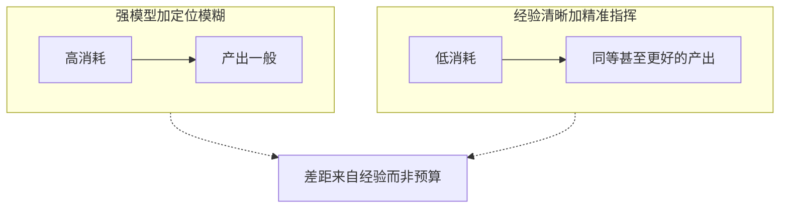

--
schemaVersion: 1
title: AI 技术组发展方向与工程化思维
description: 树成林技术组内部分享上册：为什么只做前端页面走不远，广度、方法论和产品化如何决定天花板。
publishedAt: 2026-07-29T00:00:00+08:00
section: fullstack-learning
tags:
  - Agent
  - 架构设计
  - UX
draft: false
---

# AI 技术组发展方向与工程化思维

大家好。这是整理自我在树成林 AI 社群技术组的一次录音分享。我想说的是：咱们技术组、尤其是偏 AI 技术方向的闲鱼接单，目前有几处比较大的问题。这些问题是我这一年多摸索下来真切感受到的，想借这个机会和大家交流一下。

在「能跑起来」之上，还有广度、方法论、产品化三层台阶。它们才是决定你能走多远的东西。更具体的工程实践——耦合、任务拆分、复用和部署——写在下册 [AI 编程核心能力体系与工程实践](/blog/ai-coding-core-practice/)。

## 写在前面

在说具体内容之前，我想先花一点篇幅说明我是谁、做过什么。不是为了自夸，而是因为接下来的很多判断听起来会有点「刺耳」。如果不先说清楚依据来自哪里，这些话很容易被当成空谈。

<html-embed id="credentials-timeline" src="./embeds/credentials-timeline/index.html" title="这一年的投入、合作与赛事坐标" height="360">
坐标三条：AI 编程约一年、近期每天协同常在二十小时以上；与两家企业深度合作；黑客松极限赛道三等奖、AIGC 创新赛省级二等奖、华中科技大学校级智能体大赛决赛三等奖。
</html-embed>

不是想强调「我比你们厉害」，而是想说明：接下来这些关于技术组问题的判断，不是凭空批评，而是踩过路、拿过结果之后回头看到的坑。希望大家带着这份背景，去评估这些观点是否值得参考，而不是照单全收。

> **延伸补充：关于「经历先行」的分享方式**
>
> 用履历建立可信度，是技术分享里很常见也很朴素的做法。听众没有义务无条件相信一个陌生的判断。先给出「我是在什么位置上说这句话」的坐标，能帮大家更准确地判断：哪些经验可以直接搬，哪些需要按自己的情况打折扣。

## 深度不是终点，广度才是护城河

先说结论：**整个技术板块，大家目前的问题不是「钻研得不够深」，而是对技术的广度缺乏基本认知。** 这句话需要拆开说。搞 AI 相关方向，不需要在某一个专业知识点上钻研得多深，但你需要对整个技术版图的宽度有基本的了解。

咱们社群里，前端页面做得已经是顶级水平了；AI 生图板块，我认为放到全国比也是数一数二；AI 视频板块很多人也达到了很高的水准；AI 文案板块更不用说，有林子哥这样的人在带。这几块都不会有问题，因为都有很厉害的人在把关。真正缺人补的，是 **AI 技术方向**——不是「会不会写代码」意义上的技术，而是对「所有基础设施本质上都是软件、都是代码」这件事有没有认知。

### 为什么生图、生视频的「变化性」远低于写代码

AI 生图或生视频，说到底产出物就是一张图、一段视频。构图、摄影、灯光有很多讲究，但它始终聚焦在一个相对单一的产出形态上。网站和代码不一样：你的手机是代码，硬件本质上也和代码脱不开关系，各种云服务平台、SaaS 平台、第三方接口，学校里的智慧网络、飞书这类办公系统，追根溯源全都是「网站 / 代码」这件事的不同切面。

对应到高校专业设置上，这背后是网络安全、计算机科学、软件工程、软科等一整个庞大的专业集群，而生图、生视频对应的专业范围要窄得多。

<html-embed id="discipline-map" src="./embeds/discipline-map/index.html" title="聚焦型产出与计算机学科集群的规模对比" height="420">
左侧是生图、生视频、文案这类单一产出；右侧是网站前端、后端、移动端、云、网安、硬件、大模型、Agent、部署、数据库、桌面端、插件等一整片学科集群。
</html-embed>

### 真正有技术含量的，是同质化的方法论

世界上的编程语言太多了，没有人能全部学完。真正重要的不是学会某一门语言，而是通过学一门语言（比如 Python），提炼出一套 **偏软件工程的通用思维**：错误处理怎么做、高并发压力怎么应对，这些是所有软件都会遇到的经典问题。换一门语言时，你不一定会写，但要知道该怎么去指挥 AI 写——这本身也是一套方法论。包括 AI 本身，底层也是代码与计算，很多东西是可以「归一化」理解的。

> **一句话结论**
>
> 不要只把自己焊死在「前端单页 HTML」上。前端可以是技术组下面单独的一个小组，但如果想真正把技术组办好，「能把同一套方法论迁移到任何板块」的能力，才是最核心、最不能绕过去的东西。

## 同质化的方法论比任何一门语言都重要

如果只强调「接单」这件事，一个现实的判断标准是：面对大部分单子，你是不是对相关领域都 **有所涉猎**——至少知道名字，知道它大概是干什么用的，不需要理解背后更深的原理。知道的越多，你就越清楚 AI 能干什么、边界在哪里，也就越有底气去验收 AI 产出的东西，越清楚一个项目的工期、需要投入的时间、该用什么档位的模型。

> AI 是一个杠杆——不管你理不理解一个概念，只要你能提到它、大概知道它是什么，把这些概念组合在一起交给 AI，AI 就能用很专业的视角把它做出来。
>
> ——语音原述

### 不要只停留在做一个前端页面

前端页面本身如果没有任何功能，充其量只能算一个展示型官网。真正的产品，它的价值在于官网背后跑起来的东西——一套能落地、能持续运行的系统。这也是为什么「技术组」不能等同于「前端组」：前端只是一个可以独立分出去的小组，而不是整个技术能力的全部。

> **延伸补充：「同质化方法论」具体包含什么**
>
> 结合分享里反复出现的例子，这套可迁移的方法论大致可以落到几个具体能力上：错误处理与容错设计、高并发下的稳定性意识、模块拆分与低耦合的直觉、对「生产环境 vs 开发环境」差异的敏感度，以及最关键的——判断一个需求该交给 AI 自主决策，还是需要人来把关。这些能力一旦建立，换一门语言、换一个项目类型，基本可以直接复用。

## 从中转站到产品：一条 OPC 式路径

大家应该都听说过 OPC（One Person Company，一人公司）。它更多指向的是 AI 编程时代下，一个人也可以独立做出一整套产品——比如一个工作流平台，或者一个 AI 对话平台。一个常见的误区是：只把「模型中转站」当成卖货渠道。更完整的做法是把中转站接入到自己的 AI 平台里，让它成为对外提供服务的一个环节；流程跑通之后，再考虑成立公司或个体工商户，按规范接入支付、手机号登录等基础设施——很多正规服务都需要相应的市场主体资质才能继续往下走。

### 案例一：把教科书变成一套可交互复习系统

期末复习时，数学教材里大段的公式讲解很枯燥，尤其涉及代数几何这类内容。当时的做法是：让 AI 按书本目录，把每一章内容转成结构化的 Markdown；再进一步，给每个知识点渲染配套的讲解动画——一本书大概能产出两百多个短视频，每一个都对应一个知识点。除此之外，还会在关键概念处插入 **可交互网页**：比如学到正弦函数在 x 轴、y 轴上的叠加变换时，拖动滚动条就能实时看到合成后的波形变化。

这个思路后续被包装成一个产品：用户只需要上传教材，甚至只需要搜书名，系统就能自动完成解析和转换，快速带用户进入期末复习节奏。

### 案例二：让 AI 真的「画」出化学分子式

另一个项目是同一时期做的 AI 对话产品，解决的是纯文字类 AI 助手的一个真实痛点：讲函数图像时，它顶多能截图或生成一段代码，而不会真的画一张函数图；讲化学分子式时，输出的是 `CH2` 这种纯文本表达，既不直观也不像真实的分子结构。这个项目做到了：讲函数图像时真的渲染出图像，讲分子式时真的渲染出球棍模型和立体结构。

> **内测结果**
>
> 在校园论坛发布内测招募后，一次性涌入约 **50 名** 内测用户——即便当时产品还很不成熟，这也说明「精准踩中一个具体痛点」，比「功能大而全」更容易获得早期验证。

### 黑客松与路演：距离商业化最近的舞台

类似 Devpost 上的国际大型黑客松，从来不只是一场技术展示活动——现场真的会有大量投资人和潜在合伙人在看产品。评委不只是打分，很多时候看到中意的项目会当场表达投资意向。不同高校也普遍设有科创扶持机制：先在校内路演答辩，评审认可后即可进入校内孵化器，这是一条相对现实的、从「做出东西」走向「做成事业」的路径。

> **反过来看，更重要的是什么**
>
> 技术只是这条链路上的一环。挖掘用户需求、讲清楚产品故事、做好产品运营和用户沟通，完全可以拆分给团队里更擅长这些事情的人去做——技术人不需要、也不太可能同时把所有环节都做到最好。前提只有一个：**你要有一套「怎样把产品做出来」的方法论，编程能力可以让 AI 补齐。**

## UI 与 UX 从来不是一回事

做产品而不是只做展示，重要的是分清楚两个词：**UI** 偏指前端设计怎么去布局、怎么去呈现；**UX** 指的是用户交互体验。三种前端放在一起对比会更清楚。

<html-embed id="ui-ux-cards" src="./embeds/ui-ux-cards/index.html" title="花哨难用、朴素顺手、通用商务风三种前端对比" height="380">
案例 A：视觉很炫但要点三四步才开聊，UI 高 UX 低。案例 B：界面普通但一句话就能对话，留存更好。案例 C：仿照微信、QQ、ChatGPT 的通用商务风。面向大众时，通用而不出错往往更容易被接受。
</html-embed>

### 前端设计需要打磨的，不只是好看

不管是做编程类项目还是专门做前端设计，专业设计师完全可以结合 AI 更好地完成应用原型设计。比如产品经理可以先用不带任何真实功能的原型代码，把每个界面都做成「可以点」的状态，通过点击关系去梳理交互逻辑，再把真正的功能实现交给后续开发——现在甚至可以直接在前端组件上做批注，批注本身也能成为页面的一部分，这条协作链路值得慢慢打磨。

## 绕不开的基础设施常识

很多人已经会用 AI 编程，但对一些「非技术方向、却是技术方向必不可少」的常识并不了解。不需要说得很专业，但至少要知道：**域名、DNS 解析、证书** 分别是干什么用的；**部署** 的本质是什么；用服务器自己部署，和用不同平台做托管部署，区别到底在哪里。再比如一个很朴素的问题：我们写网站都用 HTML，那为什么大型网站不能只靠一个 HTML 文件搞定？——这类问题，用最直白的语言给自己解释清楚，就已经是入门的门槛了。

> **不要闭门造车**
>
> 很多新手会不自觉地把自己焊死在「前端单页 HTML」上，也没有真正推进到「AI 编程的边界到底在哪里」这个问题。想做更专业的东西，不能只依赖对话式的 AI 编程工具，还是要用 **IDE（集成开发环境）**：打开浏览器看报错、定位到具体组件、搞清楚哪几个文件是前端组件、哪几个文件是后端逻辑——不需要读懂每一行代码，但要知道大概「这一片文件是管什么方向的」，这样才能在项目变大后，依然能精准地指挥 AI。

### 为什么「了解」比「精通」更值得优先投入

一个真实的现象：项目一旦大起来，你必须能跟 AI 说清楚「这一批文件控制前端组件，那一批文件控制后端逻辑」，才能让 AI 用更低的成本、更快找到问题所在。换句话说，很多时候不需要能精通每一项基础设施知识，但完全不了解，会让你在项目变复杂之后彻底失去方向感。

## 模型不是越贵越好

每一年，模型能力都是爆发式增长。一年前能打的最强模型，放到今天可能被很多国产模型远远超过，但当年很多复杂项目照样能被那些「更差」的模型做出来。这说明一件事：**如果你用更强的模型、消耗更多的算力，却没能做出更好的产品，问题往往不在模型，而在你有没有真正了解模型的能力边界。**

一个具体的算法：如果每个月能靠接单稳定赚到一两千元，这笔钱本可以拿去用更好的模型；但如果换一种思路——把大部分代码交给能力已经够用的便宜模型去写，靠自己的经验判断「这个模型的能力边界在哪里」，反而可以省下这笔预算，用来接更多单子，或者干脆攒下来。**模型只是一部分，更重要的一定是你怎样带着经验去指挥 AI。**

## 从编码到软件工程

想做复杂项目，真正要学的是 **软件工程**，而不是编码本身——或者说，在学编码之前，要先了解一个软件项目到底是怎样被组织、被推进的，每个模块怎么划分。这件事想清楚之后，有余力再去深研真正的代码细节，比如计算机操作系统的基本原理，或者算法导论。

> **算法导论的价值不在「会写」，而在「有判断」**
>
> 了解算法本质之后，你不是只能让 AI「随便找一个能跑的办法」，而是知道某个场景该用什么类型的算法才能达到想要的效果——即便你自己不会写，也能对代码有更强的掌控感。到后期你能看懂每一行代码，就能很好地掌控整个项目。

一个很实用的判断力是：**能一眼看出 AI 生成了大量冗余代码**——比如同一个组件被反复写了很多遍，明明写一遍就够了。这类已经失效、却仍然堆在项目里的代码，会持续占用上下文、拖慢 AI 的发挥。即便看不懂每一行代码，凭经验判断「这里大概率是冗余的」，或者干脆让 AI 自己去分析排查，都是这套能力体系里很重要的一环。

> 把这套东西学到「够用」的程度，实际投入大概只需要几周到一个月。真正花时间的是把它变成肌肉记忆式的判断力，而这需要在真实项目里反复验证。

## 尾声

这不是一份要求「每个人都精通」的清单，而是一份「至少要知道它存在」的地图。

<html-embed id="ten-takeaways" src="./embeds/ten-takeaways/index.html" title="上册十条最值得带走的结论" height="520">
十条：广度、方法论、商业化、UI 不等于 UX、基础设施、模型经济学、软件工程先于编码、冗余识别、学习成本、分工。
</html-embed>

工程落地的那一层——为什么改一个 bug 会冒出三个、怎么拆任务、怎么复用、怎么部署——见下一篇 [AI 编程核心能力体系与工程实践](/blog/ai-coding-core-practice/)。
