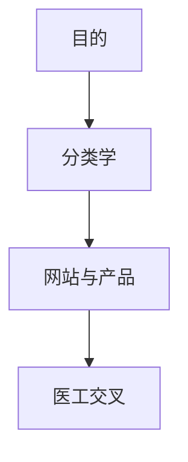

# AI 深度学习计划

25-12-9。经过大一几个月的探索，逐渐形成了要走的方向，以及更感兴趣、结合当今时代机遇、可能性最高的一条路：通过 AI 去赋能行业。

目前这个阶段，打算用我对 AI 的学习——包括但不限于智能体构建、直接应用，甚至一些底层原理——记录成长路径并分享。这比市面上那些吹嘘更有价值。例如我用 AI 编程，会分享如何结合多个模型，包括提示词、思路、点子。前期都免费，用这个方式起号。SOP 计划、最终目的、每一段时期的定位，都还没制定清楚，需要在后续思考里逐渐完善。眼下这个账号最核心的定位：深度讲解如何结合更多模型、更好地在各个方面使用 AI；同步搭建各类智能体，尤其是实用类；到未来致力于系统性、可落地的开发方案，甚至创建一些还没有人探索过的领域的 AI 模型。

以下是思考过程中的备忘，便于后续思考、初步 SOP，以及必要的项目落地。

## 从目的往下推

目前的首要目的是 AI 分类。尽量征集各大 AI 平台，按照 GPT 以及 AGI 社区给出的方式，对不同模型做细致分类和讲解。分类清楚，理解差异，才能好好使用。

深度学习 AI，到后期也可能从广变成点。但 AI 和其它学科不同，也许有机遇真正做到多方向精通。核心原因之一是它很重实践；整体发展年头并不深远，基层底蕴虽然深厚，实践的量并没有那么多。要抓住这个时代的机遇。

多个账号起号，从最开始的 AI 分类学以及规划开始。也十分鼓励大家尝试类似方向。很重要的基本技能：SOP 计划方法论，速读，打字速度，盲打。

## 网站是复利

从分类学出发，进一步印证网站的重要性。网站本身也可以作为复利工具：一方面以网站记笔记，很多时候可交互、可操作、很直观；另一方面可以作为产品向外部推进。免费放上去，上面有联系方式，用这个方式扩展人脉，尝试积累志同道合的人。个人时间终究有限，到后期尽量找人一起组团队。相关的研究可以献给 AGI 社区，同时也进一步吸引注意。动态和空间的另一层核心是宣传自己、多去表达，才有机会认识更多人。

我目前有什么，最核心的竞争力：第一是很多点子，非常强的创新能力。要多保持、多思考，用正反馈促进这个能力。自己也一直渴望把生活里的点子落实。遇到不便利或困难，总会有很多想法去实现，AI 智能体正好可以满足这份创造力。大一自我探索的方向，包括但不限于剪辑、摄影、后期、PPT、写作、唱歌、编程开发网站，甚至谱曲，都有一定兴趣和尝试。这些方面 AI 都是杠杆。这个时代相对刚刚起步，不该去想这些东西将被取代、没有前景，而该想怎么利用杠杆发挥到极致。有些事，比如根据一首歌制作谱词，已经很少有人研究，是不是可以做开拓者。越在前面提出新想法、越早落到实际，越有机会走出来、分到一些蛋糕。

最终的大方向：AI 和医学深度结合。我想做奠基人，我想获诺奖。尝试学科交叉，在 AI 里找新的机遇。

同时要顾及大的方向，比如家庭，不容易被忽视；还有可能发生的意外，比如爱情。这条路一定很艰苦，时间有限。相关蛋糕越来越难分到，AI 还具有一定泡沫性。越早做越有红利，时间不等人。即将面临期末考试，学习上也有压力。

这些 AI 工具最终一定可以充分辅助学习：以文字稿记录每一堂课，交给模型、交给智能体深度分析，出 PPT、出题目、出讲解、出可交互网站，综合复习；再结合线上课程和自主复习，尽量把效率拉到最高。

## 实践、备份、安全

基于此，构建自己的库很重要。网站、软件开发需要保存一定的 UI、编码方式，并保证可延续。这些文件一定要备份。很多时候一定以实践为主，不能只拘泥于理论；理论是指导方针，要在实践中探索可行方法、找到机遇，同时逐渐学习理论来支撑。目前 AI 方向就是先走实践，需要的时候了解相关理论，甚至学习底层逻辑。最终甚至尝试开发者的身份。

除了数据、文件的备份，还要注意点子的备份：经常写备忘录，经常反复看，如何把相关的东西构建并储存起来。备份方式也很重要：Microsoft OneDrive 的空间，WPS，百度网盘和夸克网盘，应该怎么选。肯定需要冷存储，需要组建 NAS，用机械硬盘在本地再留一份，尤其是源代码。各种各样的成长经验要多留；以后的视频一定要留下自己创作的证据，为以后铺垫。尽量了解法律，防止侵权。要考虑的不只是学校眼前，还有其它领域、未来可能遇见的东西。先彻底落实规划，才在实践中找得到方向。

有了比较远的布局，从最开始就要为将来打基础。消化整理的习惯很重要：什么文件、什么方式、什么路径、什么密码，一定备份好。不只拘泥于线上，有些 API 甚至需要线下备份。密码和数据要注意安全。从现在起不能像以前一样，个人账号数据很容易泄露。格式要统一，甚至开拓多次加密。数据安全很重要，一定要设置好自己的防火墙。

很多东西需要现金支撑。怎么开始前期投入，甚至拿到一些薪水，支撑接下来的内容。每日复利不能忘记。前期一定以免费为主，给大家切实可靠的内容和便利资源，用免费吸引更多人，也是寻找同路人、攒人脉的过程。做这些的同时要尝试参加学校相关竞赛，不能白做，这一方面也要规划。如何把这些真正建成自己的网络，一定要多考虑，多找人请教。

同步进行的还有：从现在开始储存抽到的比较好的 UI 设计，积累提示词——提示词真的很重要——积累不同模型的使用方式，从网站入手把这些存起来，再用别的方式把数据保存好。

距离报名截止还有一个月。这一段时间找队友，不只是找到人，而是找志同道合、愿意一起弄、真正感兴趣的人；同时一定要找到好的、愿意帮助我们的指导老师。这是一个学科交叉的过程。这份 SOP 写完之后，要给值得的人看：关系比较好、愿意分析、提出建议的学长学姐；针对那些值得请教的导师，包括但不限于目前医学的导师。

## 健康这条下限

时间真的很紧。不只局限在前景和个人探索，更需要关注健康。老生常谈：现在不好好刷牙、不好好爱护眼睛，将来肯定不行。睡眠也是，每天十二点多睡觉还是太晚。虽然没有那么熬夜，但第二天一定不是巅峰；只要不是巅峰，效率就达不到最高，内容还是那么多，晚上会睡得更晚，形成负反馈。要从现在开始：多喝水，不要喝饮料，开始喝热水，提前睡觉。每日打卡跟上，复利必须做。每日复利包括但不限于：练习气息、口部操，维持住，潜移默化地积累放松的能力，也通过练气息积累唱歌方面的能力。看到好看的景一定要多拍，包括每天拍月亮、拍太阳，为以后做 vlog 提供素材。

各大媒体开的账号，包括但不限于 AI 方向、Minecraft 内容、以及 vlog。三者分别对应：当今时代热点和市场上比较大的蛋糕；游戏区总会有很多热爱者，也是我最开始的热爱、编程起源的地方；vlog 则是这个时代里有哲理、比较安静、可能已被人忘却的视频形式，反其道也许在未来有更大机遇，也是我对摄影剪辑热爱的考量。摄影剪辑技术需要充分提升，不只助于视频创作和自己的记录，作为职业技能在各个方面也有用处。只有这项技能好了，才能更好地创作 AI 方面的视频、帮助起号。

虽然还没开始，也应该开始考虑将来商务合作。算是一种意志、一种笃定：好好积累、好好做，很有可能真的能做起来。一旦做起来，赚钱最直接的方式就是接广告。商务合作需要什么类型，是否可以和 AGI 社区合作，是否可以通过粉丝量和一些镜像 AI 网站合作，这些都要考虑。尽量多方面想，并留下可行方案。

思考过程中，应想办法把目前已有资源整合到一起：网盘空间，百度、夸克，OneDrive，一些 Google 账号，已经开通会员的 AI 模型，零散的网站代码，用飞书多维表格记录的内容。很重要的一点是：经常使用的飞书、WPS、Drive，是否有方法贯通。是否可以用 AI 总结 QQ 或其它对话，把信息流收集好。到后期最重要的是，如何把多个账号、多项内容统一起来，让它们有机关联——或通过文件保存，或通过账号贯通。这一点非常重要，应该在前期就准备好。目前信息量还算可以接受；一定要在各个应用、以后更多软件的使用过程中，准备好如何链接各个账号。否则后期数据量变大，更难以统一。
