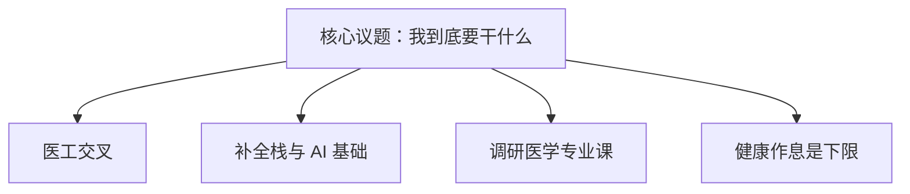

# 自我认知与职业生涯规划课报告

5 月 29 日。课程要求写一份针对「目前最需要解决的问题」的职业计划，从兴趣、性格、能力、价值观分析。

个人专业是基础医学强基，大一下。最核心的问题是未来方向。过去一年对人工智能和全栈开发兴趣极高、也做了不少，同时还没到同济校区，对专业本身了解不深。兴趣与专业之间出现裂缝。

先说结论：基础方向可以走医工交叉。AI 和全栈不只是感兴趣，也有过实际结果：华中科技大学首届智能体大赛，作为队长和主要开发拿到决赛三等奖；参与以湖北纹样为主题的大创，搭纹样网站；为基础学院医路求索团队搭过官网。背后仍有硬问题。

第一，非工科出身，从实践里学，基本功不扎实，长期不行。第二，如何平衡兴趣和学业——大二医学课会明显变忙。第三，真正的发展方向。大学阶段想尝试做网站类服务平台，也组了团队，仍然要面对兴趣、学业、社团之间的分配。

过程中也看见自己的问题：完美主义，难以拒绝。小组展示最后变成一个人的展示；团日活动一旦我会做 PPT，活就全来了；帮人搭网站也要做得「像样」，时间被拉得很长。悬置的任务会引发焦虑。

初步规划：最后一个月是期末月，停掉其他，把精力放在备考。期末后两个多月做三件事——理清方向，补全栈和 AI 基础，更深度调研专业课并提前预习。结合性格：一旦预习，沉没成本和完美主义会让我学得很认真；一旦拖欠，就容易循环拖欠。假期更重要的是身体：作息、饮食、运动。医者不能自医，这句话得先用在自己身上。
