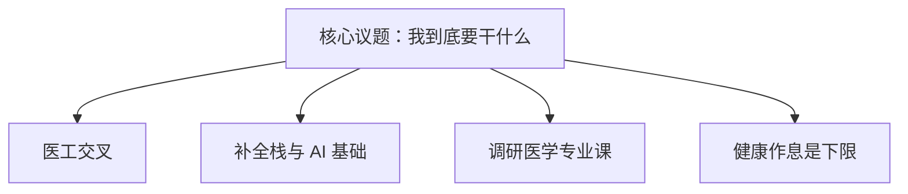

# 自我认知与职业生涯规划课报告

要求就是写一写目前你最需要解决问题的职业计划书，要从个人的，兴趣，性格、能力、价值观等多方面因素进行分析

个人专业是基医强基，目前也正是大一下学期，在这个节骨眼上，遇到的最核心问题就是未来发展方向。因为在过去的一年中，我个人对人工智能和全栈开发方向非常感兴趣，并且研究的比较深入，同时毕竟还没有来到我们的同济校区，实际上对我本身的基础医学专业了解也不是很多 ，这里就会产生一个矛盾，可能我对我之前所选的专业逐渐在丧失兴趣，反而对人工智能以及全程开发方向热情高涨。

因此近年来我认为最重要的事情，于我而言就是想清楚自己到底要干什么。先说结论吧，基础的方向就是围棋可以搞一搞义工交叉，因为人工智能和全栈开发这里，不只是感兴趣，而且确确。这是有过一些实际的成就，前段时间参加华中科技大学首届智能体大赛，啊作为队长以及主要开发人员，有幸获得了决赛的三等奖，并荣获2000元奖金，同时也参与到以湖北纹样为主题的大创中，负责搭建纹样网站，也我们基础学院医路求索团队搭建过官网，但这背后也有几个非常严重的问题

首先，毕竟我是非工科出身，更多是倾向于从实践中学习，但没有比较扎实的基本功，在未来肯定也是不行的。第二就是我如何去平衡我的兴趣，以及我的学业，大一比较特殊，毕竟我们还没有接触到正式的专业课，而上了大二之后啊我们面对我们医学本身的课程，它也就是一个繁忙的挑战，我怎么样去平衡这些东西也是很重要的。然后第三就是真正未来的发展方向，因为我个人的想法就是我可能在大学这段时间我想尝试去创业，我不太愿意去嗯，比如说未来去做一些普通的职业，我觉得没有意思，真的就是觉得没有意思，因为创业方向就是做一些网站类的服务平台，目前也是在这个方向有所研究，并且也组建了自己的团队，而从这个角度来看，还是那个经典的问题，那我怎么样去平衡，比如说我的兴趣方向，啊，像我的这个未来的发展方向。平衡我的学业，啊以及除此之外，我可能还要平衡一些社团活动方面的东西，而这一切就是我大学生活面临的最核心议题，而换句话说就是我可能需要仔细的去想一想，想很长时间，然后去在某个方向做一些调研，然后最终去确定一个更契合我的方向

同时在这个过程中也发现了自己很多的问题，比如说我总是倾向于完美主义，以及我确实是比较负责的人，就会导致我可能同时啊无法拒绝去帮助嗯去干很多事情，就举个经典的例子，每次小组作业展示啊最后都变成了我一个人的展示，以及。准备啊每一次像团日的一些活动啊，或者是啊一些活动啊，啊，发现我可以做ppt之后之后所有活都变成我的活了。然后以及网站搭建也是类似的，有时候帮别人做一些东西，肯定还是要求一些完美主义，就会做的时间很长，啊就就会导致 给我带来了非常多的压力啊，就是本来我的平衡我很多精力和时间，这一点就做的不是很好，再加上这种无休止的这些任务，然后其实这段时间也是一直感觉很焦虑啊，嗯前段时间正好看过一个悬知心理学，啊有这种一些很多任务啊悬而未完成的这种感觉，其实就是会引发你一个很深的一个焦虑，而这一点啊它代表的是啊。面向前面是我的我的前景，后面是我发现我遇到的问题，然后这些也是啊要值得我去思考，怎么样去应对，然后以及找一个什么样的时间去仔细的分析一下

目前初步的规划就是最后一个月是期末月，核心任务就一个，啊，尽量停掉其他的东西，把所有精力放在备考上。期末月之后两个多月啊主要几件事情，第1个是理清楚未来的发展方向，第2个是补一些啊全程开发和人工智能方面的基础知识，去学一学 第3个是更深度的调研我们专业未来学的东西，能在一定程度上提前预习，这个非常的重要。嗯就是这个也算是结合我的性格吧，就是我是一个倾向于完美主义的人，那么一旦我提前预习这个东西，就这份寂寞成本以及我的完美主义会让我啊在这一个方向学得很认真，而一旦我在某一个方面有所拖欠，就很容易不断的循环下去，就永远拖欠了，啊，然后也是结合我的性格，反正就是主要这几件事情

同时不只是这些理论方面吧，我的假期更重要一点，其实是如何去保证你的身体和健康，啊，不要不要以后真的医者不能自医了，比如说假期一定要养成一个好的作息习惯，然后养成一个好的饮食习。。习惯和运动运动健康的一个习惯。

然后上面是我个人的一些分析，那么下面就是我们引入到我们自我认知和职业生涯规划课讲到的那些知识，然后从专业的视角来分析一下我遇到的这些问题，啊以及从这些视角来看，我怎么样更好的去向着个人未来方向去走

