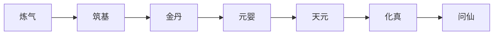

# 飞星大陆的修为规则

初稿，飞星大陆乃是修真不胜之地，灵气匮乏，资源很穷，大部分以普通人（普通修为）为主。
修真界共分6层：炼气 筑基 金丹 元婴 天元  化真。传说修真界之上还有仙界，修为远高于修真界。
         修炼本质提升的是血量，伤害吸收和抗性
        而最重要的，修真可以修炼出灵气
          1.练气：开始吸收天地元气，提升自己修为，具有一定的法术。可以开辟丹田，具有灵气。但修到极致也没有登堂入室，难以真正突破凡人之躯，故而血量难以提升。
      面气分为面气初期练气，中期练气，后期练气巅峰，练气圆满，每一个跨度都是极大的提升。
巅峰和圆满的差距就在于是否可以渡劫成就下一境界。
         2.筑基：真正铸就修炼基础，可以提升一定血量，但最终仍旧在凡人领域。真元（灵气）大幅度增加
      3.金丹：真正步入修真行列，血量可以大幅度提升，抗性也大幅度提升，身体内的真元成指数倍增加，可以掌握法宝，但晋级金丹需要度过雷劫
    4.元婴：即使虚拟血量为0后也不会立即死亡，元婴可以溢出，且元婴的抗性极强，可以在敌人手中逃得一命
   5.天元：可以调动周围的天地元气，真源回复速度爆炸式增加，伤害爆炸式增加
    6.化真：可以修炼出域，能禁锢住他人，是巅峰存在
    7.问仙：追寻仙道，从此境界开始，修炼不在凭借普通修为，而是凭借顿悟

