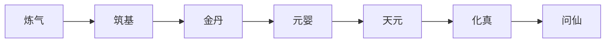

# 飞星大陆的修为规则

随笔，初稿。

飞星大陆是修真不盛之地，灵气匮乏，资源穷，大部分人以普通修为活着。修真界共分六层：炼气、筑基、金丹、元婴、天元、化真。传说其上还有仙界。修炼本质提升的是血量、伤害吸收和抗性；最重要的是，修真可以修出灵气。

1. **炼气**：开始吸收天地元气，有一定法术，可开辟丹田。修到极致也难真正突破凡人之躯，血量难以提升。面气分初期、中期、后期、巅峰、圆满，每一跨度都极大；巅峰与圆满的差距，在于能否渡劫进入下一境。
2. **筑基**：真正铸就基础，血量略升，仍在凡人领域。真元大幅度增加。
3. **金丹**：步入修真行列，血量与抗性大幅提升，体内真元成指数增加，可掌握法宝。晋级需度雷劫。
4. **元婴**：虚拟血量为 0 也不会立即死亡，元婴可溢出，抗性极强，能从敌人手里逃得一命。
5. **天元**：可调动周围天地元气，真源回复与伤害爆炸式增加。
6. **化真**：可修炼出域，禁锢他人，是巅峰存在。
7. **问仙**：追寻仙道。从此境界起，修炼不再只凭普通修为，而是凭顿悟。
