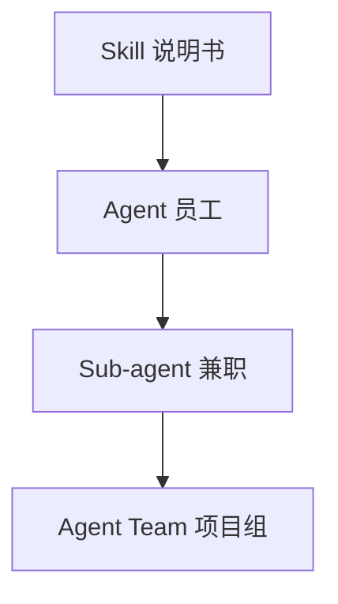

# 开发词汇手册

遇到一个听不懂的词，先来这里查。搞懂「它叫什么、干什么用」，再去跟 AI 或工程师聊天，效率会高很多。九个专题，从架构分层到数据库后端；每一条术语都配「通俗解释」与「展开」两种读法。

<html-embed id="topic-map" src="./embeds/topic-map/index.html" title="九个专题地图" height="640">
九个专题：01 架构分层，02 提示词与模型，02b Agent 与工具链，03 环境与部署，03b 测试与流程，04 UI 组件，05 语言与格式，06 动效与渲染，07 数据库与后端。
</html-embed>

## 怎么用

每篇都有两种讲法：「词条表」用来快速定位术语和场景；「展开讲解」用打比方讲清楚为什么需要它、不用会怎样。不用从头读到尾，按目录找到你现在困惑的那个话题，直接跳过去即可。

- [01 架构分层与工程规范](#01-架构分层与工程规范)
- [02 提示词与模型基础](#02-提示词与模型基础)
- [02b Agent、工具链与协作流程](#02b-agent-工具链与协作流程)
- [03 环境与部署基础设施](#03-环境与部署基础设施)
- [03b 测试与工程流程](#03b-测试与工程流程)
- [04 前端 UI 组件与布局术语](#04-前端-ui-组件与布局术语)
- [05 语言与数据格式技术栈](#05-语言与数据格式技术栈)
- [06 动效与图形 / 渲染库](#06-动效与图形-渲染库)
- [07 数据库与后端服务](#07-数据库与后端服务)

语言用 TypeScript；需要动效、3D、物理找 06；需要存数据、登录看 07；界面描述不清就翻 04；部署看 03，测试和 Git 看 03b；架构乱就翻 01；跟 AI 对话调参看 02，AI 怎么自己动手做事看 02b；该学哪个语言、文件格式看不懂就翻 05。

## 01 架构分层与工程规范

这篇讲的是：为什么代码不能随便堆在一起写，要拆成「层」？每一层到底负责什么？


点击「购买」时，一次请求大致按这个顺序流过四层。

| 词条 | 通俗解释 | 展开 |
| --- | --- | --- |
| 架构（Architecture） | 整个项目「房子怎么盖」的设计图 | 常见：Monorepo、分层架构、六边形架构。场景：项目刚起步、决定代码怎么分文件夹时。架构是设计图；要把图刻进工具里，见 Harness Engineering。 |
| 路由（Router / Routing） | 网址决定显示哪个页面的规则 | 常见：React Router、Next.js App Router。场景：做多页面网站或 App。没有统一路由，页面改名后链接会到处失效。 |
| 数据层（Data Layer） | 只管数据存哪、怎么读写，不管页面好不好看 | 常见：Repository、DAO、ORM（Prisma / Drizzle）。场景：存取数据库、调用第三方 API。对应餐厅后厨去仓库拿菜。 |
| 业务层（Business Layer / Service Layer） | 管「这件事该怎么处理」的规则和判断 | 常见：Service、UseCase。场景：下单、扣库存、判断优惠券能不能用。对应服务员判断今天卖不卖、券能不能用。 |
| 逻辑层（Logic Layer） | 纯计算，不碰数据库、不碰界面 | 常见：Pure Function、工具函数。场景：算价格、算碰撞、算分数。给定输入就出结果，不用知道是谁点的。 |
| 展示层（Presentation Layer / UI Layer） | 只管画出来给人看 | 常见：React 组件、Vue 组件。场景：按钮、页面、动画。菜单好不好看，跟厨房怎么做菜无关。 |
| 单一职责原则（Single Responsibility） | 一个模块只干一件事 | 场景：判断这段代码是不是该拆出去。SOLID 里的 S；一个类方法多到看不完，往往就在违反它。 |
| 依赖方向（Dependency Direction） | 谁可以调用谁，不能反过来 | 常见：依赖倒置、「核心不依赖壳」。场景：大项目防止代码越写越乱。展示层不该直接去调数据层。 |
| Harness Engineering | 给项目定骨架规范，让人和 AI 长期按规矩协作 | 常见：AGENTS.md、ESLint 规则、CI 检查。场景：项目要长期维护、多人（或多次 AI 会话）协作。架构是设计图，Harness 是把禁令写成检查、想违反都难。 |
| MVC / MVVM | 一种「页面–数据–逻辑」三方分工的经典分层套路 | 常见：Model-View-Controller / Model-View-ViewModel。场景：传统 Web 框架、桌面或移动应用。 |
| 单体架构（Monolith） | 所有功能写在一个项目里，一起开发、一起部署 | 场景：小型项目、团队规模小、起步阶段。回答的是运行时有几个独立服务，不是仓库有几个。 |
| 微服务（Microservices） | 把一个大系统拆成多个各自独立部署、独立扩容的小服务 | 场景：大型系统、多团队并行开发。拆完之后互相用网络调用，不是「文件夹多」就叫微服务。 |
| Monorepo | 多个子项目（包）放在同一个代码仓库里统一管理 | 常见：pnpm workspace、Turborepo、Nx。场景：本项目就是 Monorepo（packages/ + apps/）。改一处公共逻辑，所有引用立刻同步。 |
| Polyrepo | 每个项目或服务各自一个独立仓库 | 场景：团队或服务边界清晰、想各自独立发版。公共代码复用会更麻烦。 |
| SOLID 原则 | 五条让代码好改、不易崩的设计准则 | 常见：单一职责 / 开闭原则 / 里氏替换 / 接口隔离 / 依赖倒置。场景：评审代码设计得好不好时的标尺。改一个小功能却牵连一大片，就是在违反其中某条。 |
| 耦合与内聚（Coupling & Cohesion） | 耦合＝模块之间粘得有多紧；内聚＝模块内部是不是该放在一起的东西 | 常见说法：低耦合高内聚。场景：判断代码要不要拆分或合并。 |
| 依赖注入（Dependency Injection） | 模块不自己创建它需要的东西，而是从外面传进来 | 常见：DI Container、构造函数注入。场景：让代码更容易替换实现、更容易测试。核心只认接口，不认「本地存档还是云端存档」。 |
| 设计模式（Design Pattern） | 前人总结出来的、某类重复出现问题的标准解法 | 常见：单例模式、工厂模式、观察者模式、仓库模式。场景：遇到「这个设计难题好像见过」时去查对应模式。 |
| 领域驱动设计（DDD） | 先把业务概念（比如订单、库存）理清楚，再照着业务概念设计代码结构 | 常见：Entity、Aggregate、Bounded Context。场景：业务规则复杂、容易越改越乱的系统。 |
| 中间件（Middleware） | 请求处理流程里，插在中间统一处理一类事情的关卡 | 常见：鉴权中间件、日志中间件、限流中间件。场景：统一处理登录校验、请求日志、跨域。 |
| 事件驱动架构（Event-Driven Architecture） | 模块之间靠发消息或广播事件来通信，而不是互相直接调用 | 常见：EventEmitter、消息总线。场景：想让模块互相不知道对方存在（解耦）、异步处理。 |
| 消息队列（Message Queue） | 一个「任务先排队，慢慢被处理」的中转站 | 常见：RabbitMQ、Redis Queue、Kafka。场景：削峰限流、异步任务（发邮件、生成报表）。 |
| 状态管理（State Management） | 集中管理整个应用里多个组件要共享的数据 | 常见：Redux、Zustand、Pinia。场景：多个页面或组件要读写同一份数据时。 |
| 插件架构（Plugin Architecture） | 核心系统保持精简，具体功能通过插件往外挂 | 常见：VS Code 插件、Vite 插件。场景：想让核心稳定，又要保留灵活扩展空间。 |

### 为什么「点击购买」背后要拆这么多层？

想象你在餐厅点餐：

- 你（顾客）看到的菜单和按钮——这是**展示层**。菜单好不好看、按钮在哪，跟厨房怎么做菜完全无关。
- 服务员把你的需求记下来，判断「这道菜今天卖不卖、你的优惠券能不能用」——这是**业务层**。这里全是规则判断，比如会员打 8 折、库存不足不能下单。
- 后厨真正去仓库拿菜、下锅炒——这是**数据层**。它只管东西存在哪、怎么取出来，不关心你为什么点这道菜。
- 厨师炒菜的手法、火候计算——这是**逻辑层**。纯粹的计算过程：给定食材和火候，算出结果，不用知道是谁点的。

如果这四件事全部写在一起（比如按钮的点击事件里直接写数据库查询），会出现什么问题？

- 你想换一个好看的按钮样式，却怕改坏了扣库存的逻辑。
- 你想把打折规则复用到另一个页面，却发现代码和这个按钮死死绑在一起，拆不出来。
- 出 bug 了，你不知道问题出在页面显示错了、规则算错了，还是数据库读错了——因为它们全挤在一个文件里。

拆层的本质好处：出问题时，你能快速定位是哪一层出的错，改一层不会震动另一层。

### 路由是什么？

路由就是「网址 → 该显示哪个页面」的对照表。

```text
/home        → 首页组件
/shop        → 商店页面组件
/user/123    → 用户 123 的个人主页
```

浏览器地址栏输入不同网址，路由系统查这张表，决定渲染哪个页面。没有统一路由规范的项目，经常会出现「这个页面到底该用什么网址」「改了一个页面名字，结果到处链接都失效了」的混乱。

### Harness Engineering 和架构是什么关系？

Harness 原意是挽具（拴住牲口拉车用的皮带套）。在软件里，Harness Engineering 指的是：在写具体功能之前，先把骨架规范钉死——文件夹怎么分、哪层能调用哪层、命名怎么定、多长的文件要拆分、AI 或新人接手时该先看哪份文档。

它跟架构的关系是：**架构是设计图，Harness 是把设计图刻进工具里、让人（或 AI）想违反都难的那套机制**。比如：

- 架构说「数据层不该被展示层直接调用」——这是设计图上的一句话。
- Harness 会用 ESLint 规则把这条禁令写成代码检查，你要是写错了，代码直接报错、提交不了。

### 为什么要自己懂，不能只让 AI 自己定规范？

因为 AI 每次对话可能是失忆的。如果规范只停留在口头约定或者靠 AI「自觉」，下一次换一个会话、换一个人接手，规矩可能就被悄悄破坏。把规矩写进文档（如 `AGENTS.md`）和工具配置里，才能让规矩真正长期生效，而不是说过就忘。

### 一个完整例子：点击「购买」，数据怎么流动？

```text
用户点击「购买」按钮
      ↓  （展示层：捕获点击事件）
调用「下单」业务逻辑
      ↓  （业务层：检查库存够不够、优惠券能不能用、算最终价格）
调用逻辑层的纯函数计算最终金额
      ↓  （逻辑层：只做数学计算，不碰数据库）
把订单数据写入数据库
      ↓  （数据层：INSERT 一条订单记录）
返回结果给展示层，弹出「购买成功」提示
```

每一步只关心自己那一层的事，出错了也只需要去对应那一层排查，这就是分层的价值。

### 单体、微服务、Monorepo、Polyrepo 怎么区分？

这四个词其实回答的是**两个不同的问题**，很多人会把它们混成一个问题：

- 「代码在运行时是几个独立服务？」——这是**单体 vs 微服务**要回答的问题。单体是一个程序打包运行；微服务是拆成好几个各自独立运行、独立部署的小程序，互相用网络调用。
- 「代码在仓库层面放在几个 Git 仓库里？」——这是 **Monorepo vs Polyrepo** 要回答的问题。Monorepo 是好几个项目的源码放在同一个 Git 仓库里；Polyrepo 是每个项目各自一个仓库。

关键点：这两个问题互相独立，可以任意组合。

```text
Monorepo + 单体   →  packages / apps 都在一个仓库，但可以作为独立壳各自运行
Monorepo + 微服务 → 大厂常见做法：所有微服务代码放一个大仓库，方便统一改公共代码，运行时仍是多个独立服务
Polyrepo + 单体   → 小团队最简单的做法：一个仓库对应一个单体项目
Polyrepo + 微服务 → 每个微服务各自一个仓库，团队边界清晰，但公共代码复用会麻烦一些
```

选 Monorepo 的核心好处是「改一处公共逻辑，所有引用它的项目立刻同步」，代价是仓库会变大、需要专门的工具（如 pnpm workspace、Turborepo）来管理「只构建改动过的那部分」。`pnpm-workspace.yaml` 存在，就是因为要用它管理 Monorepo。

### SOLID 到底是哪五条？

SOLID 是五个英文单词首字母拼出来的缩写，是面向对象设计里最常被引用的五条准则：

| 字母 | 全称 | 一句话 |
| --- | --- | --- |
| S | 单一职责原则 | 一个类或模块只干一件事 |
| O | 开闭原则 | 加新功能时尽量新增代码，别老是改已有代码 |
| L | 里氏替换原则 | 子类可以无痛替换父类使用，不会导致意外行为 |
| I | 接口隔离原则 | 不要强迫一个模块依赖它根本用不到的接口 |
| D | 依赖倒置原则 | 高层逻辑不该依赖具体实现细节，而是依赖抽象接口 |

不需要死记硬背。实用角度只需要知道：当你发现「改一个小功能却牵连了一大片不相关的代码」「一个类的方法多到看不完」，就是在违反 SOLID 里的某一条，这时候该考虑拆分或重新设计。

### 依赖注入到底解决了什么问题？

没有依赖注入时，一个模块想用「存档服务」，会直接在内部写：

```ts
class Game {
  private saveService = new LocalSaveService(); // 内部自己创建，死死绑定
}
```

这样写的问题：如果以后想换成云端存档服务，或者写测试时想用假的存档服务，都得跑到 `Game` 类内部去改代码。

依赖注入的做法是从外部把存档服务传进来：

```ts
class Game {
  constructor(private saveService: SaveService) {} // 从外面注入，随时能换实现
}
```

核心逻辑只认「存档服务应该有什么功能」（接口），不关心「具体是本地存档还是云端存档」（实现）。换壳、换平台时核心代码完全不用动。

## 02 提示词与模型基础

这篇讲的是：跟 AI 对话、调模型参数时经常冒出来的黑话。Agent、Skill、MCP 等工具链和协作流程，见姊妹篇 [02b](#02b-agent-工具链与协作流程)。


RAG：先查资料，再让 AI 参考着回答。

| 词条 | 通俗解释 | 展开 |
| --- | --- | --- |
| Vibe Coding | 靠感觉和 AI 对话式地写代码，而不是先设计再写 | 常见：直接跟 Cascade / Cursor / Copilot 聊需求。场景：快速试错、做原型。快、试错成本低；项目大了容易越改越乱，要用架构规范兜底。 |
| 敏捷开发（Agile） | 小步快跑、频繁反馈的开发方式，不是一次性憋大招 | 常见：Scrum、Kanban。场景：需求会变化的项目。 |
| Loop Engineering | 设计 AI 反复自我检查、修正的循环流程 | 常见：AI 写代码 → 跑测试 → 看报错 → 自己修。场景：让 AI 在长任务里少犯错。Harness 是护栏和车道线，Loop 是边开边看后视镜。 |
| Harness Engineering | 给项目定死骨架规范，让协作长期稳定 | 详见第 01 篇。常见：AGENTS.md、四把锁。场景：项目要长期演进。静态的、一次性搭好的框架。 |
| Prompt（提示词） | 你给 AI 的那段话或指令 | 例子：「帮我写一个登录页面」。场景：每次跟 AI 对话。 |
| System Prompt vs User Prompt | System Prompt 是预先设定、贯穿全程的人设或规则；User Prompt 是你当下这句话 | 例子：系统提示词设定「你是个游戏开发助手」。场景：区分谁在什么层级影响 AI 的行为。 |
| Prompt Engineering | 研究怎么把话说清楚，让 AI 输出更准 | 常见：结构化提问、给例子。场景：让 AI 输出更符合预期。99% 的情况应先穷尽提示词工程，再考虑微调。 |
| 上下文（Context） | AI 这次对话「记得」的所有信息总量 | 常见：对话历史、打开的文件。场景：AI 突然忘事或答非所问时。 |
| 上下文窗口（Context Window） | AI 一次最多能看多少 token 的硬性上限 | 例子：128K / 200K token 窗口。场景：判断这个项目或对话是不是塞太多东西了。 |
| 上下文管理（Context Management） | 主动整理、精简喂给 AI 的信息，别让它信息过载 | 常见：摘要、清空历史、分文件说明。场景：长对话、大项目。只喂当前任务真正需要的信息。 |
| Token | AI 处理文字的最小单位（不完全等于一个字） | 粗算：1 token ≈ 0.75 个英文单词，中文常常不到 1 个汉字。场景：计算用量和费用。收费按 token；窗口也按 token 封顶。 |
| 模型选择（Model Selection） | 选用哪个 AI 大脑来干活 | 常见：GPT、Claude、Gemini、DeepSeek。场景：追求速度、质量、成本的取舍。 |
| 输入 / 输出（Input / Output） | 你发给 AI 的内容 / AI 返回给你的内容 | 场景：计算 token 消耗时要区分方向。输入和输出往往单价不同。 |
| 采样参数：Temperature / Top-p | 控制 AI 回答有多随机、有多保守的旋钮 | Temperature 0 死板严谨，1+ 天马行空。场景：想要更稳定或更有创意时调整。Top-p 只在累计概率达到 p 的候选里抽签。 |
| 缓存命中（Cache Hit） | 服务商发现这段内容之前处理过，直接复用结果，省钱省时间 | 常见：Prompt Caching。场景：长期反复用同一份系统说明或文档。不常变的规则（如 AGENTS.md）别老改，才能命中缓存。 |
| RAG（检索增强生成） | 先去资料库里查相关内容，再让 AI 参考着回答，而不是凭记忆瞎答 | 常见：向量检索 + LLM 生成。场景：让回答基于你的私有文档或最新资料。Embedding 是翻译，向量库是仓库，RAG 是整套流程。 |
| Embedding（向量嵌入） | 把文字翻译成一串数字（向量），方便计算机比较意思像不像 | 常见：text-embedding-3、BGE。场景：做语义搜索、RAG 的底层技术。意思相近的段落，向量也相近。 |
| 向量数据库（Vector Database） | 专门存 Embedding 向量、能快速找出意思最相近的数据 | 常见：Pinecone、pgvector、Milvus。场景：RAG 系统、语义搜索。 |
| 微调（Fine-tuning） vs 提示词工程 | 微调＝重新训练模型让它学会新技能；提示词工程＝不改模型，只改怎么问 | 常见：LoRA 微调。场景：决定用更好的提问方式，还是投入资源训练专属模型。微调贵，只有提示词和 RAG 都问不出再考虑。 |
| 幻觉（Hallucination） | AI 一本正经地编造不存在的事实 | 例子：编造不存在的函数名或 API。场景：判断这个回答需不需要人工核实。这是固有缺陷，不是哪个模型故意犯错。 |
| Few-shot / Zero-shot | Few-shot＝先给几个例子再提问；Zero-shot＝不给例子直接问 | 场景：想让 AI 更准确模仿某种格式时用 Few-shot。Prompt 里附带示例输入输出即可。 |
| 思维链（Chain of Thought, CoT） | 让 AI 把思考步骤写出来，而不是直接跳到答案 | 例子：「请一步步推理后再回答」。场景：复杂逻辑或数学题，提升准确率。相当于让它打草稿。 |
| 多模态（Multimodal） | AI 不只能读文字，还能看图片、听语音 | 例子：上传截图问这是什么 bug。场景：需要理解图片、音频、视频时。回答的是能力边界：文字之外还能懂什么。 |
| 流式响应（Streaming Response） | 回答像打字机一样一个字一个字冒出来，而不是等全部写完再显示 | 例子：ChatGPT 网页的逐字输出。场景：提升等待体验，长回答可以提前看。 |
| 知识截止日期（Knowledge Cutoff） | 模型训练数据截止到哪一天，之后发生的事它不知道 | 例子：「我的知识截止到 2024 年」。场景：问最新新闻或版本号时要留意，需联网搜索或 RAG 补。 |
| 开源权重 vs 闭源模型（Open-weight vs Closed） | 开源权重＝模型文件公开可下载自己跑；闭源＝只能通过官方 API 调用 | 例子：DeepSeek / Llama 开源权重，GPT / Claude 闭源。场景：决定能不能私有化部署。 |
| 模型量化（Quantization） | 把模型压缩得更小、跑得更快，牺牲一点精度 | 常见：4-bit / 8-bit 量化。场景：想在普通电脑或手机上跑本地模型。用精度换体积和速度。 |
| 本地大模型（Local LLM） | 把模型直接下载到自己电脑上跑，不用联网调 API | 常见：Ollama、LM Studio。场景：想离线用、不想数据传到云端。通常是开源权重 + 量化后的落地。 |

### Vibe Coding 跟正经写代码有什么不同？

传统写代码像先画好图纸再盖房子：先想清楚需求、画流程图，再动手写。

Vibe Coding 更像跟一个很懂技术的朋友聊天，边聊边改：你说一句「我想要个能左右移动的小车」，AI 直接写出来；你看效果不满意再说一句「车速太快了，调慢点」，AI 再改。优点是快、试错成本低；缺点是项目大了容易越改越乱，这也是为什么还是需要[架构规范](#01-架构分层与工程规范)来兜底。

### Loop Engineering 和 Harness Engineering 有什么区别？

- **Harness Engineering**：定骨架和规矩——项目该长什么样，文件夹怎么分，谁不能调用谁。是静态的、一次性搭好的框架。
- **Loop Engineering**：设计 AI 干活时的自我检查循环——写一段代码 → 跑一下测试 → 看报错 → 自己改 → 再跑测试，一直循环到通过。是动态的、AI 工作过程中反复走的流程。

打个比方：Harness 是给车装好护栏和车道线，Loop Engineering 是教司机养成边开边看后视镜、发现偏了就纠正的习惯。

### Token 是什么？为什么要省 Token？

AI 不是按「字」读文字的，它把文字切成更小的碎片，叫 Token。粗略估算：

- 英文：1 个 token ≈ 0.75 个单词（例如 `hello world` 大概是 2～3 个 token）
- 中文：1 个 token 经常还不到 1 个汉字（中文相对更贵）

为什么要省？

1. **收费按 token 数算**——输入越长、AI 回复越长，花的钱越多。
2. **AI 一次能记住的 token 数有上限**（上下文窗口）。塞太多没用的信息，AI 反而会漏看重要的部分，答非所问。

所以上下文管理的核心工作，就是只喂给 AI 当前任务真正需要的信息，别把整个项目的历史对话都堆进去。

### 缓存命中为什么能省钱？

如果你每次对话都要先把一份很长的系统说明书发给 AI（比如项目的架构文档），服务商发现「这段内容我上次处理过，内容完全没变」，就可以直接复用之前算好的结果，不用重新读一遍，这部分的费用会打折甚至免费。这也是为什么把不常变化的规则（如 `AGENTS.md`）单独放好、别老改动，能帮你省钱。

### RAG、Embedding、向量数据库是怎么串起来的？

假设你想让 AI 回答「我们项目的存档服务是怎么设计的」，但这个信息只存在你自己的代码仓库里，AI 训练时根本没见过。RAG 的做法：

```text
第一步：把你的文档或代码切成一小段一小段
      ↓
第二步：用 Embedding 模型把每一段翻译成一串数字（向量），意思相近的段落，向量也相近
      ↓
第三步：把这些向量存进向量数据库里
      ↓
你提问时，先把你的问题也变成向量，去向量数据库里找长得最像的那几段
      ↓
把找到的相关段落 + 你的问题，一起交给 AI，让它参考着这些真实资料来回答
```

一句话理解三者关系：Embedding 是把文字变成可比较的数字的翻译技术；向量数据库是存这些数字、能快速找相似的仓库；RAG 是「先查资料再回答」这一整套流程的名字。这解决的核心问题是：让 AI 的回答有真实依据，而不是只靠训练时记住的旧知识瞎猜。

### 微调和提示词工程，什么时候该选哪个？

两者都是让 AI 表现得更符合你的需求，但成本和适用场景完全不同：

| | 提示词工程 | 微调（Fine-tuning） |
| --- | --- | --- |
| 改的是什么 | 只改怎么问，模型本身不变 | 用你的数据重新训练，模型参数真的变了 |
| 成本 | 几乎零成本，随时能改 | 需要准备训练数据、花算力和时间 |
| 适合场景 | 绝大多数日常任务 | 需要模型稳定输出特定风格或特定领域知识，且提示词工程已经解决不了 |

建议：99% 的情况先穷尽提示词工程（把问题描述清楚、给例子、用 RAG 补充资料），只有确认就是问不出想要的效果，才考虑微调。

### Temperature / Top-p 到底是调什么？

AI 生成下一个字时，其实是在一堆候选字里按概率抽签。Temperature 就是调这个抽签有多随机：

- Temperature 调低（接近 0）：几乎每次都选概率最高的那个字，回答稳定、死板，适合写代码、算数学。
- Temperature 调高（大于 1）：更愿意选一些概率不是最高但也不差的字，回答更有变化、更有创意，但也更容易跑偏。

Top-p 是另一种控制方式：只在加起来概率达到 p（比如 90%）的候选字里抽签，把明显不合理的选项直接排除掉，跟 Temperature 经常搭配使用。

### 幻觉、Few-shot / Zero-shot、思维链，怎么帮你拿到更靠谱的答案？

**幻觉**是问题本身：AI 有时会一本正经地编——编一个不存在的函数名、编一个不存在的历史事件，还说得特别自信。这是所有大模型目前都存在的固有缺陷，不是哪个模型故意犯错。

Few-shot / Zero-shot 和思维链（CoT）是两种缓解幻觉、提升准确率的问法技巧：

- Few-shot：先给 AI 看 2～3 个「问题 + 标准答案」的例子，AI 更容易照着格式和逻辑来，而不是自由发挥。
- CoT：让 AI 先把推理步骤写出来，再给结论，相当于让它打草稿，比直接跳答案更准（尤其在数学、逻辑题上）。

实用建议：遇到 AI 一本正经说出一个你从没听过的库名或 API，先怀疑是幻觉，去官方文档核实，而不是直接相信。

### 多模态、知识截止日期、开源权重、量化、本地大模型有什么联系？

这几个词共同回答的问题是：**这个 AI 能力的边界在哪里？我能不能完全掌控它？**

- **多模态**回答它能理解文字之外的什么东西（图片 / 语音 / 视频）。
- **知识截止日期**回答它的知识新鲜到什么时候。超过这个日期的新闻或新版本号它不知道，需要靠联网搜索或 RAG 补充。
- **开源权重 vs 闭源**回答我能不能拿到模型本体，自己私有化部署，不经过官方服务器。
- **模型量化**回答这个模型能不能塞进普通电脑或手机跑——量化是用精度换体积和速度的压缩手段。
- **本地大模型**是前面几个概念的落地：选一个开源权重模型，量化压缩后，用 Ollama 之类的工具在自己电脑上跑起来，不用联网、数据不出本地。

这些概念串起来能帮你判断：我的场景需不需要联网或最新知识？需不需要图片理解？需不需要数据完全不出本地（涉及隐私或合规）？不同答案会指向完全不同的模型选择。

## 02b Agent、工具链与协作流程

这篇讲的是：让 AI 自己动手做事背后涉及的黑话——Agent 怎么用工具、MCP 怎么接外部系统、这套协作流程该怎么设计规矩。提示词和模型基础见姊妹篇 [02](#02-提示词与模型基础)。



按权力范围从小到大：说明书 → 员工 → 兼职 → 项目组。

| 词条 | 通俗解释 | 展开 |
| --- | --- | --- |
| MCP（Model Context Protocol） | 让 AI 能接上外部工具、数据库、服务的统一协议 | 常见：GitHub MCP、Supabase MCP。场景：AI 需要操作 GitHub、数据库等外部系统。像给 AI 装万能遥控器插座。 |
| CLI（命令行界面） | 用打字命令而不是点鼠标来操作电脑 | 例子：`npm install`、`git commit`。场景：几乎所有开发工具的基本操作方式。 |
| Skill | 一份教 AI 怎么做某类任务的说明书 | 常见：仓库里的 `.agent/skills/`。场景：让 AI 遇到特定任务时自动照着流程走。权力范围最小，是操作手册。 |
| Agent | 能自主使用工具、连续执行多步任务的 AI | 常见：Cascade、Claude Code、Devin。场景：需要 AI 自己动手改代码、跑命令。照着手册干活的员工。 |
| Sub-agent | Agent 派出去干某个子任务的分身 | 常见：搜索子任务、审查子任务。场景：大任务拆小任务并行处理。干完汇报，自己消失。 |
| Agent Team | 多个 Agent 分工协作，各管一块 | 例子：一个写代码、一个测试、一个审查。场景：复杂项目的多角色协作。完整的项目小组。 |
| Function Calling / Tool Use | AI 判断这件事该调用哪个工具，并按格式生成调用参数 | 例子：决定调用「查天气」函数并传入城市名。场景：需要触发具体动作而不只是聊天。这是模型本身的底层输出能力。 |
| 编排（Orchestration） | 安排多个 Agent 或工具按什么顺序、什么条件配合工作 | 常见：LangGraph、多 Agent 工作流。场景：复杂任务需要多步骤、多角色协调。像项目经理排的工作计划表。 |
| 护栏（Guardrails） | 给 AI 的行为划定不能做的边界 | 常见：内容审核、禁止执行危险命令。场景：防止输出违规内容或做危险操作。无论编排怎么走，红线都不能踩。 |
| Jailbreak（越狱） | 想办法绕过 AI 的安全限制，让它做本不该做的事 | 例子：精心设计的诱导提示词。这是安全风险，不是正常使用方式。 |
| 人类介入（Human-in-the-loop） | 关键步骤让人确认后才继续，而不是完全自动化 | 例子：危险命令需要用户手动批准。场景：涉及不可逆操作（删文件、发钱）。 |
| Spec-driven Development | 先写清楚要做成什么样的规格文档，再让 AI 照着实现 | 常见：先写 PRD 或接口定义，再生成代码。场景：避免 AI 猜需求导致跑偏。适合需求明确、后期改动成本高。 |
| Git Worktree | 同一个仓库同时开出多个独立工作目录，各自切不同分支 | 命令：`git worktree add`。场景：让多个 Agent 或任务并行改代码、互不干扰。 |
| AI 代码审查（AI Code Review） | AI 自动检查 PR 里的代码有没有问题 | 常见：Bot 自动评论 PR。场景：减少人工审查负担、提前发现问题。 |
| 限流（Rate Limit） | 限制单位时间内最多能调用多少次 | 例子：API 每分钟最多 60 次请求。场景：防止滥用、控制成本。 |
| Webhook | 某个事件发生时，系统主动通知另一个系统 | 例子：GitHub 有新 PR 时自动通知 CI。场景：系统之间自动联动，不用人工检查。 |
| SDK vs API | API 是接口规则本身；SDK 是帮你调用这个 API 的现成代码包 | 例子：Stripe API vs Stripe SDK。场景：用 SDK 能少写很多拼接请求的重复代码。 |
| 沙箱（Sandbox） | 一个隔离的、出了问题也不影响真实环境的试验场 | 常见：代码执行沙箱、CodeSandbox。场景：让 AI 跑代码或命令时先在沙箱里测试。 |
| 代码解释器（Code Interpreter） | AI 能直接运行一段代码并看到执行结果，而不是只生成代码文字 | 例子：ChatGPT 的 Code Interpreter。场景：需要 AI 跑一下看看对不对。 |
| README.md | 写给人看的项目说明书 | 场景：项目根目录必备，让新人快速了解项目。欢迎手册：项目是干什么的、怎么安装、怎么运行。 |
| AGENTS.md | 写给 AI 看的项目规矩说明书 | 场景：让 AI 每次接手都知道红线在哪。要短、要狠，只写 AI 猜不到的规矩；废话是负资产。 |

### MCP 到底解决了什么问题？

在 MCP 出现之前，如果你想让 AI 帮你去 GitHub 建一个 issue，AI 是做不到的——它只会聊天，接触不到 GitHub 的真实系统。

MCP 就像给 AI 装了一套万能遥控器接口：只要一个系统（GitHub、Supabase 数据库、你的文件系统）按 MCP 这个标准协议接好了插座，AI 就能直接操作它——建 issue、查数据库、读写文件，而不再只是纸上谈兵。

### Skill / Agent / Sub-agent / Agent Team 分别是什么层级？

按权力范围从小到大排：

```text
Skill（说明书）
   ↓ 被谁使用
Agent（一个会自己动手干活的 AI）
   ↓ 可以派出
Sub-agent（Agent 派出去干具体子任务的分身，干完汇报，自己消失）
   ↓ 多个 Agent 组合起来
Agent Team（多个 Agent 分工协作，比如一个专门写代码、一个专门测试、一个专门审查）
```

打比方：Skill 是操作手册，Agent 是照着手册干活的员工，Sub-agent 是员工临时喊来帮个小忙的兼职，Agent Team 是一个完整的项目小组，每个人有自己的岗位。

### Function Calling 和 MCP 有什么关系？

两者经常被搞混，区别在于范围大小：

- **Function Calling（工具调用）**是底层能力：AI 判断这句话需要调用哪个函数、参数是什么，然后生成一段结构化的调用请求。这是 AI 模型本身具备的一种输出格式能力。
- **MCP** 是标准化的外部系统接口协议：定义了外部系统该怎么把自己的功能，包装成 AI 能理解、能调用的工具列表。

关系是：MCP 服务器把 GitHub 或数据库的功能翻译成一堆可调用的工具，AI 用 Function Calling 这个底层能力去决定调用哪个工具、传什么参数。MCP 解决接口标准化，Function Calling 解决 AI 怎么决定调用，两者配合才能让 AI 真正操作外部世界。

### 编排、护栏、人类介入，怎么让 AI 自主干活变得可控？

如果放任 AI Agent 完全自由行动，风险很高（比如不小心删了重要文件、无限循环空转）。这三个机制是让自主性和安全性平衡的关键：

- **编排**负责流程设计：规定任务先做什么、后做什么、遇到分支条件走哪条路——像项目经理排的工作计划表。
- **护栏**负责边界限定：明确规定无论编排怎么走，AI 都绝对不能做这几件事——像安全规范里的红线。
- **人类介入**负责关键节点拦一下：遇到不可逆的操作（删除、发布、花钱），先停下来让人确认，而不是自动往下走。

三者组合起来，才是一个既能自主干活、又不会闯出大祸的 Agent 系统设计。

### Spec-driven Development 和 Vibe Coding 是相反的吗？

不完全是相反，更像是同一套工作流程里的两个阶段：

- **Spec-driven Development**：先把要做成什么样写清楚（需求规格、接口定义、验收标准），确定后再让 AI（或人）照着实现。适合需求明确、后期改动成本高的场景。
- **Vibe Coding**：直接边聊边改，适合探索阶段、需求还不确定的场景。

成熟的做法往往是：先用 Vibe Coding 快速试出大概想要什么，一旦方向确定，就转成 Spec-driven 把规格钉死，再让 AI 或团队按规格稳定推进——这也正是第 01 篇里 Harness Engineering 强调「先问透再动手」的原因。

### README.md 和 AGENTS.md 有什么区别？

两份文档都在项目根目录，但读者不一样：

| | README.md | AGENTS.md |
| --- | --- | --- |
| 读者 | 人（尤其是第一次看这个项目的人） | AI（每次接手这个项目的 AI 助手） |
| 内容 | 这个项目是干什么的、怎么安装、怎么运行 | 这个项目有什么红线不能碰、命令怎么跑、架构上的硬性约束 |
| 风格 | 可以写得亲切、有截图、有介绍 | 要短、要狠，只写 AI 猜不到的规矩，废话是负资产 |

一句话记忆：README 是给人看的欢迎手册，AGENTS.md 是给 AI 看的宪法和安全须知。

## 03 环境与部署基础设施

这篇讲的是：为什么代码在我电脑上跑得好好的，发布上线就出问题？服务器、CDN、Docker 这些基础设施词到底是什么意思。测试类型、Git 工作流、监控告警见姊妹篇 [03b](#03b-测试与工程流程)。

从本地到生产：写代码 → 打包 → 部署 → 生产环境。这个过程如果自动化完成，就叫 CI / CD。

| 词条 | 通俗解释 | 展开 |
| --- | --- | --- |
| 本地开发环境（Local / Dev） | 你自己电脑上跑的那个草稿版 | 例子：`localhost:3000`。场景：写代码、调试。家里试做的菜，食材和口味设置都是自己的。 |
| 预发布 / 测试环境（Staging） | 跟生产环境几乎一样，但只给内部测试用，不给真实用户 | 例子：staging.example.com。场景：上线前最后一轮真实环境验证。 |
| 生产环境（Production） | 真正给用户用的正式版 | 例子：线上域名。场景：上线后。餐厅正式给客人上菜，仓库和菜单都是正式的。 |
| 部署（Deploy） | 把代码从你电脑搬到能被别人访问的地方 | 常见：Vercel、EdgeOne Pages。场景：发布新版本时。 |
| 打包（Build） | 把一堆源代码编译、压缩成能真正运行的文件 | 例子：`npm run build`。场景：部署前的必经步骤。 |
| 服务器（Server） | 一台 24 小时开着、专门等着回应别人请求的电脑 | 常见：云服务器、VPS。场景：网站或游戏需要被访问时。 |
| 容器化（Docker / Container） | 把程序和它需要的运行环境打包成一个标准盒子，到哪都能一样运行 | 常见：Docker、Dockerfile。场景：避免「我电脑能跑、服务器跑不了」。盒子内部环境不依赖宿主机装了什么。 |
| 容器编排（Kubernetes） | 管理成百上千个容器该在哪台机器跑、坏了自动重启的调度系统 | 常见：K8s。场景：大规模、多容器的生产系统。个人小项目通常还用不上。 |
| 无服务器 / 边缘函数（Serverless / Edge Function） | 不用自己管服务器，写个函数丢上去，有请求来才运行、按次计费 | 常见：Cloudflare Workers、Vercel Edge Functions。场景：小流量或间歇性请求，省去运维。没人访问时几乎不花钱。 |
| CDN（内容分发网络） | 把静态文件复制到全球各地机房，用户就近访问 | 常见：Cloudflare、EdgeOne。场景：加速全球访问、减轻源站压力。解决的是各地访问速度不一样。 |
| 负载均衡（Load Balancer） | 把大量请求分流给后面多台服务器，别都挤到一台上 | 常见：Nginx、云负载均衡器。场景：单台服务器扛不住高流量。前面加一层分配员。 |
| 横向 / 纵向扩展（Scaling） | 横向＝加更多台机器一起扛；纵向＝给一台机器升配置 | 例子：加机器 vs 升级 CPU / 内存。场景：用户量增长后如何应对压力。 |
| 域名（Domain） | 服务器地址的好记名字，代替一串数字 IP | 例子：example.com。场景：让别人能记住你的网址。 |
| URL | 完整的门牌地址：域名 + 路径 + 参数 | 例子：`https://example.com/shop?id=1`。场景：访问具体某个页面或资源。 |
| HTTPS / SSL / TLS | 给网络传输加密，防止别人偷看或篡改数据 | 例子：网址前面的小锁标志。场景：几乎所有正式网站的标配。 |
| 反向代理（Reverse Proxy） | 服务器前面挡一层接待员，帮忙转发请求、隐藏真实服务器地址 | 常见：Nginx、Caddy。场景：统一入口、做安全防护和限流。 |
| 路由（Route） | 网址到页面的对照规则 | 详见第 01 篇「架构分层与工程规范」。部署语境里常指网关或应用如何把请求分到哪个服务、哪个页面。 |
| 前端（Frontend） | 用户看得到、点得到的那一层 | 常见：React、Vue。场景：界面、交互。 |
| 后端（Backend） | 用户看不到，负责处理数据和规则的那一层 | 常见：Node.js、Python 服务。场景：存数据、算逻辑、权限校验。 |
| 前后端一体（Full-stack） | 一个人或一套代码同时管前端和后端 | 常见：Next.js（自带后端功能）。场景：小团队、独立开发。 |
| 渲染策略：SSR / SSG / CSR / ISR | 页面内容在哪个时间点、由谁生成的四种方式 | Next.js 支持四种混用。场景：决定首屏速度、SEO、实时性。没有绝对最好，不同页面可以混用。 |
| 灰度发布 / 蓝绿部署（Canary / Blue-Green） | 新版本先给一小部分用户，或切到一套新环境试跑，没问题再全量切换 | 例子：5% 流量先用新版本。场景：降低一上线就全炸的风险。蓝绿是两套环境瞬间切换，出问题立刻切回。 |
| 功能开关（Feature Flag） | 代码已经上线，但功能开着还是关着用开关远程控制 | 常见：LaunchDarkly、自建开关表。场景：想灰度放某个新功能，不满意能立刻关掉，不必重新部署。 |
| 环境变量（Environment Variable） | 不同环境下会变化的配置（密码、地址） | 常见：`.env` 文件。场景：区分本地和生产的密钥、地址。本地硬编码的临时偏方，生产可能根本没配。 |
| 缓存（Cache） | 把结果先存一份，下次直接用，不用重新算 | 常见：浏览器缓存、CDN 缓存。场景：加速网页加载。每个人看到效果不同，有时就是缓存了旧文件。 |
| 语义化版本（Semver） | 版本号主.次.修三段式，每段变动代表不同含义 | 例子：2.1.0 → 2.1.1 只是修 bug。场景：判断升级这个依赖会不会破坏东西。 |
| 变更日志（Changelog） | 记录每个版本改了什么的文档 | 常见：CHANGELOG.md。场景：升级前查看有没有不兼容改动。 |

### 为什么本地能跑，上线就炸？

想象你在家里试做一道菜（本地环境）和在餐厅正式给客人上菜（生产环境）：

- 家里的冰箱食材、你自己的口味设置（本地的数据库、你自己电脑的配置）跟餐厅仓库的食材、正式菜单（生产环境的数据库、正式配置）不是同一套。
- 你在家里可能用了一个临时偏方（比如本地环境变量里硬编码了一个密钥），到了餐厅这个偏方可能压根没准备（生产环境没配这个密钥），于是出错。

每个人电脑上展示的效果不同，很多时候是因为：浏览器缓存了旧版本的文件、不同人访问到了还没更新完的服务器节点，或者本地测试用的是假数据而生产用的是真实数据，数据量和情况不一样导致界面表现不同。

### 从本地到生产，中间发生了什么？

```text
你在本地写代码（Local）
      ↓ git push（用版本控制上传代码改动）
代码进入代码仓库（如 GitHub）
      ↓ 触发打包（Build）：把源代码编译、压缩成正式可运行的文件
打包后的文件被部署（Deploy）到服务器或托管平台
      ↓
生产环境（Production）：真实用户能访问的正式网站
```

这整个过程如果是自动完成的，就叫 **CI / CD**（持续集成 / 持续部署）——你一提交代码，机器自动帮你测试、打包、上线。

### Docker 到底解决了什么问题？

「我电脑上能跑，服务器上跑不了」，经常是因为两台机器的运行环境不一样——Node.js 版本不同、缺了某个系统依赖、操作系统不一样。

Docker 的做法是把「程序 + 它需要的整个运行环境」打包成一个标准化的盒子（镜像）。这个盒子在任何装了 Docker 的机器上，运行出来的结果都完全一样，不再依赖这台机器本身装了什么。

```text
没有 Docker：程序 + 依赖环境直接装在服务器上 → 换台服务器可能环境不一样，容易出问题
有 Docker：程序 + 依赖环境打包进一个盒子 → 换到哪台机器，盒子内部环境都一样，稳定复现
```

Kubernetes（K8s）则更进一步：当你的系统有几十上百个这样的盒子需要同时管理（哪个坏了自动重启、流量大了自动多开几个），K8s 就是负责指挥调度这些盒子的系统。对个人开发者或小项目来说，这两者暂时都不是必需品，先了解是干什么的即可。

### Serverless、CDN、负载均衡都是为了解决什么？

这三个概念都在回答怎么应对流量、怎么少花运维精力，但角度不同：

- **Serverless（无服务器）**：你完全不用管服务器长什么样、装没装好环境，只写一个函数丢上去，有人访问才运行，按调用次数计费。适合流量不稳定、间歇性的场景，没人访问时几乎不花钱。
- **CDN（内容分发网络）**：把你的静态文件（图片、HTML、JS）提前复制到全球各地的机房，用户访问时就近取货，而不是每次都跑到你的源服务器所在地。解决的是全球用户访问速度不一样的问题。
- **负载均衡**：当一台服务器扛不住所有请求时，前面加一层分配员，把请求分流给后面多台服务器一起处理。解决的是单台机器撑不住高并发的问题。

三者可以叠加使用：CDN 处理静态文件的全球加速，负载均衡加多台服务器处理动态请求的高并发，Serverless 处理不需要一直开着机器等着的轻量后端逻辑。

### SSR / SSG / CSR / ISR，网页内容到底是谁在什么时候生成的？

这四个缩写描述的是：一个页面的 HTML 内容，是在什么时间点、由谁生成。

| 缩写 | 全称 | 生成时机 | 类比 |
| --- | --- | --- | --- |
| CSR | Client-Side Rendering（客户端渲染） | 用户打开页面后，浏览器自己现算现画 | 到店现做的快餐 |
| SSR | Server-Side Rendering（服务端渲染） | 每次用户访问，服务器现算好一份 HTML 再发过去 | 每来一个客人，厨房现炒一份菜 |
| SSG | Static Site Generation（静态站点生成） | 网站发布时提前算好所有页面，之后谁访问都是同一份 | 提前做好摆在货架上的成品菜 |
| ISR | Incremental Static Regeneration（增量静态再生成） | 像 SSG 一样提前做好，但过一段时间自动重新做一份更新掉 | 货架上的成品菜，过一阵子换一批新的 |

为什么要关心这个？它直接决定：首屏打开速度快不快、搜索引擎收录效果好不好（SEO）、内容是不是实时最新。没有哪种是绝对最好的，一个网站里不同页面完全可以混用不同策略（比如首页用 SSG 保证极快加载，用户个人中心用 CSR，因为每个人看到的内容都不一样）。

### 灰度发布、蓝绿部署、功能开关，怎么降低上线风险？

上线新版本最怕一次性全量切换，结果出大问题，所有用户都受影响。这三个手段都是为了把风险切小：

- **灰度发布（Canary）**：先让 5%～10% 的用户用上新版本，观察一段时间没问题，再逐步扩大到 100%。
- **蓝绿部署（Blue-Green）**：同时准备两套完全独立的环境（蓝、绿），新版本先部署到没在服务用户的那一套，测试通过后把流量瞬间切过去，出问题能立刻切回旧的那一套。
- **功能开关（Feature Flag）**：代码其实已经上线了，但功能藏在一个开关后面，想不想让用户看到，远程点一下开关就能控制，不需要重新部署代码。

三者经常配合使用：用蓝绿部署保证能快速切回旧版本，用灰度发布控制每次影响多少用户，用功能开关做更细粒度的、不需要重新部署的临时控制。

## 03b 测试与工程流程

这篇讲的是：版本控制、各种测试类型、Git 分支怎么管、上线后怎么知道系统有没有出问题。服务器、CDN、部署基础设施见姊妹篇 [03](#03-环境与部署基础设施)。

从细到粗的多层保险可以记成测试金字塔：单元测试单独测一个函数，集成测试测几个模块凑在一起，端到端模拟真实用户走一遍，冒烟测试最快最粗只看能不能打开；回归测试则是每次改动后把以上检查重新跑一遍。

| 词条 | 通俗解释 | 展开 |
| --- | --- | --- |
| 版本控制（Version Control） | 记录代码每一次改动，能随时倒带 | 常见：Git。场景：几乎所有正规项目。 |
| 版本回滚（Rollback） | 发现新版本出问题，退回上一个正常版本 | 常见：`git revert`、平台一键回滚。场景：上线后出大问题时。 |
| 数据库迁移（Database Migration） | 给数据库结构升级，同时保留已有数据 | 常见：Prisma Migrate、Supabase Migrations。场景：表结构要改动时。不能删表重建，否则真实用户数据会清空。详见第 07 篇。 |
| 调试（Debug） | 找出代码为什么不对的过程 | 常见：打印日志、断点调试。场景：代码报错或行为不对时。 |
| 单元测试（Unit Test） | 只测一个小函数是否算得对 | 常见：Vitest、Jest。场景：验证纯逻辑（比如算价格函数）。像单独测刹车片好不好用。 |
| 集成测试（Integration Test） | 测几个模块凑在一起工作是否正常，比单测大、比 E2E 小 | 例子：测业务层调数据层整条链路。场景：验证模块对接没问题，但不用启动整个真实应用。 |
| 端到端测试（E2E Test） | 像真实用户一样从头操作一遍整个流程 | 常见：Playwright、Cypress。场景：验证注册 → 登录 → 下单全流程通不通。像把车开出去跑一圈。 |
| 冒烟测试（Smoke Test） | 最基本的能不能打开、会不会直接崩的检查 | 例子：部署后跑一遍首页能不能打开。场景：部署完的第一轮快速检查。上车前先看能不能打火。 |
| 回归测试（Regression Test） | 改了新功能后，重新跑一遍老测试，确认没把以前跑通的东西改坏 | 场景：每次提交自动重跑全部测试。防止修好一个 bug 带出另一个。不是新的一种检查，而是重新跑已有检查。 |
| 代码覆盖率（Code Coverage） | 测试跑过的代码占全部代码的百分比 | 例子：80% coverage。场景：衡量测试写得够不够全面。覆盖率高不等于质量好——调用了却没断言，等于白测。 |
| Lint / 格式化（ESLint / Prettier） | Lint 检查有没有潜在问题或不规范写法；格式化统一代码长什么样 | 常见：ESLint、Prettier。场景：提交代码前自动检查和格式化。格式化管整齐，Lint 管隐患。 |
| 类型检查（Type Check） | 检查这里该传数字却传了文字之类的类型错误 | 例子：`tsc --noEmit`。场景：TypeScript 项目编译前的静态检查。不用等运行时才报错。 |
| 包管理器（Package Manager） | 帮你下载、管理项目依赖的工具 | 常见：npm、pnpm、yarn。场景：装任何第三方库都要用。 |
| Node.js | 让 JavaScript 能在服务器和你电脑上（不只是浏览器里）运行的环境 | 场景：几乎所有前端工具的运行基础。 |
| 功能分支（Feature Branch） | 每个新功能单独开一条分支来写，不直接改主线代码 | 例子：`git checkout -b feature/xxx`。场景：多人协作、避免互相干扰主线。 |
| Pull Request（PR） | 请求把我这个分支的改动合并进主线的正式申请，附带代码审查 | 常见：GitHub / GitLab 的 PR / MR。场景：团队协作里合并代码的标准流程。 |
| 合并 vs 变基（Merge vs Rebase） | Merge 保留两条分支的完整历史；Rebase 把改动嫁接到最新主线上，历史更干净 | 命令：`git merge` / `git rebase`。场景：决定分支历史长什么样。共享分支上用 Rebase 要格外小心，因为它会改写提交记录。 |
| 监控（Monitoring） | 持续观察系统活得好不好（CPU、内存、响应速度） | 常见：Grafana、云平台自带监控面板。场景：提前发现系统压力过大。回答整体状态怎么样。 |
| 日志（Logging） | 系统运行过程中留下的流水账记录 | 常见：`console.log`、日志文件。场景：事后排查当时到底发生了什么。 |
| 错误追踪（Error Tracking） | 自动收集、汇总生产环境里发生的报错，而不用等用户投诉 | 常见：Sentry。场景：第一时间知道线上出错。专门盯坏消息。 |

### 为什么不能直接覆盖生产数据库？

生产数据库里存的是真实用户的真实数据（订单、账号、进度）。如果你想给数据库加一个新字段，直接删表重建，所有用户的数据都会被清空——这是灾难性的。

数据库迁移就是一套温柔升级的流程：写一个迁移脚本，描述「给这张表加一列，默认值是什么」，工具会在不删除已有数据的前提下，把结构改过去。这也是为什么正规项目里，数据库结构的改动必须写成迁移文件，不能手动在生产数据库里乱改。这个概念在 [07](#07-数据库与后端服务) 里会结合具体数据库工具再展开。

### 单元 / 集成 / E2E / 冒烟 / 回归，五者怎么分工？

用检查一辆车来类比，从细到粗排列：

| 测试类型 | 类比 | 检查粒度 |
| --- | --- | --- |
| 单元测试 | 单独测试刹车片好不好用这一个零件 | 最细，只测一个函数或一个功能点 |
| 集成测试 | 测刹车片装到刹车系统上，整套刹车能不能正常刹住 | 中等，测几个模块凑在一起是否配合正常 |
| 端到端测试（E2E） | 真的把车开出去跑一圈，从启动到刹车全流程试一遍 | 最完整，模拟真实用户操作全过程 |
| 冒烟测试 | 上车前先看一眼能不能打火、轮子有没有掉 | 最快最粗，只检查最基本能不能用 |
| 回归测试 | 修完一个零件后，把前面所有检查项重新跑一遍 | 不是新的一种检查，而是重新跑一遍已有检查 |

它们不是互相替代的关系，是从细到粗的多层保险：单元测试保证每个零件没问题，集成测试保证零件组装到一起没问题，E2E 保证整套流程走得通，冒烟测试是部署完之后最后一道快速关卡，回归测试是每次改动后都重新确认一遍旧功能没坏的持续性动作。

### 代码覆盖率高就代表代码质量好吗？

不一定。代码覆盖率只回答「测试跑过了多少行代码」，不回答「测试有没有真的验证出正确的结果」。举个极端例子：

```ts
test("加法函数", () => {
  add(1, 2); // 调用了，但没有检查结果对不对——覆盖率算跑过了，但等于没测
});
```

这一行代码被跑过了，覆盖率会算进去，但测试根本没有断言结果是否正确，等于白测。覆盖率是测试范围够不够广的参考信号，不是测试质量够不够高的保证——两者要一起看。

### Lint、格式化、类型检查分别在防什么？

三者都是代码提交前的自动检查，但检查的维度不同：

- **格式化（Prettier）**：只管长得整不整齐——缩进、换行、引号用单引号还是双引号，纯粹是风格统一，不涉及逻辑对错。
- **Lint（ESLint）**：管有没有潜在问题或不规范写法——比如定义了一个变量却从来没用过、用了容易出 bug 的写法。
- **类型检查（TypeScript 的 `tsc`）**：管类型对不对——比如函数需要传数字，你却传了个字符串，编译阶段就能提前发现，不用等运行时才报错。

三者叠加使用，能在代码跑起来之前就拦掉一大批问题。这也是为什么几乎所有现代前端项目的提交前检查（pre-commit）都会跑这三样。

### Git 分支策略：功能分支、PR、Merge / Rebase 怎么配合？

一个典型的团队协作流程：

```text
从主线（main）拉出一条功能分支（feature branch）
      ↓
在功能分支上写代码、提交，不影响主线
      ↓
写完后发起 Pull Request（PR），请求合并回主线
      ↓
其他人在 PR 里做代码审查（Code Review），提出修改意见
      ↓
审查通过后，用 Merge 或 Rebase 的方式把改动并入主线
```

Merge 和 Rebase 的区别：Merge 会保留这条分支曾经存在过的完整历史记录（历史图会有分叉又合并的痕迹）；Rebase 则是把你这条分支的改动重新嫁接到主线最新的位置上，历史看起来像是一条直线，更干净，但会改写提交记录。在团队共享分支上使用 Rebase 要格外小心。

### 监控、日志、错误追踪，上线之后怎么知道系统健康？

代码上线之后，你不可能一直盯着屏幕看。这三者是自动帮你盯着的机制：

- **监控**：持续采集服务器或程序的健康指标——CPU 占用多少、内存还剩多少、响应速度是不是变慢了。回答系统整体状态怎么样。
- **日志**：程序运行过程中自己记下的流水账——什么时候发生了什么事、哪个函数被调用了、传了什么参数。回答具体某一刻发生了什么，用于事后排查。
- **错误追踪**：专门收集程序报错这一类事件，自动汇总、去重、通知你，而不需要等用户来投诉才知道线上出问题了。回答线上是不是正在出错，出的是什么错。

三者组合起来，构成了系统上线之后的眼睛：监控看整体健康度，日志看细节过程，错误追踪专门盯坏消息，让你不用靠用户投诉才知道系统出了问题。

## 04 前端 UI 组件与布局术语

这篇讲的是：你想描述「我要的界面长什么样」，却说不出组件名字——把常见界面元素和它的官方名字对上号。

原子设计可以记成：设计令牌定颜色和间距 → 原子是按钮和图标 → 分子是搜索框 → 组织是导航栏 → 最后收成设计系统。积木一层层拼成完整的视觉规范。

| 词条 | 通俗解释 | 展开 |
| --- | --- | --- |
| 组件库（Component Library） | 一堆做好的、可以直接拿来用的界面积木 | 常见：shadcn/ui、Ant Design、MUI。场景：不想从零画按钮和表单。遮罩、居中、ESC 关闭、滚动锁定这些细节别人已经测过。 |
| 导航栏（Navbar） | 页面顶部（有时是侧边）的主菜单条 | 常见：Top Nav。场景：几乎所有网站顶部。 |
| Tab 栏（Tab Bar） | 底部或顶部可切换的几个大分类按钮 | 常见：Bottom Tab（手机 App 常见）。场景：首页 / 排行 / 我的 切换。永远显示着，不用点开。 |
| 汉堡菜单（Hamburger Menu） | 三条横线 ☰ 图标，点开显示隐藏菜单 | 常见：Hamburger Icon。场景：手机端空间不够，把菜单先收起来。是门把手，不是房间本身。 |
| 侧边抽屉（Drawer / Sidebar） | 从屏幕边缘滑出来的一块菜单 | 常见：Drawer。场景：设置、筛选、背包列表。打开后的那个房间，可能由汉堡菜单或手势触发。 |
| 弹窗（Modal / Dialog） | 盖在页面正中间的一个框，背景会变暗 | 常见：Popup、Modal。场景：确认购买、游戏结束提示。必须处理它才能继续。 |
| 提示条（Toast / Snackbar） | 一闪而过的小提示条，几秒后自动消失 | 常见：Toast。场景：「已保存」「金币 +100」。不挡住操作，不需要用户回应。 |
| 进度条（Progress Bar） | 一条从左到右填充的条 | 常见：Loading Bar、血条。场景：加载进度、角色血量。 |
| 开关（Toggle / Switch） | 圆点左右滑动的小开关 | 常见：Switch。场景：打开或关闭音效、震动。 |
| 滑块（Slider） | 一条线上拖动一个圆点来选数值 | 常见：Range Slider。场景：调音量、选难度。 |
| 下拉选择（Dropdown / Select） | 点一下展开一列选项 | 常见：Select Box。场景：选语言、选关卡。 |
| 响应式设计（Responsive Design） | 同一个页面在手机、平板、电脑上自动变布局 | 常见：Responsive / Adaptive。场景：保证手机和电脑都好看。同一套代码里写了屏幕多宽用什么排版。 |
| 卡片布局（Card Layout） | 一块块带边框或阴影的矩形区域，装一小块内容 | 常见：Card。场景：商品列表、关卡选择。卡片是内容单元，网格才是排列规则。 |
| 网格布局（Grid） | 排成整齐行列的方块 | 常见：Grid Layout。场景：背包格子、选关地图。 |
| 启动页（Splash Screen） | App 打开瞬间先看到的 Logo 画面 | 常见：Splash。场景：App 或游戏刚启动时。 |
| 加载页（Loading Screen） | 转圈圈或进度条页面，等资源加载完 | 常见：Loading。场景：大资源还没下载完时。 |
| 骨架屏（Skeleton Screen） | 内容还没加载出来时，先显示灰色的占位轮廓 | 常见：Skeleton。场景：比空白页面体验更好。 |
| 面包屑（Breadcrumb） | 显示你现在在哪一层的路径导航条 | 例子：首页 > 商店 > 皮肤。场景：多层级页面，帮用户知道自己的位置。 |
| 手风琴（Accordion） | 点一下展开、再点一下收起的可折叠内容块 | 例子：常见问题 FAQ 列表。场景：内容多但想默认收起、按需展开。 |
| 提示框（Tooltip） | 鼠标悬停或长按时冒出来的小提示气泡 | 例子：悬停在图标上显示「设置」。场景：给一个简短补充说明，不占用常驻空间。 |
| 徽标（Badge） | 数字或小圆点角标，通常挂在图标右上角 | 例子：消息角标「3」。场景：提示有几个未读或新内容。 |
| 头像（Avatar） | 代表用户身份的小圆形或方形图片 | 场景：个人中心的圆形头像，展示用户身份。 |
| 分页（Pagination） | 把很长的列表拆成一页一页，靠数字按钮翻页 | 例子：1 2 3 … 下一页。场景：数据量大，不想一次全部加载。 |
| 无限滚动（Infinite Scroll） | 滚动到底部自动加载更多，不用点下一页 | 常见：短视频、信息流。场景：想让用户停不下来地往下看。 |
| 轮播图（Carousel） | 一组图片或卡片自动或手动左右切换展示 | 常见：首页 Banner 轮播。场景：展示多张推荐图，节省空间。 |
| 步骤条（Stepper / Wizard） | 显示当前在第几步、一共几步的进度指示 | 例子：注册流程 1/3 步骤。场景：多步骤表单、流程引导。 |
| 表单校验（Form Validation） | 检查用户填的内容对不对（格式、必填、长度） | 例子：邮箱格式校验、密码强度提示。场景：任何需要用户输入信息的表单。 |
| 交互状态（Hover / Focus / Disabled / Error State） | 组件在鼠标悬停、被选中、不可用、出错时的不同外观 | 例子：按钮变色、输入框变红。场景：让用户清楚现在能不能点、有没有填错。 |
| 设计系统（Design System） | 一整套统一的颜色、字体、间距、组件规则 | 常见：Material Design、Ant Design。场景：保证一个产品所有页面视觉统一。产品的视觉宪法。 |
| 设计令牌（Design Token） | 把颜色、间距、字号定义成变量，改一处全局生效 | 例子：`color-primary: #3B82F6`。场景：设计系统里具体的数值来源。积木的颜色和尺寸标准。 |
| 原子设计（Atomic Design） | 把界面拆成原子 → 分子 → 组织 → 模板 → 页面五层组合关系 | 例子：按钮（原子）→ 搜索框（分子）→ 导航栏（组织）。场景：指导怎么拆分组件粒度。 |
| 线框图 vs 高保真原型（Wireframe vs Prototype） | 线框图＝只画黑白方框布局；高保真原型＝接近最终视觉、可点击体验 | 常见：Figma 里先画线框图再细化。场景：设计流程的先后两个阶段。先定骨架，再填色彩，讨论才不会互相干扰。 |
| 深色模式（Dark Mode） | 界面提供暗色主题供用户切换 | 常见：系统跟随、手动切换。场景：护眼、省电、用户偏好。 |
| 无障碍设计（Accessibility / a11y） | 让视力、听力、操作能力有障碍的用户也能正常使用 | 常见：屏幕阅读器支持、键盘可操作。场景：正规产品的合规与体验基本要求。a11y 是 accessibility 的缩写。 |
| UX vs UI | UX＝整体使用体验和流程是否顺畅；UI＝界面具体长什么样 | 例子：UX 问下单流程顺不顺，UI 问按钮好不好看。场景：区分体验设计和视觉设计。房子动线 vs 墙刷什么颜色。 |
| 微交互（Microinteraction） | 一个小动作带来的小反馈，比如点赞时的跳动动画 | 例子：点赞爱心放大一下。场景：让操作有回应感，提升体验细节。 |
| 空状态 / 错误状态（Empty State / Error State） | 列表没数据时、加载失败时该显示什么 | 例子：「暂无数据」插画、「加载失败，点击重试」。场景：别让用户看到一片空白或报错代码。 |
| 层级（Z-index） | 决定谁盖在谁上面的堆叠顺序数值 | 例子：弹窗 z-index 要比背景高。场景：多个元素重叠时控制显示优先级。 |
| 弹性布局 vs 网格布局（Flexbox vs Grid） | Flexbox 适合一行或一列的排列；Grid 适合整个二维表格的排列 | 技术：CSS `display: flex` / `display: grid`。场景：页面布局的两种基础 CSS 方案。 |
| 视口 / 断点（Viewport / Breakpoint） | 视口＝当前设备的可见屏幕范围；断点＝屏幕宽度到多少切换布局的临界值 | 例子：768px 断点切换手机 / 平板布局。场景：响应式设计里判断该用哪套布局。 |

### 组件库到底帮你省了什么？

如果没有组件库，你想做一个「确认购买」的弹窗，得自己从零写：一个半透明背景遮罩、一个居中的白色框、框里的按钮、点击关闭的逻辑、手机上弹出来会不会挡住输入框……这些细节全部自己处理，很容易漏东西（比如按 ESC 键能不能关掉、手机上滚动会不会露出遮罩外的内容）。

组件库就是别人已经把这些细节全部处理好、测试过很多次的半成品。你只需要说「给我一个 Modal，内容是这段文字，两个按钮是确认和取消」，剩下的交互细节全部自动搞定。

### 汉堡菜单、Tab 栏、抽屉怎么区分？

三者都是藏菜单的地方，区别在于触发方式和出现位置：

- **汉堡菜单（☰）**：一个图标按钮，点一下才展开，通常在顶部角落。特点是默认收起来，需要主动点开。
- **Tab 栏**：常驻在屏幕底部（App）或顶部（网页），永远显示着，不用点开就能看到几个大分类，点哪个就切到哪个页面。
- **侧边抽屉（Drawer）**：从屏幕边缘滑出来的一块区域，可能是点汉堡菜单触发的，也可能是往右滑手势触发的。它是菜单展开后的那个具体内容区域，而汉堡菜单是触发它出现的那个按钮。

一句话记忆：汉堡菜单是门把手，抽屉是打开后的那个房间，Tab 栏是永远敞开的几个固定门。

### 弹窗（Modal）和提示条（Toast）有什么不同？

| | Modal（弹窗） | Toast（提示条） |
| --- | --- | --- |
| 位置 | 屏幕正中间 | 通常在顶部或底部边缘 |
| 是否挡住操作 | 是，背景变暗，必须处理它才能继续 | 否，不影响你继续操作 |
| 消失方式 | 用户主动点按钮关闭 | 几秒后自动消失 |
| 常见用途 | 需要用户做决定（确认删除、确认购买） | 单纯告知一个结果（保存成功、网络断开） |

判断标准：如果这件事必须让用户做出选择才能继续，用 Modal；如果只是告诉用户发生了什么、不需要他回应，用 Toast。

### 响应式设计是什么？为什么手机和电脑看到的布局不一样？

同一个网页代码，根据屏幕宽度自动调整排版，这就是响应式设计。比如：

- 电脑屏幕宽 → 商品卡片一排显示 4 个
- 平板 → 一排显示 2 个
- 手机屏幕窄 → 卡片改成一排 1 个，纵向堆叠

这不是做了两个网站，而是同一套代码里写了「屏幕多宽的时候用什么排版」的规则（技术上常用 CSS 的媒体查询，或者 Tailwind 这类工具的响应式写法），浏览器自动根据当前屏幕宽度选用对应的规则。

### 卡片布局和网格布局是什么关系？

- **卡片（Card）**：描述的是一小块内容长什么样——通常带个边框或阴影，里面放图片 + 标题 + 简介，像一张实体卡片。
- **网格（Grid）**：描述的是一堆东西怎么排列——横竖对齐、整整齐齐的行列结构。

两者经常一起出现：把很多张卡片按照网格的方式排列，就是你常见的商品列表、关卡选择界面。卡片是内容单元，网格是排列规则，不是同一个东西。

### UX 和 UI 到底谁包含谁？

这两个词经常被连在一起说「UI/UX」，但其实是两个不同层面的工作：

- **UX（User Experience，用户体验）**：关心整个使用过程顺不顺——用户从进入 App 到完成一件事，中间要点几步、有没有卡顿、逻辑合不合理。是流程和结构层面的设计。
- **UI（User Interface，用户界面）**：关心具体每个页面或组件长什么样——按钮用什么颜色、字体多大、间距多少。是视觉呈现层面的设计。

打比方：UX 是这栋房子的动线设计合不合理（进门先到哪、卧室离厕所远不远），UI 是墙刷成什么颜色、家具选什么风格。一个 UI 很漂亮但 UX 很差的产品，会出现每个页面都好看、但用户找不到想要的功能的情况。

### 设计系统、设计令牌、原子设计怎么保证视觉统一？

一个产品有几十上百个页面，如果每个页面的按钮颜色、间距都是设计师或程序员随手定的，很快就会变得五花八门、不统一。这三个概念是解决这个问题的标准做法：

```text
设计令牌（Design Token）：最底层的数值仓库
  例如：color-primary = #3B82F6，spacing-md = 16px
      ↓ 被引用
原子设计（Atomic Design）：规定组件怎么从小拼到大
  原子（按钮 / 图标）→ 分子（搜索框 = 输入框 + 按钮）→ 组织（导航栏 = Logo + 搜索框 + 菜单）
      ↓ 组合成完整规则
设计系统（Design System）：把上面两者 + 使用规范，打包成一整套产品的视觉宪法
  例如 Material Design、Ant Design
```

关系是：设计令牌是积木的颜色和尺寸标准，原子设计是积木怎么一层层拼起来的规则，设计系统是把这一整套标准和规则，打包成团队所有人都遵守的统一规范。

### 线框图和高保真原型，为什么设计要先画丑的再画好看的？

- **线框图（Wireframe）**：只用黑白方框、线条勾勒这个页面有哪些区域、大概怎么排列，完全不考虑颜色、字体好不好看。
- **高保真原型（Prototype）**：接近最终视觉效果，甚至可以点击模拟真实交互体验。

为什么要先画线框图？因为布局结构和视觉风格是两件不同的事。早期讨论这个页面该放哪些内容、顺序怎样时，如果同时纠结颜色好不好看，会互相干扰讨论效率。先用线框图把骨架定下来，大家对结构没意见了，再往上填色彩和细节，效率更高、返工更少。

### 无障碍设计（a11y）为什么值得了解？

a11y 是 accessibility 的缩写（首尾字母 a、y 中间 11 个字母）。它关心的是：视力不好的人怎么用你的产品？只能用键盘、不能用鼠标的人怎么操作？

常见的基本要求包括：图片要有文字描述（供屏幕阅读器朗读）、所有功能都能用键盘 Tab 键操作到、文字和背景的颜色对比度要够高（色弱用户能看清）。这不只是做好事：很多地区或行业对无障碍设计有明确的合规要求，同时它也能提升所有用户（不只是有障碍的用户）在弱光环境、临时不方便用鼠标等场景下的体验。

## 05 语言与数据格式技术栈

这篇讲的是：该学哪个编程语言？那些 `.md` `.json` `.yaml` 文件后缀到底是什么意思？

语言有两组互相独立的坐标轴：解释型 ↔ 编译型，动态类型 ↔ 静态类型。TypeScript 偏静态且转译；JavaScript、Python 偏动态解释；Rust、Go 偏静态编译。

### 编程语言

| 词条 | 通俗解释 | 展开 |
| --- | --- | --- |
| TypeScript / JavaScript | 网页、游戏（配合 Phaser / Three.js）、桌面或手机套壳都能用 | 2026 年中：AI 最擅长的语言之一，顶尖编程工具评分都很高。人类学习难度低。初期项目优先推荐：翻译损耗小、生态和一键部署最成熟。 |
| Python | 数据处理、AI / 机器学习脚本、自动化工具 | AI 最擅长的语言，训练数据里占比最高。人类学习难度低。 |
| Go | 后端服务、命令行工具 | AI 表现中上，语法简单、生成质量稳定。人类学习难度中。 |
| HTML / CSS | 网页结构与样式 | 严格说 HTML 是标记语言不是编程语言，但 AI 写得非常好。人类学习难度低。 |
| Java / Kotlin | 安卓原生开发、企业后端 | 整体基准中等，但在 JetBrains AI 等专用 IDE 里很强，尤其 Kotlin。人类学习难度中高。 |
| Rust | 高性能系统程序、底层工具 | 综合基准两极分化：顶尖模型表现不错，一般模型明显吃力。语法对 AI 和人类都是难点。学习难度高。 |
| C / C++ / 纯 Java | 操作系统、嵌入式、传统企业系统 | 多个跨语言基准里 C 和纯 Java 经常排名靠后，AI 容易在内存管理和类型细节上出错。学习难度高。以上评价是 2026 年中大致趋势，模型进步很快，选择时以最新测评为准。 |

以上评价基于 2026 年中多份公开测评（如 JetBrains 官方 Kotlin Benchmark、Multi-LCB 多语言基准、多家 AI 编程工具对比测试）综合得出的大致趋势。AI 模型进步很快，具体排名会持续变化，实际选择时建议以当前最新测评为准，不要当成一成不变的结论。

### 为什么初期项目优先推荐 TypeScript？

- **AI 最擅长写**——出错率低，你和 AI 沟通的翻译损耗最小。
- **语法逻辑直观**，人类自学门槛也低。
- **能力覆盖面广**：网页、游戏（配合引擎库）、桌面端（配合 Electron / Tauri）、移动端（配合 Capacitor）全部能用同一门语言覆盖。
- **一键部署生态成熟**：EdgeOne Pages、Vercel、Netlify 等平台对 TS / JS 项目支持最完善，大幅降低独立开发者的部署门槛。

### 语言基础概念

| 词条 | 通俗解释 | 展开 |
| --- | --- | --- |
| 编译型语言（Compiled） | 先整体翻译成机器能直接执行的文件，再运行 | 例子：C、Rust、Go。影响：运行速度快，但改一行代码要重新编译。像先把整本书翻译好再给别人看。 |
| 解释型语言（Interpreted） | 一行一行边翻译边执行，不用提前整体编译 | 例子：Python、早期 JavaScript。影响：改完立刻能看效果，运行速度通常慢一些。像同声传译。 |
| 静态类型 vs 动态类型（Static vs Dynamic Typing） | 静态＝写代码时就定好类型、编译期检查；动态＝运行时才知道变量是什么类型 | 例子：TypeScript 静态 vs JavaScript 动态。影响：静态类型能提前发现类型用错了的 bug。跟编译/解释是互相独立的两根坐标轴。 |
| 强类型 vs 弱类型（Strong vs Weak Typing） | 强类型＝不同类型之间不会偷偷自动转换；弱类型＝会自动猜着转换 | 例子：Python 强；JavaScript 较弱，`"5" + 3` 会变成 `"53"`。影响：弱类型容易出现莫名其妙的隐藏 bug。 |
| 运行时 vs 编译时（Runtime vs Compile-time） | 编译时＝代码还没跑、正在被翻译检查；运行时＝代码真正执行的那一刻 | 例子：类型检查在编译时做，用户点击按钮在运行时发生。影响：判断这个错误能不能提前发现。 |
| 转译（Transpiling） | 把一种语言翻译成另一种语言（通常是同层级），而不是编译成机器码 | 例子：Babel 把新版 JS 转成旧版浏览器能懂的 JS。影响：让新语法能在旧环境里跑。TypeScript 去掉类型标注变成 JavaScript，也是转译。 |
| 打包工具（Bundler） | 把成百上千个源代码文件打包合并成少数几个能直接跑的文件 | 常见：Webpack、Vite、esbuild、Rollup。影响：项目最终能被浏览器高效加载。真实构建通常先转译再打包，所以常叫构建工具。 |
| 包注册表（npm Registry） | 全世界开发者上传、下载第三方代码包的公共仓库 | 例子：npmjs.com。影响：用包管理器 install 时，包就是从这里下载的。 |
| WebAssembly（WASM） | 让 C / C++ / Rust 等语言编译出的代码，也能在浏览器里接近原生速度运行 | 例子：Figma、部分游戏引擎用它做性能优化。场景：网页里跑计算量很大的任务（图像处理、游戏物理）。独立开发者通常不必自己写 WASM。 |
| Protocol Buffers / gRPC | 一种比 JSON 更紧凑、传输更快的二进制数据格式加通信协议 | 例子：Google 内部大量使用。场景：对性能要求很高的服务器间通信。个人小项目 JSON 通常够用。 |
| Base64 | 把图片或文件等二进制数据编码成一段普通文字，方便嵌入文本格式里传输 | 例子：小图片直接内嵌进 HTML / CSS。场景：不想额外发一次网络请求去拿一张小图。体积大约比原始文件大 33%。 |
| 正则表达式（Regex） | 用一段特定语法描述文字的模式，用来查找、校验、替换 | 例子：`^\d{3}-\d{4}$` 匹配「三位数字-四位数字」。场景：校验邮箱格式、从文本里提取特定内容。语法密集难读，需要专门学。 |
| 字符编码（Unicode / UTF-8） | 规定文字在计算机里怎么用数字表示的标准 | 几乎所有现代网页和文件默认 UTF-8。场景：避免乱码，尤其是中文和 emoji。看到「锟斤拷」通常就是编码不匹配。 |
| Deno / Bun | Node.js 之外的新一代 JavaScript 运行环境，主打更快、更现代 | Deno 内置更安全的权限控制，Bun 主打启动速度快。场景：Node.js 的替代选项。目前 Node.js 仍是生态最成熟的选择。 |

### 编译型 vs 解释型，静态类型 vs 动态类型——这两组概念是什么关系？

这是两组互相独立的分类维度，一门语言在这两组维度上的选择可以任意组合：

- **编译 vs 解释**回答代码怎么变成能跑的东西：编译型要先整体翻译成机器码才能跑（像先把整本书翻译好再给别人看）；解释型是翻译一句、执行一句（像同声传译，边听边翻）。
- **静态 vs 动态类型**回答变量的类型什么时候确定、什么时候检查：静态类型在写代码的时候就要求你说清楚这是数字还是文字，编译阶段就能挑出类型错误；动态类型允许运行到那一行时才决定这个变量到底是什么类型。

TypeScript 是「静态类型 + 转译」（转译成 JavaScript 再解释执行）；Python 是「动态类型 + 解释型」；Rust 是「静态类型 + 编译型」。了解这两组概念能帮你判断一门新语言的基本脾气：编译型通常更快但改代码周期更长，静态类型通常更啰嗦但能提前抓 bug。

### 转译和打包有什么不同？

两者都发生在你写的代码和浏览器最终跑的代码之间，但做的事不一样：

- **转译**：把一种语法或版本的代码，转换成另一种语法或版本，但语言本质不变。比如把 TypeScript 转译成 JavaScript（去掉类型标注），或者把新版 JS 语法转译成旧版浏览器能看懂的写法。
- **打包（Bundling）**：把你项目里成百上千个分散的文件（包括你自己写的和从 npm 装的），合并、优化，压缩成浏览器能高效加载的少数几个文件。

一个真实项目的构建流程通常是先转译，再打包。Vite / Webpack 这类工具内部会先用转译工具（如 esbuild、SWC）处理语法转换，再把所有结果打包整合到一起——这也是为什么它们常被称为构建工具而不单纯是打包工具，它们其实身兼两职。

### WebAssembly 解决了 JavaScript 的什么局限？

JavaScript 虽然灵活，但对计算量特别大的任务（比如实时图像处理、复杂物理模拟）性能天花板较低。WASM 允许把用 C / C++ / Rust 写的、性能更强的代码，编译成一种浏览器能直接高速运行的格式，嵌入到网页里，跟 JavaScript 配合使用。

对独立开发者来说，目前不需要自己去写 WASM，但了解它有助于理解：为什么有些网页应用（如 Figma、专业级图片或视频编辑器）能做到接近桌面软件的流畅度——它们背后往往用了 WASM 来处理最耗性能的那部分逻辑。

### 数据 / 文档格式

| 词条 | 通俗解释 | 展开 |
| --- | --- | --- |
| Markdown | 用简单符号（`#`、`*`、`-`）写带格式的文字，不用鼠标点样式 | 后缀：`.md`。用途：文档、README、AI 交流总结。纯文本、AI 读写零障碍，是人和模型都最容易读写的中间格式。 |
| SVG | 用数学描述画出来的图片，放大不失真 | 后缀：`.svg`。用途：图标、Logo。本质是文字描述图形，所以 AI 可以直接「手写」出一张 SVG，却没法直接画出 PNG 像素。 |
| JSON | 用 `{}` `[]` 组织数据的格式，程序之间交换数据最常用 | 后缀：`.json`。用途：配置文件、接口数据传输。符号多，机器解析最快最稳。 |
| YAML | 比 JSON 更少符号、靠缩进表示层级的数据格式 | 后缀：`.yaml` / `.yml`。用途：配置文件，尤其是自动化脚本和 CI 配置。人读起来更清爽。 |
| XML | 比 JSON 更啰嗦、用尖括号标签包裹数据的老牌格式 | 后缀：`.xml`。用途：老系统数据交换、部分办公文档。`.docx` 内部其实是压缩过的 XML。新项目不必主动选它。 |
| 富文本（Rich Text） | 带样式（粗体、颜色、字体大小）的文字内容，区别于纯文本 | 常见：RTF、HTML 片段。用途：编辑器里所见即所得的内容。评论框、文章编辑器背后常存一段 HTML 或富文本 JSON。 |
| LaTeX | 专门用来排版数学公式的书写语言 | 后缀：`.tex`。用途：写论文、展示复杂数学公式。普通文字没法准确表示分数、根号、求和。 |
| KaTeX | 网页里实时渲染 LaTeX 公式的库 | 用途：网页上显示漂亮的数学公式。LaTeX 是写法，KaTeX 是网页上的渲染器。 |

### 为什么同样是配置文件，有 JSON 也有 YAML？

两者本质上装的是同一类东西（键值对数据），区别是长相：

```json
{
  "name": "my-game",
  "version": "1.0.0"
}
```

```yaml
name: my-game
version: 1.0.0
```

JSON 靠 `{}` 和引号明确框住范围，符号多，但机器解析最快最稳；YAML 靠缩进表示层级，符号少，人读起来更清爽。JSON 更适合程序之间互相传数据（严格、少歧义）；YAML 更适合人要经常手动改的配置文件（好读好写）。这也是为什么很多自动化部署脚本（CI / CD 配置）喜欢用 YAML，而接口返回的数据几乎都是 JSON。

### Markdown 为什么在 AI 时代特别重要？

Markdown 有两个特性正好踩中 AI 协作的需求：

- **纯文本，AI 读写都零障碍**——不像 Word 文档那样藏着复杂的二进制格式，AI 可以直接原样读懂、原样生成。
- **格式简单但表达力够**——加个 `#` 就是标题，加个 `-` 就是列表，AI 生成总结、文档、方案时天然就用这套语法，人读起来也不费劲。

所以你会发现：AI 生成的总结、方案、`README.md`、`AGENTS.md`，几乎全都是 Markdown 格式——这不是巧合，是 Markdown 恰好是 AI 和人类都最容易读写的中间格式。

### SVG、LaTeX / KaTeX 为什么值得多了解一点？

- **SVG**：如果你做 AI 相关项目（比如让 AI 生成图标、简单示意图），AI 用文字直接手写出一张 SVG 图片是完全可行的（因为 SVG 本质就是用文字描述图形的坐标和形状），而 AI 没法直接画出一张 PNG / JPG（那些是像素数据，不是文字能直接生成的）。掌握 SVG 概念后，你会明白为什么很多 AI 生成的图标或简单插画背后其实是一段文字代码。
- **LaTeX / KaTeX**：如果项目里需要展示数学公式（比如一个教育类或科学类应用），普通文字没法准确表示分数、根号、求和符号这些数学符号。LaTeX 就是数学公式的 Markdown，KaTeX 则是让这些公式能在网页上实时渲染出来的库。

### 富文本和 XML，什么时候会遇到？

- **富文本**：任何文字编辑器场景都会遇到——比如做一个允许用户加粗、变色、插入图片的评论框或文章编辑器，背后存的内容格式就是富文本（常见实现是一段 HTML 片段，或专门的富文本 JSON 结构）。
- **XML**：现在新项目用得越来越少（大部分被 JSON 取代），但一些老系统、部分 Office 文档格式（如 `.docx` 内部其实是压缩过的 XML）、某些游戏引擎的配置文件仍在用。了解它主要是为了看懂老系统或别人给的老数据，自己新项目不必主动选它。

### 正则、字符编码、Base64、Protocol Buffers 这些底层工具是干什么的？

- **正则表达式（Regex）**：一段专门描述文字长什么模式的迷你语法，能用来查找符合某个格式的内容、校验格式对不对、批量替换。比如判断一个字符串是不是合法邮箱，不用自己写一堆 if 判断，一行正则就能搞定。代价是正则语法本身比较密集难读，需要专门学习。
- **字符编码（Unicode / UTF-8）**：计算机本质上只认数字，文字要先被翻译成数字才能存储和传输，这套翻译规则就是字符编码。UTF-8 是现在几乎所有网页和文件的默认编码标准。当你看到网页或文件里出现「锟斤拷」之类的乱码，通常就是编码规则不匹配导致的。
- **Base64**：把图片等二进制数据，编码成一串只包含普通字母数字的文字。好处是可以直接塞进 JSON、HTML 这些只认文字的格式里，坏处是编码后体积会比原始文件大约 33%。
- **Protocol Buffers / gRPC**：当 JSON 的文字化格式在大规模、高频率的服务器间通信中显得太啰嗦（传输体积大、解析慢）时，Protocol Buffers 提供一种二进制化的紧凑格式，配合 gRPC 协议使用，常见于大公司内部微服务之间的通信。对个人或小项目来说，JSON 通常已经够用，这两个概念先了解存在即可。

### Deno 和 Bun 是要取代 Node.js 吗？

不完全是取代，更像是同一个赛道里，后来者想解决前辈的一些历史遗留问题：

- **Deno**：由 Node.js 原作者主导开发，主打默认更安全（脚本默认不能随意读写文件或联网，除非你明确授权）、原生支持 TypeScript（不用额外配置转译）。
- **Bun**：主打启动速度和运行速度都比 Node.js 快很多，同时尽量兼容 Node.js 现有的生态（大部分 npm 包可以直接用）。

目前 Node.js 仍然是生态最成熟、教程最多、兼容性最好的选择，Deno / Bun 更适合追求某个特定优势（更快或更安全）且能接受生态还在成长中的场景。作为初学者，先掌握 Node.js 足够应付绝大多数项目，Deno / Bun 可以作为知道有这个选项的储备知识。

## 06 动效与图形 / 渲染库

这篇讲的是：想给项目加动画、3D 效果，但不知道该用哪个库——把最常见的几个渲染地基和动效工具讲清楚，以及它们之间是互补还是替代关系。

先选一个渲染地基（Phaser、Three.js、Babylon.js、PixiJS 通常只选一个），再按需叠加动效工具（GSAP、Framer Motion、Lottie）。

### 渲染地基（画面到底是怎么画出来的）

| 词条 | 通俗解释 | 展开 |
| --- | --- | --- |
| Canvas | 浏览器提供的一块画布，可以用代码一个像素一个像素地画 2D 图形 | 层级：最底层的 2D 画图接口。普通人几乎不会直接用它画游戏，而是用包装好的库。 |
| WebGL | 浏览器提供的接口，能调用电脑的显卡（GPU）画 3D 图形，速度快很多 | 层级：最底层的 3D / 高性能画图接口。Three.js、PixiJS 等在底下调用它。 |
| WebGPU | WebGL 的下一代，更现代、性能更强的显卡接口 | 层级：新一代底层接口，逐步取代部分 WebGL 场景。Babylon.js 等已开始支持。 |

记住：Canvas 和 WebGL 都是最底层的画笔，普通人几乎不会直接用它们画游戏——而是用下面这些已经包装好的库。它们在底层调用 Canvas / WebGL，帮你省掉画一个像素都要自己算坐标的麻烦。

### 常见动效 / 渲染库

| 词条 | 通俗解释 | 展开 |
| --- | --- | --- |
| Phaser | 2D 游戏引擎 | 解决：游戏里的精灵、物理、碰撞、输入、音效一把梭。底层：Canvas / WebGL。2D 跑酷、消除、塔防、卡牌优先选它。 |
| Three.js | 3D 渲染库 | 解决：在网页里画 3D 模型、场景、光影、摄像机。底层：WebGL。灵活，但要自己写更多逻辑。 |
| Babylon.js | 3D 游戏引擎，比 Three.js 更全家桶 | 解决：3D 场景 + 物理 + 粒子 + 音效等一体化。底层：WebGL / WebGPU。想开箱即用更完整的引擎功能时选它。 |
| PixiJS | 2D 高性能渲染库 | 解决：比 Canvas 原生更快地画大量 2D 图形或特效。底层：WebGL。偏视觉特效展示，不是严格游戏引擎。 |
| GSAP | 动效编排库 | 解决：精确控制这个元素从 A 用什么曲线移到 B，配合文字逐字出现。操作 DOM / Canvas / SVG。API 规整、文档丰富，AI 生成准确率高。 |
| Framer Motion / Motion One | 网页 UI 动效库 | 解决：给 React 组件加进入、退出、切换动画，写法简单。操作 DOM 元素。 |
| Anime.js | 轻量动效库 | 解决：比 GSAP 更小巧，做简单动画够用。操作 DOM / SVG / Canvas。 |
| Lottie | 播放设计师用 After Effects 做好的动画 | 解决：让复杂动画直接在网页或 App 里播放，不用程序员重写。解析 JSON 动画数据渲染。设计稿和代码实现直接打通。 |
| P5.js | 创意编程 / 生成艺术库 | 解决：快速做随手画的、实验性的视觉效果和互动艺术。底层：Canvas / WebGL。适合玩和实验，不是正式商业游戏。 |

### 游戏开发相邻类别（物理 / 音频 / 数据可视化）

| 词条 | 通俗解释 | 展开 |
| --- | --- | --- |
| Matter.js | 轻量 2D 物理引擎 | 解决：给 2D 游戏加真实感的碰撞、重力、弹性。纯 JavaScript，上手快。 |
| Rapier | 高性能 2D / 3D 物理引擎（Rust 编写，编译到 WASM） | 解决：比 Matter.js 更快，更适合复杂 3D 物理。计算量大、很多物体同时碰撞时更合适。 |
| Cannon.js | 3D 物理引擎，常搭配 Three.js | 解决：给 Three.js 场景加物理模拟。 |
| Howler.js | 网页音频播放库 | 解决：统一处理音效播放、音量、跨浏览器兼容。 |
| Tone.js | 网页音乐 / 音频合成库 | 解决：更复杂的音乐生成、音频特效，不只是播放一个音效。 |
| Shader / GLSL | 直接对显卡编程，控制每个像素该显示什么颜色的底层语言 | 解决：水面反光、发光、扭曲等高级视觉特效。普通开发者多半是调用别人写好的效果。 |
| 粒子系统（Particle System） | 用大量微小图形模拟烟雾、火焰、爆炸、星光 | 解决：游戏特效里一大堆小点在动的视觉效果。每个粒子有位置、速度、生命周期。 |
| 精灵图集 / 纹理打包（Sprite Atlas / Texture Packing） | 把很多张小图片拼成一张大图，再按坐标裁切使用 | 解决：减少加载请求次数、提升渲染性能。 |
| 瓦片地图工具（Tilemap / Tiled） | 用一小块一小块地砖拼出一整张游戏地图 | 解决：2D 游戏关卡地图的常见制作方式。 |
| ECS（Entity Component System） | 一种「实体＝一堆组件的组合」而不是继承关系的游戏架构模式 | 解决：大型游戏管理成千上万个对象时，性能和灵活性更好。会飞的车只要同时挂车辆组件和飞行组件。 |
| 游戏循环 / 帧间时间差（Game Loop / Delta Time） | 游戏每一帧都在做什么的核心循环，以及两帧之间过了多久 | 解决：保证游戏速度在不同性能设备上表现一致。用速度 × 实际经过的时间，而不是每次固定移动距离。 |
| 后处理特效（Post-processing） | 整个画面渲染完之后，再统一叠加一层滤镜效果 | 解决：泛光、色调映射、景深等电影感画面。给整张画面调色加滤镜。 |
| D3.js / Chart.js | 数据可视化库（图表、统计图） | 跟游戏渲染是邻居领域：一个画游戏画面，一个画数据图表。 |

### 这些库之间是竞争关系还是互补关系？

先分两大类：

- **第一类：渲染引擎 / 游戏引擎**（决定画面用什么技术呈现）。Phaser（2D）、Three.js / Babylon.js（3D）、PixiJS（2D 高性能）——这一类互相是选择关系，一个项目通常只选一个作为主渲染方案（2D 项目选 Phaser 或 PixiJS，3D 项目选 Three.js 或 Babylon.js），不会同时用两个来画同一个场景。
- **第二类：动效编排工具**（决定东西怎么动）。GSAP、Framer Motion、Anime.js、Lottie——这一类是补充关系，可以叠加在第一类之上。比如你用 Phaser 做了游戏画面，同时可以用 GSAP 来控制游戏结算页面的文字逐字飞入这种 UI 动效。

一句话总结关系：先选一个渲染地基（Phaser / Three.js / Babylon.js / PixiJS 选一个），再按需叠加动效工具（GSAP / Framer Motion / Lottie 等）来让界面动起来。

### Phaser、Three.js、Babylon.js、PixiJS 具体怎么选？

```text
我要做 2D 游戏（跑酷 / 消除 / 塔防 / 卡牌）
   → 选 Phaser（自带物理、输入、场景管理，游戏专用）

我要做纯粹的 2D 视觉特效展示（不算严格游戏）
   → 选 PixiJS（更轻，专注渲染速度，没有游戏专用功能）

我要做 3D 游戏或场景，想要灵活、自己搭骨架
   → 选 Three.js（灵活但要自己写更多逻辑）

我要做 3D 游戏，想要开箱即用、更完整的引擎功能
   → 选 Babylon.js（自带物理、粒子、GUI 等更多现成功能）
```

### GSAP 为什么在 AI 时代格外被强调？

GSAP（GreenSock Animation Platform）能做到用简单的一行代码描述复杂的动画时间线，比如「文字先从下往上飞入，0.2 秒后颜色渐变，再过 0.3 秒开始逐字放大」。这种多个动作按时间顺序精确编排的能力，是原生 CSS 动画很难做到的。

对 AI 来说，GSAP 的 API 写法非常规整、文档极其丰富，AI 生成 GSAP 动效代码的准确率很高。这也是为什么很多「让 AI 做酷炫动效」的场景会优先选它——给 AI 引入更多这类成熟动效库，本质上是在扩大 AI 能做出的效果的边界。AI 不用凭空造轮子，而是调用已经设计好的高级功能。

### Lottie 是什么？为什么它和其他库不太一样？

前面提到的库大多是用代码描述动画该怎么动，而 Lottie 反过来：设计师在专业动画软件（Adobe After Effects）里做好一个复杂动画（比如一只会眨眼摆尾巴的卡通角色），导出成一个 JSON 文件，Lottie 库负责在你的网页或 App 里原样播放这个 JSON 动画。

这解决的问题是：程序员没法（也不该）用代码重新画出设计师做的精美动画。Lottie 让设计稿和代码实现直接打通，不用二次开发。

### P5.js 适合什么场景？

P5.js 的定位更偏玩和实验——比如做一个随鼠标移动而变化的粒子特效、生成艺术图案、简单的物理模拟小玩具。它不是拿来做正式商业游戏的，更多用于快速验证一个视觉创意、教学、艺术创作类的小项目。如果你只是想试试某个视觉点子好不好看，P5.js 上手最快。

### 物理引擎解决了什么问题？为什么一个项目可能同时用 Rapier 和 Matter.js？

如果没有物理引擎，「车子撞到墙该怎么反弹」「球掉下来该怎么加速下落」这些效果，全部要你自己写数学公式去模拟——重力加速度、碰撞检测、弹性系数，任何一个细节算错都会让游戏手感很怪。

物理引擎就是把这些物理世界的规律提前实现好，你只需要告诉它「这是一个有质量、有形状的物体」，剩下的重力、碰撞、反弹全部交给引擎自动计算。

- **Matter.js**：纯 JavaScript 实现，轻量、上手快，适合 2D 游戏的基础物理需求。
- **Rapier**：用 Rust 编写后编译成 WASM 在浏览器里运行，性能远高于纯 JS 实现，同时支持 2D 和 3D，适合物理计算量大的场景（比如很多物体同时碰撞）。
- **Cannon.js**：专为 3D 场景设计，常和 Three.js 搭配。

为什么一个项目可能同时用 Rapier 和 Matter.js？通常是 3D 视觉表现用更强的 Rapier，某些 2D 辅助判定或轻量场景用更简单的 Matter.js。两者各自负责自己更擅长的那部分物理计算，而不是互相替代。

### Shader、粒子系统、后处理特效怎么配合做出高级视觉效果？

这三者是 3D / 2D 渲染里让画面变得更酷炫的三个不同层次：

- **Shader（着色器）**：最底层，直接告诉显卡这个像素该显示什么颜色，能做出水面反光、材质发光、扭曲变形等效果。Three.js / Babylon.js 内部大量依赖 Shader。普通开发者一般是调用别人写好的 Shader 效果，而不是从零手写。
- **粒子系统**：用成百上千个微小的图形（点、小方块）模拟烟雾、火花、爆炸、下雪等效果，每个粒子都有自己的位置、速度、生命周期。
- **后处理特效（Post-processing）**：等整个 3D 场景画完之后，再对整张画面统一叠加一层效果，比如让亮的地方产生泛光、给画面加一点电影感的色调、模拟镜头景深虚化。

三者经常一起工作：Shader 负责单个物体表面材质的细节，粒子系统负责动态、数量多的效果，后处理负责给整体画面调色或加滤镜，最终组合成一个视觉丰富的游戏画面。

### ECS 跟传统的面向对象继承有什么不同？

传统面向对象的游戏对象设计常用继承：

```text
GameObject
   └── Vehicle（继承 GameObject）
         └── Car（继承 Vehicle）
```

这种方式在对象类型变多、需求变复杂后，容易出现「我想给车加一个会飞的能力，但会飞这个逻辑不该属于车的继承链」的尴尬。

ECS 换了一种思路：不再靠继承来定义一个对象是什么，而是靠组合了哪些组件：

```text
实体（Entity）：只是一个 ID，本身不含任何逻辑
组件（Component）：纯数据，比如位置组件、速度组件、可碰撞组件
系统（System）：专门处理某一类组件的逻辑，比如移动系统只处理带有位置 + 速度组件的实体
```

一辆会飞的车，只需要给这个实体同时挂上车辆组件和飞行组件，不需要改动任何继承结构。这种设计在需要管理大量、类型多变的游戏对象时，性能和灵活性通常都优于传统继承模式，是目前很多大型游戏引擎底层采用的架构方式。

### 游戏循环和帧间时间差为什么很关键？

游戏本质上是每隔很短的时间，重新计算一次画面该长什么样。这个不断重复的过程就是游戏循环：

```text
while (游戏还在运行) {
  处理玩家输入
  更新游戏逻辑（车往前移动一点、判断有没有撞到东西）
  重新绘制画面
}
```

问题在于：不同设备的性能不一样，有的设备一秒能循环 60 次（60 帧 / 秒），有的设备可能只能循环 30 次。如果直接每次循环车往前移动固定距离，那高性能设备上的车就会比低性能设备上的车跑得快——这显然不合理。

Delta Time（帧间时间差）的做法是：每次循环时，先算出上一次循环到这一次循环实际过了多少秒，然后用「速度 × 实际经过的时间」来决定移动距离，而不是用固定的距离。这样无论设备快慢，车在每秒钟移动的实际距离是一致的，只是画面刷新的流畅度不同。这是几乎所有游戏引擎（包括 Phaser、Three.js 配合的动画循环）底层都会用到的核心机制。

## 07 数据库与后端服务

这篇讲的是：数据到底存在哪？为什么哪怕是个 Demo，也建议接一个数据库？Supabase、PgSQL、对象存储这些词是什么意思？

登录状态被记住并逐次校验，大致是：账号密码 → 认证（Authentication）→ JWT / Session / Cookie → 授权（Authorization）。

| 词条 | 通俗解释 | 展开 |
| --- | --- | --- |
| 数据库（Database） | 专门用来长期、有序、可查询地存数据的系统 | 例子：PostgreSQL、MySQL。场景：存用户账号、订单、游戏进度。几乎所有跨设备、跨会话记住东西的功能的地基。 |
| PostgreSQL（PgSQL） | 一款开源数据库，功能全面、现在新项目首选度很高 | 场景：通用后端数据存储。支持 JSON、地理位置等更复杂类型；许多现代云服务（包括 Supabase）基于它。 |
| MySQL | 另一款开源数据库，历史更悠久，很多老系统在用 | 场景：通用后端数据存储。老教程多；近几年新项目更多转向 PostgreSQL。 |
| Supabase | 把数据库、登录认证、文件存储、服务器函数打包成一个云端服务，几分钟能接好 | 例子：supabase.com。场景：独立开发者或小团队快速搭后端。有 MCP，AI 能直接帮你建表、查数据、写迁移。 |
| 对象存储（Object Storage / OSS） | 专门存文件（图片、视频、音频）的云端仓库，跟数据库分开 | 常见：腾讯云 COS、阿里云 OSS、Supabase Storage。场景：存游戏素材、用户上传的图片。数据库里只存文件地址字符串。 |
| pglite | 能在你自己电脑（甚至浏览器）里跑起来的迷你版 PostgreSQL | 场景：本地开发阶段，不想连云端也能测数据库逻辑。没网也能折腾，测好再接到云端 Supabase，语法通用。 |
| 按量计费（Pay-as-you-go） | 用多少花多少钱，不用也不花钱 | 常见：大部分云服务商的默认计费方式。场景：项目刚起步、流量不确定。没人用就几乎不花钱。 |
| 包月 / 包年 | 提前买一个固定套餐，用不用都是这个价 | 常见：传统云服务器。场景：流量稳定、规模确定后更省钱。没验证有没有人用之前，包月投入有风险。 |
| SQL 数据库 vs NoSQL 数据库 | SQL＝表格式、结构固定、强调关系；NoSQL＝更灵活，不强求固定表结构 | 例子：SQL 用 PostgreSQL / MySQL；NoSQL 用 MongoDB、Redis。场景：决定怎么组织数据。新手默认选 SQL，NoSQL 多半当补充。 |
| ORM（对象关系映射） | 用你熟悉的编程语言写代码，自动帮你转换成数据库能懂的 SQL 语句 | 常见：Prisma、Drizzle。场景：不想手写大量 SQL。也能减少拼接字符串引发的 SQL 注入。复杂查询有时不如手写高效。 |
| 主键 / 外键（Primary Key / Foreign Key） | 主键＝一行数据的唯一身份证号；外键＝指向另一张表某一行的引用 | 例子：用户表的 id 是主键，订单表的 user_id 是外键。场景：保证数据唯一性、建立表之间的关联。 |
| 索引（Index） | 给数据库表建一个目录，加快按某个字段查找的速度 | 例子：给邮箱字段建索引，登录查询秒回。场景：表数据量大、经常按某字段查询时。 |
| 事务（Transaction）/ ACID | 把多个数据库操作打包成一个不可分割的整体，要么全部成功，要么全部失败 | 例子：转账时扣 A 的钱 + 加 B 的钱必须同时成功。场景：涉及多步骤、要求数据一致性的操作。 |
| 连接池（Connection Pooling） | 预先准备好一批数据库连接，重复利用，不用每次都重新建立 | 常见：Supabase 自带连接池管理。场景：高并发时减少建立连接的开销。 |
| Redis 缓存层 | 一种运行在内存里、速度极快的临时数据仓库，跟浏览器缓存完全不是一回事 | 例子：热门排行榜数据先放 Redis，减轻数据库压力。场景：频繁读取、可以接受偶尔丢失的高速缓存。 |
| 认证 vs 授权（Authentication vs Authorization） | 认证＝确认你是谁；授权＝确认你能做什么 | 例子：登录是认证，「能不能删除别人的帖子」是授权。场景：任何涉及用户权限的系统都要分清这两者。 |
| JWT / Session / Cookie | 三种记住用户已登录状态的技术实现方式 | JWT 是一段自带信息的加密字符串；Session 是服务器记着；Cookie 是浏览器帮忙存着。场景：实现登录状态保持。 |
| OAuth / 单点登录（SSO） | 用微信登录、Google 登录这种第三方账号直接登录，不用重新注册 | 例子：「使用 GitHub 登录」。场景：减少注册门槛，复用已有账号体系。是认证这一步的替代实现。 |
| 行级安全策略（Row Level Security, RLS） | 数据库层面直接规定这一行数据只能被谁看到或修改，不用只在业务代码里写权限判断 | 常见：Supabase 的核心权限机制。场景：保证用户 A 看不到用户 B 的私有数据。业务代码漏判时，数据库仍能兜底。 |
| 实时订阅（Realtime / WebSocket） | 数据一变化立刻主动推送给客户端，不用客户端不停问服务器 | 常见：Supabase Realtime、WebSocket。场景：排行榜实时更新、聊天消息即时到达。比轮询延迟低、没变化就不用发消息。 |
| BaaS（后端即服务） | 把数据库、认证、存储、实时能力打包成后端全家桶服务 | 常见：Supabase、Firebase。场景：独立开发者不想从零搭建整套后端。 |
| Headless CMS（无头内容管理系统） | 只负责存内容、管理内容，不管前端怎么展示，靠 API 把内容喂给任意前端 | 常见：Strapi、Contentful。场景：需要非技术人员也能编辑网站或游戏文案。 |
| 发布订阅（Pub / Sub） | 一个事件发生，广播给所有订阅了这个事件的人，互相不直接认识 | 常见：消息队列的底层模式之一。场景：模块间解耦通信，呼应第 01 篇的事件驱动架构。 |
| 数据备份（Backup） | 定期把数据库复制一份存起来，防止数据丢失或损坏 | 常见：云数据库通常自带每日自动备份。场景：出现误删或故障时能恢复数据。 |
| Zod 数据校验 | 用代码写这份数据该长什么样的规则，运行时自动检查符不符合 | 例子：用 Zod 校验关卡数据格式。场景：防止格式错误的数据意外混入系统。 |

### 为什么哪怕是 Demo，也建议至少接一个数据库？

如果你的项目完全没有数据库，意味着：

- 用户关掉浏览器，进度全部消失（因为数据只存在内存里，没落地）。
- 没法做登录——因为登录的本质就是数据库里查一下这个账号密码对不对。
- 没法做排行榜——排行榜就是把所有人的分数存起来，排序展示。

所以哪怕只是想验证登录功能能不能跑通这种最基础的需求，背后也必须有个数据库存着「账号-密码」这张表。数据库是几乎所有跨设备、跨会话记住东西功能的地基。

### PostgreSQL 和 MySQL，现在为什么更多人选 PgSQL？

两者都是关系型数据库（用表格的方式存数据，表之间可以互相关联）。历史上 MySQL 更流行（很多老教程、老系统都用它），但近几年新项目更多转向 PostgreSQL，主要原因：

- **功能更全面**：支持更复杂的数据类型（比如直接存 JSON 数据、地理位置数据）。
- **开源生态活跃**：很多现代云服务（包括 Supabase）都是直接基于 PostgreSQL 搭建的。
- **在 AI / 新项目社区里的默认选择地位越来越强**——这意味着 AI 编程工具对它也更熟悉，网上现成的教程和踩坑经验也更集中。

### Supabase 是什么？为什么对独立开发者和 AI 协作特别友好？

自己从零搭一个「数据库 + 登录系统 + 文件存储」，需要：装数据库、写用户认证逻辑（加密密码、处理登录状态）、搭文件上传服务……这一套下来对新手是不小的工程量。

Supabase 把这一整套打包好，给你一个网页控制台 + 一套 API。你只需要：

- 在网页上点几下建好表结构。
- 用官方提供的 SDK，几行代码就能注册用户、存一条数据、上传一张图片。
- 有配套的 MCP 工具，能让 AI 直接帮你建表、查数据、写迁移（参考 [02b](#02b-agent-工具链与协作流程) 里的 MCP 概念）。

这也是为什么结合 AI 开发的场景下，Supabase 经常被推荐——它把后端搭建的门槛压得很低，又天然支持 AI 直接操作。

### 对象存储和数据库有什么不同？为什么要分开？

数据库适合存结构化的、需要频繁查询、排序、筛选的小块数据（比如一个用户名、一个分数）。但如果你把一张几 MB 的图片直接塞进数据库表的一个字段里，会导致：

- 数据库查询变慢（数据库不是为存大文件设计的）。
- 备份或迁移数据库时，体积暴涨。

所以行业惯例是：图片、音频、视频这类大文件，存进专门的对象存储（OSS）里，数据库里只存一个「这个文件放在 OSS 哪个地址」的字符串链接。国内常见的对象存储服务有腾讯云 COS、阿里云 OSS，走的都是按存储量 + 按流量计费，比塞进数据库便宜得多。

### pglite 是什么？为什么本地开发会用到它？

正常流程是：本地开发时连接一个云端数据库（比如 Supabase）来测试功能。但这样有几个不方便：

- 没网就没法开发。
- 云端数据库是大家共用的，本地随便测试可能会污染真实数据。

pglite 是一个可以直接在你自己电脑（甚至浏览器）里跑起来的迷你版 PostgreSQL。你可以完全脱离网络、在本地随意折腾数据库结构和数据，不会影响任何人。等功能测好了，再把同样的数据库操作代码接到云端的 Supabase 上——因为两者都是 PostgreSQL，语法和逻辑是通用的，迁移几乎是无缝的，不需要重写逻辑。

### 按量计费 vs 包月，独立开发者该怎么选？

| 阶段 | 建议 | 原因 |
| --- | --- | --- |
| 项目刚上线，用户量不确定 | 按量计费 | 没人用就几乎不花钱，避免包了个月费但没人玩、白花钱 |
| 用户量稳定、规模可预测 | 可以考虑包月 / 包年或预留资源套餐 | 规模确定后，包月通常比按量更便宜 |

这也是为什么前面几篇提到先做单文件 HTML 小游戏测试——在没验证清楚有没有人玩之前，任何按包月计费的服务器或数据库投入都是有风险的。按量计费或免费额度（Supabase、EdgeOne Pages 都有较大的免费额度）是更稳妥的起步方式。

### SQL 和 NoSQL，到底该按什么标准选？

- **SQL 数据库**（PostgreSQL / MySQL）：数据要先定义好表结构（这张表有哪些列、每列是什么类型），强调数据之间的关系（用户表和订单表通过外键关联）。适合数据结构比较固定、需要复杂关联查询的场景。绝大多数应用（用户、订单、游戏进度）都适合用 SQL。
- **NoSQL 数据库**（如 MongoDB 文档型、Redis 键值型）：不强制要求固定表结构，存取方式更灵活。某些类型（如 Redis）读写速度极快，但通常不适合做永久、复杂关联的主数据存储。

给新手的建议：默认选 SQL（尤其是 PostgreSQL），除非你明确知道自己的数据「结构不固定、查询模式简单、需要极致读写速度」，才考虑引入 NoSQL 作为补充（而不是替代）。

### ORM 是怎么帮你不用手写 SQL 的？

不用 ORM 时，查一个用户的代码可能是：

```sql
SELECT * FROM users WHERE id = 123;
```

用 ORM（如 Prisma）之后，你写的是你熟悉的编程语言：

```ts
const user = await db.users.findUnique({ where: { id: 123 } });
```

ORM 在背后自动把这段代码翻译成真正的 SQL 语句发给数据库。好处是你不用记住 SQL 语法细节、不容易因为拼接字符串引发安全漏洞（比如 SQL 注入攻击）；代价是遇到特别复杂的查询时，ORM 生成的 SQL 有时不如手写的高效，需要权衡。

### 认证、授权、JWT / Session / Cookie、OAuth 怎么串起来？

这几个词分别回答登录这件事里的不同子问题：

```text
用户输入账号密码
      ↓
认证（Authentication）：验证你是不是你说的那个人
      ↓ 验证通过后，系统需要记住你已经登录了
用 JWT / Session / Cookie 中的一种方式，把「已登录」这个状态保存下来
      ↓ 之后你每次操作
授权（Authorization）：检查你这个已登录的身份，能不能做眼前这个操作（比如能不能删除别人的存档）
```

OAuth / 单点登录（SSO）是认证这一步的一种替代实现方式：不用自己维护账号密码系统，而是让用户用微信 / Google / GitHub 的账号登录。这些第三方平台帮你完成「确认这是不是真实的这个人」的认证工作，你的系统只需要接收一个认证成功的凭证。

一句话记忆：认证解决你是谁，授权解决你能干什么，JWT / Session / Cookie 解决怎么记住你已经过了认证，OAuth 解决要不要自己做认证系统、还是借用别人的。

### 行级安全策略（RLS）为什么在 Supabase 里特别重要？

假设你的游戏有个「我的存档」功能，正常业务逻辑里你会在代码里写「只查询当前登录用户自己的存档」。但如果代码某处不小心漏了这个判断，或者有人绕过前端直接调接口，别人的存档数据可能就泄露了——这种权限判断散落在业务代码各处、容易漏的问题很常见。

RLS 的做法是把权限规则直接写在数据库这一层：比如给存档表设置一条规则「只允许 `user_id` 等于当前登录用户 ID 的行被读取」。这样无论上层业务代码怎么调用，数据库自己会在最底层拦住不该被看到的数据，是一种防御更彻底的权限设计思路。这也是 Supabase 被推荐给 AI 协作场景的原因之一——AI 生成的业务代码哪怕权限判断没写全，数据库层的 RLS 依然能兜底。

### 实时订阅和弱联网轮询有什么区别？

如果没有实时订阅能力，想让排行榜看起来实时更新，常见做法是轮询（Polling）：客户端每隔几秒主动问一次服务器数据有没有变化。这种方式简单，但存在延迟（最多要等一个轮询周期），而且大量用户同时轮询会给服务器造成不必要的压力（哪怕数据根本没变化，也要来问一遍）。

实时订阅（如 Supabase Realtime，底层基于 WebSocket）反过来：客户端和服务器之间建立一条常开的通道，数据库数据一旦真的发生变化，服务器主动推送给客户端，不需要客户端不停地问。这样延迟更低（几乎是数据变化的瞬间就收到），服务器压力也更小（没变化就不用发消息）。

## 全书怎么用

这本手册会持续补充——遇到新词，随时可以让 AI 追加进对应章节。

- 语言用 TypeScript
- 需要动效 / 3D / 物理，找 [06](#06-动效与图形-渲染库)
- 需要存数据 / 登录，看 [07](#07-数据库与后端服务)
- 界面描述不清，翻 [04](#04-前端-ui-组件与布局术语)
- 部署基础设施看 [03](#03-环境与部署基础设施)，测试和 Git 流程看 [03b](#03b-测试与工程流程)
- 架构乱就翻 [01](#01-架构分层与工程规范)
- 跟 AI 对话调参看 [02](#02-提示词与模型基础)，AI 怎么自己动手做事看 [02b](#02b-agent-工具链与协作流程)
- 该学哪个语言、文件格式看不懂，翻 [05](#05-语言与数据格式技术栈)
