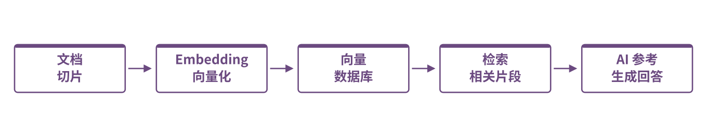
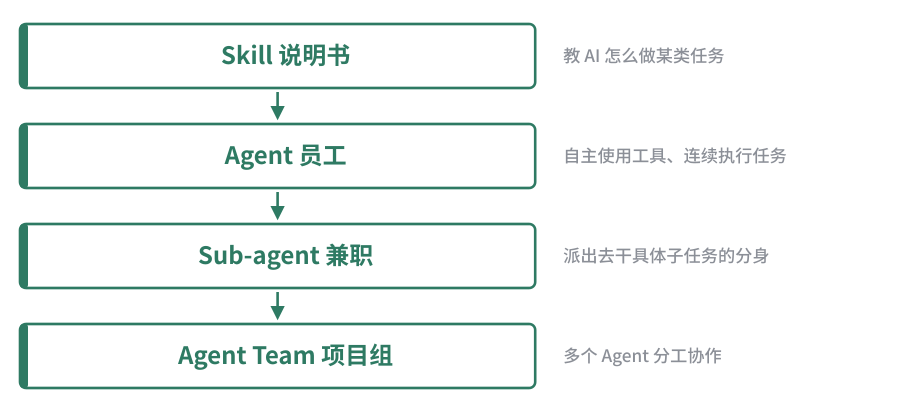
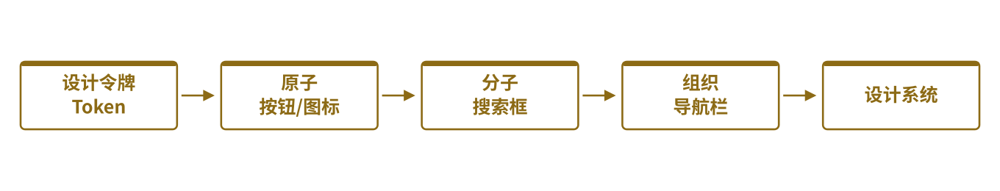
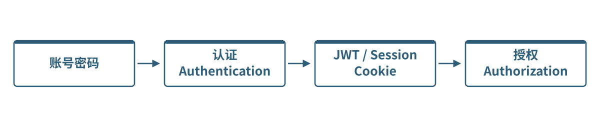

# 开发词汇手册

DEV GLOSSARY · 写给不懂技术的你

开发词汇
手册

A Field Guide to Software \& AI-Era Jargon

遇到一个听不懂的词，先来这里查， **搞懂"它叫什么、干什么用的"** ，
再去跟 AI／工程师聊天，效率会高很多。九个专题，从架构分层到数据库后端，
每一条术语都配"通俗解释"与"展开讲解"两种读法。

<svg-embed id="source-diagram-01" src="./media/svg/source-diagram-01.svg" title="原稿图示 01" />

01

架构分层与工程规范

02

提示词与模型基础

02b

Agent、工具链与协作流程

03

环境与部署基础设施

03b

测试与工程流程

04

前端 UI 组件与布局术语

05

语言与数据格式技术栈

06

动效与图形 / 渲染库

07

数据库与后端服务

开发词汇手册 · DEV‑GLOSSARY.MD
EDITION 2026 · 全 9 篇

## 目录

TABLE OF CONTENTS · 九个专题，按需跳转，不必通读

- 01

架构分层与工程规范

ARCHITECTURE \& ENGINEERING DISCIPLINE

为什么代码不能随便堆在一起写——分层、Monorepo、SOLID、依赖注入、Harness Engineering。

4
- 02

AI 时代特有词汇（一）：提示词与模型基础

PROMPTS \& MODEL FUNDAMENTALS

Prompt、Token、RAG、Embedding、幻觉、思维链——跟 AI 对话时冒出来的黑话。

12
- 02b

AI 时代特有词汇（二）：Agent、工具链与协作流程

AGENTS \& TOOLING

MCP、Skill、Agent、Sub-agent、护栏——AI「自己动手做事」背后的一整套黑话。

19
- 03

生产环境 / 部署（一）：环境与部署基础设施

ENVIRONMENTS \& INFRASTRUCTURE

本地、Staging、生产环境有什么不同，Docker、CDN、灰度发布是什么。

24
- 03b

生产环境 / 部署（二）：测试与工程流程

TESTING \& WORKFLOW

单元测试到 E2E、Git 分支策略、监控日志——上线前后怎么知道系统靠不靠谱。

30
- 04

前端 UI 组件与布局术语

UI COMPONENTS \& LAYOUT

导航栏、弹窗、设计系统、原子设计——把「界面长什么样」说清楚的词汇表。

36
- 05

语言与数据格式技术栈

LANGUAGES \& DATA FORMATS

该学哪个编程语言、.json/.yaml 是什么、编译与解释、静态与动态类型。

43
- 06

动效与图形 / 渲染库

ANIMATION \& GRAPHICS

Canvas、WebGL、Three.js、Phaser、GSAP——渲染地基和动效工具怎么选。

50
- 07

数据库与后端服务

DATABASE \& BACKEND SERVICES

Supabase、SQL vs NoSQL、认证/授权、RLS——数据到底存在哪、怎么保证安全。

57

**怎么用这本手册：** 每篇文章都有两种讲法——「速查表」用来快速定位术语和场景；
「展开讲解」用打比方的方式讲清楚"为什么需要它、不用会怎样"，用来真正理解。
不用从头读到尾，按目录找到你现在困惑的那个话题，直接翻过去即可。

开发词汇手册  /  PART 01

01

## 架构分层与工程规范

ARCHITECTURE \& ENGINEERING DISCIPLINE

这篇讲的是：为什么代码不能随便堆在一起写，要拆成"层"？每一层到底负责什么？


点击「购买」按钮时，一次请求依次流经的四层

速查表  ·  QUICK REFERENCE

| 术语 | 通俗解释 | 常见叫法/工具 | 什么场景会用到 |
| --- | --- | --- | --- |
| 架构（Architecture） | 整个项目"房子怎么盖"的设计图 | Monorepo、分层架构、六边形架构 | 项目刚起步、决定代码怎么分文件夹时 |
| 路由（Router / Routing） | 网址决定显示哪个页面的规则 | React Router、Next.js App Router | 做多页面网站/App 时 |
| 数据层（Data Layer） | 只管"数据存哪、怎么读写"，不管页面好不好看 | Repository、DAO、ORM（Prisma/Drizzle） | 存取数据库、调用第三方 API |
| 业务层（Business Layer / Service Layer） | 管"这件事该怎么处理"的规则和判断 | Service、UseCase | 下单、扣库存、判断优惠券能不能用 |
| 逻辑层（Logic Layer） | 纯计算，不碰数据库、不碰界面 | Pure Function、工具函数 | 算价格、算碰撞、算分数 |
| 展示层（Presentation Layer / UI Layer） | 只管"画出来给人看" | React 组件、Vue 组件 | 按钮、页面、动画 |
| 单一职责原则（Single Responsibility） | 一个模块只干一件事 | — | 判断"这段代码是不是该拆出去" |
| 依赖方向（Dependency Direction） | 谁可以调用谁，不能反过来 | 依赖倒置、"核心不依赖壳" | 大项目防止代码越写越乱 |
| Harness Engineering | 给项目定"骨架规范"，让人和 AI 长期按规矩协作 | AGENTS.md、ESLint 规则、CI 检查 | 项目要长期维护、多人（或多次 AI 会话）协作时 |
| MVC / MVVM | 一种"页面-数据-逻辑"三方分工的经典分层套路 | Model-View-Controller / Model-View-ViewModel | 传统 Web 框架、桌面/移动应用 |
| 单体架构（Monolith） | 所有功能写在一个项目里，一起开发、一起部署 | — | 小型项目、团队规模小、起步阶段 |
| 微服务（Microservices） | 把一个大系统拆成多个各自独立部署、独立扩容的小服务 | — | 大型系统、多团队并行开发 |
| Monorepo | 多个子项目（包）放在 **同一个** 代码仓库里统一管理 | pnpm workspace、Turborepo、Nx | 本项目就是 Monorepo（ ` packages/ ` \+  ` apps/ ` 结构） |
| Polyrepo | 每个项目/服务各自一个 **独立** 仓库 | — | 团队/服务边界清晰、想各自独立发版时 |
| SOLID 原则 | 五条让代码"好改、不易崩"的设计准则 | 单一职责 / 开闭原则 / 里氏替换 / 接口隔离 / 依赖倒置 | 评审代码"设计得好不好"时的参考标尺 |
| 耦合与内聚（Coupling \& Cohesion） | 耦合＝模块之间"粘得有多紧"；内聚＝模块内部"是不是该放在一起的东西" | 低耦合高内聚 | 判断代码要不要拆分/合并 |
| 依赖注入（Dependency Injection） | 模块不自己创建它需要的东西，而是"从外面传进来" | DI Container、构造函数注入 | 让代码更容易替换实现、更容易测试 |
| 设计模式（Design Pattern） | 前人总结出来的、某类重复出现问题的"标准解法" | 单例模式、工厂模式、观察者模式、仓库模式 | 遇到"这个设计难题好像见过"时去查对应模式 |
| 领域驱动设计（DDD） | 先把业务概念（比如"订单""库存"）理清楚，再照着业务概念设计代码结构 | Entity、Aggregate、Bounded Context | 业务规则复杂、容易越改越乱的系统 |
| 中间件（Middleware） | 请求处理流程里，插在中间统一处理一类事情的"关卡" | 鉴权中间件、日志中间件、限流中间件 | 统一处理登录校验、请求日志、跨域等 |
| 事件驱动架构（Event-Driven Architecture） | 模块之间靠"发消息/广播事件"来通信，而不是互相直接调用 | EventEmitter、消息总线 | 想让模块互相不知道对方存在（解耦）、异步处理 |
| 消息队列（Message Queue） | 一个"任务先排队，慢慢被处理"的中转站 | RabbitMQ、Redis Queue、Kafka | 削峰限流、异步任务（发邮件、生成报表） |
| 状态管理（State Management） | 集中管理"整个应用里多个组件要共享的数据"的方案 | Redux、Zustand、Pinia | 多个页面/组件要读写同一份数据时 |
| 插件架构（Plugin Architecture） | 核心系统保持精简，具体功能通过"插件"往外挂 | VS Code 插件、Vite 插件 | 想让核心稳定，又要保留灵活扩展空间时 |

展开讲解  ·  IN DEPTH

### 为什么"点击购买"按钮背后要拆这么多层？

想象你在餐厅点餐：

1. **你（顾客）看到的菜单和按钮** —— 这是  **展示层** 。菜单好不好看、按钮在哪，跟"厨房怎么做菜"完全无关。
2. **服务员把你的需求记下来，判断"这道菜今天卖不卖、你的优惠券能不能用"** —— 这是  **业务层** 。这里全是"规则判断"，比如"会员打8折""库存不足不能下单"。
3. **后厨真正去仓库拿菜、下锅炒** —— 这是  **数据层** 。它只管"东西存在哪、怎么取出来"，不关心你为什么点这道菜。
4. **厨师炒菜的手法、火候计算** —— 这是  **逻辑层** 。纯粹的"计算过程"，给定食材和火候，算出结果，不用知道是谁点的。

如果这四件事全部写在一起（比如按钮的点击事件里直接写数据库查询语句），会出现什么问题？

- 你想换一个好看的按钮样式，却怕改坏了扣库存的逻辑。
- 你想把"打折规则"复用到另一个页面，却发现代码和这个按钮死死绑在一起，拆不出来。
- 出 bug 了，你不知道问题出在"页面显示错了"还是"规则算错了"还是"数据库读错了"——因为它们全挤在一个文件里。

**拆层的本质好处：出问题时，你能快速定位"是哪一层出的错"，改一层不会震动另一层。**

### 路由（Router）是什么？

路由就是"网址 → 该显示哪个页面"的对照表。

CODE

```text
/home        → 首页组件
/shop        → 商店页面组件
/user/123    → 用户 123 的个人主页

```

浏览器地址栏输入不同网址，路由系统查这张表，决定渲染哪个页面。没有统一路由规范的项目，经常会出现"这个页面到底该用什么网址""改了一个页面名字，结果到处链接都失效了"的混乱。

### Harness Engineering 到底是什么？和"架构"是什么关系？

` Harness ` 原意是"挽具"（拴住牲口拉车用的皮带套）。在软件里， ` Harness Engineering ` 指的是：

<aside-note id="source-note-1" kind="callout">
**在写具体功能之前，先把"骨架规范"钉死** ——文件夹怎么分、哪层能调用哪层、命名怎么定、多长的文件要拆分、AI 或新人接手时该先看哪份文档。
</aside-note>

它跟"架构"的关系是： **架构是设计图，Harness 是"把设计图刻进工具里，让人（或 AI）想违反都难"的那套机制** 。比如：

- 架构说"数据层不该被展示层直接调用" —— 这是设计图上的一句话。
- Harness 会用 ESLint 规则把这条禁令写成代码检查，你要是写错了，代码直接报错、提交不了。

<aside-note id="source-note-2" kind="callout">
**为什么要自己懂，不能只让 AI 自己定规范？**
因为 AI 每次对话可能是"失忆"的，如果规范只停留在口头约定或者靠 AI"自觉"，下一次换一个 AI 会话/换一个人接手，规矩可能就被悄悄破坏。把规矩写进文档（如  ` AGENTS.md ` ）和工具配置里，才能让规矩真正"长期生效"，而不是"说过就忘"。
</aside-note>

### 一个完整例子：点击"购买"按钮，数据是怎么流动的？

CODE

```text
用户点击"购买"按钮
↓  （展示层：捕获点击事件）
调用 "下单" 业务逻辑
↓  （业务层：检查库存够不够、优惠券能不能用、算最终价格）
调用逻辑层的纯函数计算最终金额
↓  （逻辑层：只做数学计算，不碰数据库）
把订单数据写入数据库
↓  （数据层：INSERT 一条订单记录）
返回结果给展示层，弹出"购买成功"提示

```

每一步只关心自己那一层的事，出错了也只需要去对应那一层排查，这就是分层的价值。

### 单体架构、微服务、Monorepo、Polyrepo——这四个词经常被混着说，怎么区分？

这四个词其实回答的是 **两个不同的问题** ，很多人会把它们混成一个问题：

- **"代码在运行时是几个独立服务？"** —— 这是  **单体（Monolith）vs 微服务（Microservices）** 要回答的问题。单体是"一个程序打包运行"；微服务是"拆成好几个各自独立运行、独立部署的小程序，互相用网络调用"。
- **"代码在仓库层面放在几个 Git 仓库里？"** —— 这是  **Monorepo vs Polyrepo** 要回答的问题。Monorepo 是"好几个项目的源码放在同一个 Git 仓库里"；Polyrepo 是"每个项目各自一个仓库"。

<aside-note id="source-note-3" kind="callout">
**关键点：这两个问题互相独立，可以任意组合** ：
</aside-note>

CODE

```text
Monorepo + 单体   → 本项目现在的情况：packages/apps 都在一个仓库，但目前作为独立壳各自运行
Monorepo + 微服务 → 大厂常见做法：所有微服务代码放一个大仓库，方便统一改公共代码，但运行时仍是多个独立服务
Polyrepo + 单体   → 小团队最简单的做法：一个仓库对应一个单体项目
Polyrepo + 微服务 → 每个微服务各自一个仓库，团队边界非常清晰，但公共代码复用会麻烦一些

```

选 Monorepo 的核心好处是"改一处公共逻辑，所有引用它的项目立刻同步"，代价是仓库会变大、需要专门的工具（如 pnpm workspace、Turborepo）来管理"只构建改动过的那部分"。这也是为什么本项目的  ` pnpm-workspace.yaml ` 存在——它就是 Monorepo 管理工具的配置文件。

### SOLID 原则到底是哪五条？用最简单的话说

SOLID 是五个英文单词首字母拼出来的缩写，是面向对象设计里最常被引用的五条准则：

| 字母 | 全称 | 一句话 |
| --- | --- | --- |
| **S** | 单一职责原则 | 一个类/模块只干一件事 |
| **O** | 开闭原则 | 加新功能时尽量"新增代码"，别老是"改已有代码" |
| **L** | 里氏替换原则 | 子类可以无痛替换父类使用，不会导致意外行为 |
| **I** | 接口隔离原则 | 不要强迫一个模块依赖它根本用不到的接口 |
| **D** | 依赖倒置原则 | 高层逻辑不该依赖具体实现细节，而是依赖"抽象接口" |

<aside-note id="source-note-4" kind="callout">
**不需要死记硬背** ，实用角度只需要知道： **当你发现"改一个小功能却牵连了一大片不相关的代码""一个类的方法多到看不完"，就是在违反 SOLID 里的某一条** ，这时候该考虑拆分或重新设计。
</aside-note>

### 依赖注入（DI）到底解决了什么问题？

没有依赖注入时，一个模块想用"存档服务"，会直接在内部写：

LANGUAGE-TS

```text
class Game {
private saveService = new LocalSaveService(); // 内部自己创建，死死绑定
}

```

这样写的问题：如果以后想换成"云端存档服务"，或者写测试时想用"假的存档服务"，都得跑到  ` Game ` 类内部去改代码。

依赖注入的做法是 **从外部把"存档服务"传进来** ：

LANGUAGE-TS

```text
class Game {
constructor(private saveService: SaveService) {} // 从外面注入，随时能换实现
}

```

**这正是本项目  ` packages/game-core/src/services/index.ts ` 里定义各种 Service 接口、由  ` apps/* ` 各个壳去实现并注入的原理** ——核心逻辑只认"存档服务应该有什么功能"（接口），不关心"具体是本地存档还是云端存档"（实现），换壳、换平台时核心代码完全不用动。

01 — 架构分层与工程规范
下一篇 · AI 提示词与模型基础

开发词汇手册  /  PART 02

02

## AI 时代特有词汇（一）：提示词与模型基础

PROMPTS \& MODEL FUNDAMENTALS

这篇讲的是：跟 AI 对话、调模型参数时经常冒出来的黑话。 **Agent、Skill、MCP 等"工具链/协作流程"相关的词，见姊妹篇  ` 02b-ai-agents-and-tooling.md ` 。**



RAG（检索增强生成）：先查资料，再让 AI 参考着回答

速查表  ·  QUICK REFERENCE

| 术语 | 通俗解释 | 常见工具/例子 | 什么场景会用到 |
| --- | --- | --- | --- |
| Vibe Coding | 靠"感觉"和 AI 对话式地写代码，而不是先设计再写 | 直接跟 Cascade/Cursor/Copilot 聊需求 | 快速试错、做原型 |
| 敏捷开发（Agile） | 小步快跑、频繁反馈的开发方式，不是一次性憋大招 | Scrum、Kanban | 需求会变化的项目 |
| Loop Engineering | 设计"AI 反复自我检查/修正"的循环流程 | AI 写代码→跑测试→看报错→自己修 | 让 AI 长任务里少犯错 |
| Harness Engineering | 给项目定死骨架规范，让协作长期稳定（详见  ` 01-architecture-layers.md ` ） | AGENTS.md、四把锁 | 项目要长期演进 |
| Prompt（提示词） | 你给 AI 的那段话/指令 | "帮我写一个登录页面" | 每次跟 AI 对话 |
| System Prompt vs User Prompt | System Prompt 是"预先设定好、贯穿全程的人设/规则"；User Prompt 是"你当下这句话" | 系统提示词设定"你是个游戏开发助手" | 区分"谁在什么层级影响 AI 的行为" |
| Prompt Engineering | 研究"怎么把话说清楚，让 AI 输出更准" | 结构化提问、给例子 | 让 AI 输出更符合预期 |
| 上下文（Context） | AI 这次对话"记得"的所有信息总量 | 对话历史、打开的文件 | AI 突然"忘事"或答非所问时 |
| 上下文窗口（Context Window） | AI 一次最多能"看"多少 token 的硬性上限 | 128K / 200K token 窗口 | 判断"这个项目/对话是不是塞太多东西了" |
| 上下文管理（Context Management） | 主动整理/精简喂给 AI 的信息，别让它信息过载 | 摘要、清空历史、分文件说明 | 长对话、大项目 |
| Token | AI 处理文字的最小单位（不完全等于一个字） | 1 token ≈ 0.75 个英文单词 / 不到 1 个中文字 | 计算 AI 用量/费用 |
| 模型选择（Model Selection） | 选用哪个 AI 大脑来干活 | GPT、Claude、Gemini、DeepSeek | 追求速度/质量/成本的取舍 |
| 输入/输出（Input/Output） | 你发给 AI 的内容 / AI 返回给你的内容 | — | 计算 token 消耗时区分方向 |
| 采样参数：Temperature / Top-p | 控制 AI 回答"有多随机/有多保守"的旋钮 | Temperature 0（死板严谨）～1+（天马行空） | 想要 AI 更稳定 or 更有创意时调整 |
| 缓存命中（Cache Hit） | AI 服务商发现"这段内容之前处理过"，直接复用结果、省钱省时间 | Prompt Caching | 长期反复用同一份系统说明/文档时 |
| RAG（检索增强生成） | 先去"资料库"里查相关内容，再让 AI 参考着回答，而不是凭"记忆"瞎答 | 向量检索 + LLM 生成 | 让 AI 回答基于你的私有文档/最新资料 |
| Embedding（向量嵌入） | 把文字"翻译"成一串数字（向量），方便计算机比较"意思像不像" | text-embedding-3、BGE | 做语义搜索、RAG 的底层技术 |
| 向量数据库（Vector Database） | 专门存 Embedding 向量、能快速找出"意思最相近"的数据的数据库 | Pinecone、pgvector、Milvus | RAG 系统、语义搜索 |
| 微调（Fine-tuning） vs 提示词工程 | 微调＝重新训练模型让它"学会"新技能；提示词工程＝不改模型，只改"怎么问" | LoRA 微调 | 决定"用更好的提问方式" 还是 "投入资源训练专属模型" |
| 幻觉（Hallucination） | AI 一本正经地编造不存在的事实 | AI 编造不存在的函数名/API | 判断"这个回答需不需要人工核实" |
| Few-shot / Zero-shot | Few-shot＝先给几个例子再提问；Zero-shot＝不给例子直接问 | Prompt 里附带"示例输入输出" | 想让 AI 更准确模仿某种格式时用 Few-shot |
| 思维链（Chain of Thought, CoT） | 让 AI"把思考步骤写出来"，而不是直接跳到答案 | "请一步步推理后再回答" | 复杂逻辑/数学题，提升准确率 |
| 多模态（Multimodal） | AI 不只能读文字，还能"看"图片、"听"语音 | 上传截图问 AI 这是什么 bug | 需要 AI 理解图片/音频/视频时 |
| 流式响应（Streaming Response） | AI 的回答像打字机一样一个字一个字冒出来，而不是等全部写完再显示 | ChatGPT 网页的逐字输出效果 | 提升用户等待体验、支持长回答提前查看 |
| 知识截止日期（Knowledge Cutoff） | 模型训练数据"截止到哪一天"，之后发生的事它不知道 | "我的知识截止到 2024 年" | 问 AI 最新新闻/版本号时要留意 |
| 开源权重 vs 闭源模型（Open-weight vs Closed） | 开源权重＝模型文件公开可下载自己跑；闭源＝只能通过官方 API 调用 | DeepSeek/Llama（开源权重）vs GPT/Claude（闭源） | 决定能不能自己私有化部署模型 |
| 模型量化（Quantization） | 把模型"压缩"得更小、跑得更快，牺牲一点精度 | 4-bit/8-bit 量化 | 想在普通电脑/手机上跑本地模型时 |
| 本地大模型（Local LLM） | 把模型直接下载到自己电脑上跑，不用联网调 API | Ollama、LM Studio | 想离线用、不想数据传到云端时 |

展开讲解  ·  IN DEPTH

### Vibe Coding 是什么？跟"正经写代码"有什么不同？

传统写代码像"先画好图纸再盖房子"：先想清楚需求、画流程图，再动手写。

Vibe Coding 更像"跟一个很懂技术的朋友聊天，边聊边改"：你说一句"我想要个能左右移动的小车"，AI 直接写出来，你看效果不满意再说一句"车速太快了，调慢点"，AI 再改。 **优点是快、试错成本低；缺点是项目大了容易越改越乱，这也是为什么还是需要"架构规范"（见  ` 01-architecture-layers.md ` ）来兜底。**

### Loop Engineering 和 Harness Engineering 有什么区别？

- **Harness Engineering** ：定"骨架"和"规矩"——项目该长什么样，文件夹怎么分，谁不能调用谁。是 **静态的、一次性搭好的框架** 。
- **Loop Engineering** ：设计 AI 干活时的"自我检查循环"——写一段代码 → 跑一下测试 → 看报错 → 自己改 → 再跑测试，一直循环到通过。是 **动态的、AI 工作过程中反复走的流程** 。

打个比方：Harness 是"给车装好护栏和车道线"，Loop Engineering 是"教司机养成边开边看后视镜、发现偏了就纠正的习惯"。

### Token 是什么？为什么要"省 Token"？

AI 不是按"字"读文字的，它把文字切成更小的碎片，叫  **Token** 。粗略估算：

- 英文：1 个 token ≈ 0.75 个单词（例如 "hello world" 大概是 2\~3 个 token）
- 中文：1 个 token 经常还不到 1 个汉字（中文相对"更贵"）

<aside-note id="source-note-5" kind="callout">
**为什么要省？** 因为：
1\.  **收费按 token 数算** ——输入越长、AI 回复越长，花的钱越多。
2\.  **AI 一次能"记住"的 token 数是有上限的** （叫"上下文窗口"），塞太多没用的信息，AI 反而会漏看重要的部分，答非所问。
</aside-note>

所以"上下文管理"的核心工作，就是 **只喂给 AI 当前任务真正需要的信息，别把整个项目的历史对话都堆进去** 。

### 缓存命中（Cache Hit）为什么能省钱？

如果你每次对话都要先把一份很长的"系统说明书"发给 AI（比如项目的架构文档），AI 服务商发现"这段内容我上次处理过，内容完全没变"，就可以直接复用之前算好的结果， **不用重新"读"一遍，这部分的费用会打折甚至免费** 。这也是为什么把"不常变化的规则"（如  ` AGENTS.md ` ）单独放好、别老改动，能帮你省钱。

### RAG、Embedding、向量数据库——这三个词是怎么串起来工作的？

假设你想让 AI 回答"我们项目的存档服务是怎么设计的"，但这个信息只存在你自己的代码仓库里，AI 训练时根本没见过。 **RAG（检索增强生成）** 的做法：

CODE

```text
第一步：把你的文档/代码切成一小段一小段
↓
第二步：用 Embedding 模型把每一段"翻译"成一串数字（向量），意思相近的段落，向量也相近
↓
第三步：把这些向量存进"向量数据库"里
↓
你提问时，先把你的问题也变成向量，去向量数据库里"找长得最像的那几段"
↓
把找到的相关段落 + 你的问题，一起交给 AI，让它"参考着"这些真实资料来回答

```

<aside-note id="source-note-6" kind="callout">
**一句话理解三者关系** ：Embedding 是"把文字变成可比较的数字"的翻译技术；向量数据库是"存这些数字、能快速找相似"的仓库；RAG 是"先查资料再回答"这一整套流程的名字。 **这解决的核心问题是：让 AI 的回答有真实依据，而不是只靠训练时记住的旧知识瞎猜。**
</aside-note>

### 微调（Fine-tuning）和提示词工程，什么时候该选哪个？

两者都是"让 AI 表现得更符合你的需求"，但成本和适用场景完全不同：

|  | 提示词工程 | 微调（Fine-tuning） |
| --- | --- | --- |
| 改的是什么 | 只改"怎么问"，模型本身不变 | 用你的数据重新训练，模型参数真的变了 |
| 成本 | 几乎零成本，随时能改 | 需要准备训练数据、花算力和时间 |
| 适合场景 | 绝大多数日常任务 | 需要模型稳定输出"特定风格/特定领域知识"，且提示词工程已经解决不了 |

<aside-note id="source-note-7" kind="callout">
**建议：99% 的情况先穷尽提示词工程（把问题描述清楚、给例子、用 RAG 补充资料），只有确认"就是问不出想要的效果"，才考虑微调。**
</aside-note>

### 采样参数（Temperature / Top-p）到底是调什么？

AI 生成下一个字时，其实是在"一堆候选字里按概率抽签"。 **Temperature** 就是调"这个抽签有多随机"：

- Temperature 调低（接近 0）：几乎每次都选"概率最高的那个字"，回答稳定、死板、适合写代码、算数学。
- Temperature 调高（大于 1）：更愿意选一些"概率不是最高但也不差"的字，回答更有变化、更有"创意"，但也更容易跑偏。

**Top-p** 是另一种控制方式：只在"加起来概率达到 p（比如 90%）的候选字"里抽签，把"明显不合理的选项"直接排除掉，跟 Temperature 经常搭配使用。

### 幻觉（Hallucination）、Few-shot/Zero-shot、思维链，这三者怎么帮你拿到更靠谱的答案？

- **幻觉** 是问题本身：AI 有时会"一本正经地编"——编一个不存在的函数名、编一个不存在的历史事件，还说得特别自信。 **这是所有大模型目前都存在的固有缺陷，不是哪个模型"故意"犯错** 。
- **Few-shot/Zero-shot** 和  **思维链（CoT）** 是两种缓解幻觉、提升准确率的"问法技巧"：
- Few-shot：先给 AI 看 2\~3 个"问题+标准答案"的例子，AI 更容易照着格式和逻辑来，而不是自由发挥。
- CoT：让 AI"先把推理步骤写出来，再给结论"，相当于让它"打草稿"，比直接跳答案更准（尤其在数学、逻辑题上）。

<aside-note id="source-note-8" kind="callout">
**实用建议：遇到 AI 一本正经说出一个你从没听过的库名/API，先怀疑是幻觉，去官方文档核实，而不是直接相信。**
</aside-note>

### 多模态、知识截止日期、开源权重 vs 闭源、模型量化、本地大模型——这几个"能力边界"相关的词有什么联系？

这几个词共同回答的问题是： **"这个 AI 能力的边界在哪里？我能不能完全掌控它？"**

- **多模态** 回答"它能理解文字之外的什么东西"（图片/语音/视频）。
- **知识截止日期** 回答"它的知识新鲜到什么时候"，超过这个日期的新闻/新版本号它是不知道的，需要靠联网搜索或 RAG 补充。
- **开源权重 vs 闭源** 回答"我能不能拿到模型本体，自己私有化部署，不经过官方服务器"。
- **模型量化** 回答"这个模型能不能塞进普通电脑/手机跑"——量化是用"精度换体积和速度"的压缩手段。
- **本地大模型（Local LLM）** 是前面几个概念的落地应用：选一个开源权重模型，量化压缩后，用 Ollama 之类的工具在自己电脑上跑起来，不用联网、数据不出本地。

**这些概念串起来能帮你判断："我的场景需不需要联网/最新知识？需不需要图片理解？需不需要数据完全不出本地（涉及隐私/合规）？"——不同答案会指向完全不同的模型选择。**

02 — AI 时代特有词汇（一）：提示词与模型基础
下一篇 · Agent、工具链与协作流程

开发词汇手册  /  PART 02B

02b

## AI 时代特有词汇（二）：Agent、工具链与协作流程

AGENTS \& TOOLING

这篇讲的是：让 AI"自己动手做事"背后涉及的黑话——Agent 怎么用工具、MCP 怎么接外部系统、这套协作流程该怎么设计规矩。 **提示词/模型基础相关的词，见姊妹篇  ` 02-ai-era-terms.md ` 。**



按「权力范围」从小到大：说明书 → 员工 → 兼职 → 项目组

速查表  ·  QUICK REFERENCE

| 术语 | 通俗解释 | 常见工具/例子 | 什么场景会用到 |
| --- | --- | --- | --- |
| MCP（Model Context Protocol） | 让 AI 能"接上"外部工具/数据库/服务的统一协议 | GitHub MCP、Supabase MCP | AI 需要操作 GitHub、数据库等外部系统时 |
| CLI（命令行界面） | 用打字命令而不是点鼠标来操作电脑 | ` npm install ` 、 ` git commit ` | 几乎所有开发工具的基本操作方式 |
| Skill | 一份教 AI"怎么做某类任务"的说明书 | 本仓库的  ` .agent/skills/ ` | 让 AI 遇到特定任务时自动照着流程走 |
| Agent | 能自主使用工具、连续执行多步任务的 AI | Cascade、Claude Code、Devin | 需要 AI 自己动手改代码、跑命令 |
| Sub-agent | Agent 派出去干"某个子任务"的分身 | 搜索子任务、审查子任务 | 大任务拆小任务并行处理 |
| Agent Team | 多个 Agent 分工协作，各管一块 | 一个写代码、一个测试、一个审查 | 复杂项目的多角色协作 |
| Function Calling / Tool Use | AI 判断"这件事该调用哪个工具"，并按格式生成调用参数 | AI 决定调用"查天气"函数并传入城市名 | AI 需要触发具体动作而不只是聊天 |
| 编排（Orchestration） | 安排多个 Agent/工具按什么顺序、什么条件配合工作 | LangGraph、多 Agent 工作流 | 复杂任务需要多步骤、多角色协调 |
| 护栏（Guardrails） | 给 AI 的行为划定"不能做"的边界 | 内容审核、禁止执行危险命令 | 防止 AI 输出违规内容或做危险操作 |
| Jailbreak（越狱） | 想办法绕过 AI 的安全限制，让它做本不该做的事 | 精心设计的诱导提示词 | 了解这是安全风险，而非正常使用方式 |
| 人类介入（Human-in-the-loop） | 关键步骤让人确认后才继续，而不是完全自动化 | 危险命令需要用户手动批准 | 涉及不可逆操作（删文件、发钱）时 |
| Spec-driven Development | 先写清楚"要做成什么样"的规格文档，再让 AI 照着实现 | 先写 PRD/接口定义，再生成代码 | 避免 AI"猜需求"导致跑偏 |
| Git Worktree | 同一个仓库同时开出多个独立工作目录，各自切不同分支 | ` git worktree add ` | 让多个 Agent/任务并行改代码互不干扰 |
| AI 代码审查（AI Code Review） | AI 自动检查 PR 里的代码有没有问题 | Bot 自动评论 PR | 减少人工审查负担、提前发现问题 |
| 限流（Rate Limit） | 限制"单位时间内最多能调用多少次"的规则 | API 每分钟最多 60 次请求 | 防止滥用、控制成本 |
| Webhook | 某个事件发生时，系统"主动通知"另一个系统的机制 | GitHub 有新 PR 时自动通知 CI | 系统之间自动联动，不用人工检查 |
| SDK vs API | API 是"接口规则"本身；SDK 是"帮你调用这个 API 的现成代码包" | Stripe API vs Stripe SDK | 用 SDK 能少写很多"拼接请求"的重复代码 |
| 沙箱（Sandbox） | 一个隔离的、"出了问题也不影响真实环境"的试验场 | 代码执行沙箱、CodeSandbox | 让 AI 跑代码/命令时先在沙箱里测试 |
| 代码解释器（Code Interpreter） | AI 能直接运行一段代码并看到执行结果，而不是只生成代码文字 | ChatGPT 的 Code Interpreter 功能 | 需要 AI"跑一下看看对不对"时 |
| README.md | 写给 **人** 看的项目说明书 | 项目根目录必备 | 让新人/用户快速了解项目 |
| AGENTS.md | 写给 **AI** 看的项目规矩说明书 | 本仓库根目录已有 | 让 AI 每次接手都知道"红线在哪" |

展开讲解  ·  IN DEPTH

### MCP 到底解决了什么问题？

在 MCP 出现之前，如果你想让 AI"帮你去 GitHub 建一个 issue"，AI 是做不到的——它只会聊天，接触不到 GitHub 的真实系统。

**MCP 就像给 AI 装了一套"万能遥控器接口"** ：只要一个系统（GitHub、Supabase 数据库、你的文件系统）按 MCP 这个标准协议接好了"插座"，AI 就能直接操作它——建 issue、查数据库、读写文件，而不再只是"纸上谈兵"。

### Skill / Agent / Sub-agent / Agent Team 分别是什么层级？

按"权力范围"从小到大排：

CODE

```text
Skill（说明书）
↓ 被谁使用
Agent（一个会自己动手干活的 AI）
↓ 可以派出
Sub-agent（Agent 派出去干具体子任务的分身，干完汇报，自己消失）
↓ 多个 Agent 组合起来
Agent Team（多个 Agent 分工协作，比如一个专门写代码、一个专门测试、一个专门审查）

```

打比方： **Skill 是操作手册，Agent 是照着手册干活的员工，Sub-agent 是员工临时喊来帮个小忙的兼职，Agent Team 是一个完整的项目小组，每个人有自己的岗位。**

### Function Calling 和 MCP 有什么关系？

两者经常被搞混，区别在于 **范围大小** ：

- **Function Calling（工具调用）** 是"底层能力"：AI 判断"这句话需要调用哪个函数、参数是什么"，然后生成一段结构化的调用请求。这是 AI 模型本身具备的一种输出格式能力。
- **MCP** 是"标准化的外部系统接口协议"：定义了"外部系统该怎么把自己的功能，包装成 AI 能理解、能调用的工具列表"。

<aside-note id="source-note-9" kind="callout">
**关系是** ：MCP 服务器把 GitHub/数据库的功能"翻译"成一堆可调用的"工具"，AI 用 Function Calling 这个底层能力去决定"调用哪个工具、传什么参数"。 **MCP 解决"接口标准化"的问题，Function Calling 解决"AI 怎么决定调用"的问题，两者配合才能让 AI 真正操作外部世界。**
</aside-note>

### 编排（Orchestration）、护栏（Guardrails）、人类介入（Human-in-the-loop），这三者是怎么让"AI 自主干活"变得可控的？

如果放任 AI Agent 完全自由行动，风险很高（比如不小心删了重要文件、无限循环空转）。这三个机制是让"自主性"和"安全性"平衡的关键：

- **编排** 负责"流程设计"：规定任务先做什么、后做什么、遇到分支条件走哪条路——像项目经理排的工作计划表。
- **护栏** 负责"边界限定"：明确规定"无论编排怎么走，AI 都绝对不能做这几件事"——像安全规范里的"红线"。
- **人类介入** 负责"关键节点拦一下"：遇到不可逆的操作（删除、发布、花钱），先停下来让人确认，而不是自动往下走。

<aside-note id="source-note-10" kind="callout">
**三者组合起来，才是一个"既能自主干活，又不会闯出大祸"的 Agent 系统设计。**
</aside-note>

### Spec-driven Development 和 Vibe Coding 是相反的吗？

不完全是"相反"，更像是 **同一套工作流程里的"两个阶段"** ：

- **Spec-driven Development** ：先把"要做成什么样"写清楚（需求规格、接口定义、验收标准），确定后再让 AI（或人）照着实现。适合 **需求明确、后期改动成本高** 的场景。
- **Vibe Coding** ：直接边聊边改，适合 **探索阶段、需求还不确定** 的场景。

**成熟的做法往往是：先用 Vibe Coding 的方式快速试出"大概想要什么"，一旦方向确定，就转成 Spec-driven 的方式把规格钉死，再让 AI/团队按规格稳定推进——这也正是  ` 01-architecture-layers.md ` 里 Harness Engineering 强调"先问透再动手"的原因。**

### README.md 和 AGENTS.md 有什么区别？

两份文档都在项目根目录，但读者不一样：

|  | README.md | AGENTS.md |
| --- | --- | --- |
| 读者 | **人** （尤其是第一次看这个项目的人） | **AI** （每次接手这个项目的 AI 助手） |
| 内容 | 这个项目是干什么的、怎么安装、怎么运行 | 这个项目有什么"红线"不能碰、命令怎么跑、架构上的硬性约束 |
| 风格 | 可以写得亲切、有截图、有介绍 | 要短、要狠、只写"AI 猜不到的规矩"，废话是负资产 |

一句话记忆： **README 是给人看的"欢迎手册"，AGENTS.md 是给 AI 看的"宪法+安全须知"。**

02b — AI 时代特有词汇（二）：Agent、工具链与协作流程
下一篇 · 环境与部署基础设施

开发词汇手册  /  PART 03

03

## 生产环境 / 部署（一）：环境与部署基础设施

ENVIRONMENTS \& INFRASTRUCTURE

这篇讲的是：为什么代码在我电脑上跑得好好的，发布上线就出问题？服务器、CDN、Docker 这些"基础设施"词到底是什么意思。 **测试类型、Git 工作流、监控告警相关的词，见姊妹篇  ` 03b-testing-and-workflow.md ` 。**


从本地到生产：整个过程自动化完成，就叫 CI / CD

速查表  ·  QUICK REFERENCE

| 术语 | 通俗解释 | 常见工具/例子 | 什么场景会用到 |
| --- | --- | --- | --- |
| 本地开发环境（Local / Dev） | 你自己电脑上跑的那个"草稿版" | ` localhost:3000 ` | 写代码、调试时 |
| 预发布/测试环境（Staging） | 跟生产环境几乎一样，但只给内部测试用，不给真实用户 | staging.example.com | 上线前最后一轮真实环境验证 |
| 生产环境（Production） | 真正给用户用的"正式版" | 线上域名 | 上线后 |
| 部署（Deploy） | 把代码从你电脑"搬"到能被别人访问的地方 | Vercel、EdgeOne Pages | 发布新版本时 |
| 打包（Build） | 把一堆源代码编译/压缩成能真正运行的文件 | ` npm run build ` | 部署前的必经步骤 |
| 服务器（Server） | 一台 24 小时开着、专门等着回应别人请求的电脑 | 云服务器、VPS | 网站/游戏需要被访问时 |
| 容器化（Docker / Container） | 把"程序+它需要的运行环境"打包成一个标准盒子，到哪都能一样运行 | Docker、Dockerfile | 避免"我电脑能跑、服务器跑不了"的环境差异问题 |
| 容器编排（Kubernetes） | 管理成百上千个容器"该在哪台机器跑、坏了自动重启"的调度系统 | K8s | 大规模、多容器的生产系统 |
| 无服务器/边缘函数（Serverless / Edge Function） | 不用自己管服务器，写个函数丢上去，有请求来才运行、按次计费 | Cloudflare Workers、Vercel Edge Functions | 小流量/间歇性请求，省去运维服务器的麻烦 |
| CDN（内容分发网络） | 把你的静态文件复制到全球各地机房，用户就近访问，速度更快 | Cloudflare、EdgeOne | 加速全球用户访问、减轻源服务器压力 |
| 负载均衡（Load Balancer） | 把大量请求"分流"给后面多台服务器，别都挤到一台上 | Nginx、云负载均衡器 | 单台服务器扛不住高流量时 |
| 横向/纵向扩展（Scaling） | 横向＝加更多台机器一起扛；纵向＝给一台机器升配置 | 加机器 vs 升级 CPU/内存 | 用户量增长后如何应对压力 |
| 域名（Domain） | 服务器地址的"好记名字"，代替一串数字 IP | ` example.com ` | 让别人能记住你的网址 |
| URL | 完整的"门牌地址"，域名+路径+参数 | ` https://example.com/shop?id=1 ` | 访问具体某个页面/资源 |
| HTTPS / SSL / TLS | 给网络传输加密，防止别人偷看/篡改数据 | 网址前面的小锁标志 | 几乎所有正式网站的标配 |
| 反向代理（Reverse Proxy） | 服务器前面挡一层"接待员"，帮忙转发请求、隐藏真实服务器地址 | Nginx、Caddy | 统一入口、做安全防护/限流 |
| 路由（Route） | 见  ` 01-architecture-layers.md ` | — | — |
| 前端（Frontend） | 用户看得到、点得到的那一层 | React、Vue | 界面、交互 |
| 后端（Backend） | 用户看不到，负责处理数据和规则的那一层 | Node.js、Python 服务 | 存数据、算逻辑、权限校验 |
| 前后端一体（Full-stack） | 一个人/一套代码同时管前端和后端 | Next.js（自带后端功能） | 小团队/独立开发 |
| 渲染策略：SSR / SSG / CSR / ISR | 页面内容"在哪个时间点、由谁生成"的四种方式 | Next.js 支持四种混用 | 决定首屏速度、SEO、实时性的取舍 |
| 灰度发布/蓝绿部署（Canary / Blue-Green） | 新版本先给一小部分用户/切到一套新环境试跑，没问题再全量切换 | 5% 流量先用新版本 | 降低"一上线就全炸"的风险 |
| 功能开关（Feature Flag） | 代码已经上线，但功能是"开着"还是"关着"用开关远程控制 | LaunchDarkly、自建开关表 | 想灰度放某个新功能，不满意能立刻关掉 |
| 环境变量（Environment Variable） | 不同环境下会变化的配置（密码、地址） | ` .env ` 文件 | 区分本地/生产的密钥、地址 |
| 缓存（Cache） | 把结果先存一份，下次直接用，不用重新算 | 浏览器缓存、CDN 缓存 | 加速网页加载 |
| 语义化版本（Semver） | 版本号  ` 主.次.修 ` 三段式，每段变动代表不同含义 | ` 2.1.0 ` →  ` 2.1.1 ` 只是修 bug | 判断"升级这个依赖会不会破坏东西" |
| 变更日志（Changelog） | 记录"每个版本改了什么"的文档 | ` CHANGELOG.md ` | 升级前查看有没有不兼容改动 |

展开讲解  ·  IN DEPTH

### 为什么"本地能跑，上线就炸"？本地环境和生产环境到底差在哪？

想象你在家里试做一道菜（本地环境）和在餐厅正式给客人上菜（生产环境）：

- **家里的冰箱食材、你自己的口味设置** （本地的数据库、你自己电脑的配置）跟 **餐厅仓库的食材、正式菜单** （生产环境的数据库、正式配置）不是同一套。
- 你在家里可能用了一个"临时偏方"（比如本地环境变量里硬编码了一个密钥），到了餐厅这个偏方可能压根没准备（生产环境没配这个密钥），于是出错。
- **每个人电脑上展示的效果不同** ，很多时候是因为：浏览器缓存了旧版本的文件、不同人访问到了还没更新完的服务器节点、或者本地测试用的是"假数据"而生产用的是"真实数据"，数据量/情况不一样导致界面表现不同。

### 从本地到生产，中间发生了什么？

CODE

```text
你在本地写代码（Local）
↓ git push（用版本控制上传代码改动）
代码进入代码仓库（如 GitHub）
↓ 触发打包（Build）：把源代码编译/压缩成正式可运行的文件
打包后的文件被"部署"（Deploy）到服务器/托管平台
↓
生产环境（Production）：真实用户能访问的正式网站

```

这整个过程如果是自动完成的，就叫  **CI/CD** （持续集成/持续部署）——你一提交代码，机器自动帮你测试、打包、上线。

### Docker（容器化）到底解决了什么问题？

"我电脑上能跑，服务器上跑不了"，经常是因为 **两台机器的运行环境不一样** ——Node.js 版本不同、缺了某个系统依赖、操作系统不一样。

**Docker 的做法是把"程序+它需要的整个运行环境"打包成一个标准化的"盒子"（镜像）** ，这个盒子在任何装了 Docker 的机器上，运行出来的结果都完全一样，不再依赖"这台机器本身装了什么"。

CODE

```text
没有 Docker：程序 + 依赖环境 直接装在服务器上 → 换台服务器可能环境不一样，容易出问题
有 Docker：程序 + 依赖环境 打包进一个盒子 → 换到哪台机器，盒子内部环境都一样，稳定复现

```

**Kubernetes（K8s）** 则是更进一步：当你的系统有几十上百个这样的"盒子"需要同时管理（哪个坏了自动重启、流量大了自动多开几个），K8s 就是负责"指挥调度"这些盒子的系统。 **对个人开发者/小项目来说，这两者暂时都不是必需品，先了解"是干什么的"即可，真正用到大规模生产系统时再深入学习。**

### Serverless / CDN / 负载均衡，都是为了解决什么问题？

这三个概念都在回答"怎么应对流量、怎么少花运维精力"，但角度不同：

- **Serverless（无服务器）** ：你完全不用管"服务器长什么样、装没装好环境"，只写一个函数丢上去，有人访问才运行，按调用次数计费。 **适合流量不稳定、间歇性的场景** ，没人访问时几乎不花钱。
- **CDN（内容分发网络）** ：把你的静态文件（图片、HTML、JS）提前复制到全球各地的机房，用户访问时"就近取货"，而不是每次都跑到你的源服务器所在地。 **解决的是"全球用户访问速度不一样"的问题。**
- **负载均衡** ：当一台服务器扛不住所有请求时，前面加一层"分配员"，把请求分流给后面多台服务器一起处理。 **解决的是"单台机器撑不住高并发"的问题。**

<aside-note id="source-note-11" kind="callout">
**三者可以叠加使用** ：CDN 处理"静态文件的全球加速"，负载均衡+多台服务器处理"动态请求的高并发"，Serverless 处理"不需要一直开着机器等着"的轻量后端逻辑。
</aside-note>

### SSR / SSG / CSR / ISR，网页内容到底是"谁在什么时候生成"的？

这四个缩写描述的是"一个页面的 HTML 内容，是在什么时间点、由谁生成"：

| 缩写 | 全称 | 生成时机 | 类比 |
| --- | --- | --- | --- |
| **CSR** | Client-Side Rendering（客户端渲染） | 用户打开页面后，浏览器自己现算现画 | 到店现做的快餐 |
| **SSR** | Server-Side Rendering（服务端渲染） | 每次用户访问，服务器现算好一份 HTML 再发过去 | 每来一个客人，厨房现炒一份菜 |
| **SSG** | Static Site Generation（静态站点生成） | 网站发布时提前算好所有页面，之后谁访问都是同一份 | 提前做好摆在货架上的成品菜 |
| **ISR** | Incremental Static Regeneration（增量静态再生成） | 像 SSG 一样提前做好，但过一段时间自动"重新做一份"更新掉 | 货架上的成品菜，过一阵子换一批新的 |

<aside-note id="source-note-12" kind="callout">
**为什么要关心这个？** 它直接决定：首屏打开速度快不快、搜索引擎收录效果好不好（SEO）、内容是不是"实时最新"。 **没有哪种是"绝对最好"的，一个网站里不同页面完全可以混用不同策略** （比如首页用 SSG 保证极快加载，用户个人中心用 CSR，因为每个人看到的内容都不一样）。
</aside-note>

### 灰度发布、蓝绿部署、功能开关，这三者是怎么"降低上线风险"的？

上线新版本最怕"一次性全量切换，结果出大问题，所有用户都受影响"。这三个手段都是为了把风险"切小"：

- **灰度发布（Canary）** ：先让 5%\~10% 的用户用上新版本，观察一段时间没问题，再逐步扩大到 100%。
- **蓝绿部署（Blue-Green）** ：同时准备两套完全独立的环境（蓝、绿），新版本先部署到没在服务用户的那一套，测试通过后把流量瞬间切过去，出问题能立刻切回旧的那一套。
- **功能开关（Feature Flag）** ：代码其实已经上线了，但功能藏在一个"开关"后面，想不想让用户看到，远程点一下开关就能控制，不需要重新部署代码。

<aside-note id="source-note-13" kind="callout">
**三者经常配合使用** ：用蓝绿部署保证"能快速切回旧版本"，用灰度发布控制"每次影响多少用户"，用功能开关做"更细粒度的、不需要重新部署的临时控制"。
</aside-note>

03 — 生产环境 / 部署（一）：环境与部署基础设施
下一篇 · 测试与工程流程

开发词汇手册  /  PART 03B

03b

## 生产环境 / 部署（二）：测试与工程流程

TESTING \& WORKFLOW

这篇讲的是：版本控制、各种测试类型、Git 分支怎么管、上线后怎么知道系统有没有出问题。 **服务器/CDN/部署基础设施相关的词，见姊妹篇  ` 03-production-deployment.md ` 。**

<svg-embed id="source-diagram-37" src="./media/svg/source-diagram-37.svg" title="原稿图示 37" />

从细到粗的多层保险：测试金字塔

速查表  ·  QUICK REFERENCE

| 术语 | 通俗解释 | 常见工具/例子 | 什么场景会用到 |
| --- | --- | --- | --- |
| 版本控制（Version Control） | 记录代码每一次改动，能随时"倒带" | Git | 几乎所有正规项目 |
| 版本回滚（Rollback） | 发现新版本出问题，退回上一个正常版本 | ` git revert ` 、平台一键回滚 | 上线后出大问题时 |
| 数据库迁移（Database Migration） | 给数据库结构"升级"，同时保留已有数据（详见  ` 07-database-backend.md ` ） | Prisma Migrate、Supabase Migrations | 数据库表结构要改动时 |
| 调试（Debug） | 找出代码为什么不对的过程 | 打印日志、断点调试 | 代码报错/行为不对时 |
| 单元测试（Unit Test） | 只测"一个小函数"是否算得对 | Vitest、Jest | 验证纯逻辑（比如算价格函数） |
| 集成测试（Integration Test） | 测"几个模块凑在一起工作"是否正常，比单测大、比 E2E 小 | 测"业务层调数据层"整条链路 | 验证模块之间对接没问题，但不用启动整个真实应用 |
| 端到端测试（E2E Test） | 像真实用户一样从头操作一遍整个流程 | Playwright、Cypress | 验证"注册→登录→下单"全流程通不通 |
| 冒烟测试（Smoke Test） | 最基本的"能不能打开、会不会直接崩"的检查 | 部署后跑一遍首页能不能打开 | 部署完的第一轮快速检查 |
| 回归测试（Regression Test） | 改了新功能后，重新跑一遍老测试，确认"没把以前跑通的东西改坏" | 每次提交自动重跑全部测试 | 防止"修好一个 bug，带出另一个 bug" |
| 代码覆盖率（Code Coverage） | 测试跑过的代码占全部代码的百分比 | ` 80% coverage ` | 衡量"测试写得够不够全面"的参考指标 |
| Lint / 格式化（ESLint / Prettier） | Lint 检查"代码有没有潜在问题/不规范写法"；格式化统一"代码长什么样" | ESLint、Prettier | 提交代码前自动检查+格式化 |
| 类型检查（Type Check） | 检查"这里该传数字却传了文字"之类的类型错误 | ` tsc --noEmit ` | TypeScript 项目编译前的静态检查 |
| 包管理器（Package Manager） | 帮你下载、管理项目依赖的工具 | npm、pnpm、yarn | 装任何第三方库都要用 |
| Node.js | 让 JavaScript 能在服务器/你电脑上（不只是浏览器里）运行的环境 | — | 几乎所有前端工具的运行基础 |
| 功能分支（Feature Branch） | 每个新功能单独开一条"分支"来写，不直接改主线代码 | ` git checkout -b feature/xxx ` | 多人协作、避免互相干扰主线 |
| Pull Request（PR） | "请求把我这个分支的改动合并进主线"的正式申请，附带代码审查 | GitHub/GitLab 的 PR/MR | 团队协作里合并代码的标准流程 |
| 合并 vs 变基（Merge vs Rebase） | Merge 保留两条分支的完整历史；Rebase 把改动"嫁接"到最新主线上，历史更干净 | ` git merge ` /  ` git rebase ` | 决定分支历史长什么样 |
| 监控（Monitoring） | 持续观察系统"活得好不好"（CPU、内存、响应速度） | Grafana、云平台自带监控面板 | 提前发现系统压力过大 |
| 日志（Logging） | 系统运行过程中留下的"流水账记录" | ` console.log ` 、日志文件 | 事后排查"当时到底发生了什么" |
| 错误追踪（Error Tracking） | 自动收集、汇总生产环境里发生的报错，而不用等用户投诉 | Sentry | 第一时间知道线上出错，而不是"用户不说就不知道" |

展开讲解  ·  IN DEPTH

### 为什么不能直接覆盖生产数据库？数据库迁移是什么？

生产数据库里存的是 **真实用户的真实数据** （订单、账号、进度）。如果你想给数据库"加一个新字段"，直接删表重建， **所有用户的数据都会被清空** ——这是灾难性的。

**数据库迁移（Migration）** 就是一套"温柔升级"的流程：写一个迁移脚本，描述"给这张表加一列，默认值是什么"，工具会在 **不删除已有数据** 的前提下，把结构改过去。这也是为什么正规项目里， **数据库结构的改动必须写成迁移文件，不能手动在生产数据库里乱改** ——这个概念在  ` 07-database-backend.md ` 里会结合具体数据库工具再展开。

### 单元测试 / 集成测试 / E2E 测试 / 冒烟测试 / 回归测试，五者到底怎么分工？

用"检查一辆车"来类比，从细到粗排列：

| 测试类型 | 类比 | 检查粒度 |
| --- | --- | --- |
| **单元测试** | 单独测试"刹车片好不好用"这一个零件 | 最细，只测一个函数/一个功能点 |
| **集成测试** | 测"刹车片装到刹车系统上，整套刹车能不能正常刹住" | 中等，测几个模块凑在一起是否配合正常 |
| **端到端测试（E2E）** | 真的把车开出去跑一圈，从启动到刹车全流程试一遍 | 最完整，模拟真实用户操作全过程 |
| **冒烟测试** | 上车前先看一眼"能不能打火、轮子有没有掉" | 最快最粗，只检查"最基本能不能用"，不追求全面 |
| **回归测试** | 修完一个零件后，把前面所有检查项重新跑一遍 | 不是"新的一种检查"，而是"重新跑一遍已有检查"，确认没有引入新问题 |

**它们不是互相替代的关系，是"从细到粗"的多层保险** ：单元测试保证每个零件没问题，集成测试保证零件组装到一起没问题，E2E 保证整套流程走得通，冒烟测试是部署完之后最后一道快速关卡，回归测试是"每次改动后都重新确认一遍旧功能没坏"的持续性动作。

### 代码覆盖率高就代表代码质量好吗？

**不一定。** 代码覆盖率只回答"测试跑过了多少行代码"，不回答"测试有没有真的验证出正确的结果"。举个极端例子：

LANGUAGE-TS

```text
test("加法函数", () => {
add(1, 2); // 调用了，但没有检查结果对不对——覆盖率算跑过了，但等于没测
});

```

这一行代码"被跑过"了，覆盖率会算进去，但 **测试根本没有断言（assert）结果是否正确** ，等于白测。 **覆盖率是"测试范围够不够广"的参考信号，不是"测试质量够不够高"的保证——两者要一起看。**

### Lint、格式化、类型检查，三者分别在防什么？

三者都是"代码提交前的自动检查"，但检查的维度不同：

- **格式化（Prettier）** ：只管"长得整不整齐"——缩进、换行、引号用单引号还是双引号，纯粹是风格统一，不涉及逻辑对错。
- **Lint（ESLint）** ：管"有没有潜在问题/不规范写法"——比如定义了一个变量却从来没用过、用了容易出 bug 的写法。
- **类型检查（TypeScript 的  ` tsc ` ）** ：管"类型对不对"——比如函数需要传数字，你却传了个字符串，编译阶段就能提前发现，不用等运行时才报错。

<aside-note id="source-note-14" kind="callout">
**三者叠加使用，能在代码"跑起来之前"就拦掉一大批问题** ，这也是为什么几乎所有现代前端项目的"提交前检查"（pre-commit）都会跑这三样。
</aside-note>

### Git 分支策略：功能分支、PR、Merge/Rebase 是怎么配合工作的？

一个典型的团队协作流程：

CODE

```text
从主线（main）拉出一条"功能分支"（feature branch）
↓
在功能分支上写代码、提交，不影响主线
↓
写完后发起 Pull Request（PR），请求合并回主线
↓
其他人在 PR 里做代码审查（Code Review），提出修改意见
↓
审查通过后，用 Merge 或 Rebase 的方式把改动并入主线

```

**Merge 和 Rebase 的区别** ：Merge 会保留"这条分支曾经存在过"的完整历史记录（历史图会有分叉又合并的痕迹）；Rebase 则是把你这条分支的改动，"重新嫁接"到主线最新的位置上，历史看起来像是一条直线，更干净，但会改写提交记录， **在团队共享分支上使用 Rebase 要格外小心** 。

### 监控、日志、错误追踪，上线之后怎么知道系统是不是"健康"？

代码上线之后，你不可能一直盯着屏幕看，这三者是"自动帮你盯着"的机制：

- **监控** ：持续采集"服务器/程序的健康指标"——CPU 占用多少、内存还剩多少、响应速度是不是变慢了。 **回答"系统整体状态怎么样"。**
- **日志** ：程序运行过程中自己记下的"流水账"——什么时候发生了什么事、哪个函数被调用了、传了什么参数。 **回答"具体某一刻发生了什么"，用于事后排查。**
- **错误追踪（Error Tracking）** ：专门收集"程序报错"这一类事件，自动汇总、去重、通知你，而不需要等用户来投诉才知道线上出问题了。 **回答"线上是不是正在出错，出的是什么错"。**

<aside-note id="source-note-15" kind="callout">
**三者组合起来，构成了"系统上线之后的眼睛"** ：监控看整体健康度，日志看细节过程，错误追踪专门盯"坏消息"，让你不用靠"用户投诉"才知道系统出了问题。
</aside-note>

03b — 生产环境 / 部署（二）：测试与工程流程
下一篇 · UI 组件与布局术语

开发词汇手册  /  PART 04

04

## 前端 UI 组件与布局术语

UI COMPONENTS \& LAYOUT

这篇讲的是：你想描述"我要的界面长什么样"，却说不出组件名字——这篇帮你把常见界面元素和它的"官方名字"对上号。



原子设计：积木怎么一层层拼成完整的视觉规范

速查表  ·  QUICK REFERENCE

| 术语 | 通俗解释 | 常见叫法 | 什么场景会用到 |
| --- | --- | --- | --- |
| 组件库（Component Library） | 一堆做好的、可以直接拿来用的界面积木 | shadcn/ui、Ant Design、MUI | 不想从零画按钮/表单时 |
| 导航栏（Navbar） | 页面顶部（有时是侧边）的主菜单条 | Top Nav | 几乎所有网站顶部 |
| Tab 栏（Tab Bar） | 底部/顶部可切换的几个大分类按钮 | Bottom Tab（手机App常见） | App 首页/排行/我的 切换 |
| 汉堡菜单（Hamburger Menu） | 三条横线 ☰ 图标，点开显示隐藏菜单 | Hamburger Icon | 手机端空间不够，把菜单先收起来 |
| 侧边抽屉（Drawer / Sidebar） | 从屏幕边缘滑出来的一块菜单 | Drawer | 设置、筛选、背包列表 |
| 弹窗（Modal / Dialog） | 盖在页面正中间的一个框，背景会变暗 | Popup、Modal | 确认购买、游戏结束提示 |
| 提示条（Toast / Snackbar） | 一闪而过的小提示条，几秒后自动消失 | Toast | "已保存""金币+100" |
| 进度条（Progress Bar） | 一条从左到右填充的条 | Loading Bar、血条 | 加载进度、角色血量 |
| 开关（Toggle / Switch） | 圆点左右滑动的小开关 | Switch | 打开/关闭音效震动 |
| 滑块（Slider） | 一条线上拖动一个圆点来选数值 | Range Slider | 调音量、选难度 |
| 下拉选择（Dropdown / Select） | 点一下展开一列选项 | Select Box | 选语言、选关卡 |
| 响应式设计（Responsive Design） | 同一个页面在手机/平板/电脑上自动变布局 | Responsive / Adaptive | 保证手机和电脑都好看 |
| 卡片布局（Card Layout） | 一块块带边框/阴影的矩形区域，装一小块内容 | Card | 商品列表、关卡选择界面 |
| 网格布局（Grid） | 排成整齐行列的方块 | Grid Layout | 背包格子、选关地图 |
| 启动页（Splash Screen） | App 打开瞬间先看到的 Logo 画面 | Splash | App/游戏刚启动时 |
| 加载页（Loading Screen） | 转圈圈/进度条页面，等资源加载完 | Loading | 大资源还没下载完时 |
| 骨架屏（Skeleton Screen） | 内容还没加载出来时，先显示灰色的"占位轮廓" | Skeleton | 比空白页面体验更好 |
| 面包屑（Breadcrumb） | 显示"你现在在哪一层"的路径导航条 | 首页 \> 商店 \> 皮肤 | 多层级页面，帮用户知道自己的位置 |
| 手风琴（Accordion） | 点一下展开、再点一下收起的可折叠内容块 | 常见问题 FAQ 列表 | 内容多但想默认收起、按需展开 |
| 提示框（Tooltip） | 鼠标悬停/长按时冒出来的小提示气泡 | 悬停在图标上显示"设置" | 给一个简短的补充说明，不占用常驻空间 |
| 徽标（Badge） | 数字/小圆点角标，通常挂在图标右上角 | 消息角标"3" | 提示"有几个未读/新内容" |
| 头像（Avatar） | 代表用户身份的小圆形/方形图片 | 个人中心的圆形头像 | 展示用户身份 |
| 分页（Pagination） | 把很长的列表拆成一页一页，靠数字按钮翻页 | 1 2 3 ... 下一页 | 数据量大，不想一次全部加载/显示 |
| 无限滚动（Infinite Scroll） | 滚动到底部自动加载更多，不用点"下一页" | 短视频/信息流常见 | 想让用户"停不下来地往下看" |
| 轮播图（Carousel） | 一组图片/卡片自动或手动左右切换展示 | 首页 Banner 轮播 | 展示多张推荐图，节省空间 |
| 步骤条（Stepper / Wizard） | 显示"当前在第几步，一共几步"的进度指示 | 注册流程 1/3 步骤 | 多步骤表单/流程引导 |
| 表单校验（Form Validation） | 检查用户填的内容对不对（格式、必填、长度） | 邮箱格式校验、密码强度提示 | 任何需要用户输入信息的表单 |
| 交互状态（Hover / Focus / Disabled / Error State） | 组件在"鼠标悬停/被选中/不可用/出错"时的不同外观 | 按钮变色、输入框变红 | 让用户清楚"现在能不能点、有没有填错" |
| 设计系统（Design System） | 一整套统一的颜色、字体、间距、组件规则 | Material Design、Ant Design | 保证一个产品所有页面视觉统一 |
| 设计令牌（Design Token） | 把颜色/间距/字号定义成"变量"，改一处全局生效 | ` color-primary: #3B82F6 ` | 设计系统里具体的"数值来源" |
| 原子设计（Atomic Design） | 把界面拆成"原子→分子→组织→模板→页面"五层组合关系 | 按钮(原子)→搜索框(分子)→导航栏(组织) | 组件库设计思路，指导怎么拆分组件粒度 |
| 线框图 vs 高保真原型（Wireframe vs Prototype） | 线框图＝只画黑白方框布局；高保真原型＝接近最终视觉效果、可点击体验 | Figma 里先画线框图再细化 | 设计流程的先后两个阶段 |
| 深色模式（Dark Mode） | 界面提供"暗色主题"供用户切换 | 系统跟随、手动切换 | 保护眼睛、省电、用户偏好 |
| 无障碍设计（Accessibility / a11y） | 让视力/听力/操作能力有障碍的用户也能正常使用产品 | 屏幕阅读器支持、键盘可操作 | 正规产品的合规与体验基本要求 |
| UX vs UI | UX＝整体使用体验/流程是否顺畅；UI＝界面具体长什么样 | UX：下单流程顺不顺；UI：按钮好不好看 | 区分"体验设计"和"视觉设计"两个角色 |
| 微交互（Microinteraction） | 一个小动作带来的小反馈，比如点赞时的跳动动画 | 点赞爱心放大一下 | 让操作"有回应感"，提升体验细节 |
| 空状态/错误状态（Empty State / Error State） | 列表没数据时、加载失败时该显示什么 | "暂无数据"插画、"加载失败，点击重试" | 别让用户看到一片空白或报错代码 |
| 层级（Z-index） | 决定"谁盖在谁上面"的堆叠顺序数值 | 弹窗 z-index 要比背景高 | 多个元素重叠时控制显示优先级 |
| 弹性布局 vs 网格布局（Flexbox vs Grid） | Flexbox 适合"一行/一列"的排列；Grid 适合"整个二维表格"的排列 | CSS  ` display: flex ` /  ` display: grid ` | 页面布局的两种基础 CSS 方案 |
| 视口/断点（Viewport / Breakpoint） | 视口＝当前设备的可见屏幕范围；断点＝"屏幕宽度到多少切换布局"的临界值 | ` 768px ` 断点切换手机/平板布局 | 响应式设计里判断"该用哪套布局"的依据 |

展开讲解  ·  IN DEPTH

### 组件库到底帮你省了什么？

如果没有组件库，你想做一个"确认购买"的弹窗，得自己从零写：一个半透明背景遮罩、一个居中的白色框、框里的按钮、点击关闭的逻辑、手机上弹出来会不会挡住输入框……这些细节全部自己处理，很容易漏东西（比如按 ESC 键能不能关掉、手机上滚动会不会露出遮罩外的内容）。

**组件库就是别人已经把这些细节全部处理好、测试过很多次的"半成品"** ，你只需要说"给我一个 Modal，内容是这段文字，两个按钮是确认和取消"，剩下的交互细节全部自动搞定。

### 汉堡菜单、Tab 栏、抽屉，这三个经常被搞混，怎么区分？

三者都是"藏菜单的地方"，区别在于 **触发方式和出现位置** ：

- **汉堡菜单（☰）** ：一个图标按钮，点一下才展开，通常在顶部角落。 **特点是"默认收起来，需要主动点开"** 。
- **Tab 栏** ：常驻在屏幕底部（App）或顶部（网页）， **永远显示着，不用点开就能看到几个大分类** ，点哪个就切到哪个页面。
- **侧边抽屉（Drawer）** ：从屏幕边缘"滑出来"的一块区域，可能是点汉堡菜单触发的，也可能是往右滑手势触发的。 **它是"菜单展开后的那个具体内容区域"** ，而汉堡菜单是"触发它出现的那个按钮"。

一句话记忆： **汉堡菜单是"门把手"，抽屉是"打开后的那个房间"，Tab 栏是"永远敞开的几个固定门"。**

### 弹窗（Modal）和提示条（Toast）有什么不同？

|  | Modal（弹窗） | Toast（提示条） |
| --- | --- | --- |
| 位置 | 屏幕正中间 | 通常在顶部/底部边缘 |
| 是否挡住操作 | 是，背景变暗，必须处理它才能继续 | 否，不影响你继续操作 |
| 消失方式 | 用户主动点按钮关闭 | 几秒后自动消失 |
| 常见用途 | 需要用户做决定（确认删除、确认购买） | 单纯告知一个结果（保存成功、网络断开） |

<aside-note id="source-note-16" kind="callout">
**判断标准：如果这件事"必须让用户做出选择才能继续"，用 Modal；如果只是"告诉用户发生了什么，不需要他回应"，用 Toast。**
</aside-note>

### 响应式设计是什么？为什么手机和电脑看到的布局不一样？

同一个网页代码， **根据屏幕宽度自动调整排版** ，这就是响应式设计。比如：

- 电脑屏幕宽 → 商品卡片一排显示 4 个
- 平板 → 一排显示 2 个
- 手机屏幕窄 → 卡片改成一排 1 个，纵向堆叠

这不是"做了两个网站"，而是 **同一套代码里写了"屏幕多宽的时候用什么排版"的规则** （技术上常用 CSS 的"媒体查询"或者 Tailwind 这类工具的响应式写法），浏览器自动根据当前屏幕宽度选用对应的规则。

### 卡片布局（Card）和网格布局（Grid）是什么关系？

- **卡片（Card）** ：描述的是" **一小块内容长什么样** "——通常带个边框或阴影，里面放图片+标题+简介，像一张实体卡片。
- **网格（Grid）** ：描述的是" **一堆东西怎么排列** "——横竖对齐、整整齐齐的行列结构。

<aside-note id="source-note-17" kind="callout">
**两者经常一起出现** ：把很多张"卡片"按照"网格"的方式排列，就是你常见的"商品列表""关卡选择界面"。卡片是"内容单元"，网格是"排列规则"，不是同一个东西。
</aside-note>

### UX 和 UI 到底谁包含谁？

这两个词经常被连在一起说"UI/UX"，但其实是 **两个不同层面的工作** ：

- **UX（User Experience，用户体验）** ：关心"整个使用过程顺不顺"——用户从进入 App 到完成一件事，中间要点几步、有没有卡顿、逻辑合不合理。 **是"流程和结构"层面的设计。**
- **UI（User Interface，用户界面）** ：关心"具体每个页面/组件长什么样"——按钮用什么颜色、字体多大、间距多少。 **是"视觉呈现"层面的设计。**

打比方： **UX 是"这栋房子的动线设计合不合理"（进门先到哪、卧室离厕所远不远），UI 是"墙刷成什么颜色、家具选什么风格"。** 一个 UI 很漂亮但 UX 很差的产品，会出现"每个页面都好看，但用户找不到想要的功能"的情况。

### 设计系统、设计令牌、原子设计，三者是怎么串起来保证"整个产品视觉统一"的？

一个产品有几十上百个页面，如果每个页面的按钮颜色、间距都是设计师/程序员随手定的，很快就会变得五花八门、不统一。这三个概念是解决这个问题的标准做法：

CODE

```text
设计令牌（Design Token）：最底层的"数值仓库"
例如：color-primary = #3B82F6，spacing-md = 16px
↓ 被引用
原子设计（Atomic Design）：规定组件怎么"从小拼到大"
原子（按钮/图标）→ 分子（搜索框=输入框+按钮）→ 组织（导航栏=Logo+搜索框+菜单）
↓ 组合成完整规则
设计系统（Design System）：把上面两者+使用规范，打包成一整套"产品的视觉宪法"
例如 Material Design、Ant Design

```

<aside-note id="source-note-18" kind="callout">
**关系是** ：设计令牌是"积木的颜色和尺寸标准"，原子设计是"积木怎么一层层拼起来的规则"，设计系统是"把这一整套标准和规则，打包成团队所有人都遵守的统一规范"。
</aside-note>

### 线框图和高保真原型，为什么设计要先画"丑的"再画"好看的"？

- **线框图（Wireframe）** ：只用黑白方框、线条勾勒"这个页面有哪些区域、大概怎么排列"，完全不考虑颜色、字体好不好看。
- **高保真原型（Prototype）** ：接近最终视觉效果，甚至可以点击模拟真实交互体验。

<aside-note id="source-note-19" kind="callout">
**为什么要先画线框图？** 因为 **布局结构和视觉风格是两件不同的事，早期讨论"这个页面该放哪些内容、顺序怎样"时，如果同时纠结"颜色好不好看"，会互相干扰讨论效率** 。先用线框图把"骨架"定下来，大家对结构没意见了，再往上填色彩和细节，效率更高、返工更少。
</aside-note>

### 无障碍设计（a11y）为什么值得了解？

` a11y ` 是 "accessibility" 的缩写（首尾字母 a、y 中间 11 个字母，所以简写成 a11y）。它关心的是： **视力不好的人怎么用你的产品？只能用键盘、不能用鼠标的人怎么操作？**

常见的基本要求包括：图片要有文字描述（供屏幕阅读器朗读）、所有功能都能用键盘 Tab 键操作到、文字和背景的颜色对比度要够高（色弱用户能看清）。 **这不只是"做好事"，很多地区/行业对无障碍设计有明确的合规要求，同时它也能提升所有用户（不只是有障碍的用户）在弱光环境、临时不方便用鼠标等场景下的体验。**

04 — 前端 UI 组件与布局术语
下一篇 · 语言与数据格式技术栈

开发词汇手册  /  PART 05

05

## 语言与数据格式技术栈

LANGUAGES \& DATA FORMATS

这篇讲的是：该学哪个编程语言？那些  ` .md `  ` .json `  ` .yaml ` 文件后缀到底是什么意思？

<svg-embed id="source-diagram-45" src="./media/svg/source-diagram-45.svg" title="原稿图示 45" />

两组互相独立的坐标轴：语言的基本脾气

速查表  ·  编程语言

| 语言 | AI 写代码的熟练度（2026年中的大致情况） | 常见用途 | 学习难度（人类角度） |
| --- | --- | --- | --- |
| TypeScript / JavaScript | **AI 最擅长的语言之一** ，几乎所有顶尖 AI 编程工具评分都最高 | 网页、游戏（配合 Phaser/Three.js）、桌面/手机套壳 | 低 |
| Python | **AI 最擅长的语言** ，训练数据里 Python 占比最高 | 数据处理、AI/机器学习脚本、自动化工具 | 低 |
| Go | AI 表现中上，语法简单、AI 生成质量稳定 | 后端服务、命令行工具 | 中 |
| HTML/CSS | 严格说不是"编程语言"（HTML是标记语言），但 AI 写得非常好 | 网页结构与样式 | 低 |
| Java / Kotlin | 整体基准测试中排名中等，但 **在专用 IDE 内的 AI 工具（如 JetBrains AI）里表现很强** ，尤其 Kotlin | 安卓原生开发、企业后端 | 中高 |
| Rust | 综合基准里是"两极分化"的语言： **顶尖模型（如 Claude 系列）表现不错，一般模型明显吃力** ；语法本身对 AI（和人类）都是难点 | 高性能系统程序、底层工具 | 高 |
| C / C++ / Java | 在多个跨语言基准测试中， **C 和纯 Java 经常是排名最靠后的两门语言** ，AI 容易在内存管理/类型细节上出错 | 操作系统、嵌入式、传统企业系统 | 高 |

> 以上评价基于 2026 年中多份公开测评（如 JetBrains 官方 Kotlin Benchmark、Multi-LCB 多语言基准、多家 AI 编程工具对比测试）综合得出的 **大致趋势** ，AI 模型进步很快，具体排名会持续变化，实际选择时建议以当前最新测评为准，不要当成一成不变的结论。

速查表  ·  语言基础概念

| 术语 | 通俗解释 | 例子 | 影响什么 |
| --- | --- | --- | --- |
| 编译型语言（Compiled） | 先整体"翻译"成机器能直接执行的文件，再运行 | C、Rust、Go | 运行速度快，但改一行代码要重新编译 |
| 解释型语言（Interpreted） | 一行一行边翻译边执行，不用提前整体编译 | Python、JavaScript（早期） | 改完代码能立刻看到效果，但运行速度通常慢一些 |
| 静态类型 vs 动态类型（Static vs Dynamic Typing） | 静态＝变量类型在写代码时就定好、编译期检查；动态＝运行时才知道变量是什么类型 | TypeScript（静态）vs JavaScript（动态） | 静态类型能提前发现"类型用错了"的 bug |
| 强类型 vs 弱类型（Strong vs Weak Typing） | 强类型＝不同类型之间不会偷偷自动转换；弱类型＝会自动"猜"着转换 | Python（强）vs JavaScript（较弱， ` "5" + 3 ` 会变成  ` "53" ` ） | 弱类型容易出现"莫名其妙"的隐藏 bug |
| 运行时 vs 编译时（Runtime vs Compile-time） | 编译时＝代码还没跑起来、正在被翻译检查的阶段；运行时＝代码真正执行的那一刻 | 类型检查在编译时做，用户点击按钮在运行时发生 | 判断"这个错误是能提前发现的，还是只有跑起来才会暴露" |
| 转译（Transpiling） | 把一种语言"翻译"成另一种语言（通常是同层级），而不是编译成机器码 | Babel 把新版 JS 转成旧版浏览器能懂的 JS | 让新语法能在旧环境里也能跑 |
| 打包工具（Bundler） | 把成百上千个源代码文件"打包"合并成少数几个能直接跑的文件 | Webpack、Vite、esbuild、Rollup | 项目最终能被浏览器高效加载 |
| 包注册表（npm Registry） | 全世界开发者上传/下载第三方代码包的公共仓库 | npmjs.com | 用包管理器  ` install ` 时，包就是从这里下载的 |
| WebAssembly（WASM） | 让 C/C++/Rust 等语言编译出的代码，也能在浏览器里接近原生速度运行 | Figma、部分游戏引擎用它做性能优化 | 网页里跑"计算量很大"的任务（图像处理、游戏物理） |
| Protocol Buffers / gRPC | 一种比 JSON 更紧凑、传输更快的二进制数据格式+通信协议 | Google 内部大量使用 | 对性能要求很高的服务器间通信 |
| Base64 | 把图片/文件等二进制数据"编码"成一段普通文字，方便嵌入文本格式里传输 | 小图片直接内嵌进 HTML/CSS 里 | 不想额外发一次网络请求去拿一张小图时 |
| 正则表达式（Regex） | 用一段特定语法描述"文字的模式"，用来查找/校验/替换文字 | ` ^\d{3}-\d{4}$ ` 匹配"三位数字-四位数字" | 校验邮箱格式、从文本里提取特定内容 |
| 字符编码（Unicode / UTF-8） | 规定"文字在计算机里怎么用数字表示"的标准 | 几乎所有现代网页/文件默认用 UTF-8 | 避免"乱码"问题（尤其是中文/emoji显示异常时） |
| Deno / Bun | Node.js 之外的新一代 JavaScript 运行环境，主打更快/更现代 | Deno 内置更安全的权限控制、Bun 主打启动速度快 | Node.js 的替代选项，特定场景下更快更省心 |

### 为什么初期项目优先推荐 TypeScript？

1. **AI 最擅长写** ——出错率低，你和 AI 沟通的"翻译损耗"最小。
2. **语法逻辑直观** ，人类自学门槛也低。
3. **能力覆盖面广** ：网页、游戏（配合引擎库）、桌面端（配合 Electron/Tauri）、移动端（配合 Capacitor）全部能用同一门语言覆盖。
4. **一键部署生态成熟** ：EdgeOne Pages、Vercel、Netlify 等平台对 TS/JS 项目支持最完善，大幅降低独立开发者的部署门槛。

### 编译型 vs 解释型，静态类型 vs 动态类型——这两组概念是什么关系？

这是两组 **互相独立** 的分类维度，一门语言在这两组维度上的选择可以任意组合：

- **编译 vs 解释** 回答"代码怎么变成能跑的东西"：编译型要先"整体翻译"成机器码才能跑（像先把整本书翻译好再给别人看）；解释型是"翻译一句、执行一句"（像同声传译，边听边翻）。
- **静态 vs 动态类型** 回答"变量的类型什么时候确定、什么时候检查"：静态类型在 **写代码的时候** 就要求你说清楚"这是数字还是文字"，编译阶段就能挑出类型错误；动态类型允许 **运行到那一行时** 才决定这个变量到底是什么类型。

TypeScript 是"静态类型 + 转译"（转译成 JavaScript 再解释执行）；Python 是"动态类型 + 解释型"；Rust 是"静态类型 + 编译型"。 **了解这两组概念能帮你判断一门新语言的基本脾气：编译型通常更快但改代码周期更长，静态类型通常更"啰嗦"但能提前抓 bug。**

### 转译（Transpiling）和打包（Bundling）有什么不同？

两者都发生在"你写的代码"和"浏览器最终跑的代码"之间，但做的事不一样：

- **转译** ：把一种语法/版本的代码，转换成另一种语法/版本，但语言本质不变。比如把 TypeScript 转译成 JavaScript（去掉类型标注），或者把新版 JS 语法转译成旧版浏览器能看懂的写法。
- **打包（Bundling）** ：把你项目里成百上千个分散的文件（包括你自己写的和从 npm 装的），合并、优化，压缩成浏览器能高效加载的少数几个文件。

**一个真实项目的构建流程通常是"先转译，再打包"** ：Vite/Webpack 这类工具内部会先用转译工具（如 esbuild、SWC）处理语法转换，再把所有结果打包整合到一起——这也是为什么  ` 05 ` 提到的 Vite、Webpack 常被称为"构建工具"而不单纯是"打包工具"，它们其实身兼两职。

### WebAssembly（WASM）解决了 JavaScript 的什么局限？

JavaScript 虽然灵活，但对"计算量特别大"的任务（比如实时图像处理、复杂物理模拟）性能天花板较低。 **WASM 允许把用 C/C++/Rust 写的、性能更强的代码，编译成一种浏览器能直接高速运行的格式，嵌入到网页里，跟 JavaScript 配合使用** 。

对独立开发者来说，目前不需要自己去写 WASM，但了解它有助于理解： **为什么有些网页应用（如 Figma、专业级图片/视频编辑器）能做到接近桌面软件的流畅度** ——它们背后往往用了 WASM 来处理最耗性能的那部分逻辑。

速查表  ·  数据/文档格式

| 格式 | 通俗解释 | 后缀 | 常见用途 |
| --- | --- | --- | --- |
| Markdown | 用简单符号（ ` # ` 、 ` * ` 、 ` - ` ）写"带格式的文字"，不用鼠标点样式 | ` .md ` | 文档、README、AI 交流总结（你现在读的这份文件就是它） |
| SVG | 用"数学描述"画出来的图片，放大不失真 | ` .svg ` | 图标、Logo |
| JSON | 用  ` {} `  ` [] ` 组织数据的格式，程序之间交换数据最常用 | ` .json ` | 配置文件、接口数据传输 |
| YAML | 比 JSON 更"少符号"、靠缩进表示层级的数据格式 | ` .yaml ` /  ` .yml ` | 配置文件（尤其是自动化脚本、CI 配置） |
| XML | 比 JSON 更"啰嗦"、用尖括号标签包裹数据的老牌格式 | ` .xml ` | 老系统数据交换、部分办公文档格式 |
| 富文本（Rich Text） | 带样式（粗体、颜色、字体大小）的文字内容，区别于纯文本 | RTF、HTML片段 | 编辑器里"所见即所得"的内容 |
| LaTeX | 专门用来"排版数学公式"的书写语言 | ` .tex ` | 写论文、展示复杂数学公式 |
| KaTeX | 网页里"实时渲染" LaTeX 公式的库 | — | 网页上显示漂亮的数学公式 |

展开讲解  ·  IN DEPTH

### 为什么同样是"配置文件"，有 JSON 也有 YAML？

两者本质上装的是同一类东西（键值对数据），区别是"长相"：

LANGUAGE-JSON

```text
// JSON：靠 {} 和 "" 明确框住范围，符号多，但机器解析最快最稳
{
"name": "my-game",
"version": "1.0.0"
}

```

LANGUAGE-YAML

```text
# YAML：靠缩进表示层级，符号少，人读起来更清爽
name: my-game
version: 1.0.0

```

**JSON 更适合"程序之间互相传数据"（严格、少歧义）；YAML 更适合"人要经常手动改的配置文件"（好读好写）。** 这也是为什么很多自动化部署脚本（CI/CD 配置）喜欢用 YAML，而接口返回的数据几乎都是 JSON。

### Markdown 为什么在 AI 时代特别重要？

Markdown 有两个特性正好踩中 AI 协作的需求：

1. **纯文本，AI 读写都零障碍** ——不像 Word 文档那样藏着复杂的二进制格式，AI 可以直接原样读懂、原样生成。
2. **格式简单但表达力够** ——加个  ` # ` 就是标题，加个  ` - ` 就是列表，AI 生成总结、文档、方案时天然就用这套语法，人读起来也不费劲。

所以你会发现：AI 生成的总结、方案、 ` README.md ` 、 ` AGENTS.md ` ，几乎全都是 Markdown 格式—— **这不是巧合，是 Markdown 恰好是"AI 和人类都最容易读写"的中间格式。**

### SVG、LaTeX/KaTeX 为什么值得多了解一点？

- **SVG** ：如果你做 AI 相关项目（比如让 AI 生成图标、简单示意图）， **AI 用文字直接"手写"出一张 SVG 图片是完全可行的** （因为 SVG 本质就是用文字描述图形的坐标和形状），而 AI 没法直接"画"一张 PNG/JPG（那些是像素数据，不是文字能直接生成的）。掌握 SVG 概念后，你会明白为什么很多 AI 生成的"图标/简单插画"背后其实是一段文字代码。
- **LaTeX / KaTeX** ：如果项目里需要展示数学公式（比如一个教育类/科学类应用），普通文字没法准确表示"分数""根号""求和符号"这些数学符号，LaTeX 就是"数学公式的 Markdown"，KaTeX 则是让这些公式能在网页上实时渲染出来的库。

### 富文本和 XML，什么时候会遇到？

- **富文本** ：任何"文字编辑器"场景都会遇到——比如做一个允许用户加粗、变色、插入图片的评论框/文章编辑器，背后存的内容格式就是富文本（常见实现是一段 HTML 片段，或专门的富文本 JSON 结构）。
- **XML** ：现在新项目用得越来越少（大部分被 JSON 取代），但一些老系统、部分 Office 文档格式（如  ` .docx ` 内部其实是压缩过的 XML）、某些游戏引擎的配置文件仍在用。了解它主要是为了"看懂老系统/别人给的老数据"，自己新项目不必主动选它。

### 正则表达式、字符编码、Base64、Protocol Buffers——这几个"文字处理"相关的底层工具是干什么的？

- **正则表达式（Regex）** ：一段专门描述"文字长什么模式"的迷你语法，能用来"查找符合某个格式的内容""校验格式对不对""批量替换"。比如判断一个字符串是不是合法邮箱，不用自己写一堆 if 判断，一行正则就能搞定。 **代价是正则语法本身比较"密集难读"，需要专门学习。**
- **字符编码（Unicode/UTF-8）** ：计算机本质上只认数字，"文字"要先被翻译成数字才能存储/传输，这套"翻译规则"就是字符编码。UTF-8 是现在几乎所有网页/文件的默认编码标准。 **当你看到网页/文件里出现"锟斤拷"之类的乱码，通常就是编码规则不匹配导致的。**
- **Base64** ：把图片等二进制数据，编码成一串只包含普通字母数字的文字。 **好处是可以直接塞进 JSON、HTML 这些"只认文字"的格式里** ，坏处是编码后体积会比原始文件大约 33%。
- **Protocol Buffers / gRPC** ：当 JSON 的"文字化"格式在大规模、高频率的服务器间通信中显得太"啰嗦"（传输体积大、解析慢）时，Protocol Buffers 提供一种"二进制化"的紧凑格式，配合 gRPC 协议使用，常见于大公司内部微服务之间的通信， **对个人/小项目来说，JSON 通常已经够用，这两个概念先了解"存在即可"** 。

### Deno 和 Bun 是要取代 Node.js 吗？

不完全是"取代"，更像是"同一个赛道里，后来者想解决前辈的一些历史遗留问题"：

- **Deno** ：由 Node.js 原作者主导开发，主打"默认更安全"（脚本默认不能随意读写文件/联网，除非你明确授权）、原生支持 TypeScript（不用额外配置转译）。
- **Bun** ：主打"启动速度和运行速度都比 Node.js 快很多"，同时尽量兼容 Node.js 现有的生态（大部分 npm 包可以直接用）。

**目前 Node.js 仍然是生态最成熟、教程最多、兼容性最好的选择，Deno/Bun 更适合"追求某个特定优势（更快/更安全）且能接受生态还在成长中"的场景。** 作为初学者，先掌握 Node.js 足够应付绝大多数项目，Deno/Bun 可以作为"知道有这个选项"的储备知识。

05 — 语言与数据格式技术栈
下一篇 · 动效与图形 / 渲染库

开发词汇手册  /  PART 06

06

## 动效与图形 / 渲染库

ANIMATION \& GRAPHICS

这篇讲的是：想给项目加动画、3D效果，但不知道该用哪个库——这里把最常见的几个"渲染地基"和"动效工具"讲清楚，以及它们之间是互补还是替代关系。

<svg-embed id="source-diagram-51" src="./media/svg/source-diagram-51.svg" title="原稿图示 51" />

渲染库的层级关系

速查表  ·  渲染地基（画面到底是怎么画出来的）

| 术语 | 通俗解释 | 层级关系 |
| --- | --- | --- |
| Canvas | 浏览器提供的一块"画布"，可以用代码一个像素一个像素地画 2D 图形 | 最底层的 2D 画图接口 |
| WebGL | 浏览器提供的接口，能调用电脑的显卡（GPU）画 3D 图形，速度快很多 | 最底层的 3D/高性能画图接口 |
| WebGPU | WebGL 的"下一代"，更现代、性能更强的显卡接口 | 新一代底层接口，逐步取代部分 WebGL 场景 |

**记住：Canvas 和 WebGL 都是"最底层的画笔"，普通人几乎不会直接用它们画游戏——而是用下面这些"已经包装好的库"，它们在底层调用 Canvas/WebGL，帮你省掉画一个像素都要自己算坐标的麻烦。**

速查表  ·  常见动效/渲染库

| 库 | 一句话定位 | 解决什么问题 | 底层用的是 |
| --- | --- | --- | --- |
| **Phaser** | 2D 游戏引擎 | 游戏里的精灵、物理、碰撞、输入、音效一把梭 | Canvas / WebGL |
| **Three.js** | 3D 渲染库 | 在网页里画 3D 模型、场景、光影、摄像机 | WebGL |
| **Babylon.js** | 3D 游戏引擎（比 Three.js 更"全家桶"） | 3D 场景 + 物理 + 粒子 + 音效等一体化 | WebGL / WebGPU |
| **PixiJS** | 2D 高性能渲染库 | 比 Canvas 原生更快地画大量 2D 图形/特效 | WebGL |
| **GSAP** | 动效编排库 | 精确控制"这个元素从A位置用什么曲线移动到B位置，配合文字逐字出现" | 操作 DOM/Canvas/SVG 元素 |
| **Framer Motion / Motion One** | 网页 UI 动效库 | 给 React 组件加"进入/退出/切换"动画，写法简单 | 操作 DOM 元素 |
| **Anime.js** | 轻量动效库 | 比 GSAP 更小巧，做简单动画够用 | 操作 DOM/SVG/Canvas |
| **Lottie** | 播放"设计师用 After Effects 做好的动画" | 让设计师的复杂动画直接在网页/App里播放，不用程序员重写 | 解析 JSON 动画数据渲染 |
| **P5.js** | 创意编程/生成艺术库 | 快速做"随手画的、实验性的"视觉效果和互动艺术 | Canvas / WebGL |

速查表  ·  游戏开发相邻类别（物理/音频/数据可视化）

| 库/概念 | 一句话定位 | 解决什么问题 |
| --- | --- | --- |
| **Matter.js** | 轻量 2D 物理引擎 | 给 2D 游戏加"真实感"的碰撞、重力、弹性效果 |
| **Rapier** | 高性能 2D/3D 物理引擎（Rust 编写，编译到 WASM） | 比 Matter.js 更快、更适合复杂 3D 物理场景 |
| **Cannon.js** | 3D 物理引擎，常搭配 Three.js | 给 Three.js 场景加物理模拟 |
| **Howler.js** | 网页音频播放库 | 统一处理音效播放、音量、跨浏览器兼容问题 |
| **Tone.js** | 网页音乐/音频合成库 | 做更复杂的音乐生成、音频特效处理，不只是"播放一个音效" |
| Shader / GLSL | 直接对显卡编程，控制"每个像素该显示什么颜色"的底层语言 | 做水面反光、发光、扭曲等高级视觉特效 |
| 粒子系统（Particle System） | 用大量微小图形模拟烟雾、火焰、爆炸、星光等效果 | 游戏特效里"一大堆小点在动"的视觉效果 |
| 精灵图集/纹理打包（Sprite Atlas / Texture Packing） | 把很多张小图片拼成一张大图，再按坐标裁切使用 | 减少加载请求次数、提升渲染性能 |
| 瓦片地图工具（Tilemap / Tiled） | 用一小块一小块"地砖"拼出一整张游戏地图 | 2D 游戏关卡地图的常见制作方式 |
| ECS（Entity Component System） | 一种"实体=一堆组件的组合"而不是"继承关系"的游戏架构模式 | 大型游戏管理成千上万个游戏对象时，性能和灵活性更好 |
| 游戏循环 / 帧间时间差（Game Loop / Delta Time） | 游戏"每一帧都在做什么"的核心循环，以及"两帧之间过了多久" | 保证游戏速度在不同性能设备上表现一致 |
| 后处理特效（Post-processing） | 整个画面渲染完之后，再统一叠加一层滤镜效果 | 做泛光、色调映射、景深等"电影感"画面效果 |
| **D3.js / Chart.js** | 数据可视化库（图表、统计图） | 跟游戏渲染是"邻居领域"：一个画游戏画面，一个画数据图表 |

展开讲解  ·  IN DEPTH

### 这些库之间是"竞争关系"还是"互补关系"？

先分两大类：

**第一类：渲染引擎/游戏引擎（决定"画面用什么技术呈现"）**
\- Phaser（2D）、Three.js/Babylon.js（3D）、PixiJS（2D高性能）—— **这一类互相是"选择关系"** ，一个项目通常只选一个作为主渲染方案（2D 项目选 Phaser 或 PixiJS，3D 项目选 Three.js 或 Babylon.js），不会同时用两个来画同一个场景。

**第二类：动效编排工具（决定"东西怎么动"）**
\- GSAP、Framer Motion、Anime.js、Lottie—— **这一类是"补充关系"** ，可以叠加在第一类之上。比如你用 Phaser 做了游戏画面，同时可以用 GSAP 来控制"游戏结算页面的文字逐字飞入"这种 UI 动效。

一句话总结关系： **先选一个"渲染地基"（Phaser/Three.js/Babylon.js/PixiJS 选一个），再按需叠加"动效工具"（GSAP/Framer Motion/Lottie 等）来让界面动起来。**

### Phaser、Three.js、Babylon.js、PixiJS 具体怎么选？

CODE

```text
我要做 2D 游戏（跑酷/消除/塔防/卡牌）
→ 选 Phaser（自带物理、输入、场景管理，游戏专用）

我要做纯粹的 2D 视觉特效展示（不算严格游戏）
→ 选 PixiJS（更轻，专注渲染速度，没有游戏专用功能）

我要做 3D 游戏/场景，想要灵活、自己搭骨架
→ 选 Three.js（灵活但要自己写更多逻辑）

我要做 3D 游戏，想要"开箱即用"更完整的引擎功能
→ 选 Babylon.js（自带物理、粒子、GUI 等更多现成功能）

```

### GSAP 为什么在"AI 时代"格外被强调？

GSAP（GreenSock Animation Platform）能做到 **用简单的一行代码描述复杂的动画时间线** ，比如"文字先从下往上飞入，0.2秒后颜色渐变，再过0.3秒开始逐字放大"，这种"多个动作按时间顺序精确编排"的能力是原生 CSS 动画很难做到的。

对 AI 来说， **GSAP 的 API 写法非常规整、文档极其丰富** ，AI 生成 GSAP 动效代码的准确率很高，这也是为什么很多"让 AI 做酷炫动效"的场景会优先选它—— **给 AI 引入更多这类成熟动效库，本质上是在扩大 AI"能做出的效果"的边界，AI 不用凭空造轮子，而是调用已经设计好的高级功能。**

### Lottie 是什么？为什么它和其他库不太一样？

前面提到的库大多是"用代码描述动画该怎么动"，而  **Lottie 反过来** ：设计师在专业动画软件（Adobe After Effects）里做好一个复杂动画（比如一只会眨眼摆尾巴的卡通角色），导出成一个 JSON 文件，Lottie 库负责在你的网页/App 里"原样播放"这个 JSON 动画。

<aside-note id="source-note-20" kind="callout">
**这解决的问题是** ：程序员没法（也不该）用代码重新画出设计师做的精美动画，Lottie 让"设计稿"和"代码实现"直接打通，不用二次开发。
</aside-note>

### P5.js 适合什么场景？

P5.js 的定位更偏"玩"和"实验"——比如做一个随鼠标移动而变化的粒子特效、生成艺术图案、简单的物理模拟小玩具。它不是拿来做正式商业游戏的，更多用于 **快速验证一个视觉创意、教学、艺术创作类的小项目** 。如果你只是想"试试某个视觉点子好不好看"，P5.js 上手最快。

### 物理引擎（Matter.js / Rapier / Cannon.js）解决了什么问题？为什么本项目会用到 Rapier + Matter.js？

如果没有物理引擎，"车子撞到墙该怎么反弹""球掉下来该怎么加速下落"这些效果，全部要你自己写数学公式去模拟——重力加速度、碰撞检测、弹性系数，任何一个细节算错都会让游戏手感很怪。

**物理引擎就是把这些"物理世界的规律"提前实现好，你只需要告诉它"这是一个有质量、有形状的物体"，剩下的重力、碰撞、反弹全部交给引擎自动计算。**

- **Matter.js** ：纯 JavaScript 实现，轻量、上手快，适合 2D 游戏的基础物理需求。
- **Rapier** ：用 Rust 编写后编译成 WASM 在浏览器里运行，性能远高于纯 JS 实现，同时支持 2D 和 3D，适合物理计算量大的场景（比如很多物体同时碰撞）。
- **Cannon.js** ：专为 3D 场景设计，常和 Three.js 搭配。

**为什么一个项目可能同时用 Rapier 和 Matter.js（如本仓库  ` packages/game-core ` 的技术选型）？** 通常是"3D 视觉表现用更强的 Rapier，某些 2D 辅助判定/轻量场景用更简单的 Matter.js"，两者各自负责自己更擅长的那部分物理计算，而不是互相替代。

### Shader、粒子系统、后处理特效，这三者是怎么配合做出"高级视觉效果"的？

这三者是 3D/2D 渲染里"让画面变得更酷炫"的三个不同层次：

- **Shader（着色器）** ：最底层，直接告诉显卡"这个像素该显示什么颜色"，能做出水面反光、材质发光、扭曲变形等效果，Three.js/Babylon.js 内部大量依赖 Shader，普通开发者一般是"调用别人写好的 Shader 效果"，而不是从零手写。
- **粒子系统** ：用成百上千个微小的图形（点、小方块）模拟烟雾、火花、爆炸、下雪等效果，每个粒子都有自己的位置、速度、生命周期。
- **后处理特效（Post-processing）** ：等整个 3D 场景画完之后，再对"整张画面"统一叠加一层效果，比如让亮的地方产生"泛光"、给画面加一点电影感的色调、模拟镜头景深虚化。

<aside-note id="source-note-21" kind="callout">
**三者经常一起工作** ：Shader 负责单个物体表面材质的细节，粒子系统负责"动态、数量多"的效果，后处理负责"给整体画面调色/加滤镜"，最终组合成一个视觉丰富的游戏画面。
</aside-note>

### ECS（Entity Component System）跟传统的"面向对象继承"设计有什么不同？

传统面向对象的游戏对象设计常用"继承"：

CODE

```text
GameObject
└── Vehicle（继承 GameObject）
└── Car（继承 Vehicle）

```

这种方式在对象类型变多、需求变复杂后，容易出现"我想给车加一个'会飞'的能力，但'会飞'这个逻辑不该属于车的继承链"的尴尬。

**ECS 换了一种思路：不再靠"继承"来定义一个对象是什么，而是靠"组合了哪些组件"** ：

CODE

```text
实体（Entity）：只是一个 ID，本身不含任何逻辑
组件（Component）：纯数据，比如"位置组件""速度组件""可碰撞组件"
系统（System）：专门处理"某一类组件"的逻辑，比如"移动系统"只处理带有"位置+速度"组件的实体

```

一辆"会飞的车"，只需要给这个实体同时挂上"车辆组件"和"飞行组件"，不需要改动任何继承结构。 **这种设计在需要管理大量、类型多变的游戏对象时，性能和灵活性通常都优于传统继承模式，是目前很多大型游戏引擎底层采用的架构方式。**

### 游戏循环（Game Loop）和帧间时间差（Delta Time）为什么很关键？

游戏本质上是"每隔很短的时间，重新计算一次画面该长什么样"，这个不断重复的过程就是  **游戏循环** ：

CODE

```text
while (游戏还在运行) {
处理玩家输入
更新游戏逻辑（车往前移动一点、判断有没有撞到东西）
重新绘制画面
}

```

<aside-note id="source-note-22" kind="callout">
**问题在于** ：不同设备的性能不一样，有的设备一秒能循环 60 次（60 帧/秒），有的设备可能只能循环 30 次。如果直接"每次循环车往前移动固定距离"，那高性能设备上的车就会比低性能设备上的车跑得快——这显然不合理。
</aside-note>

**Delta Time（帧间时间差）** 的做法是：每次循环时，先算出"上一次循环到这一次循环，实际过了多少秒"，然后 **用"速度 × 实际经过的时间"来决定移动距离** ，而不是用固定的距离。这样无论设备快慢，车在"每秒钟"移动的实际距离是一致的，只是画面刷新的流畅度不同。 **这是几乎所有游戏引擎（包括 Phaser、Three.js 配合的动画循环）底层都会用到的核心机制。**

06 — 动效与图形 / 渲染库
下一篇 · 数据库与后端服务

开发词汇手册  /  PART 07

07

## 数据库与后端服务

DATABASE \& BACKEND SERVICES

这篇讲的是：数据到底存在哪？为什么哪怕是个 Demo，也建议接一个数据库？Supabase、PgSQL、对象存储这些词是什么意思？



登录状态是怎么被「记住」并逐次校验的

速查表  ·  QUICK REFERENCE

| 术语 | 通俗解释 | 例子 | 什么场景会用到 |
| --- | --- | --- | --- |
| 数据库（Database） | 专门用来"长期、有序、可查询"地存数据的系统 | PostgreSQL、MySQL | 存用户账号、订单、游戏进度 |
| PostgreSQL（PgSQL） | 一款开源数据库，功能全面、现在新项目首选度很高 | — | 通用后端数据存储 |
| MySQL | 另一款开源数据库，历史更悠久，很多老系统在用 | — | 通用后端数据存储 |
| Supabase | 把"数据库+登录认证+文件存储+服务器函数"打包成一个云端服务，几分钟能接好 | supabase.com | 独立开发者/小团队快速搭后端 |
| 对象存储（Object Storage / OSS） | 专门存"文件"（图片、视频、音频）的云端仓库，跟数据库分开 | 腾讯云 COS、阿里云 OSS、Supabase Storage | 存游戏素材、用户上传的图片 |
| pglite | 能在你自己电脑（甚至浏览器）里跑起来的迷你版 PostgreSQL | — | 本地开发阶段，不想连云端也能测数据库逻辑 |
| 按量计费（Pay-as-you-go） | 用多少花多少钱，不用也不花钱 | 大部分云服务商的默认计费方式 | 项目刚起步、流量不确定时 |
| 包月/包年 | 提前买一个固定套餐，用不用都是这个价 | 传统云服务器 | 流量稳定、规模确定后更省钱 |
| SQL 数据库 vs NoSQL 数据库 | SQL＝表格式、结构固定、强调关系；NoSQL＝更灵活的存储方式，不强求固定表结构 | SQL：PostgreSQL/MySQL；NoSQL：MongoDB、Redis | 决定用哪种方式组织你的数据 |
| ORM（对象关系映射） | 用你熟悉的编程语言写代码，自动帮你转换成数据库能懂的 SQL 语句 | Prisma、Drizzle | 不想手写大量 SQL 语句时 |
| 主键 / 外键（Primary Key / Foreign Key） | 主键＝一行数据的唯一身份证号；外键＝指向另一张表某一行的"引用" | 用户表的  ` id ` 是主键，订单表的  ` user_id ` 是外键 | 保证数据唯一性、建立表之间的关联关系 |
| 索引（Index） | 给数据库表建一个"目录"，加快按某个字段查找的速度 | 给邮箱字段建索引，登录查询秒回 | 表数据量大、经常按某字段查询时 |
| 事务（Transaction）/ ACID | 把多个数据库操作"打包"成一个不可分割的整体，要么全部成功，要么全部失败 | 转账时"扣A的钱+加B的钱"必须同时成功 | 涉及多步骤、要求数据一致性的操作 |
| 连接池（Connection Pooling） | 预先准备好一批"数据库连接"，重复利用，不用每次都重新建立连接 | Supabase 自带连接池管理 | 高并发场景下减少建立连接的开销 |
| Redis 缓存层 | 一种运行在内存里、速度极快的"临时数据仓库"，跟浏览器缓存是完全不同的东西 | 热门排行榜数据先放 Redis，减轻数据库压力 | 需要"频繁读取、可以接受偶尔丢失"的高速缓存场景 |
| 认证 vs 授权（Authentication vs Authorization） | 认证＝确认"你是谁"；授权＝确认"你能做什么" | 登录是认证，"能不能删除别人的帖子"是授权 | 任何涉及用户权限的系统都要分清这两者 |
| JWT / Session / Cookie | 三种"记住用户已登录"状态的技术实现方式 | JWT：一段自带信息的加密字符串；Session：服务器记着；Cookie：浏览器帮忙存着 | 实现登录状态保持的具体机制 |
| OAuth / 单点登录（SSO） | 用"微信登录""Google登录"这种第三方账号直接登录，不用重新注册 | "使用 GitHub 登录" | 减少用户注册门槛，复用已有账号体系 |
| 行级安全策略（Row Level Security, RLS） | 数据库层面直接规定"这一行数据只能被谁看到/修改"，不用在业务代码里写权限判断 | Supabase 的核心权限机制 | 保证"用户A看不到用户B的私有数据"这类要求 |
| 实时订阅（Realtime / WebSocket） | 数据库/服务器数据一变化，立刻主动推送给客户端，不用客户端不停"问"服务器 | Supabase Realtime、WebSocket | 排行榜实时更新、聊天消息即时到达 |
| BaaS（后端即服务） | 把数据库+认证+存储+实时能力打包成"后端全家桶"服务 | Supabase、Firebase | 独立开发者不想自己从零搭建整套后端 |
| Headless CMS（无头内容管理系统） | 只负责"存内容、管理内容"，不管前端怎么展示，靠 API 把内容喂给任意前端 | Strapi、Contentful | 需要非技术人员也能编辑网站/游戏文案内容时 |
| 发布订阅（Pub/Sub） | 一个事件发生，"广播"给所有订阅了这个事件的人，互相不直接认识 | 消息队列的底层模式之一 | 模块间解耦通信（呼应  ` 01-architecture-layers.md ` 的事件驱动架构） |
| 数据备份（Backup） | 定期把数据库复制一份存起来，防止数据丢失/损坏 | 云数据库通常自带每日自动备份 | 出现误删/故障时能恢复数据 |
| Zod 数据校验 | 用代码写"这份数据该长什么样"的规则，运行时自动检查数据符不符合规则 | 本仓库  ` game-content ` 用 Zod 校验关卡数据格式 | 防止"格式错误的数据"意外混入系统 |

展开讲解  ·  IN DEPTH

### 为什么哪怕是 Demo，也建议至少接一个数据库？

如果你的项目完全没有数据库，意味着：

- 用户关掉浏览器， **进度全部消失** （因为数据只存在内存里，没"落地"）。
- 没法做"登录"——因为登录的本质就是"数据库里查一下这个账号密码对不对"。
- 没法做"排行榜"——排行榜就是"把所有人的分数存起来，排序展示"。

所以哪怕只是想验证"登录功能能不能跑通"这种最基础的需求，背后也必须有个数据库存着"账号-密码"这张表。 **数据库是几乎所有"跨设备/跨会话记住东西"功能的地基。**

### PostgreSQL 和 MySQL，现在为什么更多人选 PgSQL？

两者都是"关系型数据库"（用表格的方式存数据，表之间可以互相关联），历史上 MySQL 更流行（很多老教程、老系统都用它），但近几年新项目更多转向 PostgreSQL，主要原因：

- **功能更全面** ：支持更复杂的数据类型（比如直接存 JSON 数据、地理位置数据）。
- **开源生态活跃** ：很多现代云服务（包括 Supabase）都是直接基于 PostgreSQL 搭建的。
- **在 AI/新项目社区里的"默认选择"地位越来越强** ——这意味着 AI 编程工具对它也更熟悉，网上现成的教程和踩坑经验也更集中。

### Supabase 是什么？为什么对独立开发者/AI 协作特别友好？

自己从零搭一个"数据库+登录系统+文件存储"，需要：装数据库、写用户认证逻辑（加密密码、处理登录状态）、搭文件上传服务……这一套下来对新手是不小的工程量。

**Supabase 把这一整套打包好，给你一个网页控制台+一套 API** ，你只需要：

1. 在网页上点几下建好表结构。
2. 用官方提供的 SDK，几行代码就能"注册用户""存一条数据""上传一张图片"。
3. 有配套的 MCP 工具，能让 AI  **直接帮你建表、查数据、写迁移** （参考  ` 02-ai-era-terms.md ` 里的 MCP 概念）。

这也是为什么"结合 AI 开发"场景下，Supabase 经常被推荐—— **它把后端搭建的门槛压得很低，又天然支持 AI 直接操作** 。

### 对象存储（OSS）和数据库有什么不同？为什么要分开？

数据库适合存"结构化的、需要频繁查询/排序/筛选"的小块数据（比如一个用户名、一个分数）。但如果你把一张几MB的图片直接塞进数据库表的一个字段里，会导致：

- 数据库查询变慢（数据库不是为存大文件设计的）。
- 备份/迁移数据库时，体积暴涨。

所以行业惯例是： **图片、音频、视频这类"大文件"，存进专门的"对象存储"（OSS）里，数据库里只存一个"这个文件放在OSS哪个地址"的字符串链接** 。国内常见的对象存储服务有腾讯云 COS、阿里云 OSS，走的都是"按存储量+按流量计费"，比塞进数据库便宜得多。

### pglite 是什么？为什么本地开发会用到它？

正常流程是：本地开发时连接一个云端数据库（比如 Supabase）来测试功能。但这样有几个不方便：

- 没网就没法开发。
- 云端数据库是大家共用的，本地随便测试可能会污染真实数据。

**pglite 是一个"可以直接在你自己电脑（甚至浏览器）里跑起来的迷你版 PostgreSQL"** ，你可以完全脱离网络、在本地随意折腾数据库结构和数据，不会影响任何人。等功能测好了，再把同样的数据库操作代码接到云端的 Supabase 上——因为两者都是 PostgreSQL，语法和逻辑是通用的， **迁移几乎是"无缝"的，不需要重写逻辑** 。

### 按量计费 vs 包月，独立开发者该怎么选？

| 阶段 | 建议 | 原因 |
| --- | --- | --- |
| 项目刚上线，用户量不确定 | **按量计费** | 没人用就几乎不花钱，避免"包了个月费但没人玩，白花钱" |
| 用户量稳定、规模可预测 | 可以考虑  **包月/包年** 或预留资源套餐 | 规模确定后，包月通常比按量更便宜 |

这也是为什么前面几篇提到"先做单文件 HTML 小游戏测试"—— **在没验证清楚有没有人玩之前，任何"按包月计费"的服务器/数据库投入都是有风险的，按量计费或免费额度（Supabase、EdgeOne Pages 都有较大的免费额度）是更稳妥的起步方式。**

### SQL 和 NoSQL，到底该按什么标准选？

- **SQL 数据库** （PostgreSQL/MySQL）：数据要先定义好"表结构"（这张表有哪些列、每列是什么类型）， **强调数据之间的关系** （用户表和订单表通过外键关联）。适合"数据结构比较固定、需要复杂关联查询"的场景，绝大多数应用（用户、订单、游戏进度）都适合用 SQL。
- **NoSQL 数据库** （如 MongoDB 文档型、Redis 键值型）：不强制要求固定表结构，存取方式更灵活，某些类型（如 Redis）读写速度极快但通常不适合做"永久、复杂关联"的主数据存储。

<aside-note id="source-note-23" kind="callout">
**给新手的建议：默认选 SQL（尤其是 PostgreSQL），除非你明确知道自己的数据"结构不固定、查询模式简单、需要极致读写速度"，才考虑引入 NoSQL 作为补充（而不是替代）。**
</aside-note>

### ORM 是怎么帮你"不用手写 SQL"的？

不用 ORM 时，查一个用户的代码可能是：

LANGUAGE-SQL

```text
SELECT * FROM users WHERE id = 123;

```

用 ORM（如 Prisma）之后，你写的是你熟悉的编程语言：

LANGUAGE-TS

```text
const user = await db.users.findUnique({ where: { id: 123 } });

```

**ORM 在背后自动把这段代码"翻译"成真正的 SQL 语句发给数据库** ，好处是你不用记住 SQL 语法细节、不容易因为拼接字符串引发安全漏洞（比如 SQL 注入攻击），代价是遇到特别复杂的查询时，ORM 生成的 SQL 有时不如手写的高效，需要权衡。

### 认证（Authentication）、授权（Authorization）、JWT/Session/Cookie、OAuth，这一整套"登录相关"的词是怎么串起来的？

这几个词分别回答"登录这件事"里的不同子问题：

CODE

```text
用户输入账号密码
↓
认证（Authentication）：验证"你是不是你说的那个人"
↓ 验证通过后，系统需要"记住"你已经登录了
用 JWT / Session / Cookie 中的一种方式，把"已登录"这个状态保存下来
↓ 之后你每次操作
授权（Authorization）：检查"你这个已登录的身份，能不能做眼前这个操作"（比如能不能删除别人的存档）

```

**OAuth/单点登录（SSO）** 是"认证"这一步的一种 **替代实现方式** ：不用自己维护账号密码系统，而是让用户用"微信/Google/GitHub"的账号登录，这些第三方平台帮你完成"确认这是不是真实的这个人"的认证工作，你的系统只需要接收一个"认证成功"的凭证。

<aside-note id="source-note-24" kind="callout">
**一句话记忆：认证解决"你是谁"，授权解决"你能干什么"，JWT/Session/Cookie 解决"怎么记住你已经过了认证"，OAuth 解决"要不要自己做认证系统，还是借用别人的"。**
</aside-note>

### 行级安全策略（RLS）为什么是 Supabase 里特别重要的一个概念？

假设你的游戏有个"我的存档"功能，正常业务逻辑里你会在代码里写"只查询当前登录用户自己的存档"。 **但如果代码某处不小心漏了这个判断，或者有人绕过前端直接调接口** ，别人的存档数据可能就泄露了——这种"权限判断散落在业务代码各处、容易漏"的问题很常见。

**RLS 的做法是把权限规则直接写在数据库这一层** ：比如给"存档表"设置一条规则"只允许  ` user_id ` 等于当前登录用户 ID 的行被读取"。 **这样无论上层业务代码怎么调用，数据库自己会在最底层拦住不该被看到的数据** ，是一种"防御更彻底"的权限设计思路。这也是  ` 02-ai-era-terms.md ` 里提到 Supabase 被推荐给 AI 协作场景的原因之一——AI 生成的业务代码哪怕权限判断没写全，数据库层的 RLS 依然能兜底。

### 实时订阅（Realtime）和"弱联网"轮询有什么区别？

如果没有实时订阅能力，想让排行榜"看起来实时更新"，常见做法是 **轮询（Polling）** ：客户端每隔几秒主动问一次服务器"数据有没有变化"。这种方式简单，但 **存在延迟（最多要等一个轮询周期）、而且大量用户同时轮询会给服务器造成不必要的压力** （哪怕数据根本没变化，也要来问一遍）。

**实时订阅（如 Supabase Realtime，底层基于 WebSocket）反过来** ：客户端和服务器之间建立一条"常开的通道"， **数据库数据一旦真的发生变化，服务器主动推送给客户端** ，不需要客户端不停地问。 **这样延迟更低（几乎是数据变化的瞬间就收到），服务器压力也更小（没变化就不用发消息）。**

07 — 数据库与后端服务
全书完 · 附：怎么用这本手册

全书完

这本手册会持续补充——遇到新词，随时可以让 AI 追加进对应文件。
语言用 TypeScript，需要动效/3D/物理找「06」，需要存数据/登录看「07」，
界面描述不清就翻「04」，部署基础设施看「03」、测试和 Git 流程看「03b」，
架构乱就翻「01」，跟 AI 对话调参看「02」、AI 怎么自己动手做事看「02b」，
该学哪个语言/文件格式看不懂就翻「05」。

01 架构分层与工程规范4

02 AI 时代特有词汇（一）：提示词与模型基础12

02b AI 时代特有词汇（二）：Agent、工具链与协作流程19

03 生产环境 / 部署（一）：环境与部署基础设施24

03b 生产环境 / 部署（二）：测试与工程流程30

04 前端 UI 组件与布局术语36

05 语言与数据格式技术栈43

06 动效与图形 / 渲染库50

07 数据库与后端服务57

开发词汇手册 · DEV‑GLOSSARY.MD · 写给完全不懂技术的你

01
架构分层与工程规范

02
提示词与模型基础

02b
Agent、工具链与协作流程

03
环境与部署基础设施

03b
测试与工程流程

04
前端 UI 组件与布局术语

05
语言与数据格式技术栈

06
动效与图形 / 渲染库

07
数据库与后端服务

⌘K

ESC
