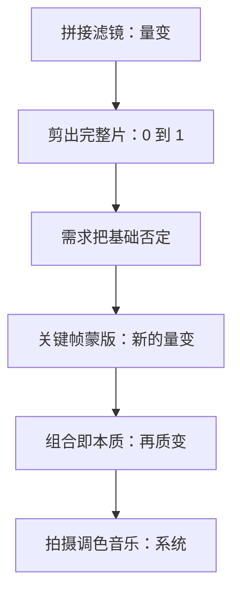

# 兴许对于一位刚刚接触剪辑的人而言

写于 2026 年 2 月 6 日。

兴许对于刚接触剪辑的人，学会片段拼接、加一点动画、放上滤镜和 BGM，每接触轨道、字幕、动画中的一小块，都是量变。当你大体了解最基础的这些，至少可以剪出一个完整视频——这是从 0 到 1 的第一次质变。你开始相信自己「会剪」，和这条线的联系加深，真正开始创作。

实践多了，会发现基础技能和实际需求打架。联系加深，又让你碰到更深入的动画特效和范式，意识到自己不足。这是对「我已经学会剪辑」的第一次否定。矛盾推着你去学关键帧、蒙版，重新理解 BGM 和滤镜。点滴积累之后，你会把点连起来：蒙版加关键帧，蒙版加字幕，关键帧加字幕。炫酷动效的本质，不过是层级、蒙版、关键帧的组合。这是新的质变，否定之否定。

这份理解让你几乎可以去剪想剪的东西，也让你碰到拍摄：调色、色阶、灰度，反过来加深对滤镜的理解；碰到音乐的人，才知道节拍和 loop；明白素材拍摄时的推拉平移，以及硬切、跳切、闪切。这些元素不再孤立服务于「剪辑」二字，它们是一个系统，彼此牵制：BGM 会影响剪法和色调，剪法也会反过来要 BGM。

于是眼光不再限于剪辑，而以实践需要出发：题材、立意、受众、素材、拍摄、BGM、手法，用脚本、拍摄、后期当作范式。这一整套，才否定了「单单会剪」的片面。也正是对这整个领域的精通，让我和学生社团指导中心、资委会、读书会、学生会产生联系，后来成为读书会活动部部长，在同一套方法论里锻炼策划与组织。

写这篇文章时，最初想分开讲联系、矛盾、量变质变、否定之否定。真用自然辩证法去分析一个实际问题时，这些方法论会自己长在一起，而不是被切开。我更深刻地理解了「方法论」本身——这何尝不是对方法论的否定之否定：听过，用过，再发现它们可以合在一起。

解释没有标准答案，阅历不同，方向不同。但总能找到高度凝练的规律。回头看，当初的分析或许粗略甚至有谬误，在当下阶段却必要，处处是成长。了解得越多，越发现自己懂得太少。「路漫漫其修远兮，吾将上下而求索。」若用自然辩证法定义成长，便是在一个又一个矛盾里，实践、理论、再实践，不断否定曾经的自己，加深与世界的联系。

「无数的人们，无数的远方，都和我有关。」不论这句话的时代背景，只希望在旅途上见到更广阔的世界。不要困在「卷与摆」的口号里，而要在这个矛盾中看清：什么时候该摆，什么时候该卷，卷的是什么，摆又是为了什么。
