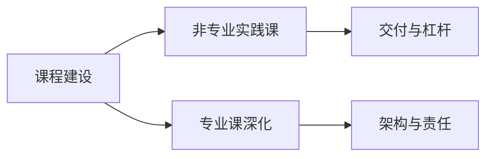

# AI 时代的教育变革与课程体系建设

当时《人工智能概论》里还有一节关于课程建议。这里把目前个人的判断，以及可能的方向，明确说一说。

## 后训练的偏科，并不等于文学能力的终结

AI 的本质是模型的训练过程，它会更倾向于实际应用。目前所有应用场景中，AI 编程和 AI 生图、衍生视频最为集中，尤以编程方向的整体实用性进展最大，商业化也更有机会真正落地。因此当前模型更普遍的做法，是针对编程和智能体能力做更深度的后训练。可以看见的近况是：各模型的编程能力、智能体能力大幅提升，甚至出现一定过拟合；语言能力、真正的文学能力，却似乎在泛化上下降。

若只看短期，这像一个问题。把目光放长远，会发现人工智能模型的一个很大特点：只要在哪个方向有明确应用，就在那个方向充分训练、测试、后训练，最终就能在该板块实现质的飞跃。几年之后，编程领域一旦成熟，厂商完全可能把核心注意力转到大语言模型的文学创作，训练到接近目前智能体与编程能力那种近乎过拟合的水准。那时，一句话或由更专业的人士去指导 AI 进行文学创作，有可能远超现在的状态。

这里说得比较抽象。但这个时代可能不像过去几次跃迁——进入信息时代那样的变化；它更接近人类第一次工业革命、发明蒸汽机对整体的影响。人工智能对整个世界和各行业的冲击，可能远超想象，是颠覆性的。

## 微观：课堂与教育产品

前面偏宏观。放到微观，放到实际教育体系里，我在做一些教育方面的产品时发现：很多新兴的 AI 类教育产品，甚至正在逐渐替代一些传统方式。比较柔和、侵入性不强的，例如目前很多省份的高中已经实施智慧化教育，课程云同步，已经比较成熟。包括「智慧华中大」相关产品，本质上可以在云端课程里，类似旁听课那样追踪分析一个人的学习状态。若 AI 更深度应用，它可以很清晰地分析各学科薄弱项，并系统、有针对性地对每一个板块进行深度学习和分析。只要人愿意学，效率会被大大提升，杠杆会很高。

于是需要思考两点。其一，传统教育到底要怎样改变或优化。其二，当优化到人工智能能细致入微地分析每个人的学习状态和进度时，这到底是好是坏。这偏向哲学或文理交界的问题。

## 非专业实践，与专业课深化

以我为例。我对全栈开发有一定了解，自己并非计算机科学专业。一方面确实做过很多和企业对接的事，包括给华中科技大学同济医学院基础医学院「医路求索」团队做技术负责人，当时团队里加入的两位计算机科学专业同学也是我带的。我以实践为导向，真实能交付企业级项目。此前给一些企业做过 App、做过项目，接过外包；上个暑假也和华中科技大学网安基地、一些社团有过合作。和同龄人、甚至比我大几年的计科、网安同学交流时发现：即使快本科毕业了，他们也往往无法完完整整地全栈交付可落地、可使用的项目。

从这个角度，有两点值得考虑。

第一，AI 时代对传统教育的冲击，有没有可能是颠覆性的。自媒体上也有博主在分析：未来一个会使用 AI 的人，用 AI 生成 PPT、图片、短句或网站，可能直接去和经过几年专业学习、刚毕业却没有实践经验的人抢饭碗。我自己以实践为导向，目前才是准大二，已经有不少计算机方向比赛的现场经历，以及和企业对接的时间；效率比传统手写代码更快，并且直接面向实践和甲方需求去学。上层或甲方要什么，我就补什么。这种情况下，反而可能比一些更专业的计科或网安学生——若他们应聘的并非极度专业化的岗位——更有竞争力。这一点值得思考。

第二，尤其对更专业的计科、网安学生，人工智能实践类课程是否重要。斯坦福大学早已有不少 AI 编程相关课程。对专业人士，这应是双向的：AI 必须经由专业化的指导、专业化的经验，才能很好地做事。一方面从底层原理和更专业的视角做项目；另一方面，我作为非专业人士，更多趋近于力大砖飞，无法做真正深度的架构决策，也无法在各个板块很清晰地知道 AI 写的每一块到底是什么原理。但我整体偏向软件工程的思维，是实践经验传递、扩展出来的。这些经验反过来让我能用更正确的方式、更快的速度，做出真实可靠的产品。

## 黑盒代码，以及非专业课该不该开

由此可以再延伸：未来的网络安全方向里，AI 写的代码到底谁负责？若无法真正了解每一行，很多专业人士也不可能真的去 review。目前这个时代，很难有人有时间、有精力去审身上每一行代码。大家的效率都在提升，都倾向于不看过程、直接观测最终结果——好使就过。若还坚持逐行审，效率会下降，在真实交付里一定缺乏核心竞争力。未来肯定有很多人不会去留、去读这些代码，AI 写的东西偏向黑盒。企业级交付中，这一点如何思考、如何分析，教师在 AI 时代应如何研究课该怎么上，都值得做。

非本专业的人，是否应该补充、扩展 AI 编程？因为它更有意义的知识并不只局限于组队交付项目。日常学习就能说明：有记账习惯，希望有什么样的记账软件，完全可以自己开发；写论文需要 LaTeX 排版，有 AI 之后可以做很专业的排版；作为医学生，偏多组学、需要统计的医学课题，本质上需要 R 和 Python 基础，有 AI 之后可以生成所需的雷达图、火山图等等。它对许多专业、对非专业人士的赋能，是否值得单独开一门课？

一方面，若一群人都有这样的核心竞争力，一定会带动整个板块质的飞跃；同时也会面临很多风险。这些风险我目前意识不到，但我认为需要权衡。对专业学生，如何开课让专业人士更专业、效率更高，是否可以对标国外斯坦福大学相关的编程类课程——这也是我的思考和分析。
