# 从十到一百 · AI 视频影视语言注入指南

从十到一百

影视语言注入指南

10 → 100

A FIELD GUIDE TO
CINEMATIC LANGUAGE
FOR AI VIDEO

六个维度 · SIX DIMENSIONS

| <text-mark tone="thesis">表演</text-mark> | PERFORMANCE |
| --- | --- |
| <text-mark tone="thesis">美术</text-mark> | PRODUCTION DESIGN |
| <text-mark tone="thesis">色彩</text-mark> | COLOR |
| <text-mark tone="thesis">镜头</text-mark> | CINEMATOGRAPHY |
| <text-mark tone="thesis">剪辑</text-mark> | EDITING |
| <text-mark tone="thesis">声音</text-mark> | SOUND |

AI 是杠杆,专业知识是支点。
这本手册只做一件事:把一百年影视工业沉淀的语言,
翻译成 AI 视频创作者可以认领、可以打穿的方向。

<text-mark tone="muted" effect="dim">从十到一百TC 00:00 · 卷首</text-mark>

卷首语 · PREFACE

## 先分清楚,你在哪一段路上

AI 生视频的能力在过去两年里翻了不止一个量级,但绝大多数人的成片没有跟着翻。画面越来越真,片子却还是"假"——不流畅、没情绪、留不住人。问题不在模型,在于<text-mark tone="note">我们只学会了生成画面,没有学会电影的语言</text-mark>。

一部片子从无到有,其实是三段完全不同的路。<text-mark tone="note">从 0 到 1</text-mark>,是学会使用工具:会写提示词,能生成一段画面。<text-mark tone="note">从 1 到 10</text-mark>,是打通工作流:脚本、生成、配音、字幕能串成一条线,产出完整的视频。到这一步,靠的是工具和流程,大多数人也停在了这一步。

而<text-mark tone="note">从 10 到 100</text-mark>,靠的是另一种东西:影视工业一百年沉淀下来的专业语言——表演、美术、色彩、镜头、剪辑、声音。这些知识不会因为 AI 出现而贬值,恰恰相反:<text-mark tone="thesis" effect="fluorescent">AI 是杠杆,专业知识是支点</text-mark>。杠杆再长,没有支点撬不动任何东西。AI 不可能取代一个专业,它只会和专业结合——所以谁先把专业语言内化成提示词、内化成工作流,谁的成片就先跨过那道"假"与"真"的分水岭。

这本手册不教你从零开始,也不是任何工具的教程。它假设你已经能产出完整的 AI 视频,然后把六个专业维度铺开在你面前:每个维度是什么、有多大、里面有哪些方向、每个方向通向哪里。

需要先说清楚这本手册的边界:<text-mark tone="note">它给方向和范围,不给终点结论</text-mark>。每一个方向的最后一公里——比如某个运镜在你的工具里到底怎么调出来、某种表演描述在你的模型上什么写法最有效——只能由动手的人自己走完。原因很简单:专业知识是稳定的,工具每个月都在变;写死的结论三个月后就是错的,而方向十年不会过时。

所以正确的用法是:通读一遍建立全局地图,然后<text-mark tone="note">挑一个方向,把它打穿</text-mark>。信息越多的时代,慢就是快。与其追着每一个新模型跑,不如在一个维度里研究到能成体系——体系才牢不可破。

<aside-note id="source-note-1" kind="addon">
<text-mark tone="thesis">本书的三个约定</text-mark>

- ① 所有内容与具体工具解耦,原理层通用于任何生视频/剪辑工具;

- ② 每个方向以统一的「方向卡片」呈现,颗粒度一致,可单独取用;

- ③ 每张卡片的「探索落点」是给人的研究任务,不是给 AI 的指令。
</aside-note>

方向卡片 · 读法示例

定义这个方向是什么,一句话说清。

功能它解决什么表达问题——为什么值得学。

时机什么时候用、什么时候千万别用。

AI 转化这条知识进入 AI 工作流的路径:提示词层 / 参考层 / 后期层。

探索落点要打穿这个方向,人需要去研究、试验、积累什么。

<text-mark tone="muted" effect="dim">卷首语002</text-mark>

<text-mark tone="muted" effect="dim">从十到一百TC 00:00 · 目录</text-mark>

目录 · CONTENTS

## 全书地图

| 00 | <text-mark tone="thesis">序章 · 诊断</text-mark>  为什么你的片子卡在 10 分 —— 一镜到底的病根 / 杠杆与支点 / 剧组模型 | 004 |
| --- | --- | --- |
| 01 | <text-mark tone="thesis">表演</text-mark>最被忽略的维度  表演即信息 / 肢体系统 / 面部系统 / 视线系统 / 声音表演 / 让 AI 体验角色 | 006 |
| 02 | <text-mark tone="thesis">美术</text-mark>画面在生成前已决定一半  场景即心境 / 光线语言 / 服化道与角色一致性 | 010 |
| 03 | <text-mark tone="thesis">色彩</text-mark>贯穿全流程的隐形导演  三属性与色环 / 配色关系 / 色彩心理与色彩弧线 / 风格谱系 / 调色工艺 | 013 |
| 04 | <text-mark tone="thesis">镜头</text-mark>从生成画面到设计画面  景别系统 / 构图体系 / 运镜语言 / 变速镜头 / 轴线与正反打 / 焦段与透视 | 017 |
| 05 | <text-mark tone="thesis">剪辑</text-mark>成片与大片的分水岭  六大要素 / 剪辑点与硬切 / 声音剪辑点 / 蒙太奇家族 / 节奏理论 / 卡点十一法 / 转场哲学 | 021 |
| 06 | <text-mark tone="thesis">声音</text-mark>普通成片到大片的最短路径  BGM / 音效三层 / 人声 / 静默 / 声画关系 | 026 |
| 07 | <text-mark tone="thesis">体裁映射</text-mark>同一套语言,不同的权重  维度权重矩阵 / 六种体裁的独有语法 / 鬼畜·整活区 | 028 |
| 08 | <text-mark tone="thesis">对标 · 陈翔六点半</text-mark>  为什么是它 / 六维评分卡 / 复刻阶梯 | 030 |
| 09 | <text-mark tone="thesis">终章 · 研究路线图</text-mark>  六维知识注入生产管线 / 从一个点打穿 | 032 |
| 附 | <text-mark tone="thesis">附录</text-mark>  免费可商用素材站 / 术语速查 | 034 |

建议路径:先读序章建立地图 → 翻到第 07 章找到你的体裁,看权重矩阵 → 按权重顺序进入对应维度章节 → 在终章认领一个探索落点。

<text-mark tone="muted" effect="dim">目录003</text-mark>

<text-mark tone="muted" effect="dim">序章 · 诊断TC 00:01</text-mark>

序章 · DIAGNOSIS

## 为什么你的片子卡在 10 分

把一条典型的 AI 生成视频和一条专业成片并排放,最先暴露的不是画质,而是三种"假":

<text-mark tone="note">① 一镜到底的假。</text-mark>AI 默认生成的是连续的单镜头,而真实影视平均每 3–5 秒就切换一次镜头。观众的眼睛被一百年的电影训练过,一个镜头超过十秒还不切,潜意识立刻报警——"这不像电影"。病根不是生成能力,是<text-mark tone="thesis" effect="fluorescent">创作者脑子里没有分镜,只有画面</text-mark>。

<text-mark tone="note">② 表演信息矛盾的假。</text-mark>台词在哭,肢体却是松弛的;情节到了愤怒的顶点,面部只有一个模糊的皱眉。真人演员的身体每一秒都在发送和剧情一致的信息,AI 生成的人物则经常"各说各话"。观众说不出哪里不对,但一眼觉得"演得假"。

<text-mark tone="note">③ 声音缺席的假。</text-mark>没有环境音、没有动作音效、BGM 从头铺到尾一成不变。画面可以骗过眼睛,寂静骗不过耳朵——真实世界永远有声音的层次。

三种假指向同一个结论:<text-mark tone="note">瓶颈不在模型,在影视语言</text-mark>。模型解决的是"画面能不能生成出来",影视语言解决的是"这些画面像不像一部片子"。前者厂商每个月都在替你进步,后者只能你自己补课。

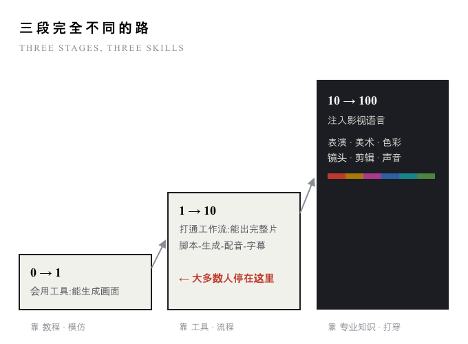

图 0-1 · 本书只负责第三段。前两段的教程已经足够多。

<aside-note id="source-note-2" kind="addon">
<text-mark tone="thesis">杠杆与支点。</text-mark>AI 不可能取代一个专业,它一定与专业结合——AI 把一个人的执行力放大百倍,但放大的是"你懂的东西"。你懂多少镜头语言,它就放大多少镜头语言;你脑子里没有正反打,再强的模型也不会替你想到该切一个反应镜头。<text-mark tone="thesis">专业知识决定上限,AI 决定到达上限的速度。</text-mark>
</aside-note>

<text-mark tone="muted" effect="dim">序章 · 诊断004</text-mark>

<text-mark tone="muted" effect="dim">序章 · 诊断TC 00:01</text-mark>

序章 · THE CREW MODEL

## 一个人,就是一整个剧组

传统影视是工业化分工:导演统筹,每个工种把一个维度做到专业。AI 创作者是"一人剧组"——所有工种都得自己兼任。问题在于,大部分人只兼任了摄影师(负责让画面生成出来),其余五个工位空着。<text-mark tone="note">空着的工位,就是你和 100 分之间的差距。</text-mark>本书六章,即六个工位的上岗地图。

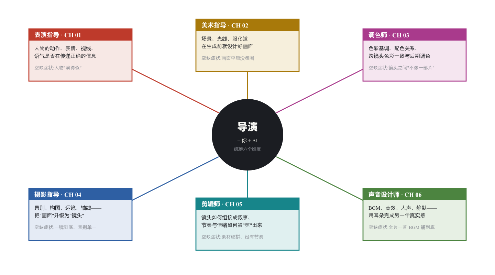

图 0-2 · 剧组模型:六个工位 = 六章 = 六种颜色。这套颜色编码贯穿全书。

读法建议:不必按顺序读。先去第 07 章「体裁映射」找到你做的内容类型,矩阵会告诉你哪个工位对你权重最高,从那一章开始。

<text-mark tone="muted" effect="dim">序章 · 诊断005</text-mark>

表演

CHAPTER 01 · PERFORMANCE

## 最被忽略的维度

几乎所有 AI 视频教程都在讲画质、讲运镜、讲工作流,几乎没有人讲表演。但观众判断一条片子"真不真",第一眼看的就是人——人物的动作、表情、视线、语气有没有在传递和剧情一致的信息。<text-mark tone="thesis">表演是 AI 短剧真实感的天花板,也是目前竞争最空旷的方向。</text-mark>

本章的编辑铁律:只收录「可以被语言精确描述」或「可以被参考素材指定」的表演知识。斯坦尼体系那种要求演员亲身体验的方法论,对 AI 创作者只保留一个用法——让 AI 替你体验(见 1.6)。

| 节 | 内容 | 回答的问题 |
| --- | --- | --- |
| 1\.1 | 表演即信息 | "演得假"到底假在哪 |
| 1\.2 | 肢体系统 | 身体如何说话 |
| 1\.3 | 面部系统 | 表情如何被精确描述 |
| 1\.4 | 视线系统 | 眼睛看哪里,故事就在哪里 |
| 1\.5 | 声音表演 | 台词的另一半是怎么说 |
| 1\.6 | 让 AI 体验角色 | 提示词迭代的表演方法论 |

<text-mark tone="muted" effect="dim">01 · 表演TC 00:08</text-mark>

1\.1

### 表演即信息

Performance as Information

先建立一个可操作的定义:<text-mark tone="note">表演,是人物身体向观众发送信息的全部方式</text-mark>。姿态、手势、表情、视线、语气、停顿——每一秒都在发报。好表演 = 信息精确且相互一致;烂表演 = 信息模糊,或者更糟——信息互相矛盾。

这个定义直接解释了 AI 人物为什么"假":台词悲伤而肢体松弛,是<text-mark tone="note">通道间矛盾</text-mark>;上一镜怒目下一镜平静,是<text-mark tone="note">时间上矛盾</text-mark>;全片表情只有一号微笑,是<text-mark tone="note">信息缺失</text-mark>。观众未必说得出术语,但大脑对"信息不一致"的检测是本能级的。

<aside-note id="source-note-3" kind="addon">
<text-mark tone="thesis">本章的总转化公式。</text-mark>写人物提示词时,不要只写"她很伤心"(情绪结论),而要把结论拆成各通道的具体信息:肩膀塌陷 + 视线落地 + 语速放慢 + 手指绞在一起。<text-mark tone="thesis">情绪是结论,通道信息才是可生成的描述。</text-mark>每一节就是一个通道的信息词典的方向。
</aside-note>

自查方法:关掉声音看画面,问自己"人物此刻在传递什么";再闭眼只听声音,问同一个问题。两个答案不一致,就是表演出了问题。

1\.2

### 肢体系统

The Body

<inset-card id="source-card-1" title="原文卡片 01">
1\.2.1姿态:开放与闭合Posture

定义身体的整体形态语言:挺展开放(自信/攻击/坦诚)vs 收缩闭合(防御/恐惧/羞愧),以及塌陷(疲惫/挫败)、僵直(紧张/压抑)。

功能观众在看清脸之前先读到姿态——远景和全景里,姿态是唯一的表演。

AI 转化提示词层:姿态形容词是生视频模型响应最稳定的表演描述之一。建立你自己的「情绪 → 姿态词」对照,比堆情绪词有效得多。

探索落点在你的主力模型上系统测试:哪些姿态词能被稳定还原?哪些会被忽略?积累一份实测过的姿态词库。
</inset-card>

<inset-card id="source-card-2" title="原文卡片 02">
1\.2.2手势的语义Gesture

定义手是脸之外表现力最强的部位:指点(指令/指责)、摊手(无奈)、握拳(压抑愤怒)、绞手指(焦虑)、抱臂(设防)、抚面(疲惫/羞愧)。

时机近景对话戏里给手一个位置,人物立刻"活"一档;但手也是当前生成模型最容易崩坏的部位——高价值高风险区。

AI 转化描述具体动作而非抽象情绪;或改用构图回避(手出画),把手势留给关键镜头。

探索落点研究方向:哪些手势语义在你的工具里"性价比"最高(表现力强且崩坏率低)?建立手势的红黑名单。
</inset-card>

<inset-card id="source-card-3" title="原文卡片 03">
1\.2.3走位调度Blocking

定义人物在场景中的位置与移动设计:谁站着谁坐着(权力关系)、相互距离(亲密度)、谁向谁走近(关系的变化)、背对与面对(接纳或拒绝)。

功能多人场景的叙事一半靠走位。两人对话从并肩到面对面再到一方转身,关系变化不用一句台词。大多数 AI 创作者从未听过这个概念——它是导演工种里的"隐藏课"。

AI 转化在分镜脚本阶段就写明人物空间关系;首尾帧可控的工具里,走位变化可以通过首尾帧的位置差来指定。

探索落点拉片研究:找三段经典双人对话戏,只记录走位变化,画成俯视图,体会位置如何叙事。
</inset-card>

<text-mark tone="muted" effect="dim">01 · 表演007</text-mark>

<text-mark tone="muted" effect="dim">01 · 表演TC 00:09</text-mark>

1\.3

### 面部系统

The Face

表情之所以能进提示词,是因为它<text-mark tone="note">可以被解剖学级地描述</text-mark>。心理学对基本情绪的面部编码研究(以 Ekman 的 FACS 面部动作编码系统为源头)给了我们一套现成的词典方向:每种情绪 = 一组具体的面部动作组合。写"愤怒"模型只能猜,写出动作组合模型只能照做。

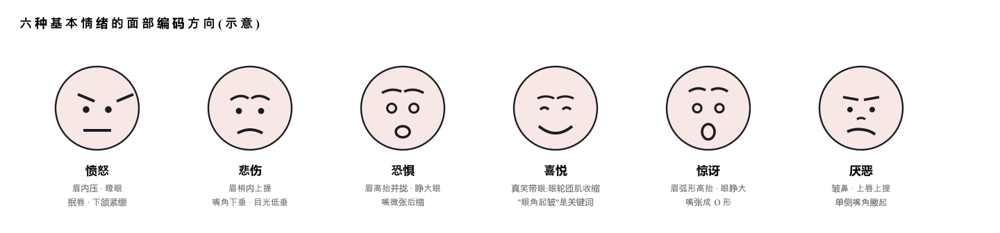

图 1-1 · 情绪的面部动作拆解方向。研究入口:Ekman 基本情绪、FACS 面部动作编码系统。

<inset-card id="source-card-4" title="原文卡片 04">
1\.3.1表情强度分档Intensity

定义同一情绪有强度光谱:微愠 → 恼怒 → 暴怒。真人表演的层次感来自强度控制,而不是换一种情绪。

功能一场戏的情绪应该有"爬坡"——从低档逐镜升到顶点。全程顶格 = 观众三秒疲劳。

AI 转化给每个镜头的表情标注强度档位(如 1–5),分镜表里情绪列旁边加一列强度列。

探索落点测试你的模型对强度副词(微微/明显/极度)的响应精度,找到能被区分开的档位数。
</inset-card>

<inset-card id="source-card-5" title="原文卡片 05">
1\.3.2反应镜头Reaction Shot

定义切到"听者"面部的镜头。表演的一半是倾听:A 说出关键台词时,真正的戏在 B 的脸上。

功能告诉观众"这句话有多重"。没有反应镜头的对话像打乒乓球没有观众席——这是 AI 短剧最容易漏掉、也最容易补上的一环。

时机关键信息揭晓、情感转折、笑点落地之后——先切反应,再继续。

探索落点拉片数一数:陈翔六点半平均每分钟有几个反应镜头?你的片子有几个?差值就是方向。
</inset-card>

<text-mark tone="muted" effect="dim">01 · 表演008</text-mark>

<text-mark tone="muted" effect="dim">01 · 表演TC 00:10</text-mark>

1\.4

### 视线系统

The Eyes

<inset-card id="source-card-6" title="原文卡片 06">
1\.4.1视线方向即叙事方向Eyeline

定义人物看哪里,观众就想知道哪里有什么。直视对方(对峙/亲密)、回避(愧疚/隐瞒)、望向画外(引出下一镜)、看镜头(打破第四面墙,慎用)。

功能视线是免费的悬念机器:人物先看到、观众后看到,中间的时间差就是张力。它还和剪辑直接联动——视线引导切镜(见 5.2),先有这里的视线,才有那里的剪辑点。

AI 转化提示词写明视线目标与变化(从桌面抬眼直视对方);跨镜头视线方向要匹配(A 往右看,B 就得在下一镜的右侧方位),这是轴线规则在表演端的体现。

探索落点研究"视线三角":对话戏里眼神在对方双眼与嘴之间的游移模式,能否被提示词稳定控制?
</inset-card>

1\.5

### 声音表演

Vocal Performance

台词有两半:说什么(剧本)和怎么说(声音表演)。后者由五个可独立控制的参数构成——这恰好是六个表演通道里 AI 工具链最成熟的一个,TTS 的情感控制正在逐月变强,值得专人跟踪。

| 参数 | 控制什么 | 方向要点 |
| --- | --- | --- |
| 语速 | 紧张度与地位 | 快=急切/慌乱;慢=权威/沉重。地位高的人物往往说得更慢——他不怕别人不等。 |
| 音高 | 情绪唤起度 | 音高上扬=激动/质问;压低=威胁/私密。一句话内的音高走向(升调疑问、降调笃定)决定语气。 |
| 音量 | 能量与距离 | 爆发前先压低音量,是百试不爽的张力技巧;耳语比咆哮更有威慑力的场景很多。 |
| 停顿 | 重量 | 关键词前的停顿制造期待,之后的停顿留出回味。停顿是台词里"最响"的部分。 |
| 音色 | 角色辨识度 | 每个角色应有稳定且可区分的音色人设(沙哑/清亮/低沉)。多角色短剧里音色混淆=角色崩塌。 |

<aside-note id="source-note-4" kind="addon">
<text-mark tone="thesis">探索落点。</text-mark>把这五个参数变成你的配音工作流的检查表:逐条测试你所用 TTS 对各参数的可控粒度,标出"能控 / 半能控 / 不能控",不能控的参数用剪辑(切停顿)和音效补偿。
</aside-note>

1\.6

### 让 AI 体验角色

Method Prompting

前面说过,要求演员亲身体验角色的方法派,对 AI 创作没有直接用处——但它有一个变体极其有用:<text-mark tone="note">你不体验,让 AI 体验</text-mark>。

做法方向:在生成表演描述之前,先让语言模型"成为"这个角色——喂给它人物小传、此刻的处境、上一场戏发生了什么,然后问它:"此刻你的身体是什么状态?手在做什么?眼睛看哪里?会怎么说这句话?"让它以第一人称回答,再把回答翻译成各通道的具体描述词。

这本质上是一个<text-mark tone="note">提示词的迭代器</text-mark>:你直接写表演描述,写的是你想象力的平均水平;让 AI 先入戏再输出,得到的是被角色处境约束过的、通道齐全的描述——然后你用 1.1 的信息一致性标准去审它,不一致就追问,迭代到收敛。

探索落点设计你自己的"入戏提问清单"(身体/手/视线/语气/潜台词五问),在同一场景上对比"直接写"与"入戏后写"的生成质量差,固化成可复用的前置流程。

<text-mark tone="muted" effect="dim">01 · 表演009</text-mark>

美术

CHAPTER 02 · PRODUCTION DESIGN

## 画面在生成前已决定一半

传统剧组里,美术指导在开机前几个月就开始工作:场景什么样、光从哪来、人物穿什么。AI 创作里这个环节被压缩成了提示词里的几个形容词——这正是画面平庸的来源。<text-mark tone="thesis">美术不是"背景",是画面的世界观:</text-mark>场景外化角色的心境,光线规定情绪的方向,服化道维系角色的存在感。

对 AI 创作者,美术还有一层特殊使命:它是<text-mark tone="thesis">跨镜头一致性</text-mark>的第一道防线——场景、光线、服装的描述越系统,镜头之间越像"同一部片子"。

| 节 | 内容 | 回答的问题 |
| --- | --- | --- |
| 2\.1 | 场景即心境 | 环境如何替角色说话 |
| 2\.2 | 光线语言 | 光从哪来,情绪就从哪来 |
| 2\.3 | 服化道与一致性 | 角色如何在镜头间"存活" |

<text-mark tone="muted" effect="dim">02 · 美术TC 00:13</text-mark>

2\.1

### 场景即心境

Set as Psychology

<inset-card id="source-card-7" title="原文卡片 07">
2\.1.1场景的叙事属性Environment Storytelling

定义场景不是中性容器,而是角色内心与处境的外化:整洁或凌乱、空旷或拥挤、崭新或破败、开阔或压抑——每个属性都在替角色发言。失恋者的房间该不该乱?乱到什么程度?这是美术决策,不是随机生成。

功能观众进入镜头的前一秒先读环境。环境说对了,人物还没开口,情绪基调已经建立。

AI 转化为每场戏写一份"场景小传":空间大小、新旧、整洁度、时代感、三件关键道具。它同时是生成描述和一致性锚点。

探索落点研究"道具叙事":一件道具(半杯冷掉的咖啡、没拆的行李箱)能承载多少前史信息?建立道具→潜台词的联想库。
</inset-card>

2\.2

### 光线语言

The Language of Light

光线是美术里最"专业"也最值得投入的子方向:它有一套完整的、可被描述的语法。核心变量只有四个——<text-mark tone="note">方向、软硬、比例、色温</text-mark>。

<text-mark tone="note">方向:</text-mark>顺光平淡安全(证件照),侧光立体有戏剧性(人脸一半明一半暗即阴阳脸,暗示矛盾),逆光出轮廓与神圣感(剪影),底光出恐怖(手电筒照下巴),顶光出压迫(审讯室)。

<text-mark tone="note">软硬:</text-mark>硬光(晴天直射)阴影锐利,适合硬朗、紧张、纪实;软光(阴天/柔光箱)阴影柔和,适合温情、浪漫、美颜。

<text-mark tone="note">比例:</text-mark>亮部与暗部的反差大小。高反差=黑色电影、悬疑;低反差=日常、明快。<text-mark tone="note">色温:</text-mark>暖光(烛火、夕阳)亲密怀旧,冷光(荧光灯、月光)疏离不安——色温对撞(室内暖 vs 窗外冷)是一镜之内制造张力的经典手法。

探索落点影视布光的术语体系(伦勃朗光、蝴蝶光、分割光、黄金时刻……)是现成的提示词矿脉——逐个测试哪些术语能被你的模型正确理解,建立"有效布光词表"。

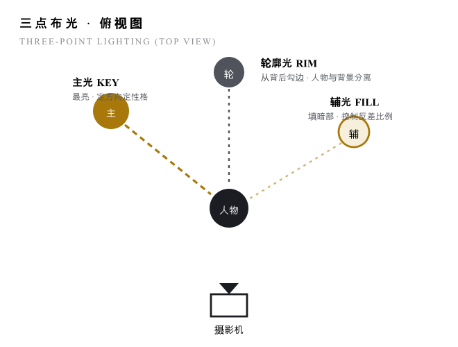

图 2-1 · 三点布光:一切布光方案的母体。记住三个角色,而不是三个位置。

<text-mark tone="muted" effect="dim">02 · 美术011</text-mark>

<text-mark tone="muted" effect="dim">02 · 美术TC 00:14</text-mark>

<inset-card id="source-card-8" title="原文卡片 08">
2\.2.1光线的时间叙事Light as Clock

定义光线自带时间戳:清晨的低角度冷蓝、正午的顶光、黄金时刻(日落前后)的暖金侧光、蓝调时刻的暮色、深夜的点光源。光线变化 = 时间流逝的最优雅表达。

功能"同一场景、光线渐变"是无台词交代时间跨度的经典蒙太奇原料;黄金时刻更是"电影感"三个字的半壁江山。

AI 转化把时间光线词(golden hour / blue hour / 顶光正午)纳入每个镜头的固定描述位;跨镜头的时间连续性检查——上一镜黄昏下一镜正午,是最刺眼的穿帮。

探索落点测试你的模型对各时段光线的还原准确度,标记哪些时段最稳定、哪些需要额外描述加固。
</inset-card>

2\.3

### 服化道与角色一致性

Costume, Makeup \& Props

<inset-card id="source-card-9" title="原文卡片 09">
2\.3.1服装的角色语法Costume

定义服装是穿在身上的人物小传:职业、阶层、性格、此刻的状态(领带松了=疲惫失序)。颜色则接入第 03 章的色彩系统——角色专属色是系列感的支柱。

功能观众靠服装在 0.5 秒内认出"这是谁"。AI 短剧角色换镜头变装,等于角色死亡。

AI 转化为每个角色写一份固定的"服装描述块",逐字复用于每个镜头——描述的稳定换取生成的稳定。

探索落点研究角色一致性的技术选项谱:固定描述块 / 参考图 / 角色一致性功能 / 换脸后处理,各自的成本与守恒度。
</inset-card>

<inset-card id="source-card-10" title="原文卡片 10">
2\.3.2一致性锚点系统Continuity Anchors

定义把角色与场景各自最不容出错的 3–5 个视觉特征(发型、标志性衣物、体型、关键道具、场景主色)提炼成"锚点清单",作为每次生成的必带描述。

功能一致性不能靠运气,要靠制度。锚点清单就是一人剧组的"场记表"——传统剧组专门有场记这个工种防穿帮,你的场记就是这份清单。

时机多镜头叙事必用;单镜头整活可免。

探索落点设计你的锚点清单模板:哪几项特征在你的工具里"守恒性"最好,就锚定哪几项——把守恒性差的特征主动从人设里去掉,是更聪明的做法。
</inset-card>

<aside-note id="source-note-5" kind="addon">
<text-mark tone="thesis">本章与色彩章的边界。</text-mark>美术决定"画面里有什么、光从哪来",色彩决定"这一切以什么色调呈现"。两章在"色温""角色专属色"处交汇——读完本章直接进入第 03 章,是最顺的路径。
</aside-note>

<text-mark tone="muted" effect="dim">02 · 美术012</text-mark>

色彩

CHAPTER 03 · COLOR

## 贯穿全流程的隐形导演

色彩是六个维度里唯一贯穿全流程的:生成前它是提示词里的色调指定,生成中它是跨镜头的一致性问题,生成后它是调色台上的最后一道工序。也因此它最容易被"分尸"到各环节里而没人系统对待。<text-mark tone="thesis">把色彩当成一个独立工种</text-mark>——一个从第一个镜头就在场、到最后一秒才收工的隐形导演。

色彩同时是审美杠杆率最高的维度:同样的素材,调色前后是两部片子。它的知识体系也最"可学"——有色环、有公式、有百年电影验证过的风格谱系。

| 节 | 内容 | 回答的问题 |
| --- | --- | --- |
| 3\.1 | 三属性与色环 | 谈论色彩的语言基础 |
| 3\.2 | 配色关系 | 颜色如何搭配不出错 |
| 3\.3 | 色彩心理与色彩弧线 | 颜色如何叙事 |
| 3\.4 | 电影调色风格谱系 | "电影感"具体指什么 |
| 3\.5 | 调色工艺 | 后期这道工序怎么入门 |

<text-mark tone="muted" effect="dim">03 · 色彩TC 00:17</text-mark>

3\.1

### 三属性与色环

Hue · Saturation · Value

一切色彩讨论建立在三个独立变量上:<text-mark tone="note">色相</text-mark>(是什么颜色——红橙黄绿青蓝紫的位置)、<text-mark tone="note">饱和度</text-mark>(颜色有多纯——从鲜艳到灰)、<text-mark tone="note">明度</text-mark>(有多亮——从白到黑)。三者独立可调:降饱和不等于变暗,提亮不等于变淡。

直觉上人们只会说"这个颜色好看/不好看",专业者说的是"色相偏青、饱和度压到三成、明度中高"——<text-mark tone="thesis" effect="fluorescent">能拆成三属性,就能被复现、被指定、被调整</text-mark>。这是本章一切内容的语言地基,也是调色软件里每个旋钮的对应物。

探索落点练习"读色":任选十帧电影画面,口头拆解主色的三属性,再和取色器对答案——把眼睛校准成仪器。

3\.2

### 配色关系

Color Harmony

色环上的几何关系 = 配色公式。右图五种是影视中最常用的骨架。要点不是背名字,而是理解两端:<text-mark tone="note">互补出张力,邻近出和谐</text-mark>——所有配色方案都是在张力与和谐之间取一个位置。

影视配色还有一条隐藏铁律:<text-mark tone="note">克制</text-mark>。一个画面的主导色相通常不超过两三个,其余全部压进灰与黑白——新手画面"脏",往往不是配错了,而是色相太多。

AI 转化在提示词里用配色方案词(互补色方案 / 单色方案 / 类比色)+ 具体色相指定,比罗列一堆颜色名稳定得多;整活/快剪可放开约束,叙事片守住两三色相。

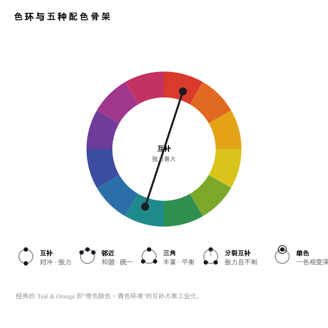

图 3-1 · 色环即公式表:几何关系决定情绪关系。

<text-mark tone="muted" effect="dim">03 · 色彩014</text-mark>

<text-mark tone="muted" effect="dim">03 · 色彩TC 00:18</text-mark>

3\.3

### 色彩心理与色彩弧线

Color Psychology \& Color Arc

色彩心理不是玄学,是统计学:大样本下,暖色调(红橙黄)与能量、亲密、危险相关,冷色调(蓝青)与理性、疏离、忧郁相关。<text-mark tone="note">但真正专业的用法不是查表,而是建立对比</text-mark>:

<text-mark tone="note">冷暖对撞</text-mark>是最强的视觉修辞——两个阵营各占一种色温(对立),角色从暖色场景走进冷色场景(处境变化),一张脸一半暖光一半冷光(内心矛盾)。单独一种颜色没有意义,<text-mark tone="thesis" effect="fluorescent">颜色的意义永远来自它和别的颜色的关系</text-mark>。

<text-mark tone="note">饱和度也是叙事变量:</text-mark>高饱和 = 生命力、戏剧化、童话感;低饱和 = 压抑、回忆、纪实。用饱和度区分现实线与回忆线,是零成本的时空标记。

探索落点建立"角色—颜色"绑定训练:给你短剧的每个主要角色指定专属色相,追踪它在服装、场景、光线中的出现——观察观众是否无意识地接收到了。

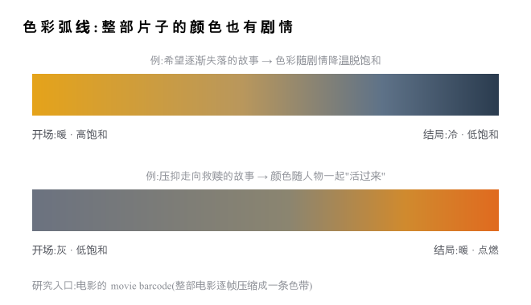

图 3-2 · 色彩弧线:把全片色调排成一条时间轴,它应该像剧情一样有起伏。

<aside-note id="source-note-6" kind="addon">
<text-mark tone="thesis">AI 转化。</text-mark>写分镜脚本时增加一列"色调",让全片的色调列连起来读是一条有意图的弧线,而不是随机噪声——这一列同时就是每个镜头提示词的色彩描述与后期调色的依据,一份工三处用。
</aside-note>

3\.4

### 电影调色风格谱系

A Field Guide to Looks

| 风格 | 特征配方方向 | 气质 / 常见于 |
| --- | --- | --- |
| Teal \& Orange | 肤色推向橙、阴影与环境推向青,互补对冲,高对比 | 好莱坞大片感 · 动作/商业片 |
| 漂白效应 Bleach Bypass | 大幅脱饱和 + 提高对比,银灰底色 | 冷峻残酷 · 战争/犯罪 |
| 日系清新 | 高明度、低饱和、轻微过曝、青绿偏色、软对比 | 治愈日常 · 小清新/Vlog |
| 港风霓虹 | 夜景 + 高饱和霓虹色(品红/青)+ 潮湿反光 | 暧昧迷离 · 都市夜戏 |
| 赛博朋克 | 品红 × 青的极端互补,暗部深蓝,人工光源主导 | 科技异化 · 科幻 |
| 怀旧胶片 | 暖黄偏色、颗粒、褪色感、暗角 | 回忆 · 年代戏 |

这些风格名本身就是高效提示词——它们在训练数据里有海量对应样本。探索落点:逐一测试你的模型对每种风格名的理解准确度,并研究"风格名 + 三属性微调"的组合控制法。

<text-mark tone="muted" effect="dim">03 · 色彩015</text-mark>

<text-mark tone="muted" effect="dim">03 · 色彩TC 00:19</text-mark>

3\.5

### 调色工艺

The Grading Pipeline

<inset-card id="source-card-11" title="原文卡片 11">
3\.5.1一级调色:先校对Correction

定义让画面先"正确"再谈风格:曝光归位(不过曝不欠曝)、白平衡校准(白的东西是白的)、对比度合理、多镜头之间统一基准。

功能对 AI 视频尤其关键——不同批次生成的镜头天然色偏不齐,一级调色是把它们"缝成一部片"的工序。经验法则:画面发灰别急着提亮度,先动对比度。

探索落点研究"匹配镜头"功能与手动匹配的差距;建立自己的一级调色检查清单(黑位/白位/肤色/白平衡)。
</inset-card>

<inset-card id="source-card-12" title="原文卡片 12">
3\.5.2二级调色:再风格Grading

定义在正确的基础上做风格化:整体推向某个 Look(3.4 的谱系)、局部调整(只调天空/只调某件衣服)、肤色保护(风格再狠,肤色要守住)。LUT 即"可复用的调色预设",是风格的封装格式。

时机永远在一级之后。顺序颠倒 = 在歪的地基上盖楼。

探索落点收集/制作自己的 LUT 库并按 3.4 谱系归档;研究同一 LUT 在不同 AI 模型输出上的表现差异——这是"AI 片源特性"这个新课题的入口。
</inset-card>

图 3-3 · 先正确,再有态度。顺序即工艺。

<aside-note id="source-note-7" kind="addon">
<text-mark tone="thesis">色彩章的收束。</text-mark>色彩的四个岗位:提示词里的色调指定(生成前)→ 色彩弧线的全局规划(分镜期)→ 跨镜头一致性(一级)→ 风格化(二级)。挑一个岗位打穿,比四个都懂一点更值钱——推荐从一级调色入手,它是 AI 视频眼下最痛的刚需。
</aside-note>

<text-mark tone="muted" effect="dim">03 · 色彩016</text-mark>

镜头

CHAPTER 04 · CINEMATOGRAPHY

## 从生成画面,到设计镜头

"画面"和"镜头"的区别在于:画面回答"看到什么",镜头回答"<text-mark tone="thesis">为什么这样看</text-mark>"——离多远(景别)、放哪里(构图)、动不动(运镜)、多快(变速)、从哪边(轴线)、什么透视(焦段)。六个问题,六节。

这是与 AI 生视频工具耦合最深的一章:景别、运镜、焦段术语大多能直接进提示词,首尾帧、运镜参数等功能就是为这套语言设计的。<text-mark tone="thesis">你掌握的镜头词汇量,直接等于你对生成结果的控制粒度。</text-mark>

| 节 | 内容 | 回答的问题 |
| --- | --- | --- |
| 4\.1 | 景别系统 | 离多远看 |
| 4\.2 | 构图体系 | 放在画面哪里 |
| 4\.3 | 运镜语言 | 镜头怎么动、为何而动 |
| 4\.4 | 变速镜头 | 时间怎么被拉伸压缩 |
| 4\.5 | 轴线与正反打 | 对话戏的空间铁律 |
| 4\.6 | 焦段与透视 | 空间感从何而来 |

<text-mark tone="muted" effect="dim">04 · 镜头TC 00:22</text-mark>

4\.1

### 景别系统

Shot Sizes

景别 = 摄影机与叙事的距离。它不是取景习惯,而是一套<text-mark tone="note">信息分配制度</text-mark>:远景给环境信息,特写给情绪信息,中景给关系信息。一场戏的景别序列,就是导演安排观众"先知道什么、后感受什么"的顺序。

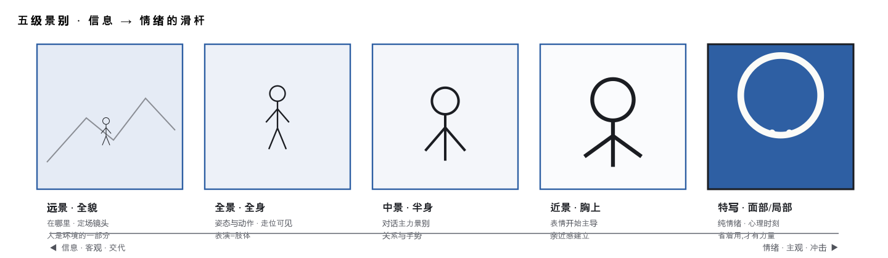

图 4-1 · 景别是"信息⇄情绪"的滑杆。经典开场语法:远景定场 → 中景入戏 → 特写点题。

<aside-note id="source-note-8" kind="addon">
<text-mark tone="thesis">两极组接。</text-mark>远景直接切特写(或反向),跳过中间档位——景别的巨大反差自带视觉冲击,用于强调突变时刻。这是你剪辑素材库里成本最低的"重音"。
</aside-note>

<aside-note id="source-note-9" kind="addon">
<text-mark tone="thesis">AI 转化与落点。</text-mark>景别词是生视频提示词的第一关键词位,把"每个镜头必须先写景别"变成分镜表的格式强制;探索:统计一部你喜欢的片子的景别分布比例,对照自己片子的分布——单一化即病灶。
</aside-note>

<text-mark tone="muted" effect="dim">04 · 镜头018</text-mark>

<text-mark tone="muted" effect="dim">04 · 镜头TC 00:23</text-mark>

4\.2

### 构图体系:点 · 线 · 面

Composition

构图回答"主体放在画面哪里、其余元素如何组织"。整个体系可以收纳进一个三层框架——<text-mark tone="note">点(主体位置)、线(视觉引导)、面(空间组织)</text-mark>,层层递进。

<inset-card id="source-card-13" title="原文卡片 13">
4\.2.1点:主体的位置Points

要点中心构图=庄重、对称、力量(也易呆板);三分点构图=把主体放在井字交叉点,天然的平衡与呼吸感。人像朝向一侧时,面朝的方向留出空间(向画面另一个三分线看)。

进阶三分点可以放双元素——两个主体各占一个分点,形成对话感。
</inset-card>

<inset-card id="source-card-14" title="原文卡片 14">
4\.2.2线:视觉的引导Lines

要点横平竖直令人安心,倾斜(对角线)产生动感与不确定——歪不歪是情绪决策不是失误。引导线利用画面自带的线条(道路/栏杆/光带)把视线押送到主体,主体宜落在三分点或中心。S 曲线出优雅与纵深。

时机对角线/倾斜(荷兰角)用于不安、失衡、危机时刻,日常戏滥用会让观众持续低烧般难受。
</inset-card>

<inset-card id="source-card-15" title="原文卡片 15">
4\.2.3面:空间的组织Planes

要点前景构图:在主体前加一层有关联的遮挡,立刻产生纵深与"偷窥感"。框架构图:用门窗/树枝把主体框起来,聚焦+隐喻(困境)。填充构图:主体塞满画面,表达压迫或夸张情绪。留白构图:大面积空,主体小——孤独、余韵、高级感。

进阶重复构图(元素有逻辑地排列)与对比构图(重复中突出一个异类:颜色异/动静异/光影异)——异类即主角。
</inset-card>

<aside-note id="source-note-10" kind="addon">
<text-mark tone="thesis">层次思维。</text-mark>构图的底层是"拍层次、拍形状":刻意安排前景-中景-背景三层,单人场景也给主体找一个"第二主体"(一件物、一处景、镜中的自己)形成前后呼应。<text-mark tone="thesis">学会构图,忘记构图</text-mark>——规则内化后,以画面好看为最终裁判,可以创新,可以打破。
AI 转化:构图术语(三分构图/框架构图/前景遮挡/荷兰角)大多能被生成模型理解;探索落点:测出你的模型的"构图词命中表",并研究首帧图控制构图的稳定性。
</aside-note>

4\.3

<html-embed id="frame-composition-bench" src="./embeds/frame-composition-bench/index.html" title="构图工作台：位置、景别与三分参考线" height="640">
几何形状演示主体位置、主体大小与留白的关系；这是阅读辅助，不是生成照片，也不代表唯一正确的构图。
</html-embed>

### 运镜语言

Camera Movement

| 运镜 | 动作 | 叙事功能——为什么而动 |
| --- | --- | --- |
| 推 | 镜头向主体推进 | 走进人物内心:注意力收拢、心理时刻逼近。缓推=张力累积,急推=震惊强调。 |
| 拉 | 镜头远离主体 | 从个人叙事抽身到宏大视野:揭示环境、表达孤立/告别、收尾余韵。 |
| 摇 | 机位不动,镜头转向 | 模拟转头:环视交代空间、跟随视线、两个主体间建立关联。 |
| 移 | 机位横向平移 | 平行伴随:跟随行走、扫过一排信息(货架/人群),带出空间层次。 |
| 跟 | 机位跟随主体 | 沉浸与代入:观众成为同行者。背跟=悬念,面跟=情绪直击。 |
| 升降 | 机位垂直移动 | 升=脱离与俯瞰(上帝视角、格局展开),降=落地与聚焦(从宏大进入具体)。 |
| 甩 | 快速摇转带动态模糊 | 能量转场:同场景两点的暴力衔接,喜剧与动作片常客。 |
| 环绕 | 绕主体弧形运动 | 仪式感与审视:主角高光时刻、对峙中心、情绪漩涡。AI 生视频的高频词,慎防滥用。 |

总原则:<text-mark tone="thesis">无动机不运镜</text-mark>——每一次移动都应回答"这次动,替观众完成了什么"。答不上来就用固定镜头,固定镜头是被严重低估的选择。探索落点:各生视频工具的运镜控制词/参数对照表,是最值得整理的公共资产之一。

<text-mark tone="muted" effect="dim">04 · 镜头019</text-mark>

<text-mark tone="muted" effect="dim">04 · 镜头TC 00:24</text-mark>

4\.4

### 变速镜头

Speed Ramping

<inset-card id="source-card-16" title="原文卡片 16">
4\.4.1升格:拉伸时间Slow Motion

定义高帧率拍摄、常速播放=慢动作。把一瞬间放大成一段可凝视的时间。

时机情绪顶点、关键动作、命运瞬间——给"值得被记住的一秒"用。全片慢动作=没有慢动作。

AI 转化生成端可用慢动作描述词;更稳的路径在后期:高帧生成/插帧后再放慢,画质更可控。
</inset-card>

<inset-card id="source-card-17" title="原文卡片 17">
4\.4.2降格与快进:压缩时间Time-lapse

定义低帧率拍摄常速放=快动作;极端形式是延时摄影(云涌、日落、人潮)。

功能交代时间流逝、制造喜剧感(快动作天然滑稽)、注入城市能量。

探索落点变速的高级形态是"一镜内变速"(先快后慢的动作强调)——研究哪些工具链能实现速度曲线控制。
</inset-card>

4\.6

### 焦段与透视

Focal Length

焦段决定空间的性格:<text-mark tone="note">广角</text-mark>(\<35mm)视野大、透视夸张(近大远小、近高远低),冲击力强但易杂乱——脸放中心区畸变最小,次要元素靠边缘借拉伸出张力;<text-mark tone="note">标准</text-mark>(50mm 上下)最接近人眼,真实自然;<text-mark tone="note">长焦</text-mark>(\>70mm)视野窄、空间压缩,背景贴向主体——简化画面、隔离杂乱、出"人景合一"的诗画感。

AI 转化焦段词(24mm 广角/85mm 人像/长焦压缩)是提示词里控制空间感的隐藏旋钮;探索:同一场景换焦段词生成,对比空间感差异,建立直觉。

4\.5

### 轴线与正反打

180° Rule

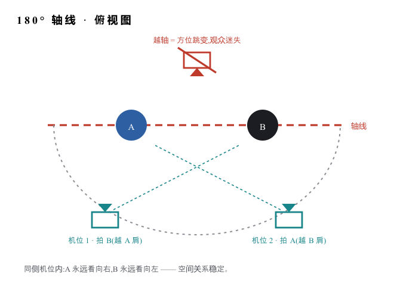

图 4-2 · 对话戏的空间铁律:所有机位待在轴线同一侧。

<inset-card id="source-card-18" title="原文卡片 18">
4\.5.1正反打Shot / Reverse Shot

定义对话的标准分镜:机位1拍B、机位2拍A,交替切换;常配过肩镜头(前景带着对方肩膀)维持两人同在感。

功能短剧对话的基础设施。配合 1.3.2 反应镜头与视线匹配(A 视线向右、B 向左),就是完整的对话语法。

AI 转化生成两人对话时,把方位写死在提示词里(A 在画面左侧面向右);跨镜头方位一致是 AI 正反打的核心难点。

探索落点攻克"AI 正反打工作流":首帧图定机位 + 方位锁定描述 + 视线匹配检查,做出一套可复用的对话戏模板——这是 AI 短剧最值得打穿的单点之一。
</inset-card>

<text-mark tone="muted" effect="dim">04 · 镜头020</text-mark>

剪辑

CHAPTER 05 · EDITING

## 成片与大片的分水岭

把生成好的片段按顺序拼在一起,得到的是"素材串";剪辑是另一件事——<text-mark tone="thesis">用镜头之间的关系去讲故事、造节奏、控情绪</text-mark>。发明剪辑就是为了更好地讲故事:信息被分配到不同镜头,每个镜头都有使命。

本章还有一条工程级结论值得先记住:普通剪辑软件的一切炫技,底层只有两个基元——<text-mark tone="thesis">蒙版</text-mark>(让一部分显示、一部分不显示)与<text-mark tone="thesis">关键帧</text-mark>(让属性随时间变化)。绝大多数视频效果都是这两个原子的组合。理解基元,就看穿了所有模板。

| 节 | 内容 | 回答的问题 |
| --- | --- | --- |
| 5\.1 | 剪辑六大要素 | 什么决定剪得好不好 |
| 5\.2 | 剪辑点与硬切 | 在哪里切、怎么切得无痕 |
| 5\.3 | 声音剪辑点 | J cut / L cut 的魔法 |
| 5\.4 | 蒙太奇家族 | 镜头相加如何大于相加 |
| 5\.5 | 节奏理论 | 张与弛如何设计 |
| 5\.6 | 卡点十一法 | 音乐驱动剪辑的完整清单 |
| 5\.7 | 转场哲学与两大基元 | 转场的本质 · 效果的原子 |

<text-mark tone="muted" effect="dim">05 · 剪辑TC 00:29</text-mark>

5\.1

### 剪辑六大要素

The Six Priorities

剪辑界流传一个源自沃尔特·默奇《眨眼之间》的优先级模型:决定一个剪辑点好坏的六个因素,权重从高到低——<text-mark tone="note">情绪永远排第一</text-mark>。当技术规则和情绪冲突时,牺牲技术,保住情绪。这个权重表也是最好的自查工具:没有经验、组织不出思路时,逐条对着检查,再做对应修改。

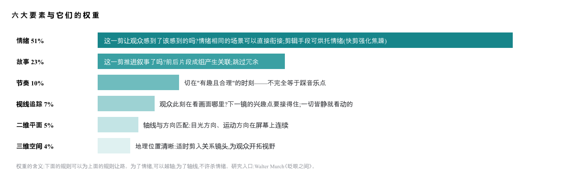

图 5-1 · 情绪 \> 故事 \> 节奏 \> 视线 \> 平面 \> 空间。永远以实际感受为准,但别钻牛角尖。

<aside-note id="source-note-11" kind="addon">
<text-mark tone="thesis">对 AI 创作者的特殊意义。</text-mark>这个模型给了"AI 自动剪辑"一个可编程的评估框架:六要素即六个可拆解的检查器。探索落点——研究哪些要素已可被算法判断(视线追踪有成熟的显著性检测,方向匹配可用光流),哪些仍必须人来把关(情绪)。这决定了自动化剪辑流水线里人的位置。
</aside-note>

<text-mark tone="muted" effect="dim">05 · 剪辑022</text-mark>

<text-mark tone="muted" effect="dim">05 · 剪辑TC 00:30</text-mark>

5\.2

### 剪辑点与硬切

The Cut

硬切(直接拼接,无任何过渡效果)占专业成片剪辑点的九成以上——<text-mark tone="note">会切,根本不需要转场特效</text-mark>。硬切的功力全在"切在哪、接什么",三大门派:

<inset-card id="source-card-19" title="原文卡片 19">
5\.2.1景别硬切:叙事反差Size Cut

要点全景接近景=从空间聚焦到人物内心;全景接特写=内心巨变的重锤;远景切特写(两极组接)=用景别反差制造视觉冲击。景别差就是情绪的音量旋钮。

时机同机位同景别相接会"跳"(jump cut 观感),换景别或换角度超过 30° 再切,是无痕的基本功。
</inset-card>

<inset-card id="source-card-20" title="原文卡片 20">
5\.2.2相似硬切:跳跃组接Match Cut

要点三种相似可以借用:①同主体相似景别跨时空跳接——用最少镜头完成时间跨越(打字员切油漆工,光影表明岁月流逝);②不同主体相似动作匹配组接——A 抬手接 B 抬手,动作在两个世界间无缝延续,最具创意感的剪法;③相似的镜头方向/运动方向组接。

功能转场的本质是找相似点——形状相似、动作相似、方向相似、颜色相似。找到相似,任何两个镜头都能优雅相接。

AI 转化生成端刻意制造相似:让上一镜结束帧与下一镜开始帧共享一个形状/动作,匹配剪辑就从"碰运气"变成"可设计"。这是 AI 工作流独有的作弊器——传统剧组要靠拍摄计划,你只要改提示词。
</inset-card>

<inset-card id="source-card-21" title="原文卡片 21">
5\.2.3引导硬切:完美转场Motivated Cut

要点①视线引导:人物回头或侧看,观众的注意力顺着视线飞出画面——下一镜顺理成章接视线落点;②声音引导:下一场景的音效先响起来(J cut),耳朵先到,眼睛跟上,切换悄无声息。

功能"引导"的意思是:切换发生前,观众已经被给了一个想看下一镜的理由——于是剪辑点隐形了。当观众察觉不到剪切点,影片的情绪才是连贯的。

探索落点把 5.2 三大门派做成你的"切法检查卡":每个剪辑点问一遍——有景别差吗?有相似点吗?有引导吗?三者取其一,硬切即无痕。
</inset-card>

5\.3

### 声音剪辑点:J cut 与 L cut

Split Edits

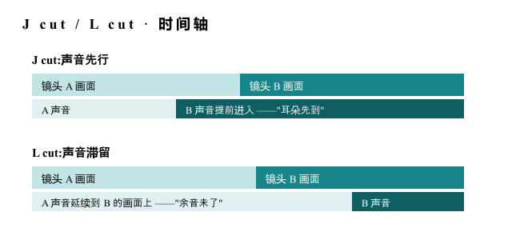

图 5-2 · 声画错位:字母 J 与 L 就是轨道形状。

声画不同步剪切,是"业余感"与"专业感"之间最廉价的一道门:声音横跨多个镜头,把剪辑缝合在一起,可以省略时间、延展时间、悄无声息地加快叙事——对话戏里让答话者的画面先于话音出现(看反应),或让上一句话压在下一镜上(思绪延续)。

AI 转化AI 视频常见做法是"一段画面配一段音",声画完全对齐,恰是业余感来源。在剪辑端把音轨与画轨解耦、手动错位,是零成本的专业感升级。

探索落点拉片任务:数一部好剧集 10 分钟里 J/L cut 出现的次数(答案通常多到吓人);研究自动化剪辑工具里声画错位能否被规则化。

<text-mark tone="muted" effect="dim">05 · 剪辑023</text-mark>

<text-mark tone="muted" effect="dim">05 · 剪辑TC 00:31</text-mark>

5\.4

<html-embed id="sound-cut-bench" src="./embeds/sound-cut-bench/index.html" title="拖动播放头：J cut 与 L cut" height="620">
J cut 是下一段声音先进入；L cut 是上一段声音在画面切换后继续延伸。示例只演示先后关系，不给出固定剪辑时长。
</html-embed>

### 蒙太奇家族

Montage

蒙太奇的核心命题:<text-mark tone="note">两个镜头相接,产生第三种意义</text-mark>——1+1\>2 是剪辑作为艺术的全部依据。家族成员按"第三种意义"的产生方式分类:

| 类型 | 机制 | 典型用法方向 |
| --- | --- | --- |
| 叙事蒙太奇 | 按时间/因果组接,老实讲故事 | 常规叙事的默认态;省略冗余、压缩时间 |
| 平行蒙太奇 | 两条线索交替,各自独立又互相照应 | 双线叙事;结尾汇合出高潮 |
| 交叉蒙太奇 | 同一时刻多地穿插,越切越快 | 营救/追逐/倒计时——张力机器 |
| 对比蒙太奇 | 内容反差相接:盛宴切饥荒 | 批判、讽刺、命运对照 |
| 隐喻蒙太奇 | 本体接喻体:人群切羊群 | 不说而说;整活区的高级弹药 |
| 心理蒙太奇 | 现实与回忆/幻想/梦交错 | 入戏人物内心;配合色彩/饱和度区分时空(见 3.3) |
| 杂耍/冲击蒙太奇 | 强刺激镜头轰炸,情绪优先于逻辑 | MV、预告片、快剪的底层逻辑 |
| 积累蒙太奇 | 同类镜头堆叠强化:一组奔跑、一组笑脸 | "训练/成长/赶工"段落的标准配方 |

探索落点:蒙太奇是 AI 视频天然的主场——它需要的是"多而短的镜头 + 强组接逻辑",恰是生成模型的舒适区。研究方向:为每种蒙太奇设计"镜头清单模板"(积累蒙太奇=同主题变奏×N),让生成任务清单化。

5\.5

### 节奏理论

Rhythm

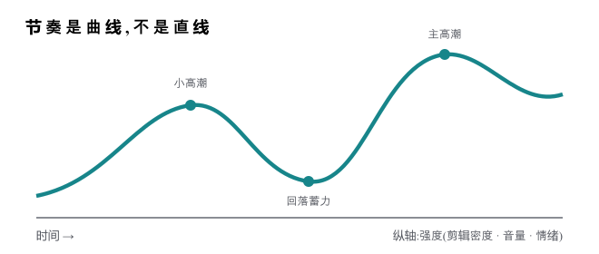

图 5-3 · 激烈之后是平静,平静之后是激烈。燃能衬静,静能衬燃。

节奏≠踩点——踩音乐点只是作曲家替你预设的节奏,真正的节奏由一切视听因素共同控制:剪辑密度(镜头多短)、景别序列、运镜速度、台词密度、音量曲线。要点三条:<text-mark tone="note">①为整部片设定一个总节奏</text-mark>(先定"这片子是快片还是慢片");<text-mark tone="note">②让节奏成为曲线</text-mark>——一直快等于没有快,长时间陷在一种情绪里观众会疲倦;<text-mark tone="note">③必要时插入镜头主动放缓</text-mark>(空镜、反应镜头、静默)为下一次爆发蓄力。

探索落点量化练习:把一条你喜欢的成片的镜头时长逐个记下,画成折线——你会亲眼看到节奏曲线。再画自己的片子,对比曲线形状。这是最直观的节奏自检法,也是未来自动化节奏分析的原型。

<text-mark tone="muted" effect="dim">05 · 剪辑024</text-mark>

<text-mark tone="muted" effect="dim">05 · 剪辑TC 00:32</text-mark>

5\.6

### 卡点十一法

Beat-Sync Toolkit

卡点的本质:<text-mark tone="note">变化产生节奏</text-mark>——音乐的重音处,画面必须发生一次"变化",而变化的形式远不止切镜头。先分析音乐的层次(鼓点层/旋律层/音效层),不同层次分配给不同类型的变化;BGM 选择方向:快闪、Funk、Techno 这类重音清晰的曲风。十一种变化形式速查:

| \# | 法 | 要点 |
| --- | --- | --- |
| 01 | 慢帧卡点 | 视频慢一帧对齐重音,重音处恰好落在动作顶点 |
| 02 | 动作卡点 | 人物每个动作对应一个节拍;充分利用人物动作做转场 |
| 03 | 动态匹配 | 音乐中的音效段落,填充动态相称的画面 |
| 04 | 颜色变化卡点 | 重音处画面色调突变(接第 03 章) |
| 05 | 外部剪辑卡点 | 相似画面串联 + 闪黑/闪白 + 随节奏缩放画面 |
| 06 | 动态文字卡点 | 文字快闪;大气磅礴式:透明白色书法体占小半屏 |
| 07 | 声响卡点 | 视频里自带的声响(关门/击掌)与音乐重音对齐 |
| 08 | 二次构图卡点 | 同一物体构图变化 / 画中画切换 |
| 09 | 灯光变化卡点 | 重音处光源亮灭、颜色跳变 |
| 10 | 运镜卡点 | 推 / 拉 / 摇 / 移的运动顶点落在重音上 |
| 11 | 变速转场卡点 | 变速曲线与重音配合:重音前加速、重音处切 |

探索落点:十一法全部可参数化(时间点 + 变化类型 + 变化量)——它是"规则可写死"的剪辑子领域,最适合作为自动化剪辑的第一块试验田。

5\.7

### 转场哲学与两大基元

Transitions \& Primitives

<text-mark tone="note">转场哲学一句话:最好的转场是自然衔接的镜头。</text-mark>镜头间要有关联(相似点/引导/景别逻辑,见 5.2);如果两个镜头不匹配,加特效也救不了——<text-mark tone="thesis" effect="fluorescent">不匹配就不要转</text-mark>,回去改镜头。特效转场(叠化=时间流逝,闪白=闪回/爆点,闪黑=段落终止)各有固定语义,当标点符号用,别当装饰品。

缓动是被忽略的质感来源:关键帧的速度曲线——缓入(先快后慢,如火车进站)、缓出(先慢后快)、缓动(加速再减速)。线性运动是"PPT 感"的元凶,一切位移加缓动,廉价感立减。

<aside-note id="source-note-12" kind="addon">
<text-mark tone="thesis">两大基元:蒙版 × 关键帧。</text-mark>蒙版决定"哪里可见",关键帧决定"何时变化"——文字从物体后面穿出、画面分屏、局部调色、无缝遮挡转场(甩过立柱时切换场景)、炫酷的拉片级效果……普通软件能做的绝大多数视觉花活,拆到底都是这两个原子的组合,更复杂的动效(AE 级)也只是原子数量更多。
探索落点(高价值):把常见效果逐个"拆成基元组合"并记录成配方——这份配方库既是你的剪辑内功,也是未来把效果做成可复用模板、乃至让 AI 按配方组装效果的地基。遮住蒙版边缘,是美化的核心细节。
</aside-note>

<text-mark tone="muted" effect="dim">05 · 剪辑025</text-mark>

声音

CHAPTER 06 · SOUND

## 普通成片到大片的最短路径

同一条片子,配上完整的声音设计和裸奔着放,第一观感差一个档次——<text-mark tone="thesis">BGM 和音效的"有和没有",就是普通成片和大片的分界</text-mark>。而且声音是六个维度里投入产出比最高的:不需要重新生成任何画面,全部在后期完成。

画面可以骗过眼睛,寂静骗不过耳朵。真实世界永远有声音的层次;专业剪辑师都有自己的 BGM 库、音效库与预设库——建库本身就是入行仪式。

| 节 | 内容 | 回答的问题 |
| --- | --- | --- |
| 6\.1 | BGM | 音乐如何选、如何用 |
| 6\.2 | 音效三层 | 真实感的声学配方 |
| 6\.3 | 人声处理 | 台词如何坐进声场 |
| 6\.4 | 静默 | 最高级的声音是没有声音 |
| 6\.5 | 声画关系 | 声音与画面的四种配合 |

<text-mark tone="muted" effect="dim">06 · 声音TC 00:36</text-mark>

6\.1

### BGM:音乐的选与用

Score

选先定情绪再找曲——用"情绪词+曲风+节奏感"检索而不是凭好听;重音清晰度决定可卡点性(见 5.6);警惕"歌红片弱":太熟的歌会抢戏。

用BGM 不该从头铺到尾——<text-mark tone="thesis">进出点就是叙事标点</text-mark>:音乐进入=情绪段落开始,抽掉=此刻很重要(见 6.4)。音量要给台词让路(闪避),高潮处才放满。

探索落点建立自己的 BGM 库并按情绪×节奏两轴归档;研究 AI 音乐生成能否按"分镜情绪表"定制配乐——这条路通了,音乐就从"选"变成"写"。

<aside-note id="source-note-13" kind="addon">
<text-mark tone="thesis">音乐的层次分析。</text-mark>把一首曲子拆成鼓点层(节奏骨架)、旋律层(情绪走向)、音效层(点缀重音),分别对应剪辑里不同类型的变化(5.6 的分配思想)。会拆音乐,卡点就从体力活变成设计活。
</aside-note>

6\.2

### 音效三层

Sound Design Layers

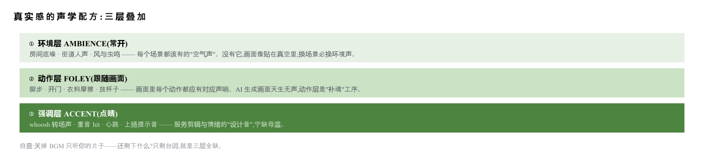

图 6-1 · 环境层打底、动作层跟画、强调层点睛。三层齐备,画面才"落地"。

6\.3

### 人声处理

Dialogue

台词永远是声场的主角:响度上其他一切为它让路;质感上要与空间匹配(浴室有混响、旷野干而远)——TTS 直出的"干声"贴在画面上就是假,给人声加上符合场景的空间混响,是 AI 配音落地感的关键一步。探索:研究"空间混响匹配"的自动化方案。

6\.4

### 静默

Silence

最高级的声音设计是敢于没有声音:巨响前抽掉一切(真空的一秒让爆发翻倍)、噩耗落地后的死寂、只剩呼吸声的紧张。静默是声音里的留白构图——它有效的前提,是其他时刻声音层次丰满,有对比才有静。

6\.5

### 声画关系

Sound-Image Relations

四种配合方向:<text-mark tone="note">同步</text-mark>(声画一致,默认态)、<text-mark tone="note">错位</text-mark>(J/L cut,见 5.3)、<text-mark tone="note">对位</text-mark>(声画唱反调:欢快音乐配残酷画面,讽刺与荒诞的利器,整活区主粮)、<text-mark tone="note">画外</text-mark>(只闻其声不见其人——恐惧与悬念来自看不见的声源)。探索落点:对位是性价比极高的高级感来源,建立你的"反差配乐"实验清单。

<text-mark tone="muted" effect="dim">06 · 声音027</text-mark>

<text-mark tone="muted" effect="dim">07 · 体裁映射TC 00:40</text-mark>

CHAPTER 07 · GENRE MAPPING

## 同一套语言,不同的权重

前六章是通用维度,但没有哪种体裁需要六个维度平均用力。这张矩阵是全书的<text-mark tone="note">路由器</text-mark>:找到你要做的体裁,按权重从高到低进入对应章节。●●● 为决定生死的维度,●● 为重要,● 为够用即可,○ 为几乎可忽略。

| 体裁 | 表演 | 美术 | 色彩 | 镜头 | 剪辑 | 声音 | 决胜点 |
| --- | --- | --- | --- | --- | --- | --- | --- |
| 叙事短剧 | ●●● | ●● | ●● | ●●● | ●● | ●● | 表演真实感 + 对话戏语法(正反打/反应镜头) |
| 影视感大片 | ●● | ●●● | ●●● | ●●● | ●● | ●●● | 美术×色彩×声音的沉浸感三件套 |
| 鬼畜 / 整活 | ● | ○ | ● | ● | ●●● | ●●● | 节奏与音乐性;素材的选择即表演(见下页) |
| 卡点快剪 | ○ | ● | ●● | ●● | ●●● | ●●● | 卡点十一法(5.6)全家桶 + 色调统一 |
| 宣传片 | ● | ●●● | ●●● | ●●● | ●● | ●● | 画面质感统治一切;AABBB 空境组接结构 |
| 口播 / 知识区 | ●● | ● | ● | ● | ●● | ●● | 声音表演(1.5)+ 信息节奏;数字人神态自然度 |

<aside-note id="source-note-14" kind="addon">
<text-mark tone="thesis">叙事短剧的独有语法。</text-mark>对话密度高 → 正反打(4.5)与反应镜头(1.3.2)是日常主食;情节靠反转 → 剪辑的信息控制(什么时候让观众知道什么)大于炫技;人物少场景少 → 一致性锚点(2.3.2)负担轻,恰是 AI 的舒适区。
</aside-note>

<aside-note id="source-note-15" kind="addon">
<text-mark tone="thesis">宣传片的独有语法。</text-mark>结构套路 AABBB:同景别/同主题镜头成组推进,空境(无人的景物镜头)承担呼吸与转段;三分线窄框内不出主体运动;质感三件套=黄金时刻(2.2.1)+ 长焦压缩(4.6)+ 统一 Look(3.4)。
</aside-note>

<aside-note id="source-note-16" kind="addon">
<text-mark tone="thesis">影视感大片的独有语法。</text-mark>它卖的不是故事是"质感幻觉":宽画幅、浅景深、Teal \& Orange、大气声场缺一不可;镜头运动要慢而稳(急运镜是短视频语法);每一帧都要经得起截图。
</aside-note>

<aside-note id="source-note-17" kind="addon">
<text-mark tone="thesis">口播/知识区的独有语法。</text-mark>敌人只有一个:流失率。语速与信息密度的配比是生命线;每 15–30 秒一次视觉变化(景别切换/图卡插入)对抗疲劳;声音表演的五参数(1.5)在这里权重最高。
</aside-note>

<text-mark tone="muted" effect="dim">07 · 体裁映射028</text-mark>

<text-mark tone="muted" effect="dim">07 · 体裁映射TC 00:41</text-mark>

GENRE SPECIAL · 鬼畜 - 整活区

## 鬼畜:一套自成体系的语法

鬼畜与传统影视语言交集不大,却是 AI 时代最被低估的体裁:它对画质要求最低、对<text-mark tone="note">节奏感和梗密度</text-mark>要求最高,而 AI 恰好把它最大的门槛(素材加工)干掉了。整活区的核心资产不是技术,是乐感和网感。四个方向卡片:

<inset-card id="source-card-22" title="原文卡片 22">
G-1音MAD / 调音Otomad

定义把人声素材切成音节,按音高对轴排进旋律——让素材"唱歌"。鬼畜的技术皇冠。

功能熟悉的声音+意外的旋律=笑点的化学反应;素材越正经,效果越炸裂。

AI 转化语音克隆/歌声合成正在把逐音节手工对轴变成一键生成——工艺门槛崩塌中,创意门槛不变。

探索落点跟踪歌声合成工具的素材音色克隆能力;研究"AI 对轴"与手工对轴的音质差与梗感差。
</inset-card>

<inset-card id="source-card-23" title="原文卡片 23">
G-2重复的艺术Loop \& Remix

定义同一片段循环、变速、变调、叠加——重复即节奏,重复即强调,重复到荒诞即笑点。

功能它是积累蒙太奇(5.4)的极端形态:第 1 遍是信息,第 3 遍是节奏,第 7 遍是抽象。

探索落点研究重复的"剂量曲线":几遍最好笑?配合什么变化(变速/变调/画面缩放)能续命?
</inset-card>

<inset-card id="source-card-24" title="原文卡片 24">
G-3素材即表演Casting the Meme

定义鬼畜不需要你导演表演——选素材就是选演员:一段表情夸张、语气怪异、姿势魔性的原始素材,自带全部戏剧性。

功能这是第 01 章表演系统的镜像:正剧靠制造信息一致,鬼畜靠<text-mark tone="thesis">放大信息的荒诞</text-mark>。审美能力体现在"看出一段素材的鬼畜潜力"。

AI 转化AI 生成的"半崩坏"素材(表情微妙失控、动作诡异)天然是鬼畜富矿——别人的废片是你的原矿。

探索落点建立"魔性素材"的判断清单:什么特征让一段素材有循环价值?
</inset-card>

<inset-card id="source-card-25" title="原文卡片 25">
G-4声画对位的喜剧学Ironic Counterpoint

定义6\.5 的"对位"在整活区是主粮:庄严 BGM 配沙雕画面、悲情音乐配日常翻车——反差即笑点。

时机对位的效果与素材的"一本正经程度"成正比;两边都在搞笑反而抵消。

探索落点收集你的"反差 BGM 弹药库"(史诗/悲情/宗教感曲目),按反差类型归档。
</inset-card>

<aside-note id="source-note-18" kind="addon">
<text-mark tone="thesis">整活区与其他章的接口。</text-mark>鬼畜依然吃剪辑章的全部(尤其 5.6 卡点与 5.7 基元——鬼畜是关键帧的健身房)和声音章的层次思维;它抛弃的只是"真实感"这个目标。先在整活区玩熟基元与节奏,再回头做正剧,是一条被反复验证的成长路径:<text-mark tone="note">整活是剪辑的少林寺</text-mark>。
</aside-note>

<text-mark tone="muted" effect="dim">07 · 体裁映射029</text-mark>

<text-mark tone="muted" effect="dim">08 · 对标TC 00:44</text-mark>

CHAPTER 08 · THE BENCHMARK

## 对标解剖:为什么是陈翔六点半

从 10 走到 100 需要一个对标物——不是"最好的作品",而是<text-mark tone="note">顶级完成度与复刻可行性的最优交点</text-mark>。直接复刻电影,美术、调度、表演的复杂度会在第一周击溃你;复刻普通短视频,又学不到完整的影视语言。陈翔六点半恰好落在交点上:

<text-mark tone="note">① 全要素齐备。</text-mark>它是完整的影视工业微缩件:分镜完整(景别调度密集)、表演在线(神态、动作、语气都有设计)、台词节奏精确(每个包袱的起落有呼吸)、音效踩点利落、剪辑干净——六个维度一个不缺,且每个维度都达到"专业级"。

<text-mark tone="note">② 每要素复杂度可控。</text-mark>单一生活化场景、两三个人物、日常服化道、对话驱动、几分钟时长——每个维度的难度都被压在"跳一跳够得着"的高度。这是刻意的工业选择,恰好也是 AI 当前能力的舒适区边缘。

<text-mark tone="note">③ 每集语言不重样。</text-mark>它不是一个模板的无限复制:不同集在玩不同的叙事结构、不同的反转手法、不同的镜头方案——把它当系列拉片,等于上一门"短剧语言的变奏课"。这个思路本身就值得学习:<text-mark tone="thesis" effect="fluorescent">同一套基本盘,每次换一个变量去打</text-mark>。

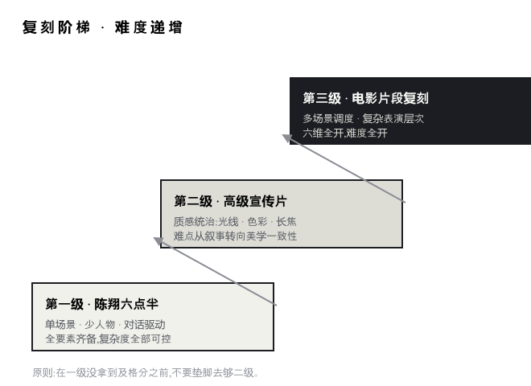

图 8-1 · 知道自己在哪一级,比急着登顶重要。

<aside-note id="source-note-19" kind="addon">
<text-mark tone="thesis">复刻≠抄袭。</text-mark>这里的复刻是练习方法:选一集,逐镜拆解它的分镜表(景别/时长/机位/表演/音效),然后用 AI 重建同等语言复杂度的<text-mark tone="note">你自己的故事</text-mark>。学的是语法,不是台词。
</aside-note>

<text-mark tone="muted" effect="dim">08 · 对标030</text-mark>

<text-mark tone="muted" effect="dim">08 · 对标TC 00:45</text-mark>

SELF-ASSESSMENT · 六维评分卡

## 拿你的成片,逐项对标打分

用法:选你最好的一条成片和任意一集陈翔六点半,并排各看一遍,按下表逐项给自己打 1–5 分(它按 5 分算)。<text-mark tone="note">总分不重要,最低分才重要——最低的那一行,就是你要认领的章节。</text-mark>

| 维度 | 对标检查项(数得出来的,尽量去数) | 我的分 | 对应章 |
| --- | --- | --- | --- |
| 表演 | 人物每句台词有配套的表情/动作吗?关键台词后有反应镜头吗?语气有强度层次吗? |  | CH 01 |
| 美术 | 场景在替角色说话吗?光线有方向和情绪吗?角色跨镜头外观稳定吗? |  | CH 02 |
| 色彩 | 全片有统一 Look 吗?镜头间色调接得住吗?色彩在参与叙事吗? |  | CH 03 |
| 镜头 | 数一数:每分钟几个镜头?用了几种景别?对话有正反打吗?每次运镜有动机吗? |  | CH 04 |
| 剪辑 | 剪辑点隐形吗(景别差/相似/引导三选一)?节奏有曲线吗?有 J/L cut 吗? |  | CH 05 |
| 声音 | 音效三层齐吗?BGM 有进出点吗?台词有空间感吗?用过静默吗? |  | CH 06 |

<aside-note id="source-note-20" kind="addon">
<text-mark tone="thesis">拉片方法。</text-mark>拉片=逐镜头暂停记录:镜头序号、景别、时长、机位/运镜、人物动作、音效。一集拉完你会得到一张"专业短剧的参数表"——它比任何教程都诚实。第一次拉片建议只追踪两列(景别+时长),别贪多。
</aside-note>

<aside-note id="source-note-21" kind="addon">
<text-mark tone="thesis">把评分卡变成路由。</text-mark>最低分维度 → 进对应章 → 挑一张"探索落点"最戳你的卡片 → 用两周只打这一个点 → 重新打分。这个循环就是"从 10 到 100"的最小步进单元。
</aside-note>

<text-mark tone="muted" effect="dim">08 · 对标031</text-mark>

<text-mark tone="muted" effect="dim">09 · 终章TC 00:46</text-mark>

CHAPTER 09 · ROADMAP

## 六维知识注入生产管线

最后回答一个工程问题:这六章知识,到底插进工作流的哪个环节?下图是一条标准的 AI 视频生产管线(节点式工作流用户会觉得眼熟),彩色标注即各章知识的注入点——<text-mark tone="note">可以看到,专业知识不是某一步,而是每一步</text-mark>。

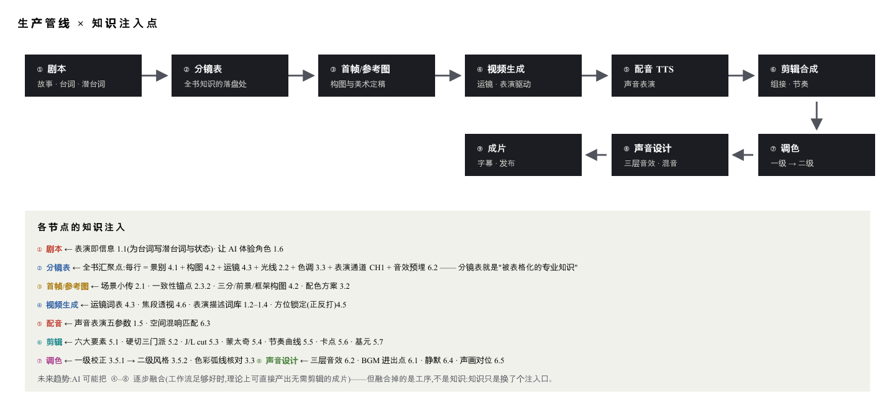

图 9-1 · 分镜表是枢纽:六章知识在那里变成一张表,表的每一行变成一个镜头。

<text-mark tone="muted" effect="dim">09 · 终章032</text-mark>

<text-mark tone="muted" effect="dim">09 · 终章TC 00:47</text-mark>

METHOD · 从一个点打穿

## 慢就是快

读完全书你会发现:方向太多了。六个维度、几十张卡片、每张卡片一个探索落点——这正是最后要谈方法论的原因。<text-mark tone="note">信息越多的时代,广度越廉价,深度越稀缺。</text-mark>

推荐的走法只有一条:<text-mark tone="note">用广度选点,用深度打穿。</text-mark>通读是为了知道地图上有什么(避免在错误的地方挖井),然后选一个点——评分卡最低分的维度里、最戳你的那一张卡片——投入不成比例的时间,研究到你在这个点上超过你能接触到的所有人。一个被打穿的点会自动带出周边:把正反打工作流做穿的人,必然顺手掌握了视线匹配、反应镜头、轴线、方位锁定——点会自己长成面。

另一条筛选标准:<text-mark tone="note">找不变的东西。</text-mark>工具月月换,但景别的信息制度、剪辑的六要素、色环的几何、表演的信息一致性——这些东西十年后依然成立。把时间押在不变量上,你的积累才会复利;押在具体工具的参数上,每次改版都清零。

最后,关于分享。这本手册本身就是"开源"的产物:与其各自藏着掖着,不如把方向摊开,大家各打一个点,再把打穿的结果互相交换——<text-mark tone="note">一个人打穿一个点需要几个月,十个人交换十个点只需要一次分享。</text-mark>做出来的东西会自动复利:一份词表、一套模板、一张配方,做一次,所有人永远用。

<aside-note id="source-note-22" kind="addon">
<text-mark tone="thesis">启程清单(建议顺序)</text-mark>

- ① 用第 08 章评分卡给自己最好的成片打分,找到最低分维度;

- ② 进入对应章节,选定一张卡片的探索落点;

- ③ 拉一集陈翔六点半,只记录与该落点相关的数据;

- ④ 用两周时间在自己的工作流里试验、记录、迭代;

- ⑤ 把结论写下来分享出去,然后回到 ①。
</aside-note>

专业知识决定上限,
AI 决定到达上限的速度。
现在,去打穿一个点。

<text-mark tone="muted" effect="dim">09 · 终章033</text-mark>

<text-mark tone="muted" effect="dim">附录TC 00:48</text-mark>

APPENDIX A · 免费可商用素材站

## 建库,从这里开始

专业剪辑师的第一资产是素材库。以下站点以免费/可商用资源为主,<text-mark tone="note">商用前务必逐条核对每个资源的授权协议</text-mark>(同一站内不同资源授权可能不同)。

| 音效 · SFX |  |
| --- | --- |
| Mixkit | 高质量音效+视频+BGM,普遍可商用 |
| 淘声网 | 中文检索方便,聚合多源,注意逐条看授权 |
| 耳聆网 | 国内声音社区,创作共用协议为主 |
| Freesound | 全球最大声音社区,CC 协议分级清晰 |
| SoundBible | 轻量音效,下载直接 |

| BGM · 音乐 |  |
| --- | --- |
| FMA | Free Music Archive,CC 协议曲库 |
| Incompetech | Kevin MacLeod 曲库,标注即可商用 |
| YouTube 音频库 | 免版税,曲风筛选完善 |

| 视频 / 图像素材 |  |
| --- | --- |
| Pexels | 视频+图片,授权宽松,质量高 |
| Pixabay | 视频/图片/音乐一站式 |
| Mixkit Video | 短视频素材,风格现代 |
| Coverr | 网页感十足的空镜视频 |

<aside-note id="source-note-23" kind="addon">
<text-mark tone="thesis">建库方法比站点更重要。</text-mark>

- ①按本书章节建立目录树(音效按 6.2 三层分;BGM 按情绪×节奏两轴);

- ②素材进库即改名(内容\_情绪\_时长);

- ③每份素材记录来源与授权;

- ④定期备份,多处冗余——素材库是越滚越值钱的复利资产,丢一次等于清零。
</aside-note>

<text-mark tone="muted" effect="dim">附录 A034</text-mark>

<text-mark tone="muted" effect="dim">附录TC 00:49</text-mark>

APPENDIX B · 术语速查

## 四十个词,一门语言的最小词汇表

| 术语 | 一句话 |
| --- | --- |
| 景别 | 摄影机与叙事的距离:远全中近特(4.1) |
| 两极组接 | 远景直切特写,反差即重音(4.1) |
| 三分构图 | 主体放井字交叉点(4.2) |
| 引导线 | 用画面自带线条押送视线(4.2) |
| 荷兰角 | 倾斜镜头=失衡不安(4.2) |
| 推/拉 | 进内心 / 出格局(4.3) |
| 甩镜头 | 快速摇转的暴力转场(4.3) |
| 升格 | 慢动作:拉伸关键一秒(4.4) |
| 轴线 | 对话戏的 180° 空间铁律(4.5) |
| 正反打 | 对话的标准机位语法(4.5) |
| 过肩镜头 | 前景带对方肩膀的对话镜头(4.5) |
| 空间压缩 | 长焦让背景贴向主体(4.6) |
| 定场镜头 | 开场交代地理的远景(4.1) |
| 空镜 | 无人的景物镜头,呼吸与转段(07) |
| 走位 | 人物的空间调度即叙事(1.2.3) |
| 反应镜头 | 切听者的脸:表演的一半是倾听(1.3.2) |
| 视线匹配 | 跨镜头视线方向的连续性(1.4) |
| FACS | 面部动作编码:表情的解剖学词典(1.3) |
| 三点布光 | 主光+辅光+轮廓光(2.2) |
| 黄金时刻 | 日落前后的暖金侧光(2.2.1) |

| 术语 | 一句话 |
| --- | --- |
| 阴阳脸 | 侧光半明半暗,矛盾外化(2.2) |
| 色温对撞 | 一镜内暖冷共存的张力(2.2) |
| 三属性 | 色相/饱和度/明度(3.1) |
| 互补色 | 色环对侧,张力最大(3.2) |
| 色彩弧线 | 全片色调随剧情演进(3.3) |
| Teal \& Orange | 青橙对冲的好莱坞 Look(3.4) |
| 一级/二级调色 | 先校正,再风格(3.5) |
| LUT | 可复用的调色预设封装(3.5.2) |
| 硬切 | 无过渡直接拼接,剪辑的九成(5.2) |
| 跳切 | 同机位同景别相接的"跳"感(5.2.1) |
| 匹配剪辑 | 借相似形/动作跨时空组接(5.2.2) |
| J/L cut | 声音先行 / 声音滞留(5.3) |
| 蒙太奇 | 镜头相接产生第三种意义(5.4) |
| 叠化 | 渐隐渐显=时间流逝(5.7) |
| 缓动 | 关键帧的速度曲线,质感之源(5.7) |
| 蒙版 | 基元一:控制哪里可见(5.7) |
| 关键帧 | 基元二:控制何时变化(5.7) |
| Foley | 动作音效:画面动作的配套声(6.2) |
| 声画对位 | 声音与画面唱反调(6.5) |
| 音MAD | 让素材唱歌的鬼畜调音(G-1) |

<text-mark tone="muted" effect="dim">附录 B035</text-mark>

10 → 100

## 羽升

希望帮助大家从10到100
