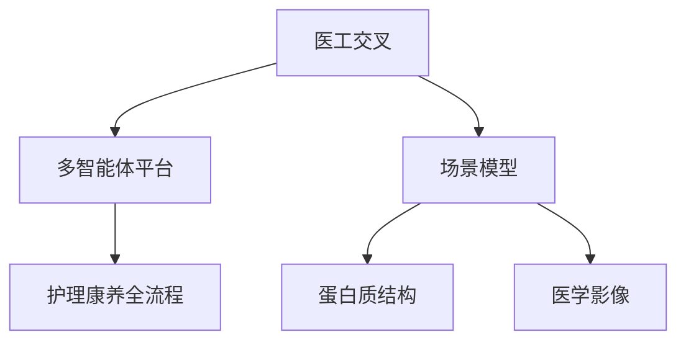
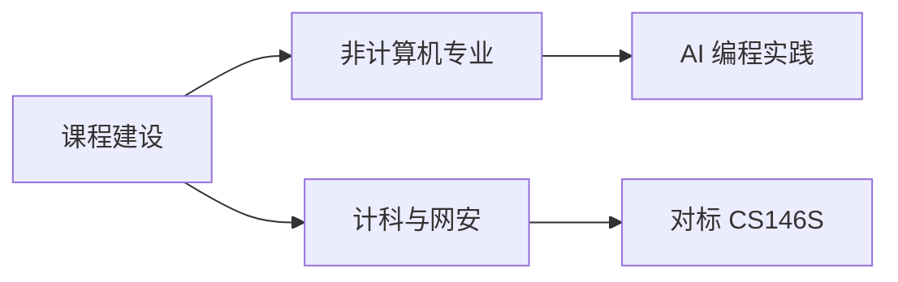

# 从「用AI」到「理解AI」：一名医学生的人工智能实践与思考

<video-embed id="leap-from-using-to-understanding" src="https://husteread.com/storage/public/files/blog/from-using-ai-to-understanding-ai/leap-from-using-to-understanding.mp4" title="从做一个网页，到看见概率模型" poster="https://husteread.com/storage/public/files/blog/from-using-ai-to-understanding-ai/leap-poster.webp" />

## 一、引言

我是华中科技大学同济医学院基础医学强基计划的一名医学生，来华中科技大学正好有一年光景。入学之时正巧赶上「百年未有之大变局」，可能在高考考场上写下这句话的时候并没有什么特别的感触，但真正在大学过了一年之后，才发现这个时代人工智能对我们的冲击到底有多大。

从大一上学期末期开始接触 AI，从最简单的单页网站制作，到后来逐渐进入更专业化的全栈开发，在这个过程中也算是与 AI 编程结下了不少不解之缘。而随着大一下学期正式选修了《人工智能导论》这门课程，我发现自己对 AI 的理解从单纯地使用它、把它当作一个很好的工具，进阶到了真正地逐渐去理解 AI、了解 AI 的基础内容。可以说这门课也为我打开了一些新的大门。

撰写这份报告，不只是完成一项课程作业，更多的是希望从我整体和 AI 接触的视角出发，按照时间线去整理一下我真实的感受和理解。

## 二、起点：全栈开发方向

大一上学期末期，大约是 2025 年 8 月前后，AI 编程的能力正值一轮快速跃升。最开始接触到的是 AI 可以把一些文章通过 HTML 的格式输出渲染，这样过去纯文本的文章就能变成一个前端可视化的网站页面，读起来非常流畅舒适，同时 HTML 中一些交互能帮助更好地理解内容。这件事情为我打开了 AI 方向的大门。

在那之后，正巧在大一上后期我在读书会做活动部的部长，就有了一个想法：为我们读书会搭建一个网站，一方面招生的时候可以用来吸引大家，另一方面也可以在上面记录活动的点点滴滴[1]。后来在做一些文科类的报告时，比如近现代史纲要的课程作业，当时也是用网站的形式，通过可视化的 3D 地图沙盒来展示长征的路线历程[2]。还有在特色团日活动中，我们医学生当时需要介绍中药方面的内容，就做了一个可视化的网站来讲解各类中药的色、香、味、用途，做成二维码放在路演帐篷外边，大家可以扫码体验[3]。这些都是我自己在 AI 编程在课余活动和学习生活中非常直观的应用场景。

<web-embed id="web-read-husteread" src="https://read.husteread.com/" title="华中科技大学读书会网站" height="420">
打不开嵌入时，请直接打开 https://read.husteread.com/ 。
</web-embed>

<web-embed id="web-changzheng" src="https://changzheng3d.husteread.com/" title="长征路线 3D 可视化地图沙盒" height="420">
打不开嵌入时，请直接打开 https://changzheng3d.husteread.com/ 。
</web-embed>

<web-embed id="web-herb" src="https://husteread.com/herb.html" title="特色团日中药可视化" height="420">
打不开嵌入时，请直接打开 https://husteread.com/herb.html 。
</web-embed>

到了 2025 年年末，AI 编程工具迎来了一轮很迅猛的发展，以 Cursor 为代表的 AI IDE 工具、亚马逊的 Kiro 等产品相继成熟。那个时候我发现生活中有很多需求可以通过 AI 编程来满足，它不只是能做网站，甚至能做一些真正有价值的全栈应用项目。

比如我在学习过程中经常遇到需要搜索权威资料的情况，当时就灵机一动，尝试用 AI 做了一个汇集各类权威资料的平台，同时也把华中科技大学的很多官方资料尝试集中在一起，而这也算是我正式接触一个真正复杂的全栈项目的起点[4]。

<web-embed id="web-platform" src="https://platform.1037solo.com/" title="1037Solo 资源整合平台" height="420">
打不开嵌入时，请直接打开 https://platform.1037solo.com/ 。
</web-embed>

随着这些项目的积累，我不再满足于简单的想法，开始认真地去思考：学习生活中还有很多「旧时代」的板块，完全可以用 AI 去进行深度的赋能。

比如听课笔记这件事。过去需要自己记，还很难保证一边思考老师讲的内容、一边记笔记、一边跟上节奏。但我在自己的真实学习生活中发现，你对老师讲的课程内容的更深度的理解，远比以笔记的形式记下来更重要。记笔记最终是一个整理和防止遗忘的过程，更好的方式其实应该是上课时充分理解，课后再去记笔记。但问题是我并没有那么多的课余时间。所以当时一直想开发的一个产品方向是：上课的时候能自动录音转文字，并且自动输出一个笔记大纲；同时通过每时每刻向你提问，帮助你更好地理解老师的内容；有任何不会的点可以随时问 AI，让 AI 帮助你理解。最终这节课上完之后，它会自动给你一个整理好的笔记，你根据自己的理解去增删改查。每一周，系统还能自动整理过去的所有笔记，以周为单位出题，做题情况实时追踪，错题进一步加深出题，会的则通过遗忘曲线逐步减少强调。这也是我目前正打算做的教育类产品方向之一[5]。

<web-embed id="web-github-1037solo" src="https://github.com/1037Solo/1037Solo/blob/main/README.zh-CN.md" title="1037Solo 官方仓库与产品矩阵" height="360">
GitHub 禁止被嵌入，请在新窗口打开仓库说明。
</web-embed>

而在今年期末也是学习教育方向，我另一个辅助复习的项目相对比较完善：当时用 AI 把每门课以教材为单位，把它拆解成每一个章节，用 HTML 格式渲染出可视化的网页形式来展示内容，每一个章节的难点通过可视化的方式展示，并且通过 Python 的 Manim 库制作教学动画辅助理解。右侧还嵌入了一个 AI 面板，可以实时检索复习教材信息、出题提问，甚至调用一些自定义的 Skills[6][7]。这个工具对我的期末复习产生了很深远的影响，因为我第一次发现当 AI 真正深入到课本内容中的时候，在跨板块知识点的整合上，以及在避免因查找资料或记忆偏差而浪费时间这件事上，能起到极大的赋能作用。

<web-embed id="web-review-1b" src="https://1b.husteread.icu/" title="期末复习可视化网站" height="360">
该站点若暂时无法嵌入或无法访问，请稍后再打开 https://1b.husteread.icu/ 。
</web-embed>

<web-embed id="web-github-notebook" src="https://github.com/AIMFllyYS/Notebook-MedFreshman" title="Notebook-MedFreshman 复习系统仓库" height="320">
GitHub 禁止被嵌入，请在新窗口打开仓库。
</web-embed>

<html-embed id="practice-timeline" src="./embeds/practice-timeline/index.html" title="一年实践时间线" height="420">
无法加载时间线小页时，可按第二节时间顺序阅读：HTML 文章页 → 读书会 / 长征 / 中药 → 1037Solo → 课堂笔记与期末复习。
</html-embed>

总结来看，AI 以全栈开发为切入点，赋能确实是很明显的。在做这些项目之前，我其实也用过不少「别人做好的」AI 学习工具：比如用 AI 转录工具把老师每节课的内容转化成文字稿便于后期复习；用 Google 的 NotebookLM 上传教材、出题目并进行 AI 讲解[8]；在各种智能体软件中让 AI 通过 HTML 给课程内容出题。这些都是 AI 时代大家可能普遍会做的事情。但当你把这些散落的功能真正整合在一起的时候，它就变成了一个产品。从个人角度来说，这个产品确实极大地赋能了自己的需求。从另一个角度来说，或许我们也可以把这个产品面向更多用户走出去，甚至是创业。

<web-embed id="web-notebooklm" src="https://notebooklm.google.com/" title="Google NotebookLM" height="320">
NotebookLM 会跳转到登录页且禁止被嵌入，请在新窗口打开。
</web-embed>

而如今，AI Coding 产品越发成熟，以 Codex 为代表的 Agent 软件，以 DeepSeek Harness 为代表的国内新范式编程工具的出现，以及一批类似的 IDE 或 Agent 的出现（如腾讯的 CodeBuddy / WorkBuddy、字节跳动的 Trae / Trae Work、阿里巴巴的 Qoder / QoderWork、智谱的 ZCode、Anthropic 的 Claude Code / CoWork、xAI 的 Grok CLI 和其收购的 Cursor 等），AI Coding 也越来越简单，不只是编程方向，其他方向的专业壁垒也似乎正在深度的改变。

## 三、AI 时代的独立思考

在一年前没有深度接触 AI 之前，我们探讨的是「AI 对大学生意味着什么」「我们是否会被 AI 取代」，当时得到的结论大多是「AI 时代要保持自己的思考和理性」。当时的结论虽不够深入具体，但直到现在我认为也很重要。

而同时，当我真正深度使用 AI 一年之后，视角就不大一样了。首先，保持自己的思考这一点仍然很重要。但问题是，过去我们在没有深度使用 AI 之前对 AI 的评价，多半是没有真正亲身实践并了解 AI 各方面边界的。在这种情况下做出的很多判断一定是远离实际的。换句话说，就像文科做调研一样，我们不能只根据理性判断去分析一件事的好坏，真正要做的是走进去实践、走入它的点点滴滴，根据实际情况去反思了解。

在使用 AI 这段时间里，我认为 AI 时代有几个点可能更重要。

<html-embed id="four-principles" src="./embeds/four-principles/index.html" title="AI 时代独立思考的四点" height="340">
四点分别是：保持对生成内容的警惕、在快节奏中找到方向、建立自己的评判标准、善于复盘并把经验封装成 Skills。
</html-embed>

第一，保持对 AI 生成内容的警惕性。随着 AI 越来越深地融入我们的生活，我们可能下意识地会越来越相信 AI 输出的每一个字。但真实情况是 AI 本身就是一个基于概率预测的模型，它输出的所有文字中一定有部分内容是错的。那么我们是否能在长对话中，甚至是未来 AI 融入学习和科研的场景中，始终去批判性地审视 AI 生成的内容？这一点我认为相当关键。

第二，在快节奏中找到自己的方向。AI 时代节奏太快了，我们是否能在这种时代汹涌发展的大潮中找到自己的节奏、找到自己的方向？毕竟慢就是快，不要被时代裹着走。不要盲目跟风，应要培养自己的判断。同时，在节奏很快的时候，我们更应该去沉淀自己，让自己专业化，而不要浮躁地只是浅层地了解或做事情。

第三，建立自己的评判标准。AI 时代产出效率飙升的同时，也会让我们陷入无尽的信息焦虑：同样一个内容有太多素材可以参考，一个主题有太多文字要看。我们如何建立自己的评判标准，用更快的速度检索需要的信息？同时也要用一个更客观的标准去衡量我们的产出效率。举个例子，AI 可以很快地帮我们写一篇文章，但我们秉持着「AI 能赋能」的思路不断让 AI 返工重写，所花的时间是否真的起到了赋能的作用？很多时候看似短期效率提升了，实际上是增加了长期的返工率。

用全栈开发的经历可以很好地解释这一点：最开始你让 AI 根据你的想法通过「许愿式」的方式直接生成一个项目，但当这个项目越来越复杂、功能越来越多时，如果前期没有认真慢下来去思考它的架构决策、没有认真思考每一个板块如何设计、每一个模块如何更好地联系在一起，后期你肯定会面临代码过度复杂以及不重构就无法继续更新、甚至很多 bug 无法修复的窘境。这本质上就是在一个看似很快的节奏中没有慢下来去分析核心问题。

<canvas-render id="complexity-curve" renderer="function-plot" data-src="./data/complexity.json" width="720" height="360" />

上图只是示意：横轴可以看成功能一件件加上去，纵轴是项目复杂度。它不是测量数据，只是把「许愿式堆功能」画成 $y = x^2$。

第四，善于复盘，把经验封装起来。AI 时代最重要的可能是：每做完一件事就要去复盘。比如写文章，写完之后你一定能提炼总结出 AI 在哪块不足、哪块可以很好地赋能、哪块需要自己亲力亲为。你应该有一套自己的思路，甚至是自己的 SOP。在这个时代我们完全可以把这个过程封装成一个 Skills，它能在你下次做同样的任务时用更高的效率完成更好的结果。摸清楚 AI 的边界，说的也是这个道理：我们在一次次制作 Skills、一次次把自己和 AI 协作的经验封装的过程中，本质上就是把很多不确定性以及不明确的边界收缩到一个更确定、边界更清晰的状态，达到人机协作更好的方向和目的。

## 四、人工智能导论课程与讲座的启发

从最开始接触到人工智能的应用，到上了我们的《人工智能导论》课程，以及当时听了非常多的讲座，除去课上推荐的讲座之外，我自己也去听了学校和一些企业合作举办的讲座。

其中给我印象很深刻的是关于自动驾驶领域 AI 应用的一个讲座[9]。简单来说，我们在训练 AI 去实现自动驾驶的过程中，本质上就是针对一个特定场景做一个更专业化的模型的过程。联系到我们医学专业，可能在医学影像方向或者是蛋白质预测方向，都可以去训练一个特别适合于这些场景的特定模型，来很大程度上提高这些领域的效率。

<web-embed id="web-feishu-minutes" src="https://mcnxs4qsv7h3.feishu.cn/minutes/obcncn8bh72gb54s4idz4bjs" title="自动驾驶与 AI 应用讲座纪要" height="320">
飞书纪要通常无法嵌入，且该链接当前可能已失效，请在新窗口尝试打开。
</web-embed>

过去在没有上这门课之前，我的认知更多的是「AI 能干什么」。但当我开始理解 AI 的本质「基于概率去预测」，很多事情就清楚了。如果我们了解到这个本质，就能明白做任何事情的时候，可能更重要的是我们如何去优化给 AI 的提示词，如何指导 AI，在不同的任务中它应该怎样去输入输出、怎样去规范它的每一个步骤。

<choice-question id="choice-ai-essence" data-src="./data/choice-ai-essence.json" />

同时，如果我们更好地了解了 AI 的本质，还能引出更深层的理解。比如 AI 在处理输入时第一步其实相当于是一个分词（Tokenization）的过程，分词器（Tokenizer）的设计会很大程度上决定 AI 最终输入输出的质量。举个最直观的例子，Anthropic Claude 系列模型中的 Opus 4.6，它的分词器对中文很友好，所以这个模型也很擅长写中文内容。但到了后续版本中，为了提升编程能力而调整了训练策略，中文输出的质量反而出现了明显下降；不只是分词的影响，在模型设计中不同维度之间的取舍也会在一定程度上影响模型整体的能力。比如嵌入维度（Embedding Dimension）的选择：映射到更高维的空间，计算量更大但表达能力更强，效果更好；维度更低的时候，精度可能下降，但推理效率会提高。

即使未来我可能无法直接从事模型训练工作，但在了解它之后，我们就能很好地知道为什么不同版本的模型有各自的特点，以及我们如何去利用不同模型在不同方向上的优势。这不只是局限于通用模型，还包括更专业化的微调模型。比如最近法律 AI 公司 Harvey 于 2026 年 8 月发布了一个名为 Tenet 的法律领域专用模型，它是在开源模型 Kimi K3 的基础上，通过异步强化学习（Asynchronous RL）结合合成数据、公开法律数据和律师标注数据进行后训练，在长周期法律任务上的表现达到了前沿水平[10]。再比如 DeepSeek V4 Pro 正式版经过系统化的后训练之后，其在 LiveCodeBench 上的编程能力评分从 V3.2 的 83.30 分跃升至 93.50 分，智能体编程板块更是提升了近 16 分，实现了编程能力的系统性跨越[11][12]。了解了 AI 模型的底层原理，我们就能清楚地解读这些宏观表现背后到底是什么。

<web-embed id="web-harvey-tenet" src="https://www.harvey.ai/blog/post-training-update-harvey-tenet" title="Harvey Tenet 后训练更新" height="480">
若该页拒绝嵌入，请打开 Harvey 官方博文。
</web-embed>

<web-embed id="web-163-deepseek" src="https://www.163.com/dy/article/L4M962JK0511CPVM.html" title="DeepSeek V4 Pro 中文测评转载" height="320">
门户站点通常禁止嵌入，请在新窗口阅读转载测评。
</web-embed>

<web-embed id="web-datalearner" src="https://www.datalearner.com/ai-models/pretrained-models/deepseek-v4-pro/analysis" title="DeepSeek V4 Pro 评测分析" height="480">
若无法嵌入，请打开 DataLearner 的评测页。
</web-embed>

还有一点让我觉得很有启发：了解了语义向量空间的基本原理之后，我们就能理解为什么可以用自然语言让 AI 写代码。因为我们的自然语言和程序员的专业化语言，在高维的语义空间上是高度对齐的。可能我们用大段自然语言描述的一件事情，在高维空间里的语义表征就是一两个专有名词。从这个角度来看，更专业化的视角、更专业化的词汇，能让我们用更少的语言、更清晰地去描述准确我们要达成的目标。

## 五、医工交叉：AI 与医学的融合方向

如果要深入思考 AI 和医学的交叉融合，从我自己的理解出发大致可以分成两个方向。

<html-embed id="med-ai-paths" src="./embeds/med-ai-paths/index.html" title="医工交叉的两条路" height="280">
一条路是多智能体平台，把看病、学习和照护流程串起来；另一条路是为蛋白质、影像这类窄场景训练或微调模型。
</html-embed>

<video-embed id="med-ai-two-paths" src="https://husteread.com/storage/public/files/blog/from-using-ai-to-understanding-ai/med-ai-two-paths.mp4" title="平台智能体与场景模型并置" poster="https://husteread.com/storage/public/files/blog/from-using-ai-to-understanding-ai/med-ai-poster.webp" />

第一个方向是以智能体（Agent）为导向，结合医学本身在看病、就诊、学习等各个板块，做一个更倾向于 AI 融入的平台方向。比如我近期参与的一个项目——华中科技大学网安校区与护理学院联合推进的「颐路同行」平台，旨在构建一个基于多智能体协同的护理康养人才成长与照护服务平台，覆盖招生、学习、实训、考证、就业、服务、评价的全流程数据贯通[13]。这类项目更多体现的是 AI 编程的直接应用，考验的是全栈开发能力和智能体架构设计能力。

第二个方向是基于不同的特定场景做一些模型的训练和微调，来优化特定领域、起到杠杆作用。这个方向我认为更触及 AI 的本质。在医学领域，蛋白质结构预测是一个典型案例：蛋白质的结构决定性质，如果我们知道蛋白质的结构，就能很好地理解它的性质，从微观视角了解性质就能分析出宏观的表现，这对指导未来医学发展非常关键。2024 年诺贝尔化学奖授予了 Google DeepMind 的 Demis Hassabis 和 John Jumper 以及华盛顿大学的 David Baker，正是对 AI 在蛋白质结构预测和计算蛋白质设计方面突破性贡献的认可[14]。AlphaFold 已经成功预测了超过 2 亿个蛋白质的结构，被全球 190 多个国家超过 200 万研究人员使用[15]。在医学影像方向，基于深度学习的计算机视觉模型在辅助读片、疾病筛查方面也展现出了很大的价值。据行业报告，2025 年全球医学影像 AI 市场规模预计突破 400 亿美元，年增速超过 45%[16]。

<web-embed id="web-nobel" src="https://www.nobelprize.org/prizes/chemistry/2024/press-release/" title="2024 年诺贝尔化学奖新闻稿" height="360">
诺奖官网只允许同源嵌入，这里会显示预览卡，请在新窗口阅读新闻稿。
</web-embed>

<web-embed id="web-uii" src="https://www.uii-ai.com/article/390.html" title="联影智能医疗影像 AI 大模型" height="320">
该站点禁止嵌入，请在新窗口阅读原文。
</web-embed>

这两个方向的划分其实也蕴含了我自己的思考。前者偏向计算机科学中的软件工程与智能体设计，后者偏向人工智能专业中的模型训练与优化，它们对应的其实是计算机或人工智能两个专业方向不同层面的能力。这也引出了我对跨领域人才的判断：如果要走医工交叉方向，最重要的其实是跨领域的人才。

这里我要很明确地说，可能在前期觉得用 AI 做一些产品和项目不太依赖专业知识。但当你真正做一个面向企业级的专业化软件的时候，你考虑的其实是软件工程的事情：如何处理高并发的压力，如何保证线上的安全和低延迟等等。这些板块已经深入到了计算机科学或软件工程方面很专业化的领域。同时另一个方向模型训练本身就是人工智能专业需要系统学习的内容。

所以我认为 AI 时代最重要的一点就是专业化。人工智能本身就是一个杠杆，它能很好地赋能在每一个学科，但它无法直接取代这个学科。本质是因为它要赋能，需要本来就专业的人才让 AI 在专业的方向上去解决那些耗时耗力的问题。比如软件开发中，AI 可能更擅长加速的部分是代码的编写，但譬如项目开发中的架构决策这种核心难点，仍然需要资深工程师去深度分析和判断，很难让 AI 直接替代。人机协作的未来方向，可能是在某一个领域，由更专业的人才去指导 AI 做更专业化的事情，在这个领域起到真正的赋能。

这也是我认为不只是 AI 和医学，甚至是 AI 加各个学科，它最核心最重要的出发点。

## 六、对 AI 时代教育变革与课程建设的思考

前面说的还是比较宏观，后面我们可以放到微观或者放到我们实际的教育体系当中，也正巧我自己在做一些教育方面的产品时，发现很多新兴的 AI 类教育产品可能正在逐渐替代一些传统的教育方式。目前很多省份的高中就已经实施了智慧化教育，云端课程的追踪分析已经相对成熟，包括我们「智慧华中大」相关的一些产品也是这个思路。但如果 AI 更深度地应用，它可以很清晰地分析一个人在各学科的薄弱项，并且很系统性地有针对性地对每一个板块进行深度学习和补强，那么一定会大大提升学习效率，产生很高的杠杆。

这种情况下我们可能需要思考：一方面传统教育到底要怎样去改变或优化？另一方面，当 AI 能细致入微地分析每个人的学习状态和进度时，这到底是好是坏？这其实也是一个偏向哲学层面的问题。

从行业整体的技术趋势来看，目前 AI 模型的训练和后训练明显偏重编程和智能体能力的优化。可以看到各大模型的编程能力和 Agent 能力得到大幅提升，甚至出现了一定程度的过拟合，但 AI 的通用语言能力、真正的文学创作能力似乎在泛化上有所下降。短期看这可能是一个问题，但把目光放长远就会发现：AI 模型的一个很大的特点就是，你在哪个方向进行充分的训练，它就能在哪个方向实现质的飞跃。当编程领域趋于成熟之后，各大厂商把核心注意力转向大语言模型在文学创作方面的能力进行深度训练，同样可以达到类似编程能力那样接近过拟合的水准。这可能意味着我们以后真正能做到让专业人士去指导 AI 进行文学创作，水平远超现在的状态。

这里说的可能比较抽象，但我认为这个时代的变革可能不只是像过去几次时代跃迁，它可能真的就像人类第一次工业革命那样，是一个完完整整的跨时代的进步，相当于人类第一次发明蒸汽机对整个社会的影响。AI 整体的发展对全世界各行各业的冲击可能是远超人类想象和颠覆性的。

以我自己为例来说一个具体维度。我自己是全栈开发方向，非计算机科学专业出身。一方面我确实做过很多和企业对接的事情，我自己是华中科技大学同济医学院基础医学院「医路求索」团队的技术核心成员，当时团队里两个计算机科学专业的同学也是我带的，因为我是以实践为导向的，真实能交付企业级别的项目。我之前给一些企业做过 APP、做过项目，甚至接过真实的外包订单。这次暑假也和华中科技大学网安基地那边有过一些项目合作。在和同龄人甚至比我大几年的计算机科学和网安专业的同学交流的过程中，我发现即使他们都快本科毕业了，也很难做到完完整整地全栈交付一些可落地、可使用的项目。

从这个角度分析，有两个点值得思考。

第一点，AI 时代对传统教育的冲击可能是颠覆性的。如果你是一个善于使用 AI 的人，用 AI 生成 PPT、生成图片、甚至生成网站，就可能直接去和一些经过专业学习几年但缺乏实践经验的毕业生竞争。我自己可能才大二，就已经有了很多计算机方向的竞赛经历以及和企业对接的实战经验，而且因为我是直接面向实践和企业需求去学习的，掌握的恰恰是市场需要的东西。

第二点，对于更专业的计算机科学或网安专业的学生，AI 实践类课程可能非常重要。比如斯坦福大学在 2025 年秋季学期就开设了 CS146S: The Modern Software Developer 这门课程，由前 Amazon Alexa 技术负责人 Mihail Eric 主讲，是全球首门系统化的 AI 辅助软件工程课程[17]。这门课明确反对所谓的「Vibe Coding」（即纯靠 AI 生成代码、不审查逻辑的做法），倡导开发者作为 AI Agent 的管理者，课程覆盖从 LLM 基础到 Agent 架构、从上下文工程到安全、从自动化构建到生产运维的完整软件开发生命周期[18]。2026 年秋季该课程继续开设。对于专业人士来说，AI 一定是通过专业化的指导和经验才能发挥最大价值的，这是一个双向互动的过程。

<web-embed id="web-cs146s" src="https://themodernsoftware.dev/" title="CS146S: The Modern Software Developer" height="480">
若课程站无法嵌入，请打开 https://themodernsoftware.dev/ 。
</web-embed>

<web-embed id="web-cs146s-github" src="https://github.com/mihail911/modern-software-dev-assignments" title="CS146S 课程作业仓库" height="320">
GitHub 禁止被嵌入，请在新窗口打开作业仓库。
</web-embed>

<html-embed id="education-tracks" src="./embeds/education-tracks/index.html" title="面向非专业与专业学生的两条课" height="300">
建议非计算机专业开 AI 编程实践课；计科与网安对标 CS146S，把开发者训练成 Agent 的管理者。
</html-embed>

我自己作为非专业人士，坦白说更多的是趋近于「力大砖飞」：我无法做真正深度的架构决策，也无法在每一个板块很清晰地知道 AI 写的代码到底是什么原理。但我整体的一些偏向软件工程类的思维是通过实践经验积累起来的，这些经验也能反过来让我用更正确的方式、更快的速度做出可靠的产品。

这里还可以延伸出一个值得关注的方向：AI 时代的代码安全与责任归属。当 AI 写的代码越来越多，实际上很少有人会去逐行 review。到目前这个阶段很难有人有时间有精力去审查 AI 写的每一行代码，因为大家的效率都在提升，都倾向于不 review 代码直接看最终结果、直接观测效果。如果你还要坚持逐行审查，你的效率就会下降，在真实的交付过程中反而缺乏竞争力。这就会进一步导致未来很多人确实不会去细看代码，AI 写的东西在某种程度上就是一个「黑盒」。在真正的企业级交付中，这个问题如何解决、代码责任如何界定，都是值得我们的老师和研究者们深入研究的课题。

从另一个角度来说，AI 编程不只是局限于做交付项目。举几个日常的例子：有记账习惯的同学完全可以自己开发一个记账软件；写论文的时候需要用 LaTeX 排版，有 AI 之后完全可以让 AI 进行专业化的排版辅助；我作为医学生，在一些偏向多组学或者需要统计的医学类课题中，本质上是需要 R 语言和 Python 基础的，有 AI 之后我们可以很方便地让 AI 去生成需要的火山图、雷达图等可视化图表。那么 AI 对非专业人士的赋能，是否值得开设一门课程？我认为是值得的。如果一群人都有了这样的核心竞争力，一定会带动整个板块的质的飞跃。当然也会面临风险，这些风险目前我可能还意识不到，但我认为也是需要权衡的。

总而言之，对于学校后续 AI 类课程建设的建设与期待，我的想法是，可以尝试面向非计算机专业的学生，开设 AI 编程实践类课程，帮助各专业的学生用 AI 赋能自己的学科；面向计算机和网安等专业的学生，可以对标斯坦福 CS146S 等国外先进课程，系统化地培养 AI 时代的软件工程能力，让专业人士变得更专业、效率更高。

## 七、结语

回顾这一年，从最初用 AI 做一个简单的网页，到独立完成全栈项目，再到通过《人工智能导论》课程开始理解 AI 的底层逻辑，我的认知经历了一次完整的跃迁。AI 时代需要我们保持警惕、保持思考，但更需要我们真正走进去，用实践去丈量它的边界。专业化、人机协作、持续复盘，这是我在这一年里提炼出的关键认识，也是我未来继续探索 AI 与医学交叉领域的出发点。

## 结业报告 PDF

标准排版的课程提交稿放在对象存储上，需要引用或存档时请直接下载，不要用系统打印对话框代替。

<web-embed id="web-report-pdf" src="https://husteread.com/storage/public/files/AI-APP-REP.pdf" title="结业报告 PDF" height="720">
若浏览器不能在页面内打开 PDF，请使用下面的下载链接。
</web-embed>

[下载结业报告 PDF](https://husteread.com/storage/public/files/AI-APP-REP.pdf)

## 参考文献

1. 华中科技大学读书会. 读书会网站 [EB/OL]. <https://read.husteread.com>.
2. 孔德羽. 长征路线 3D 可视化地图沙盒 [EB/OL]. <https://changzheng3d.husteread.com/>.
3. 孔德羽. 特色团日中药可视化展示网站 [EB/OL]. <https://husteread.com/herb.html>.
4. 孔德羽. 1037Solo 资源整合平台（AISolo / Platform）[EB/OL]. <https://platform.1037solo.com>.
5. 1037Solo Team. 1037Solo 官方 GitHub 仓库——产品矩阵与项目介绍 [EB/OL]. <https://github.com/1037Solo/1037Solo/blob/main/README.zh-CN.md>.
6. 孔德羽. 期末复习可视化网站 [EB/OL]. <https://1b.husteread.icu>.
7. AIMFllyYS. Notebook-MedFreshman：基于 AI 的医学新生课程复习系统 [EB/OL]. <https://github.com/AIMFllyYS/Notebook-MedFreshman>.
8. Google. NotebookLM [EB/OL]. <https://notebooklm.google.com>.
9. 华中科技大学人工智能导论课程. 自动驾驶与 AI 应用讲座会议纪要 [EB/OL]. <https://mcnxs4qsv7h3.feishu.cn/minutes/obcncn8bh72gb54s4idz4bjs>.
10. Harvey AI. Post-Training Update: Harvey Tenet [EB/OL]. (2026-08-20). <https://www.harvey.ai/blog/post-training-update-harvey-tenet>.
11. SuperCLUE. DeepSeek V4 Pro 正式版中文测评报告 [EB/OL]. (2026-08). 转引自：<https://www.163.com/dy/article/L4M962JK0511CPVM.html>.
12. DataLearner. DeepSeek-V4-Pro 评测分析：性能表现与竞品对比 [EB/OL]. <https://www.datalearner.com/ai-models/pretrained-models/deepseek-v4-pro/analysis>.
13. 华中科技大学护理学院, 网络空间安全学院. 颐路同行：基于多智能体协同的护理康养人才成长与照护服务平台——商业计划书 [R]. 2026.
14. The Nobel Foundation. The Nobel Prize in Chemistry 2024: Press Release [EB/OL]. (2024-10-09). <https://www.nobelprize.org/prizes/chemistry/2024/press-release/>.
15. Jumper J, Evans R, Pritzel A, et al. Highly accurate protein structure prediction with AlphaFold [J]. Nature, 2021, 596(7873): 583-589.
16. 联影智能. 从突破到领航，联影智能医疗影像 AI 大模型加速医疗技术跃迁 [EB/OL]. (2025). <https://www.uii-ai.com/article/390.html>.
17. Stanford University. CS146S: The Modern Software Developer [EB/OL]. <https://themodernsoftware.dev/>.
18. Eric M. CS146S: The Modern Software Developer——课程作业代码仓库 [EB/OL]. <https://github.com/mihail911/modern-software-dev-assignments>.
