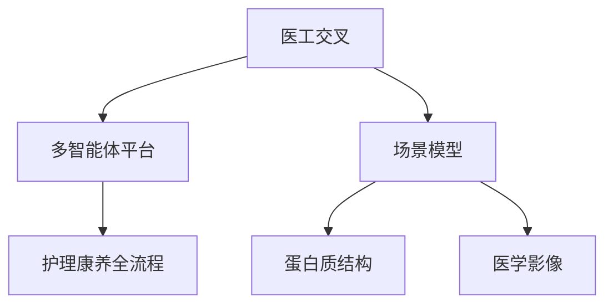
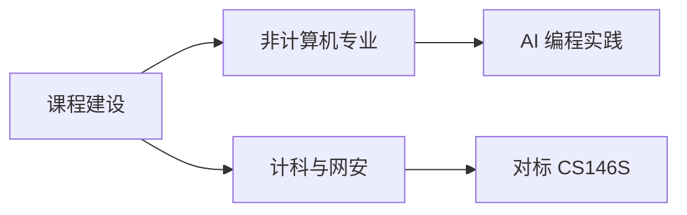

# 从「用AI」到「理解AI」：一名医学生的人工智能实践与思考

<video-embed id="leap-from-using-to-understanding" src="https://husteread.com/storage/public/files/blog/from-using-ai-to-understanding-ai/leap-from-using-to-understanding.mp4" title="从做一个网页，到看见概率模型" poster="https://husteread.com/storage/public/files/blog/from-using-ai-to-understanding-ai/leap-poster.webp" />

## 一、引言

我是华中科技大学同济医学院基础医学强基计划的一名医学生，来华中科技大学正好有一年光景。入学之时正巧赶上「百年未有之大变局」。高考考场上写下这句话时并没有什么特别的感触；真正在大学过了一年之后，才发现这个时代人工智能对我们的冲击到底有多大。

从大一上学期末期开始接触 AI：先是最简单的单页网站，后来逐渐进入更专业化的全栈开发，也算是与 AI 编程结下了不少不解之缘。大一下学期正式选修《人工智能导论》之后，我对 AI 的理解从单纯地使用它、把它当作一个很好的工具，进阶到真正去理解它、了解它的基础内容。这门课也为我打开了一些新的大门。

> 写这份报告，不只是完成一项课程作业。我更想按时间线，把这一年真实的感受和理解整理出来。

## 二、起点：全栈开发方向

### 第一扇门：把纯文本变成可读的页

大一上学期末期，大约是 2025 年 8 月前后，AI 编程的能力正值一轮快速跃升。最开始接触到的是：AI 可以把文章用 HTML 渲染出来。过去纯文本的文章，就能变成一个前端可视化的页面，读起来流畅舒适，交互也能帮助理解内容。这件事情为我打开了 AI 方向的大门。

### 课余活动里的三张网页

那之后，我在读书会做活动部部长，就有了一个想法：给读书会搭一个网站。一方面招生时可以吸引大家，另一方面也可以在上面记录活动的点点滴滴。[^1]

后来做文科类报告时，比如近现代史纲要的课程作业，也是用网站的形式，用可视化的 3D 地图沙盒展示长征路线。[^2] 特色团日活动里，医学生需要介绍中药，我们就做了一个可视化网站，讲各类中药的色、香、味、用途，做成二维码放在路演帐篷外边，大家可以扫码体验。[^3]

这些都是我自己在课余活动和学习生活中，对 AI 编程最直观的应用场景。

<web-embed id="web-read-husteread" src="https://read.husteread.com/" title="华中科技大学读书会网站" height="420">
打不开嵌入时，请直接打开 https://read.husteread.com/ 。
</web-embed>

<web-embed id="web-changzheng" src="https://changzheng3d.husteread.com/" title="长征路线 3D 可视化地图沙盒" height="420">
打不开嵌入时，请直接打开 https://changzheng3d.husteread.com/ 。
</web-embed>

<web-embed id="web-herb" src="https://husteread.com/herb.html" title="特色团日中药可视化" height="420">
打不开嵌入时，请直接打开 https://husteread.com/herb.html 。
</web-embed>

### 走进真正的全栈

到了 2025 年年末，AI 编程工具迎来一轮很迅猛的发展。以 Cursor 为代表的 AI IDE、亚马逊的 Kiro 等产品相继成熟。那个时候我发现：生活中很多需求不只是能做网站，甚至能做成真正有价值的全栈应用。

学习过程中经常需要搜索权威资料，当时就灵机一动，尝试用 AI 做一个汇集各类权威资料的平台，同时也把华中科技大学的很多官方资料尝试集中在一起。这算是我正式接触一个真正复杂的全栈项目的起点。[^4]

<web-embed id="web-platform" src="https://platform.1037solo.com/" title="1037Solo 资源整合平台" height="420">
打不开嵌入时，请直接打开 https://platform.1037solo.com/ 。
</web-embed>

### 把学习流程做成产品

随着这些项目的积累，我不再满足于简单的想法，开始认真想：学习生活中还有很多「旧时代」的板块，完全可以用 AI 去深度赋能。

听课笔记就是一个例子。过去需要自己记，还很难保证一边思考老师讲的内容、一边记笔记、一边跟上节奏。我在真实学习里发现：对课程内容更深度的理解，远比以笔记的形式记下来更重要。记笔记最终是整理和防止遗忘；更好的方式其实应该是上课时充分理解，课后再去记。问题是，我并没有那么多课余时间。

所以当时一直想做的一个产品方向是：

- 上课时自动录音转文字，并自动输出笔记大纲
- 每时每刻向你提问，帮你跟上老师的内容
- 不会的点可以随时问 AI
- 下课后给出一份可增删改查的整理稿
- 每周自动整理过去的笔记，按周出题、追踪对错，错题加深、会的则按遗忘曲线减弱

这也是我目前正打算做的教育类产品方向之一。相关产品矩阵写在 [1037Solo 仓库说明](https://github.com/1037Solo/1037Solo/blob/main/README.zh-CN.md) 里。[^5]

而在今年期末，另一个辅助复习的项目相对比较完善：把每门课以教材为单位拆到章节，用 HTML 渲染可视化网页；难点用可视化展示，并用 Python 的 Manim 做教学动画。右侧还嵌了一个 AI 面板，可以检索教材、出题提问，甚至调用自定义 Skills。[^6] [^7]

这个工具对我的期末复习影响很深。我第一次发现：当 AI 真正深入到课本内容中时，跨板块知识点的整合，以及避免因查找资料或记忆偏差而浪费时间，都能起到极大的赋能。

<web-embed id="web-review-1b" src="https://notebook1b.husteread.icu/" title="期末复习可视化网站" height="420">
该站点若暂时无法嵌入，请打开 https://notebook1b.husteread.icu/ 。
</web-embed>

<html-embed id="practice-timeline" src="./embeds/practice-timeline/index.html" title="一年实践时间线" height="420">
时间线按第二节顺序：HTML 文章页 → 读书会 / 长征 / 中药 → 1037Solo → 课堂笔记与期末复习。
</html-embed>

### 别人的工具，和自己的产品

总结来看，AI 以全栈开发为切入点，赋能确实很明显。在做这些项目之前，我也用过不少「别人做好的」AI 学习工具：

- 用转录工具把老师每节课变成文字稿，便于后期复习
- 用 Google 的 [NotebookLM](https://notebooklm.google.com/) 上传教材、出题、讲解[^8]
- 在各种智能体软件里，让 AI 用 HTML 给课程内容出题

这些都是 AI 时代大家可能普遍会做的事情。但当你把散落的功能真正整合在一起时，它就变成了一个产品。从个人角度，这个产品确实极大地赋能了自己的需求；从另一个角度，或许也可以面向更多用户走出去，甚至是创业。

> 散落的功能是工具。把它们收成一条完整流程，才是产品。

如今 AI Coding 越发成熟：Codex 一类 Agent，DeepSeek Harness 一类国内新范式编程工具，以及腾讯 CodeBuddy / WorkBuddy、字节 Trae / Trae Work、阿里 Qoder / QoderWork、智谱 ZCode、Anthropic Claude Code / CoWork、xAI 的 Grok CLI 和其收购的 Cursor。编程方向的门槛在下降，其他方向的专业壁垒也似乎正在被深度改变。

## 三、AI 时代的独立思考

一年前没有深度接触 AI 之前，我们讨论的是「AI 对大学生意味着什么」「我们是否会被 AI 取代」。当时得到的结论大多是「AI 时代要保持自己的思考和理性」。结论虽不够深入具体，直到现在我认为也很重要。

真正深度使用一年之后，视角就不一样了。保持思考仍然重要。但过去在没有亲身实践、不了解边界的情况下做出的很多判断，一定是远离实际的。就像文科做调研：不能只根据理性判断去分析一件事的好坏，真正要做的是走进去实践，根据实际情况去反思。

<html-embed id="four-principles" src="./embeds/four-principles/index.html" title="AI 时代独立思考的四点" height="340">
四点：保持对生成内容的警惕、在快节奏中找到方向、建立自己的评判标准、善于复盘并把经验封装成 Skills。
</html-embed>

### 保持警惕

随着 AI 越来越深地融入生活，我们可能下意识地越来越相信它输出的每一个字。真实情况是：AI 本身就是一个基于概率预测的模型，它输出的文字中一定有部分是错的。

那么我们是否能在长对话中，甚至在未来 AI 融入学习和科研的场景中，始终批判性地审视生成内容？这一点我认为相当关键。

### 找到节奏

AI 时代节奏太快。我们是否能在汹涌的大潮中找到自己的节奏和方向？慢就是快，不要被时代裹着走。不要盲目跟风，应培养自己的判断。节奏很快的时候，更应该沉淀自己、让自己专业化，而不是浮躁地只做浅层了解。

### 建立自己的标准

产出效率飙升的同时，也会陷入信息焦虑：同样一个内容有太多素材，一个主题有太多文字。我们如何用自己的标准更快检索需要的信息，又用更客观的标准衡量产出效率？

举个例子。AI 可以很快帮我们写一篇文章，但我们秉持着「AI 能赋能」不断让它返工重写，所花的时间是否真的起到了赋能作用？很多时候看似短期效率提升了，实际上是增加了长期返工率。

全栈开发的经历可以很好地解释这一点。最开始你让 AI 按「许愿式」直接生成一个项目；当项目越来越复杂、功能越来越多时，如果前期没有慢下来思考架构、没有认真设计每个板块如何联系，后期就会面对代码过度复杂、不重构就无法继续更新、甚至很多 bug 无法修复的窘境。

<canvas-render id="complexity-curve" renderer="function-plot" data-src="./data/complexity.json" width="720" height="360" />

上图只是示意：横轴可以看成功能一件件加上去，纵轴是项目复杂度。它不是测量数据，只是把「许愿式堆功能」画成 $y = x^2$。

### 复盘，并封装成 Skills

AI 时代很重要的一点，可能是：每做完一件事就要去复盘。比如写文章，写完之后你一定能提炼出 AI 在哪块不足、哪块可以赋能、哪块需要自己亲力亲为。你应该有一套自己的思路，甚至是自己的 SOP。这个时代完全可以把这个过程封装成 Skills，下次做同样的任务时用更高的效率完成更好的结果。

摸清楚 AI 的边界，说的也是这个道理：一次次制作 Skills、一次次把协作经验封装，本质上就是把很多不确定性收缩到更确定、边界更清晰的状态，达到人机协作更好的方向。

## 四、人工智能导论课程与讲座的启发

从最开始接触人工智能的应用，到上《人工智能导论》，以及听了许多讲座——除去课上推荐的，我自己也去听了学校和一些企业合作举办的讲座。

其中印象很深的是关于自动驾驶领域 AI 应用的一场。简单来说，训练 AI 去做自动驾驶，本质上就是针对一个特定场景做更专业化的模型。联系到医学，可能在医学影像或蛋白质预测方向，都可以训练特别适合于这些场景的特定模型，来提高效率。[^9]

### 把「能干什么」换成「它是怎么预测的」

过去没上这门课之前，我的认知更多是「AI 能干什么」。当我开始理解它的本质是「基于概率去预测」，很多事情就清楚了：做任何事情时，更重要的可能是如何优化提示词、如何指导 AI，在不同任务中它应该怎样输入输出、怎样规范每一个步骤。

<choice-question id="choice-ai-essence" data-src="./data/choice-ai-essence.json" />

了解本质还能引出更深层的理解。AI 处理输入的第一步相当于分词（Tokenization），分词器（Tokenizer）的设计会很大程度上决定输入输出质量。最直观的例子：Anthropic Claude 系列里的 Opus 4.6，分词器对中文很友好，所以也很擅长写中文；后续版本为了提升编程能力调整训练策略，中文输出质量反而明显下降。不只是分词，模型设计中不同维度的取舍也会影响整体能力。嵌入维度（Embedding Dimension）映射到更高维空间，计算量更大但表达更强；维度更低时，精度可能下降，推理效率却会提高。

即使未来我可能无法直接从事模型训练，了解这些之后，就能知道为什么不同版本的模型各有特点，以及如何利用不同模型在不同方向上的优势。这不局限于通用模型，也包括更专业化的微调模型。

- 法律 AI 公司 Harvey 于 2026 年 8 月发布 Tenet：在开源模型 Kimi K3 基础上，用异步强化学习结合合成数据、公开法律数据和律师标注做后训练，在长周期法律任务上达到前沿水平。[^10]
- DeepSeek V4 Pro 正式版经过系统化后训练，LiveCodeBench 编程评分从 V3.2 的 83.30 分跃升至 93.50 分，智能体编程板块更是提升了近 16 分。[^11] [^12]

了解底层原理，我们就能读这些宏观表现背后到底是什么。

<web-embed id="web-harvey-tenet" src="https://www.harvey.ai/blog/post-training-update-harvey-tenet" title="Harvey Tenet 后训练更新" height="480">
若该页拒绝嵌入，请打开 Harvey 官方博文。
</web-embed>

<web-embed id="web-datalearner" src="https://www.datalearner.com/ai-models/pretrained-models/deepseek-v4-pro/analysis" title="DeepSeek V4 Pro 评测分析" height="480">
若无法嵌入，请打开 DataLearner 的评测页。
</web-embed>

### 为什么自然语言能写出代码

还有一点让我觉得很有启发：了解了语义向量空间的基本原理之后，就能理解为什么可以用自然语言让 AI 写代码。自然语言和程序员的专业化语言，在高维语义空间上是高度对齐的。我们用大段自然语言描述的一件事，在高维空间里的语义表征可能就是一两个专有名词。

> 更专业化的视角、更专业化的词汇，能让我们用更少的语言、更清晰地描述要达成的目标。

## 五、医工交叉：AI 与医学的融合方向

如果要深入思考 AI 和医学的交叉融合，从我自己的理解出发，大致可以分成两条路。

<html-embed id="med-ai-paths" src="./embeds/med-ai-paths/index.html" title="医工交叉的两条路" height="280">
一条路是多智能体平台，把看病、学习和照护流程串起来；另一条路是为蛋白质、影像这类窄场景训练或微调模型。
</html-embed>

<video-embed id="med-ai-two-paths" src="https://husteread.com/storage/public/files/blog/from-using-ai-to-understanding-ai/med-ai-two-paths.mp4" title="平台智能体与场景模型并置" poster="https://husteread.com/storage/public/files/blog/from-using-ai-to-understanding-ai/med-ai-poster.webp" />

| 方向 | 更靠近什么 | 考验什么 | 例子 |
| --- | --- | --- | --- |
| 智能体平台 | 软件工程 | 全栈、Agent 架构、流程贯通 | 「颐路同行」护理康养平台 |
| 场景模型 | 模型训练 | 窄任务上的数据、微调与评价 | 蛋白质结构、医学影像 |

第一个方向是以智能体（Agent）为导向，结合医学在看病、就诊、学习等板块，做一个更倾向于 AI 融入的平台。比如我近期参与的项目——华中科技大学网安校区与护理学院联合推进的「颐路同行」，旨在构建基于多智能体协同的护理康养人才成长与照护服务平台，覆盖招生、学习、实训、考证、就业、服务、评价的全流程数据贯通。[^13] 这类项目更多体现 AI 编程的直接应用。

第二个方向是基于不同特定场景做模型训练和微调，来优化特定领域、起到杠杆作用。这个方向我认为更触及 AI 的本质。蛋白质结构决定性质；如果我们知道结构，就能从微观理解性质、分析宏观表现，这对指导未来医学发展非常关键。2024 年诺贝尔化学奖授予 Google DeepMind 的 Demis Hassabis、John Jumper 以及华盛顿大学的 David Baker，正是对 AI 在蛋白质结构预测和计算蛋白质设计方面突破性贡献的认可。[^14] AlphaFold 已经成功预测超过 2 亿个蛋白质结构，被全球 190 多个国家超过 200 万研究人员使用。[^15]

医学影像方向，基于深度学习的计算机视觉模型在辅助读片、疾病筛查方面也展现出很大价值。据行业报告，2025 年全球医学影像 AI 市场规模预计突破 400 亿美元，年增速超过 45%。[^16]

这两条路对应的，其实是计算机或人工智能两个专业方向不同层面的能力。这也引出我对跨领域人才的判断：如果要走医工交叉，最重要的其实是跨领域的人才。

前期可能会觉得用 AI 做产品和项目不太依赖专业知识。但当你真正做一个面向企业级的专业化软件时，考虑的其实是软件工程：高并发、线上安全、低延迟。这些已经深入计算机科学或软件工程很专业化的领域。另一个方向——模型训练——本身就是人工智能专业需要系统学习的内容。

所以我认为 AI 时代最重要的一点就是**专业化**。人工智能是杠杆，能赋能每一个学科，但无法直接取代这个学科。它要赋能，需要本来就专业的人才，让 AI 在专业方向上去解决那些耗时耗力的问题。软件开发里，AI 可能更擅长加速代码编写；架构决策这种核心难点，仍然需要资深工程师去判断，很难让 AI 直接替代。

> 人机协作的未来，可能是在某一个领域，由更专业的人才去指导 AI 做更专业化的事情。

这也是我认为不只是 AI 和医学，甚至是 AI 加各个学科，最核心的出发点。

## 六、对 AI 时代教育变革与课程建设的思考

前面说的还比较宏观。放到实际教育体系里，我自己在做教育产品时发现：很多新兴的 AI 类教育产品可能正在逐渐替代一些传统方式。目前很多省份的高中已经实施智慧化教育，云端课程的追踪分析相对成熟，包括「智慧华中大」相关产品也是这个思路。如果 AI 更深度地应用，它可以很清晰地分析一个人在各学科的薄弱项，并系统性地针对每一个板块补强，那么一定会大大提升学习效率。

这种情况下我们可能需要思考：

1. 传统教育到底要怎样改变或优化？
2. 当 AI 能细致入微地分析每个人的学习状态时，这到底是好是坏？

这其实也偏向哲学层面。

### 编程能力的过拟合，并不等于文学能力的终结

从行业整体趋势看，目前模型训练和后训练明显偏重编程和智能体能力。各大模型的编程能力和 Agent 能力大幅提升，甚至出现一定程度的过拟合；通用语言能力、真正的文学创作能力似乎在泛化上有所下降。短期看这可能是一个问题。把目光放长远：你在哪个方向充分训练，它就能在哪个方向实现质的飞跃。当编程领域趋于成熟之后，厂商把注意力转向文学创作，同样可以达到类似接近过拟合的水准。这可能意味着以后真正能做到让专业人士去指导 AI 进行文学创作，水平远超现在。

这里说的可能比较抽象。但我认为这个时代的变革可能不只是像过去几次跃迁，它可能真的像人类第一次工业革命那样，是一个完完整整的跨时代进步。AI 对全世界各行各业的冲击，可能远超想象。

### 非科班实践，和专业教育该补的课

以我自己为例。我是全栈开发方向，非计算机科学专业出身。一方面确实做过很多和企业对接的事情：我是华中科技大学同济医学院基础医学院「医路求索」团队的技术核心成员，当时团队里两个计算机科学专业的同学也是我带的，因为我是以实践为导向，真实能交付企业级项目。我之前给一些企业做过 APP、做过项目，甚至接过真实的外包订单。这次暑假也和华中科技大学网安基地有过项目合作。在和同龄人、甚至比我大几年的计科和网安同学交流时，我发现即使他们都快本科毕业了，也很难完完整整地全栈交付一些可落地、可使用的项目。

从这个角度，有两点值得思考。

**第一，AI 时代对传统教育的冲击可能是颠覆性的。** 如果你善于使用 AI——生成 PPT、图片、甚至网站——就可能直接去和一些经过专业学习几年但缺乏实践经验的毕业生竞争。我自己可能才大二，就已经有了很多计算机方向的竞赛经历以及和企业对接的实战经验；因为我是直接面向实践和企业需求去学习的，掌握的恰恰是市场需要的东西。

**第二，对更专业的计科或网安学生，AI 实践类课程可能非常重要。** 斯坦福大学 2025 年秋季开设 CS146S: The Modern Software Developer，由前 Amazon Alexa 技术负责人 Mihail Eric 主讲，是全球首门系统化的 AI 辅助软件工程课程。[^17] 这门课明确反对所谓的「Vibe Coding」（纯靠 AI 生成代码、不审查逻辑），倡导开发者作为 AI Agent 的管理者，覆盖从 LLM 基础到 Agent 架构、从上下文工程到安全、从自动化构建到生产运维的完整生命周期。[^18] 2026 年秋季该课程继续开设。

<web-embed id="web-cs146s" src="https://themodernsoftware.dev/" title="CS146S: The Modern Software Developer" height="480">
若课程站无法嵌入，请打开 https://themodernsoftware.dev/ 。
</web-embed>

<html-embed id="education-tracks" src="./embeds/education-tracks/index.html" title="面向非专业与专业学生的两条课" height="300">
建议非计算机专业开 AI 编程实践课；计科与网安对标 CS146S，把开发者训练成 Agent 的管理者。
</html-embed>

我自己作为非专业人士，坦白说更多趋近于「力大砖飞」：我无法做真正深度的架构决策，也无法在每一个板块很清晰地知道 AI 写的代码到底是什么原理。但我整体偏向软件工程的思维是通过实践积累起来的，这些经验也能反过来让我用更正确的方式、更快的速度做出可靠的产品。

### 黑盒代码，和日常赋能

这里还可以延伸出一个值得关注的方向：AI 时代的代码安全与责任归属。当 AI 写的代码越来越多，实际上很少有人会去逐行 review。到目前这个阶段，很难有人有时间精力去审查每一行，因为大家的效率都在提升，都倾向于不 review 代码、直接看最终结果。如果你还要坚持逐行审查，效率就会下降，在真实交付中反而缺乏竞争力。这会进一步导致未来很多人确实不会去细看代码，AI 写的东西在某种程度上就是一个「黑盒」。在企业级交付中，这个问题如何解决、代码责任如何界定，都值得老师和研究者深入研究。

从另一个角度，AI 编程不只局限于做交付项目：

- 有记账习惯的同学，完全可以自己开发一个记账软件
- 写论文需要 LaTeX 排版时，可以让 AI 做专业化辅助
- 医学生在多组学或需要统计的课题里，本质上需要 R 和 Python；有 AI 之后，可以很方便地生成火山图、雷达图

那么 AI 对非专业人士的赋能，是否值得开设一门课程？我认为是值得的。如果一群人都有了这样的核心竞争力，一定会带动整个板块的质的飞跃。当然也会面临风险，这些风险目前我可能还意识不到，但我认为也需要权衡。

| 对象 | 建议开什么 | 目标 |
| --- | --- | --- |
| 非计算机专业 | AI 编程实践课 | 用 AI 赋能本学科 |
| 计科 / 网安 | 对标 CS146S 的系统课 | 让专业人士更专业，而不是被工具摊薄 |

## 七、结语

回顾这一年，从最初用 AI 做一个简单的网页，到独立完成全栈项目，再到通过《人工智能导论》开始理解底层逻辑，我的认知经历了一次完整的跃迁。AI 时代需要我们保持警惕、保持思考，但更需要我们真正走进去，用实践去丈量它的边界。专业化、人机协作、持续复盘，这是我在这一年里提炼出的关键认识，也是我未来继续探索 AI 与医学交叉领域的出发点。

## 结业报告 PDF

标准排版的课程提交稿放在对象存储上，需要引用或存档时请直接下载，不要用系统打印对话框代替。

<web-embed id="web-report-pdf" src="https://husteread.com/storage/public/files/AI-APP-REP.pdf" title="结业报告 PDF" height="720">
若浏览器不能在页面内打开 PDF，请使用下面的下载链接。
</web-embed>

[下载结业报告 PDF](https://husteread.com/storage/public/files/AI-APP-REP.pdf)

[^1]: 华中科技大学读书会. [读书会网站](https://read.husteread.com/)。
[^2]: 孔德羽. [长征路线 3D 可视化地图沙盒](https://changzheng3d.husteread.com/)。
[^3]: 孔德羽. [特色团日中药可视化展示网站](https://husteread.com/herb.html)。
[^4]: 孔德羽. [1037Solo 资源整合平台](https://platform.1037solo.com/)。
[^5]: 1037Solo Team. [1037Solo 官方仓库：产品矩阵与项目介绍](https://github.com/1037Solo/1037Solo/blob/main/README.zh-CN.md)。
[^6]: 孔德羽. [期末复习可视化网站](https://notebook1b.husteread.icu/)。
[^7]: AIMFllyYS. [Notebook-MedFreshman：基于 AI 的医学新生课程复习系统](https://github.com/AIMFllyYS/Notebook-MedFreshman)。
[^8]: Google. [NotebookLM](https://notebooklm.google.com/)。
[^9]: 华中科技大学人工智能导论课程. [自动驾驶与 AI 应用讲座会议纪要](https://mcnxs4qsv7h3.feishu.cn/minutes/obcncn8bh72gb54s4idz4bjs)。该飞书链接当前可能已失效。
[^10]: Harvey AI. [Post-Training Update: Harvey Tenet](https://www.harvey.ai/blog/post-training-update-harvey-tenet). 2026-08-20.
[^11]: SuperCLUE. DeepSeek V4 Pro 正式版中文测评报告. 2026-08. 转引自 [网易转载](https://www.163.com/dy/article/L4M962JK0511CPVM.html)。
[^12]: DataLearner. [DeepSeek-V4-Pro 评测分析](https://www.datalearner.com/ai-models/pretrained-models/deepseek-v4-pro/analysis)。
[^13]: 华中科技大学护理学院, 网络空间安全学院. 颐路同行：基于多智能体协同的护理康养人才成长与照护服务平台——商业计划书 [R]. 2026.
[^14]: The Nobel Foundation. [The Nobel Prize in Chemistry 2024: Press Release](https://www.nobelprize.org/prizes/chemistry/2024/press-release/). 2024-10-09.
[^15]: Jumper J, Evans R, Pritzel A, et al. Highly accurate protein structure prediction with AlphaFold [J]. Nature, 2021, 596(7873): 583-589.
[^16]: 联影智能. [从突破到领航，联影智能医疗影像 AI 大模型加速医疗技术跃迁](https://www.uii-ai.com/article/390.html). 2025.
[^17]: Stanford University. [CS146S: The Modern Software Developer](https://themodernsoftware.dev/)。
[^18]: Eric M. [CS146S 课程作业代码仓库](https://github.com/mihail911/modern-software-dev-assignments)。
