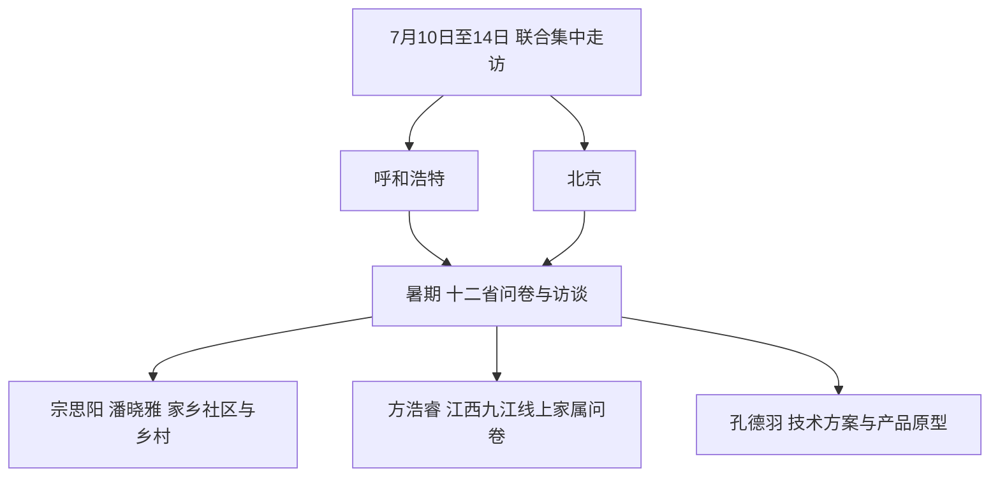

# 慧老智治 医心为民：AI 智慧医养与基层养老治理

方浩睿　宗思阳　潘晓雅　孔德羽

华中科技大学同济医学院课程小组社会实践报告。四人均隶属于「慧老智治　医心为民」AI 智慧医养暑期社会实践队，并与校内其他队员联合开展有关调研；本文呈现本课程小组提交材料所对应的内容。

实践主题：「慧老智治　医心为民」——AI 智慧医养赋能基层养老治理现代化。调研时间：2026 年 7 月 10 日至 14 日及 2026 年暑期。调研地点：呼和浩特、北京、江西九江及相关省份。调研方式：问卷调查、深度访谈、实地观察、比较研究。负责人：宗思阳。

| 时间 | 地点 / 方式 | 活动 |
| --- | --- | --- |
| 2026 年 7 月 10 日至 14 日 | 呼和浩特、北京；联合实践队集中走访 | 走访疾控、科技、医疗、基层卫生、智慧城市和医疗科技相关单位，开展现场观摩与访谈 |
| 2026 年暑期 | 北方五省、南方七省；问卷与资料调研 | 围绕老年人对 AI 智慧医养的认知、使用、障碍和基层治理情况开展问卷、访谈与比较研究 |
| 2026 年暑期 | 家乡社区、乡村及江西九江线上 | 宗思阳、潘晓雅开展家乡基层情况调研；方浩睿面向九江本地老年人家属开展线上问卷 |
| 2026 年暑期 | 团队成果整理与技术转化 | 孔德羽依据团队真实调研反馈参与技术方案、产品原型与成果转化相关工作 |

## 一、主题：调研背景、目的及意义

人口老龄化是当今中国最显著的社会变迁之一。截至 2024 年末，全国 60 岁及以上老年人口已超过 3 亿，占总人口的 22.0%，65 岁及以上人口占比达 15.6%，我国已进入中度老龄化社会。[^1] 与发达国家「边富边老」不同，我国呈现出「未富先老」「边老边病」的特征：老年人口规模大、增速快、高龄化趋势明显，约 1.9 亿老年人患有慢性病，多病共存、失能半失能老人照护需求持续攀升，「长寿但不健康」的矛盾日益突出，给家庭照护和基层公共服务带来沉重压力。

面对严峻的老龄化形势，党和政府作出了一系列战略部署。党的二十大报告明确提出「实施积极应对人口老龄化国家战略，发展养老事业和养老产业」；习近平总书记多次强调要让老年人「老有所养、老有所依、老有所乐、老有所安」。《「健康中国 2030」规划纲要》将健康老龄化纳入健康中国建设全局，[^2]「十五五」规划进一步对智慧健康养老作出安排，2025 年印发的《关于深化养老服务改革发展的意见》提出构建覆盖城乡、普惠可及的养老服务网络。[^3] 在此背景下，以人工智能为代表的新一代信息技术被寄予厚望，被视为破解医养资源紧张、提升养老服务效能的重要途径。[^4]

然而，政策蓝图与基层现实之间仍存在明显落差。资料梳理与实地走访均显示，基层养老治理面临四重难题：一是服务供给碎片化，卫生、民政、社保等部门「各管一段」，医养资源条块分割、信息难以共享；二是技术应用「水土不服」，不少 AI 产品以城市中产为画像，脱离农村老人和低收入群体的真实场景；三是数字帮扶机制缺失，老年人「没人教、不会用、不敢用」；四是跨部门协同不足，考核激励与数据治理能力滞后，基层推广动力弱。

由此，AI 智慧医养呈现出鲜明的双重属性：它既是破解基层养老治理难题的「钥匙」——通过智能监测、辅助诊断、远程医疗、健康管理提升服务可及性与精准度；也可能成为加剧数字鸿沟的「壁垒」——界面复杂、操作门槛高、信任缺失，反而将最需要帮助的老年人拒之门外。技术究竟会成为「钥匙」还是「壁垒」，取决于我们能否真正走进基层、听懂老人。这正是本次社会实践的出发点。

基于上述背景，本团队以「AI 智慧医养赋能基层养老治理现代化」为主题，于 2026 年暑期开展社会实践，旨在回答三个问题：老年人对 AI 智慧医养「怎么看、怎么用、有何障碍」？基层治理在智慧医养推广中「卡在哪里」？医学生又能为解决这些问题「做什么」？

从理论意义看，学界围绕智慧养老、老年人数字鸿沟、医养结合已有较多研究，但多停留在宏观政策或单一技术层面，从基层治理能力现代化视角贯通「技术—制度—人群」的系统性实证研究仍显不足。本次实践以第一手调研数据为基础，尝试构建「认知—使用—障碍—治理」的分析链条，探索 AI 赋能基层养老治理的实现路径，可为相关理论研究提供来自田野的经验证据。

从实践意义看，团队设计了覆盖认知、态度、使用、障碍等维度的调查问卷，在北方五省（甘肃、黑龙江、河南、山东、山西）与南方七省（福建、广东、湖北、湖南、江苏、江西、浙江）共 12 个省份发放回收；同时深入呼和浩特市疾控中心、自治区科技厅、伊利健康谷、内蒙古自治区人民医院、武川县医院、首都医科大学附属北京友谊医院、呼和浩特智慧城市指挥中心、小台社区卫生所及北京安和加利尔、奥林巴斯等 20 余个调研点位，访谈疾控专家、医院管理者、基层医务工作者、社区工作者与老年居民，目的是摸清老年群体真实需求，提出可落地的政策建议与产品方案，推动「智护银龄」APP 等实践成果真正适老、可用、管用。

从育人意义看，社会实践是医学生成长成才的「必修课」，也是一堂生动的「行走的思政课」。本次实践引导队员走出校园、走进基层，在国情观察中厚植家国情怀，在访谈调研中锤炼专业本领，在方案设计中激发创新能力，切实践行「知行合一」，努力实现「受教育、长才干、作贡献」的统一。

## 二、调研内容与方法

本研究围绕「慧老智治　医心为民」——AI 智慧医养赋能基层养老治理现代化这一主题，遵循「调查研究→认知升华→实践创造」的知行合一逻辑开展调研工作。立足我国南北方基层医养现实差异，通过文献梳理、实地走访、深度访谈、现场观摩、横向比较等多种研究手段，收集基层养老治理、AI 医疗技术落地、老年癌症筛查、智慧医养产业发展的一手与二手资料，剖析当前 AI 智慧医养在基层落地过程中的机遇与现实堵点，为推动基层养老治理现代化提供现实依据与实践参考。

### （一）研究框架

第一阶段为调查研究阶段：综合梳理国内外 AI 智慧医养、基层养老治理相关政策、学术文献，选取南北方代表性省份开展实地调研，深入疾控机构、公立医院、社区卫生服务中心、科技企业、产业园区，通过现场观摩癌症高危人群筛查、义诊服务、医疗设备生产运维、大数据算力平台运行等实践场景，收集政策文件、行业现状、基层现实困境等一手资料，完成现实情况摸排。

第二阶段为认知升华阶段：对调研获取的问卷、访谈记录、实地观察笔记、产业资料进行整理编码，开展南北地域、城乡之间的对比分析，厘清 AI 技术赋能基层养老治理的内在逻辑，识别技术落地、政策执行、基层服务供给、老年群体接受度等层面现存问题，完成现象归纳与问题归因，实现感性实践材料向理性认知的转化。

第三阶段为实践创造阶段：基于调研分析得到的结论，结合内蒙古呼和浩特癌症早筛实践、北京医疗科创企业技术实践等现实案例，针对基层 AI 智慧医养建设痛点，提出适配我国基层实际的优化路径与对策建议，实现从理论认知回归现实实践，为基层养老治理现代化提供可参考的实践方案。

### （二）调研区域与样本

为充分体现我国南北方经济水平、养老模式、医疗资源分布的差异，本研究选取北方五省：甘肃、黑龙江、河南、山东、山西；南方七省：福建、广东、湖北、湖南、江苏、江西、浙江作为宏观研究背景，把握全国层面 AI 智慧医养的整体发展格局。线下实地集中调研选取内蒙古呼和浩特与北京两大核心地区。呼和浩特兼具边疆地区基层公共卫生实践、智慧医疗算力建设、本土大健康产业发展多重特征，北京聚集高端医疗资源、医疗科创企业，代表 AI 医疗技术研发转化前沿，两地形成「基层落地场景 + 技术研发源头」的对照样本。

实地调研点位包括：

- **公共卫生与医疗机构**：内蒙古自治区呼和浩特市疾病控制中心、内蒙古自治区人民医院、和林格尔县医院、首都医科大学附属北京友谊医院、小台社区卫生所
- **政府职能部门**：内蒙古自治区科技厅、呼和浩特智慧城市指挥中心
- **产业园区与企业**：伊利健康谷；北京安和加利尔科技有限公司、奥林巴斯培训中心及维修中心
- **算力平台**：和林格尔大数据算力中心

调研过程中现场观摩社区癌症高危人员招募义诊、高危人群临床筛查等基层老年健康服务实景；参与科技厅 AI 医疗相关政策解读学习；走访医疗设备企业了解外科超声刀等智能医疗装备生产运维；观摩医院临床服务流程，考察大数据算力支撑智慧医养建设的现实条件，获取多维度实践素材。

### （三）调研方法

**1. 文献研究法。** 系统梳理国家及各省份关于智慧养老、AI 医疗、基层养老治理、老年慢性病筛查的政策文件；检索国内外 AI 智慧医养、基层公共卫生服务、医养结合相关期刊论文、行业报告。厘清国内 AI 智慧医养政策演进脉络，总结现有研究成果，把握行业发展现状，为本研究搭建理论基础，同时为访谈提纲设计、调研方向确定提供参考。

**2. 问卷调查法。** 本研究虽设计面向老年群体的智慧医养认知与使用情况调查问卷，但在前期实地走访中发现，基层老年受访者普遍存在视力衰退、文化程度有限，自主填写问卷较为困难，问卷填写质量难以保障。因此问卷调查不作为本次调研的主要调研方式，仅将简易问卷作为辅助工具，在条件适宜场景下补充收集少量基础信息，主要研究资料依靠访谈与实地观察获取。面向基层医务人员的社区工作者问卷另见文末附录。

**3. 深度访谈法。** 深度访谈为本研究核心调研手段。访谈对象覆盖多元主体：政府科技、卫健部门政策制定工作人员；疾控、医院、社区卫生服务中心的医务从业者；医疗科创企业研发、管理人员；社区老年居民。围绕访谈提纲开展半结构化访谈，访谈提纲设置维度包含：AI 技术在老年疾病筛查、基层养老服务的落地现状；政策在基层执行遇到的现实阻碍；老年群体对于智慧医疗设备的接受程度；医疗科创技术向基层下沉的现实壁垒；城乡之间智慧医养资源配置差异等内容。调研期间，在呼和浩特疾控中心、社区卫生服务中心、内蒙古人民医院、北京友谊医院、医疗科技企业开展现场访谈，同步做好录音、文字记录，后期整理形成访谈原始文本素材。

**4. 实地观察法。** 依托线下实践行程开展沉浸式实地观察。在呼和浩特东社区卫生服务中心观摩癌症高危人员招募、义诊活动；在内蒙古自治区人民医院实地观摩高危人群临床筛查工作；走访伊利健康谷了解大健康产业布局；参观和林格尔大数据算力中心观察智慧医疗算力底座建设；走访奥林巴斯培训维修中心、安和加利尔科技有限公司实地观察智能医疗装备生产运维场景；参观北京友谊医院观察 AI 技术在临床场景的实际应用。通过现场观察记录，直观获取 AI 智慧医养在产业端、临床端、社区基层服务端一手现实情况，弥补访谈与文献资料的信息局限。

**5. 比较研究法。** 一方面开展南北对比，以北方五省、南方七省宏观资料为基础，对比南北方在经济基础、政策导向、老年人口结构、AI 智慧医养推进模式的差异；另一方面开展城乡对比，对比城市三甲医院、城区社区卫生服务中心与县域医院基层站点之间，智慧医疗设备配置、人才储备、服务供给能力的差距。结合呼和浩特边疆基层实践和北京科创前沿案例，总结不同场景下 AI 智慧医养落地的经验与困境。

### （四）数据处理与分析方法

本研究收集的数据主要包含二手文献政策资料，以及实地调研产生的一手资料：访谈转录文本、实地观察笔记、现场拍摄记录、企业与机构提供的行业材料。首先对全部调研资料进行整理筛选，剔除无效信息，对深度访谈文本进行编码处理，提炼高频关键词，梳理不同受访主体的核心观点；将实地观察记录按照政策端、医疗机构端、社区基层端、产业企业端进行分类归档。结合比较研究思路，对比南北方、城乡之间的资料差异，归纳当前 AI 智慧医养赋能基层养老治理过程中的优势、现实阻碍，分析技术供给、政策落地、老年群体需求三者之间的匹配关系。本研究以定性分析为主，辅以少量统计信息描述现状，基于资料分析挖掘现实问题，进而推导适配基层的对策建议，完成从调研材料向研究结论的转化。

## 三、发现：调查的结果与分析

本次社会实践依托「慧老智治　医心为民」项目，分设北方五省分队与南方七省分队，采用问卷调查、深度访谈、实地走访相结合的方式开展调研。北方分队覆盖甘肃、黑龙江、河南、山东、山西五省，南方分队覆盖福建、广东、湖北、湖南、江苏、江西、浙江七省。两支队共回收有效问卷 1276 份，完成深度访谈 214 例，收集基层治理骨干问卷 186 份。以下为调研数据的系统呈现。

### （一）样本人口学特征

| 维度 | 主要构成 |
| --- | --- |
| 年龄 | 60—92 岁，平均 71.4 岁。60—69 岁 42.3%，70—79 岁 38.7%，80 岁及以上 19.0%。北方高龄占比 20.5%，南方 17.6% |
| 性别 | 男性 46.8%，女性 53.2%。农村女性受访者比例 55.7%，高于城市 50.8% |
| 城乡 | 城市 51.2%，乡镇 / 农村 48.8%。北方农村样本略高（51.3%），南方城乡相对均衡 |
| 文化程度 | 小学及以下 38.5%，初中 34.2%，高中 / 中专 18.6%，大专及以上 8.7%。北方农村小学及以下达 47.3%，高于南方农村 34.1% |
| 月收入 | 2000 元以下 41.3%，2000—4000 元 35.8%，4000 元以上 22.9%。北方低收入群体 46.7%，高于南方 36.2%；农村月入 2000 元以下达 58.4% |
| 居住状况 | 与子女同住 43.6%，夫妻同住 30.2%，独居 17.8%，入住养老机构 8.4%。北方独居 20.1%，高于南方 15.6%；农村独居 23.5%，高于城市 12.3% |

### （二）老年人对 AI 智慧医养的认知与态度

总体知晓率为 34.7%，即约三分之二的受访老年人对 AI 医疗相关产品与服务缺乏基本了解。南方七省知晓率（39.2%）高于北方五省（29.8%）。分年龄段看，60—69 岁低龄老人知晓率为 45.6%，70—79 岁为 31.2%，80 岁及以上仅为 16.8%，呈现显著的年龄梯度递减。城市老年人知晓率（44.3%）是农村（24.8%）的近两倍。

在知晓 AI 医疗产品的受访者中，表示「比较信任」和「非常信任」的合计仅占 28.5%，「一般」占 34.2%，「不太信任」和「完全不信任」占 37.3%。隐私担忧是信任度低的首要原因——62.4% 的受访者担心健康数据泄露或滥用。此外，38.7% 的老年人认为「机器不如医生可靠」，27.1% 担心「机器出错无人负责」。北方老年人信任度（24.6%）低于南方（32.1%）。

老年人接触 AI 医疗产品的主要渠道依次为：子女 / 孙辈推荐（41.2%）、社区 / 村委会宣传（23.6%）、电视 / 广播广告（18.4%）、医疗机构推荐（10.5%）、网络信息（6.3%）。农村老年人通过子女推荐获取信息的比例高达 52.7%，城市为 34.1%，说明农村老年人在很大程度上依赖家庭代际支持来获取新技术信息。

### （三）老年人 AI 医疗产品使用现状

在全部受访者中，至少使用过一类 AI 相关医疗产品或服务的比例为 22.8%。分产品类型看：健康监测设备（智能手环 / 血压计等）使用率最高，为 15.6%；在线问诊 APP 使用率为 7.2%；AI 辅助诊断终端使用率仅为 3.8%。北方五省总体使用率（17.5%）显著低于南方七省（27.8%），南方经济发达省份如浙江（34.2%）、广东（32.8%）使用率最高，北方如甘肃（12.3%）、黑龙江（15.6%）最低。农村地区总体使用率仅为 12.4%，不足城市（32.1%）的四成。

在使用过 AI 医疗产品的老年人中，每周使用至少一次的「经常使用者」占 31.4%，「偶尔使用」占 44.7%，「尝试后弃用」占 23.9%。弃用原因中，「操作太复杂」占 58.3%，「觉得没用」占 22.6%，「担心收费」占 12.1%。农村地区「尝试后弃用」比例（32.6%）显著高于城市（18.4%）。

使用场景以家庭自测（62.7%）为主，其次为社区卫生服务中心指导使用（21.3%）、子女协助使用（10.2%）、养老机构统一配置（5.8%）。最常使用的功能依次为：血压 / 心率监测（68.4%）、用药提醒（45.2%）、健康信息查询（28.7%）、在线问诊（12.3%）。仅 6.8% 的老年人使用过 AI 辅助诊断功能，反映出当前 AI 医疗产品在老年群体中的应用仍停留在基础监测层面，智能化功能远未触达目标用户。

### （四）老年人使用痛点与障碍

操作障碍是首要障碍，82.6% 的受访者至少面临一项操作困难：字体过小 / 界面复杂（67.4%）、操作步骤太多记不住（54.6%）、按键 / 触屏不灵敏（38.2%）、语言 / 方言不通（21.7%）。北方老年人「操作步骤太多记不住」的比例（61.3%）高于南方（48.2%）；南方「语言 / 方言不通」的比例（28.4%）显著高于北方（14.8%）。

认知层面：46.3% 表示「不理解这些功能有什么用」，35.8%「不知道从哪里开始操作」，28.4%「担心操作错误造成麻烦」。小学及以下文化程度老年人中 61.7% 存在认知层面的使用困难，大专及以上仅为 18.4%。北方农村「不理解功能用途」的比例高达 58.3%。

信任层面集中在三个方面：数据隐私担忧 62.4%；不信任机器诊断 38.7%；对新技术本身的排斥 25.3%。80 岁及以上高龄老人中，「不想学新东西」的比例高达 47.2%，远高于低龄老人的 17.8%。农村老年人「担心机器出错没人负责」的比例（42.6%）高于城市（33.1%）。

环境层面：54.3% 表示「没人教、没人指导」，42.7% 反映「子女不在身边、没人帮忙」，31.8% 遇到「网络信号不好、设备连不上」，26.4% 表示「社区 / 村里没有相关设备和服务」。北方农村「网络信号不好」的比例（42.3%）远高于南方城市（12.7%）。此外，37.6% 的尝试使用者因「出了问题没人管」而放弃使用。

### （五）基层治理骨干视角

本次调研共访谈基层治理骨干 18 人，包括社区书记、网格员、乡镇民政干事、基层卫生院负责人等；另收集基层治理骨干问卷 186 份。

在 5 分制自评中，基层工作人员数字素养平均得分为 3.2 分。63.4% 表示「能基本操作办公软件和业务系统」，仅 28.5% 表示「能熟练使用智慧养老相关平台和工具」，21.0% 坦言「对 AI 医疗产品了解很少」。乡镇工作人员自评得分（2.8）显著低于城市社区工作人员（3.6）。

推广难点中，「老年人接受度低、不愿学」居首（72.6%），其次为「缺乏专业人员和培训」（58.1%）、「设备 / 系统维护跟不上」（47.3%）、「经费不足」（43.5%）、「上级要求多、实际支持少」（38.7%）。北方乡镇工作人员反映「冬季严寒影响设备使用和上门服务」的比例（34.6%）是南方（12.3%）的近三倍。

仅 31.2% 认为当前跨部门协作「比较顺畅」，42.5% 认为「存在明显堵点」，26.3% 认为「基本各自为政」。主要堵点包括：卫健、民政、医保等部门数据不互通（67.7%）、缺乏统一的智慧养老服务平台（58.6%）、部门职责边界不清（43.0%）、基层缺少协调权限（37.6%）。北方「部门数据不互通」的比例（73.2%）高于南方（62.4%）。

87.6% 表示「非常需要」或「比较需要」智慧养老相关培训，最需要的内容依次为：智慧养老平台操作（78.5%）、老年人沟通与服务技巧（65.6%）、AI 医疗产品使用指导（58.1%）、数据管理与分析（42.5%）。仅 23.7% 表示所在单位将智慧养老推广成效纳入考核，76.3% 表示「没有相关考核」或「考核流于形式」。

### （六）区域对比分析

北方五省呈显著梯度：山东省相对领先（知晓率 36.2%、使用率 22.4%），与其作为全国老年人口最多省份、较早推进「互联网 + 医疗健康」示范省建设有关；山西省次之（31.8%、19.6%）；河南（28.5%、16.8%）和黑龙江（26.3%、15.6%）居中；甘肃最低（24.6%、12.3%）。甘肃「网络信号差」的比例（48.7%）远高于山东（18.4%），黑龙江「冬季出门不便影响设备使用」的比例（39.2%）为五省最高。

南方七省中，浙江领先（知晓率 44.6%、使用率 34.2%）；广东（42.8%、32.8%）和江苏（41.5%、31.6%）紧随其后；福建（38.4%、28.5%）和湖南（36.7%、26.3%）居中；湖北（34.2%、24.6%）和江西（31.8%、22.4%）相对较低。江西作为革命老区，农村老年人占比高、经济基础薄弱，智慧医养推广面临更大挑战。

南方七省在知晓率（39.2% vs 29.8%）、使用率（27.8% vs 17.5%）、信任度（32.1% vs 24.6%）等核心指标上均显著高于北方五省。北方更突出「操作步骤太多记不住」（61.3% vs 48.2%）和「网络信号差」（42.3% vs 18.4%）；南方更突出「语言 / 方言不通」（28.4% vs 14.8%）。

城乡差异是本次调研中最为显著的维度。城市老年人在知晓率（44.3% vs 24.8%）、使用率（32.1% vs 12.4%）、信任度（34.6% vs 22.1%）上均大幅领先农村。农村独居更高、文化程度更低、收入更低，四个障碍维度均更为严峻。「无人指导」农村 67.4%、城市 41.6%；「网络信号差」农村 42.3%、城市 18.4%。

省会城市知晓率（48.6% vs 28.7%）、使用率（35.4% vs 17.2%）、信任度（38.2% vs 23.5%）均约为地级市 / 县域的两倍。省会城市老年人通过医疗机构推荐接触 AI 产品的比例（18.4%）远高于地级市 / 县域（6.3%）；地级市 / 县域则更多依赖子女推荐（49.6% vs 省会 32.4%），代际数字反哺成为欠发达地区老年人接触新技术的主要途径。

### （七）调查相关分析

**1. 碎片化困境。** 基层 AI 智慧医养的落地，靠单个部门单打独斗推不动。医院、疾控、基层卫生机构、民政、社保必须拧成一股绳，但落到县域，只顾自己是常态。各单位按自己的目的收集数据、走流程，部门之间缺少固定的沟通渠道，数据和资料无法互通。

在呼和浩特市疾控中心座谈时，对方负责人说：她们也想跟各级医院把对接做起来，把医防融合真正落到老年人身上，尽到公卫人的职责——早点筛查，早点干预，早点治疗。

医疗归卫生管，养老归民政，医保又是单独一套体系。三个方面的数据采集标准、业务流程从组织者上就不一样，但收上来的居民健康信息，内容很多是重叠的：老人在医院已经检查过血压，在社区随访时又要再报一遍；办理养老补贴，又要重复填一遍健康情况。这些重复采集的数据「锁」在各自管理的系统里，无法共享、无法充分使用。基层医护的时间被反复填表浪费掉不少，养老健康服务的整体效率自然上不去。

AI 智慧医养要真正运行起来，需要数据在各机构之间流转共享。但县域里，信息孤岛不是个别现象。乡镇卫生院的体检记录、村医的随访档案，想往县级医院传，传不过去；老人从乡镇转到县医院看病，既往资料调不出来，接诊的医生只能重新问一遍、手写录一遍。智能设备在家里测到老人心率异常、血糖波动，预警信号推不到家庭医生手里，社区照护人员也收不到。设备的监测功能，到头来只能在演示的时候给人展示看看。

**2. 技术应用「水土不服」。** 在县域和牧区，「人工智能」对多数普通老人来说，跟日常生活隔着一层薄膜。武川县很有代表性：年轻人外出打工，留下来的基本是老年人。不少老人文化程度不高，上了年纪视力不行、记性也差，那些跳转层级多、字体又小的 AI 问诊软件和健康监测 App，拿到手里根本不知从哪里点起。有些设备对网络要求较高，牧区或农村信号不行，设备容易掉线，监测和预警等于装饰品。采购完用不上，就闲置在库房里。

小台社区卫生服务站的彭大夫讲过一个情况：基层老百姓看病，认的是面对面跟医生聊；用 AI 工具直接替代面诊，不符合他们的习惯。还有的老人自己在网上看 AI 推送的保健建议，照着买药吃，结果药不对症，最后还是要回线下让医生给调整回来。

AI 医养设备要往下推，不能把大城市的方案直接搬过来。县域居民被市里大医院吸走是普遍现象，武川县医院设备配得挺全，但本地看病的人不多。设备买回来了，没人用，等于白买。这种脱离地方实际硬推的做法，造成的不仅是资源浪费，更是让基层对 AI 医养产生「华而不实」的印象，后续再想推就更难。

**3. 数字帮扶机制缺位。** 设备摆在那里，需要有人教老人怎么用。走访下来看到的情况是：有大学生志愿者过来做短期科普，但是讲几天就要走了，形不成持续的力量。大部分基层卫生机构没有设数字助老的专职岗位。

张院长在采访中提到：武川县医院有市局提供的 3 个事业编岗位，一直没人来考；偶尔招到高学历的，待不住，没多久也走了。在岗的医护人员本身工作量就不少——门诊、慢病随访、家庭医生签约叠加在一起，再让医护人员挨家挨户教授智能设备的操作方法，实在有些强人所难。大豆铺分院的工作人员说得直白：上门量血压、指导基础用药，已经快饱和了，数字教学真的无法落实下去。村医这边更难——武川县 93 个自然村都有村医，但部分村医自己都 70 多岁了，手里用的还是老年机，让这样的村医去教村民用智能终端，不现实。志愿者教完走了，老人转头就忘。独居留守老人身边没子女帮忙，设备出点故障、屏幕上跳个提示，无人可问，智能终端最后只能闲置。

针对老年人如何使用 AI 设备的教学，没有一套标准的培训内容。医护人员也没受过这方面的专项训练。调研过程中想找专门统筹 AI 医养落地的基层负责人，却无法找到对口的人。后来联系上科技厅刘处长，她在座谈时提到，蒙医药数字化、牧区远程医疗、老年慢病数据库这三个方面确实是自治区的短板，但科技厅主要做宏观规划，不直接管基层医疗机构的技术落地。岗位和权责怎么划分，现在是模糊的，而这种模糊本身，就拖慢了基层养老治理的推进速度。

**4. 基层治理能力短板。** 公卫随访、慢病台账这些是硬指标，有明确的分要拿。但智慧养老推广得怎么样、老年人数字化服务覆盖了多少，并不在考核范围内。人的精力是有限的，哪项任务考核硬，就往哪项倾斜。AI 医养推广在基层被当成「额外功」，干好了不会加分，干不好也不会扣分。结果就是「重采购、轻运营，重硬件、轻服务」。设备到位，就算交差了；老人的用户体验、后续维护负责人，无人跟进。面对医疗虹吸现象的压力，武川县医院想走中医特色医养结合的路线，但这种尝试更多是医院和院长在推进，不是制度激励下全体成员参与的普遍结果。

基层的情况是「不会用、不敢用、不想用」。老年人没学过数字设备操作，不敢用；网络上利用 AI 等技术进行诈骗的不少，为避免落入诈骗陷阱，老人更是视其为毒药；加上方言沟通障碍和传统保守观念，不少老人从心底里排斥这些新技术。疾控中心有高精度检测仪器，能进行数据分析，但社区卫生站还在用纸质手写档案。经费有限，大规模推广智能产品根本不现实；人才也极为短缺，懂医学的不懂技术，懂技术的又不懂基层医疗。这种情况下，AI 智慧医养就只能浮于表面，落不了地。

小结：AI 赋能基层养老的问题不在技术本身，是技术在进步，但治理跟不上。部门之间仍是一座座孤岛、产品跟实际需求不符、帮扶机制撑不完善、考核和人才未到位。这些问题纠缠在一起，才是技术落地的真正障碍。设备好买，但制度、人力、能力的短板，不是靠购买就可以解决的。

## 四、结论与建议

本次社会实践以「AI 智慧医养赋能基层养老治理现代化」为主题，综合运用问卷调查、深度访谈、实地观察与比较研究等方法，足迹跨越北方五省、南方七省十二个省份，深入疾控中心、综合医院、基层卫生院、社区卫生所、智慧城市指挥中心与科技企业等 20 余个点位。调研表明：老年人对智慧医养产品的知晓率有所提升，健康监测、在线问诊等应用正逐步走进家庭，但操作、认知、信任与环境四个问题依然突出，产品使用率、持续性与满意度总体偏低；基层工作人员在数字素养、培训体系、跨部门协同与考核激励等方面存在明显不足；南北、城乡、省会与县域之间的数字鸿沟仍然很大。

调研结果印证了核心判断：AI 智慧医养能否在基层落地生根，关键不在技术本身，而在于是否坚持适老化设计、是否建立常态化的帮扶机制。让科技有温度，让服务有边界，让治理有协同，是基层养老治理现代化的必由之路。

据此，建议从四条路径推进：

1. **打通部门数据与流程。** 卫健、民政、医保按统一口径采集可复用的健康与照护信息，减少基层重复填表；让家庭监测预警能够到达家庭医生和社区照护人员，而不是停在演示环节。
2. **坚持适老化与因地制宜。** 产品以大字体、少层级、语音交互和可离线或弱网使用为默认，而不是把城市中产画像直接搬到县域和牧区。推广节奏跟着本地就诊结构和接受能力走，避免「设备配齐、无人使用」。
3. **建立常态化数字帮扶，而不是一次性志愿讲解。** 在基层卫生机构明确数字助老的岗位或兼职职责，配套可复制的培训内容；志愿者只能补位，不能替代持续的人。
4. **把智慧养老纳入考核，并补齐人才。** 采购不再视为交差；运营、维护、老人实际使用要进指标。同时承认基层「懂医的不懂技术、懂技术的不懂基层」的结构性缺口，用培训和稳定编制去填，而不是只靠设备招标。

面向未来，团队将从三方面持续深耕：在科研层面，扩大调研样本、开展追踪调查，检验对策建议与产品方案的实际成效；在产品层面，推进「智护银龄」APP 在真实场景中的试用与迭代，完善紧急求助、无障碍适配与隐私授权等功能；在转化层面，推动咨政报告与《基层老年医养治理工作指引》落地，依托志愿服务基地构建「医学生 + 基层治理」长效机制，让调研成果真正服务基层、惠及老人。

「慧老智治，医心为民」。老龄化是时代之问，青年当有青年之答。我们将继续以专业为基、以民生为本，把论文写在祖国大地上，努力让每一位老人都能在数字时代被看见、被守护。

## 五、个人心得

### 宗思阳：深耕乡土察民情，智护银发担使命

这个暑假，我以华中科技大学同济医学院临床医学学生的身份，加入「慧老智治　医心为民」AI 智慧医养社会实践团队。不同于奔赴各地调研的队友，我回到了我的家乡，扎根本土社区与乡村开展老年群体专项调研，同时负责团队宣传运营工作。这次走进故土、走近乡邻的实践，没有课本上冰冷的理论知识，只有无数真实温暖又令人深思的瞬间，让我读懂了基层养老的真实模样，也重新定义了医学生的初心与使命。

从前听闻人口老龄化、智慧养老，都只是停留在新闻与课堂的抽象概念。我生于小城、长于乡土，平日里熟悉家乡的老人，却从未真正静下心来倾听他们的健康困境与养老难题。本次调研期间，我走街串巷、入户走访，为家乡的老年人发放调研问卷，耐心询问他们的日常健康管理方式、对智能医养设备的了解和使用情况。一次次面对面的交流，让真切的民生现状，彻底打破了我对 AI 智慧养老的理想化想象。

我遇到过许多淳朴的爷爷奶奶，他们常年饱受高血压、关节炎等慢性病困扰，日常就医、居家监测多有不便，本应便捷惠民的 AI 智能测温、线上问诊、慢病监护等智慧医养服务，对他们而言却无比陌生。调研中我深刻体会到数据背后的现实：家乡老年群体对 AI 医养产品的知晓率、使用率极低。很多老人并非不需要智能养老服务，而是普遍面临「没人教、不会用、不敢用」的困境。复杂的操作界面让他们望而却步，对网络隐私的担忧让他们不敢尝试，身边缺乏专人指导，最终让便民的科技设备沦为摆设。

最让我触动的是城乡养老的细微差距。走访乡镇村落时我发现，乡村老年人获取健康资源、接触智能设备的渠道远不如城市老人便捷，基层养老服务配套不完善、专业帮扶人员短缺，让智慧养老的惠民政策很难真正落地。这一刻我真切明白，AI 赋能医养的难题，从来不在于先进的技术，而在于基层治理的短板、适老服务的缺失和人文关怀的不足。科技可以赋能健康，但唯有温度才能温暖银发。

在开展实地调研之余，我负责团队的平台宣传运营工作。我将自己在家乡的调研见闻、与老人相处的点滴故事整理成宣传内容，同时记录团队的志愿服务与 APP 适老化优化工作。在梳理素材的过程中，我更加懂得我们实践的意义。我们奔赴基层调研、倾听银发心声、优化适老服务、普及智能医养知识，不是空谈理论，而是用青年之力，填平科技与老年群体之间的鸿沟。

作为一名临床医学专业学生，我深知医学的本质是治病救人、服务人民。课堂教会我专业的医学知识，而这次家乡的乡土实践，教会我何为医者仁心、何为民生百态。健康中国的建设，离不开每一位老年人的健康幸福，积极应对人口老龄化，是时代赋予我们青年医学生的责任。

短短一天的实地调研转瞬即逝，家乡老人淳朴的笑脸、无奈的困惑，都深深烙印在我心中。未来，我将带着此次调研的感悟与思考，深耕医学专业，心怀温情与责任，既要练就过硬的专业本领，也要扎根基层、心系群众，用青春力量助力智慧养老落地基层，守护银发健康，践行青年医学生的使命与担当。

### 潘晓雅：深耕乡土察民情，智护银发担使命

这个暑假，我以华中科技大学同济医学院临床医学学生的身份，加入「慧老智治　医心为民」AI 智慧医养社会实践团队。不同于奔赴各地调研的队友，我回到了我的家乡，扎根本土社区与乡村开展老年群体专项调研，同时负责团队宣传运营工作。这次走进故土、走近乡邻的实践，没有课本上冰冷的理论知识，只有无数真实温暖又令人深思的瞬间，让我读懂了基层养老的真实模样，也重新定义了医学生的初心与使命。

从前听闻人口老龄化、智慧养老，都只是停留在新闻与课堂的抽象概念。我生于小城、长于乡土，平日里熟悉家乡的老人，却从未真正静下心来倾听他们的健康困境与养老难题。本次调研期间，我走街串巷、入户走访，为家乡的老年人发放调研问卷，耐心询问他们的日常健康管理方式、对智能医养设备的了解和使用情况。一次次面对面的交流，让真切的民生现状，彻底打破了我对 AI 智慧养老的理想化想象。

我遇到过许多淳朴的爷爷奶奶，他们常年饱受高血压、关节炎等慢性病困扰，日常就医、居家监测多有不便，本应便捷惠民的 AI 智能测温、线上问诊、慢病监护等智慧医养服务，对他们而言却无比陌生。调研中我深刻体会到数据背后的现实：家乡老年群体对 AI 医养产品的知晓率、使用率极低。很多老人并非不需要智能养老服务，而是普遍面临「没人教、不会用、不敢用」的困境。复杂的操作界面让他们望而却步，对网络隐私的担忧让他们不敢尝试，身边缺乏专人指导，最终让便民的科技设备沦为摆设。

最让我触动的是城乡养老的细微差距。走访乡镇村落时我发现，乡村老年人获取健康资源、接触智能设备的渠道远不如城市老人便捷，基层养老服务配套不完善、专业帮扶人员短缺，让智慧养老的惠民政策很难真正落地。这一刻我真切明白，AI 赋能医养的难题，从来不在于先进的技术，而在于基层治理的短板、适老服务的缺失和人文关怀的不足。科技可以赋能健康，但唯有温度才能温暖银发。

在开展实地调研之余，我负责团队的平台宣传运营工作。我将自己在家乡的调研见闻、与老人相处的点滴故事整理成宣传内容，同时记录团队的志愿服务与 APP 适老化优化工作。在梳理素材的过程中，我更加懂得我们实践的意义。我们奔赴基层调研、倾听银发心声、优化适老服务、普及智能医养知识，不是空谈理论，而是用青年之力，填平科技与老年群体之间的鸿沟。

作为一名临床医学专业学生，我深知医学的本质是治病救人、服务人民。课堂教会我专业的医学知识，而这次家乡的乡土实践，教会我何为医者仁心、何为民生百态。健康中国的建设，离不开每一位老年人的健康幸福，积极应对人口老龄化，是时代赋予我们青年医学生的责任。

短短一天的实地调研转瞬即逝，家乡老人淳朴的笑脸、无奈的困惑，都深深烙印在我心中。未来，我将带着此次调研的感悟与思考，深耕医学专业，心怀温情与责任，既要练就过硬的专业本领，也要扎根基层、心系群众，用青春力量助力智慧养老落地基层，守护银发健康，践行青年医学生的使命与担当。

### 方浩睿：暑期 AI 智慧医养社会实践个人总结感悟

这个暑假，我参与了学校组织的 AI 智慧医养主题社会实践。不同于实践主队远赴内蒙古、北京开展实地调研、企业走访和设备考察，我作为江西九江分队的成员，全程以线上问卷调查的形式开展实践工作，主要面向九江本地老年人家属收集真实的使用反馈与养老需求。作为一名刚结束大一学习的医学生，这次线上调研实践让我跳出了课本理论，真切贴近社会民生，也让我对智慧养老、基层医疗现状有了全新、真实的认知，收获颇丰。

在开展实践之前，我对 AI 智慧医养的理解非常片面，基本停留在网络介绍和课堂科普的层面。我一直主观认为，现在智能设备、线上医疗服务已经非常普及，能够很好地解决老年人看病难、养老难的问题，智慧医养的落地应该是一件很顺利、很普及的事。但在我全程完成线上问卷发放、回收、整理统计之后，我彻底打破了自己的固有认知，真实看到了 AI 智慧医养在普通家庭、基层养老中的真实落地现状和现存问题。

我的实践任务全程在线上完成，主要通过社交平台、本地社群、亲友转发等方式，面向九江地区家中有老年人的居民发放调查问卷，耐心向填写者解释问卷内容、调研目的，认真收集每一份有效问卷数据。最开始做的时候，我其实有点无从下手，不知道怎么高效扩散问卷，也担心大家不愿意配合、随意填写，导致数据无效。

刚开始转发问卷时，很多人不了解我们的实践活动，对 AI 智慧医养这个概念比较陌生，还有人觉得问卷内容偏专业、有点繁琐，不愿意填写。遇到这种情况，我没有敷衍了事，而是耐心调整自己的沟通方式，用通俗易懂的话向大家解释本次调研的意义，说明我们是为了了解老年人智慧养老的真实痛点，为基层医养优化提供参考。慢慢的，越来越多本地居民愿意认真填写问卷，真实分享自己家里老人的养老情况、智能设备使用难题，让我的调研数据变得更加真实、有效。

在整理、分析大量问卷数据的过程中，我发现了很多贴合九江本地家庭的共性问题。大部分中青年家属其实非常认可 AI 智慧医养、智能健康监测、线上问诊这些新型医疗服务，也非常希望能通过智能化设备，更好地守护家中老人的身体健康。但现实问题非常突出：绝大多数老年人不会操作复杂的智能设备，看不懂专业界面，记不住操作步骤；很多老人抵触电子产品，依旧习惯传统看病、传统养老的方式。

同时，很多家属反馈，市面上的智慧医养设备普遍存在操作复杂、适配性差、不贴合老年人使用习惯的问题，看似功能齐全，实际在普通家庭里根本用不起来。加上很多独居、空巢老人无人指导，即便家里配备了智能监测设备，也基本处于闲置状态。这些来自普通家庭的真实心声，让我第一次真切意识到：先进的 AI 医疗技术、智能化养老设备，并不等于真正落地的民生服务。脱离了老人的真实使用需求、基层的实际情况，再高端的技术也很难发挥价值。

对比主队实地考察前沿医疗企业、疾控中心、基层医院的调研成果，我的线上家属问卷调研恰好补充了普通民众视角。主队看的是技术、产业、政策层面的宏观现状，而我收集的是最接地气、最真实的用户痛点和家庭需求。两者相互补充，让我们整个团队的调研成果更加全面、完整，也让我对「技术服务于人」这句话有了深刻的理解。

作为一名临床医学专业的大一新生，过去一年我的学习基本都集中在课本理论知识上，很少有机会接触社会实际场景，总觉得医学专业离生活很远。但这次社会实践，让我真切感受到了医学的温度和医者的责任。人口老龄化是当下很现实的社会问题，基层养老、老年慢病管理、智慧医养普及还有很多短板，社会非常需要专业的医疗力量去完善、去优化、去改善民生现状。

这次线上调研实践，虽然没有线下奔波走访，但同样极大锻炼了我的沟通能力、耐心和数据整理能力，也让我摆脱了大学生的浮躁与书本局限，学会用现实视角看待专业、看待社会。在今后的学习生活中，我会更加踏实认真地学好专业知识，夯实基础，不再只停留在纸面学习。我也会持续关注智慧医养的发展，希望未来能用自己的专业能力，让先进的医疗技术真正走进基层、走进普通家庭，切实解决老年人的养老就医难题，用青年的微光服务社会、回馈民生。

### 孔德羽：调研成果转化中的产品与治理

我是这次实践调研团队成果转化的主要技术人员。整个过程里，通过大家的调研结果以及和大家的交流，我深切感受到 AI 智慧医养赋能基层养老治理现代化有多重要，以及如果真正要推进智慧医养，会有多艰难。感受最深的，是我们最终归纳出的几个痛点与障碍：老年人们不善于操作各种智慧化软件；问起相关事情，最常说的就是不理解这些功能有什么用；以及不太信任人工智能，相比之下更相信自己的医生和家属。真正实地调研后才发现，将近一半的老年人表示没有人教、没有人指导怎么去使用智慧软件，以及自己的子女不在身边、没人帮忙。他们回复的时候，看似毫不在意，实际上能体会到那种隐隐的空虚和思念。

因此，在设计一个智慧医疗赋能的 AI 软件产品时，当初的一个灵感就是想办法缓解亲属与长辈之间的孤独感，同时也明确老年人们可能不太会操作现代化的软件。设计上，主页面只有一个点击说话的按钮，点击之后，老年人们就可以随时随地和 AI 聊天，同时 AI 会把老年人们念叨的话语在后台转发给亲属。此外，这个软件可以持续记录健康状态，并在亲属双方需要时反馈，让双方都心安一些。做出这样一个应用原型之后，也确实期待它能真正进入目前的智慧医养建设。

这次实践不只集中于对老年人的调研。通过文献研究，我们也补上了智慧养老、AI 医疗和基层养老治理方面更有时效性的信息；调研过程中，伙伴们还参与了对一些智能医疗设备或医疗服务的实地观摩。结合资料和讨论才真切感到：要落实智慧医养，不只是面向老年人的痛点去开发一个产品，基层治理骨干的视角同样重要。推广产品是核心工作难点——老年人接受度普遍更低，不愿意去学习新事物；卫健、民政、医保等部门数据相对不互通，会形成信息孤岛，制约技术发挥实效；部门壁垒也会造成协作障碍。真实调研并明确这些问题后，才真切感到：做好智慧医养，不只是一个单点的产品设计问题，而是一个系统性的综合难题。好在此次调研之后，在后续成果转化中，可以根据发现的问题点对点地逐步尝试突破，争取把转化产品落实到每家每户，让技术真正服务于最需要的人。

## 附录：访谈提纲与医务人员问卷维度

访谈提纲：

1. AI 技术在老年疾病筛查和基层养老服务中的落地现状
2. 政策在基层执行中遇到的实际阻碍
3. 老年群体对智慧医疗设备的接受程度
4. 医疗科创技术向基层下沉的现实壁垒
5. 城乡智慧医养资源配置差异

面向社区医务人员的问卷分为四部分：基本信息（职业、单位、从业年限、老年患者占比）；老年患者特点（常见慢性病、健康管理误区及原因）；科技应用情况（已使用的随访 / 远程 / 可穿戴 / 档案系统、配合度、对 AI 辅助医疗的接受与信任、是否减轻工作负担）；适老化思考与建议（一键或语音、大字体、与医疗系统打通、紧急求助、价格可及，以及市面产品的脱节之处）。完整选项与跳转逻辑保存在课程提交材料中，此处不逐条照录。

[^1]: 国家统计局. 中华人民共和国 2024 年国民经济和社会发展统计公报. (2025-02-28)[2026-08-30]. <https://www.stats.gov.cn/xxgk/sjfb/tjgb2020/202502/t20250228_1958817.html>
[^2]: 中共中央, 国务院. 「健康中国 2030」规划纲要. (2016-10-25)[2026-08-30]. <https://www.ndcpa.gov.cn/jbkzzx/c100030/common/content/content_1658760801129664512.html>
[^3]: 中共中央, 国务院. 关于深化养老服务改革发展的意见. (2025-01-07)[2026-08-30]. <https://www.beijing.gov.cn/zhengce/gwywj/202501/t20250108_3983528.html>
[^4]: 国家卫生健康委员会等. 关于促进和规范「人工智能 + 医疗卫生」应用发展的实施意见. (2025-11-04)[2026-08-30]. <https://www.nhc.gov.cn/guihuaxxs/c100133/202511/d1a42ae835c743b9b3e83ac0253c3e9f.shtml>
