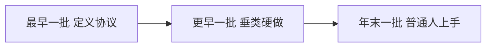

# 7 月 28 日：把 AI 编程的信息差说清楚

这是第一天正式复盘。最近事情又多、价值又大，此刻才算能静下来回头看。树林直播里刚说睡眠很重要，所以想到哪说到哪——睡前这些话，首先是说给自己听的。

明天早上第一件事，是兑现承诺。假期里欠了一年的事，我也在逐步补上。问心无愧这件事，比把话讲得漂亮更要紧。一直想跟大家整理的，是 AI 编程这边的信息差：先从大处讲，再垂到很前沿、甚至能接上商业化的那一层。我商业化不行，但那些接点我摸到过。运气和缘分都算好，遇到过这个领域真正的前辈；黑客松也特殊，小比赛和 AdventureX 这种全国最大的场子，本质不同，国内和国外也不同。

## 我为什么觉得自己有资格讲

要在一个方向做得很垂、往前推得很大，换别的赛道未必有这种机遇。这也和性格有关。原生家庭给我一套保护机制：过去有过很深的孤独、不被认可、不满。遇事我很冷静，愿意分析。不是没有情感，而是情感大多建在理论分析之上。除去怕黑、没有安全感那种生理性的恐惧，其它情绪很平。这不是一件好事情，但它让我能很理性地看清东西。

我希望至少从理性这个角度回馈身边的人。问题我也知道：未来还是要逐步放开自我、多多社交，以前社交太少。接触到前沿，等于站在边界上；再往前，就要通用的方法论。树林这些课，最大的价值一个是从 0 到 1——踏出舒适圈的门槛非常大，收这个钱是有价值的。第二，你真的在某个领域钻到很垂、很前卫，就需要商业化知识。我完全没有商业化，研究完也白扯；一旦遇到有商业知识的人，这层就变得极重要。树林传达的许多普世方法论，对各个方向都有帮助。

林子哥从 0 到 1 肯定是对的，但我认为他缺从 1 到 10 的那一段。AI 时代在垂直板块里，商业化和语言极强的人，会把自己专业推到极致；林子哥最不擅长的是技术。走技术这条路，必须理解相关专业知识。我只在 AI 编程方向有一点理解，也见过一些人，所以才觉得有资格跟大家科普：存量开发也好，软件、网站、服务类创业也好，哪些从 0 到 1 最重要、要注意什么、最前沿可能长什么样。

这个时代很特殊。大部分学专业的人其实不会用 AI；大部分会用 AI 的人又没有专业知识。一个普通人、非专业学生，要走在这个领域前列，网上那些老师基本教不到这一层。信息差的性质特殊，又特别适合我们这类非专业人士。若还想做出很垂、甚至能申请到专利的东西，专业性就更重要。我说得很抽象，有实践的人大概能 get 到；没有的话，听完也不懂。语言能力是我的短板，时间大多放在开发上。

## 三批人

我自认是最早一批非专业人士里接触 AI 编程的：大约去年年末，工具已经有一定成熟度。比这更早的一批，工具还不成熟，没有专业知识根本做不了项目，大概是去年中旬。再往前，是研究这个方向一两年的专业人士，我认为那才是「最早」——发明工具、定义协议、把边界往外推的人。最早、更早、年末，叫法别扭，时间线是清楚的。

最早那批人想得到的东西，往往就代表这个时代。举个例子，Anthropic 他们就是最早那一批。编程工具的壳做出来之后，他们认为可以把用户做事的经验按规范格式总结，用一套通用协议再喂回工具——有点像把 SOP 推广开。后来这套定义叫 Skills。MCP 也是他们定义的，sub-agent、Agent Team 也是。他们掌握全套知识，还在最前沿往外推。他们说的东西，就是在定义这个方向。

更早那一批，我有幸认识过那么几个。地球上尤其是中国，凤毛麟角。他们清楚自己的定位，研究极深，带着专业知识；那个时代工具不成熟，普通人根本用不了。他们大多更年轻，大学生或博士生，极具创新性，更能从生活里发现需求，再借助大模型做垂类项目。通用编程工具发明之后，只能解决通用的事，垂直的赋能要人去做。最早做垂类的人，观测下来收益最大、机遇更多。AI 医疗我商业化了解不多，不敢乱讲。更简单的例子：大语言模型刚成熟时，学习软件里接入 AI 还很新，现在已经被玩烂了。再简单一点：录音之后自动出纪要，那个时候没有，因为模型刚具备总结能力。一个事物刚出来，还没有下沉到各行各业，你只要做那个项目，机遇是明确的。商业我仍不了解。最早做 AI 医疗的一批，后来很多干没了；海螺视频也曾是最早的 AI 视频平台之一，现在人们更多用即梦。商业真的非常重要。我目前还是搞技术，这块太缺。

到了去年年末，AI 编程真正开始成熟，普通人也可以上手，简单的垂直工具很容易被做出来。再到今年这两个月，Codex 的长程任务出来之前，让咱们现在闲鱼这边这些技术人员去做一个网站，我直说：根本做不了。在 GPT-5 和 Claude 4.5 / 5.6 级别、至少 5.5、或者 Opus 4.7 以上出来之前，也做不了。现在模型能力大幅提升，连决策都能做，你只需提供最原始的最终目标，简单小项目就不是问题。

## 接单这段窗口，以及为什么还要学

所以我才想让大家记住：至少最近这一两个月，闲鱼还能接到单，要珍惜。年末之后竞争会很激烈。只接小单再想接一两千、甚至全站，有 AI 其实都简单，难的是交付时间和打磨。像陆云飞那个项目，制作一天够了；每个板块若要策划前端和安全，可能各要一两天。做出来简单，不了解专业知识就无法打磨。前端优化还好，安全策划很多人很难保证，非常危险。

我个人认为，现在就该以项目为导向去学专业知识。想走前一阶段这条路，学习真的变简单了。我也是非专业，最近才开始了解算法。游戏里每一个机制背后是一群数学公式。学校《算法导论》里将近几百个模型，常常不只是简单计算，会碰到微积分、线性代数，没有很深的数学基础很难硬啃。不了解这些，你很难在完全不抄别人的情境下做一款游戏；真去学一门语言，周期也要一两个月甚至更长。有 AI 就不一样：你不必会写，看一遍，知道有这个东西、它干什么，就够了，AI 可以帮你构建代码。

那为什么还要了解？若想在这个领域走到很深、很前沿，必须了解更普遍的需求和更本质的东西，从第一性原理出发：都有什么样的工具，本质在哪里，做什么能连接生态、对未来有明确需求。做 AI 项目，本质还是偏垂类。通用型有前途，但一定会被大厂做；垂类很有价值；还有一类介于两者之间——未来每个人都需要，现在没被发现，或没有更好的通用物去替代人们用得不顺手、却懒得换的东西。不了解专业知识，你 get 不到这些。

我认识一两位更早那批里成就很大的人，差不多是知名博士，岗位可以随便选。他们在做的几个项目，是那种做出来需求会铺天盖地涌向每个板块、不了解底层原理连意思都听不懂的东西，架构要从底层分析。这个时代更适合以实践为导向：做项目，简单了解基层原理，理解了就在一线用。不用会写代码，那太浪费时间。现在赶的就是时间。

垂直项目要打磨到极致，讲好趋势，做好前端设计和用户交互。这些若都展开，几个小时都不一定说完，明天还有工作。思路也还在总结中，很难很清晰——这也是我的问题。

闲鱼接单一定要学专业知识，不能全程让 AI 做。过渡期至少要学安全，还有很多端侧的东西。没有专业的端测验收，你甚至不知道功能本身好不好使。很多 bug 不是做完点一点就测得出来的：部署到生产环境第一天没事、第二天凉了，要靠实践经验。现在这个阶段，经验就是在给你们补。对接企业或初创，做完崩了对方也许暂时不管，隐患还在：安全、功能缺失、交互奇差、前端奇差，都要在项目里迭代。还要了解边界在哪里。省 token，就不能只用 Codex。Codex 可以做，但你若具备一些专业知识，就能用更低成本的订阅做到更好的效果，也大幅省时间。MCP、Skills、harness，这些必须了解。判断对了，能省大量时间。就拿我那个网站：三个月前接，可能几天甚至一周；现在一天能做完，第二天迭代前端和交互，再留三四天做安全，再加上端测和细节。

## 你要问 AI，至少得懂 Codex 的本质

有问题就问 AI。不了解的时候，至少得了解 Codex 的本质。做智能体项目更是如此。树林是从通用类型、底层原理、更大范围去深入，知道为什么要用 AI。我是技术人员，知道 Codex 本质是什么：它能组合工具，能调命令行操作电脑，能找到任何一个软件的源码并分析，甚至——说句不好听的——本地付费软件也能被它拆开。不要去破解软件。

我知道它能调搜索，也知道差的模型、没有特化好的模型为什么搜索会有巨大幻觉，不同软件搜索的本质和知识库怎么建。明白这些，才明白为什么有问题要问 AI。软件装不下来，为什么要让 Codex 帮你装？因为它能调用工具、分析源码、看到问题在哪。一个软件不只依赖自身，还跟版本号、下载途径、路径、架构有关：ARM 还是 Mac，是不是 Windows，系统有没有更新，和其它软件冲突，要不要重启，内存、缓存、硬盘，都可能有关。这些你自己排查，就算问一个有钱人他也做不到，因为他根本不知道你电脑长什么样。这时才需要能调用工具的 Codex，综合判断。学一个知识，要对一个领域有很深的理解，是类似的道理。

现在大部分人用 AI 做出来的东西，都还是信息差。说明书级的信息差也没有问题。最重要的是：从 0 到 1 迈过去之后，要真的瞄定一个方向钻下去，抓住窗口，在这个方向变强，再结合经验做出有用的东西。

后面这些不成体系，但我认为有价值，可以丢给 AI 分析。还要强调：一定要了解技术原理。很多人玩 OpenClaw（口语里的小龙虾）之类的软件，互相套、互相绑，很正常，但不要只停在这里。调几个 API、几个软件连几个模型、做一套自动化，都还很基础。往上走，是信息怎么传递，多次调用、分流、提炼，更深入地迭代，做成完整体系；每一步架构怎么优化，系统提示词怎么规定，不同板块能不能拆成不同任务、交给不同模型，省 token。每一点都能研究得很细。

## 创业、黑客松，以及德不配位

网站做完、现在能赚到钱之后，很重要的一点是掌握全栈开发。有了能力，再按自己的需求做产品，叠上树林讲的商业化知识，才有机会真的拿产品去创业。社群运营我自己还没有，实力也不好，但一定有人学得好。结合审美——审美真的非常重要——交互足够友好，用户才更愿意用你的东西。明确需求，至少让 AI 赋能自己的生活；再明确需求，做自己的项目并尝试创业。一定要尝试。

有技术之后，一定要去参加 AdventureX 这种全国最大的黑客松。普通黑客松是切磋、交流、认识人；这种全球赛体量的场子，赞助动辄几十万，投资人会派产品经理、销售、运营过来，甚至老板会来看项目，觉得好直接加微信，可能要用你的项目，也可能给你实习就业。哔哩哔哩直播赞助过我们，参赛获奖就直接给实习。通义、千问，阿里旗下的，也是这个路数。广告性质很大，但你能零距离接触很前卫的人。

我在 985，这点好处是真的。那位非常厉害的学长——更早一批、造诣很深的那种——因为我们一个学校，才愿意带我。我是非专业人士，他对我感兴趣。我这才知道，真正会用 AI 的专业人士很少，所以他才重视我。我在 Codex 这方面确实有一定了解。我以前没有给自己定位：即使强如他，也觉得这一年探索仍有许多经验要沉淀。我当时以为大家都会，没想到很多人不知道。信息差真的很重要，整理出来也是回馈。

千万不要以为帮人接了程序员的活就很厉害，就可以不学专业知识。不要傲慢。更重要的是明确自己：赚的是信息差的钱，是德不配位。应该去补相关知识，分析自己为什么能代替那些人接项目——是 AI 的功劳，是时代的功劳。要有清晰的定位。

我能接触到这种顶尖的人，是因为同校，也因为自己做过一些事。他在运营社群，基本是学校最顶尖的那一档，能联合武大、华科办联合社团，对接科技园、孵化园，对接很厉害的前辈和投资人。人脉很大程度上来自专业知识的造诣、学习的劲头、或独到的见解。开发方向有自己的文化：越厉害的人越谦虚，绝对不会说自己是大佬；交流问题时很认真。计算机比较特殊，我们直接对接真正的软件，更有机会见到投资人和合伙人，他们能给包容和支持。

在这个方向一定要走得很垂。我以前以为打穿一个点只是技术问题；现在才反应过来，过程中会遇到比你强得多的人，也会遇到机遇，这些人和机遇会带着你以更快的斜率往前。这非常重要。

## 穷，以及手头的东西

我自认为对这个方向有一定了解，说的东西绝对有价值。至于穷，就别提了。参加活动，家里本来就欠着一屁股债，当然还是支持我一些。比赛要租房子，挺麻烦，兜里真没钱，剩下的仅够吃饭。

录屏分享这件事我很震撼。自己是摸爬滚打过来的。暮云分享他从零基础到一起开发，真的打动我，给他转了 200——想转 520，怕他不收。剩下大约 300 给大家发红包。我现在真后悔。贫穷会搞心态：没有安全感，饭都吃不上，又挣不到钱，最近焦虑得一批。

我搞的很多东西仍偏向自己的全栈开发和创业，也有自己的事要做，想做能服务到社群的东西。比如社群管理：今天还有人问有没有低价 API 渠道，群里说过一百多遍了。我做了个微信聊天记录管理，还没验收，能帮你定向找到任何一条。我接触过 MCP，也接触过 OpenClaw，可能还要做一个网站，把咱们群里 AI 视频的知识同步上去，里面有智能体：有问题问 AI，直接帮你找到对应消息，定位到是谁发的，你可以去感谢他。

最近黑客松的项目是一个自动化生成代码视频的东西。做完之后，你们研究的那些代码视频相对都会被包进去。它不是 Codex 里的 Skill，而是一个网站、一个平台，有点像即梦，或做短片的那种平台。你不是在 Codex 里工作，是在我的网站里工作。上传文稿，文稿越长，调用的子分镜智能体越多，同时推进。分镜越多，别人的耗时成倍增加，我的时间几乎不变，可能永远是四五分钟、七分钟一条。网站可以接入你们的 Skills，你们做出什么风格，它就能生成什么风格。某个分镜不满意，直接跟 AI 说只重做这一个，不影响最后导出。垂类的可怕之处就在这里：它会在非常垂直的点上替代通用方案。有技术的话，还是建议去了解。真做出这样的项目，以前搞的那些不是没价值，而是相对会被收进垂直方案里。

进社群时名字后面要备注要干的事，目标就是找到自己的方向。AI 时代大有希望，但一定要在某一个领域研究很深。明天早上不一定能按刚才说的把那些东西整理完，最近太忙：手头这个自动化代码视频，以及和学校那位前辈类似半实习的工作——他有些项目，未来对某些方向会很重要，不能再具体说。学长其实希望我们互相交流、提供平台、同时推进他的项目。算实习又不算，他说真当实习就会要求更严，他更希望我们自由发挥。他还有很多新的社群运营理念，结合 AI 时代，我觉得很有道理，也真的太厉害。

树林说了，睡眠很重要。今天先到这里，早点休息。
