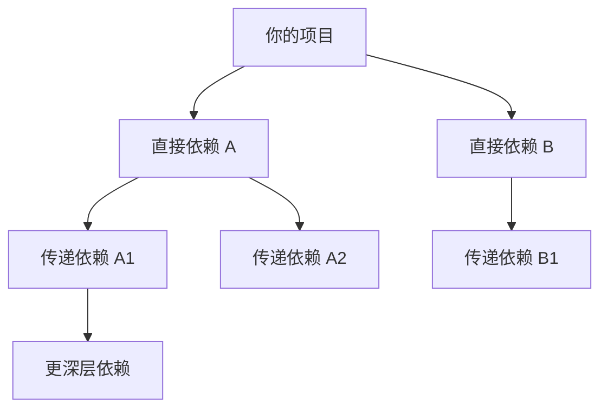
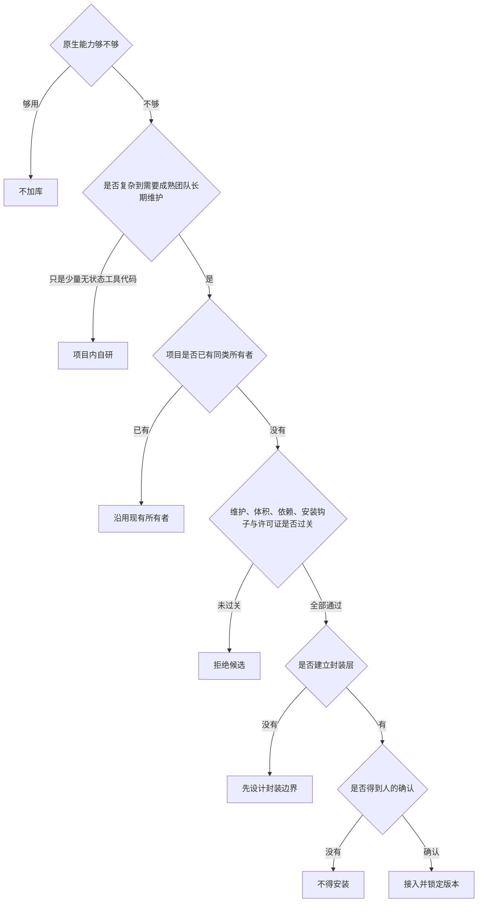

# 组件库、依赖与 AI 编程：一份真正从零讲起的完整指南

<html-embed id="interactive-handbook" src="./embeds/interactive-handbook/index.html" title="组件库、依赖与 AI 编程：完整交互版" height="620">
如果交互预览没有加载，可点击卡片右上角的「打开」进入完整页面；下方仍提供适配本站目录、划词注释和导出的完整正文。
</html-embed>

<aside-note id="reading-modes" kind="addon" title="两种阅读方式">
上方完整 HTML 保留了原始视觉、搜索、滑杆与点选演示；下方是适配本站目录、划词注释、Agent、搜索与导出的富文本正文。交互版内的文字不参与站内划词注释，如需批注，请在下方正文选择对应内容。
</aside-note>

<aside-note id="source-scope" kind="addon" title="资料口径">
本文沿用原稿截至 2026-08-30 的包数量、安全事件、研究比例、性能数据与库状态；这些数字不在本轮联网刷新。选型地图中的品牌只是解释性示例，不是永久推荐清单。
</aside-note>

> 这份文章写给“会用 AI 写代码，但没有系统学过软件工程”的人。每个新概念先用大白话和比喻讲透，再补上可以用于交流与检索的专业术语。

## 引言：一个让人困惑的现象

先从一个真实的困惑说起。

假设你想做一个网站，上面要有一个评论区。你把这个需求告诉 AI，AI 噼里啪啦写了几百行代码，从零开始造了一个评论区：评论列表、输入框、提交按钮，全是它现写的。看起来能用，你很满意。

但如果你把同样的需求告诉一位有经验的工程师，他的第一反应完全不同。他不会立刻写代码，而是先问自己：**“这个东西，是不是已经有人做好了？”** 然后他会去搜一圈，发现评论区这种东西，全世界成千上万个网站都需要，早就有人做出了非常成熟的现成方案——接进来，一天就能上线，而且比自己写的那个考虑周全得多。

于是问题来了：为什么 AI 明明“什么都会”，却偏偏不会这个“先找现成的”的动作？自己从头写，和用现成的，到底哪个好？用现成的会不会有什么隐藏的代价？如果代价存在，那这个度又在哪里？

这份文档就是要把这一整串问题，从最底层的概念开始，一层一层讲清楚。我们分五个部分走：

- **第一部分**讲地基：什么是库、什么是 SDK、代码是怎么“借”来的；
- **第二部分**看地图：各个方向都有哪些现成的东西可以用；
- **第三部分**算账本：用现成的，好处和代价分别是什么；
- **第四部分**引入主角：AI 写代码时，在这件事上会犯哪些系统性的错，为什么会犯；
- **第五部分**给答案：把前面所有内容收拢成一套可以直接照做的方法。

## 地基：代码是怎么“借”来的

### 先想清楚一件事：程序员的日常，其实是“组装”

很多没写过代码的人想象中的编程，是一个人对着黑屏幕，从第一行开始，一个字母一个字母地把整个软件敲出来。

真实情况完全不是这样。**现代编程更像组装电脑，而不是从沙子里炼硅片。** 你想装一台电脑，你会去买 CPU、买内存条、买显卡、买机箱，然后把它们插在一起——你不会自己造一块 CPU，因为造 CPU 需要一个国家级的产业链。写程序也一样：你的程序里，真正由你亲手写的代码，往往只占很小一部分；剩下的绝大部分，都是“买来的零件”——只不过软件世界的零件大多是免费的，“买”其实是“拿来用”。

为什么行业会演变成这样？因为软件里有大量的问题是**所有人都会遇到的重复问题**。比如“把一个日期显示成‘2026年8月29日’这种格式”、“检查用户填的邮箱像不像一个邮箱”、“做一个点了会有反馈的按钮”。这些问题，全世界几百万程序员每人都遇到过。如果每个人都自己解决一遍，等于全人类把同一道题做几百万遍——这是巨大的浪费。所以很自然地，就有人把自己的解法打包分享出来，别人直接拿去用。日积月累，软件世界形成了一个庞大的“公共零件仓库”，几乎你能想到的所有常见问题，里面都有现成的、被千锤百炼过的解法。

<aside-note id="source-note-1" kind="addon" title="术语：库、代码复用、重复造轮子">
把别人写好、打包好、可以直接拿来用的一批代码，统称为“ 库 ”（Library）。使用库来搭建自己程序的做法，叫“ 代码复用 ”（Code Reuse）。而“自己从头写一个别人早就做好的东西”，行话里有个略带贬义的说法，叫“ 重复造轮子 ”——轮子已经被发明了，你又发明了一遍。
</aside-note>

### 什么是组件库？

现在把“库”这个大概念切细一点。库有很多种，我们先讲和做网站关系最密切的一种：组件库。

一个网页，拆开看是由一堆“零件”拼起来的：按钮、输入框、下拉菜单、日历选择器、弹出的对话框、数据表格、翻页器……这些零件有一个共同特点：**每个网站都要用，长得也都差不多**。你在淘宝看到的按钮和在京东看到的按钮，功能上没有本质区别。

但是——这里是关键——**做好一个“合格”的零件，比看起来难得多**。就拿一个最普通的按钮来说，一个真正合格的按钮要处理这些事情：鼠标悬停时要有视觉反馈；按下去时要有“被按下”的感觉；如果正在提交数据，它要变成“转圈圈”状态并且不能被重复点击；如果这个功能暂时不可用，它要变灰；用键盘 Tab 键也要能选中它、按回车也要能触发它（因为有些用户不用鼠标）；视障用户的读屏软件要能正确念出它是个按钮、是干什么的。一个按钮尚且如此，日历选择器、可以拖动列宽的表格，背后的细节只会更多。

所以就有团队站出来说：这些零件我们来做，做到极致，然后打包成一整套送给大家。这一整套零件不但每个都打磨过，而且**风格统一**——按钮、输入框、弹窗的圆角、颜色、间距是一套设计语言，拼在一起天然和谐，就像宜家的“整间客厅方案”，家具灯具地毯都配好了套。

用起来是什么体验？一行代码，一个成品按钮：

```tsx
import { Button } from 'antd'; // 意思是：从 antd 这套零件箱里，取出"按钮"这个零件
<Button type="primary">提交</Button> // 用它。一个漂亮、功能完备的按钮就出现了
```

第一行的 `import` 你可以读作“取货”：从某个零件箱里取出某个零件。这个动作我们后面会反复见到。

<aside-note id="source-note-2" kind="addon" title="术语：组件库、组件、UI 全家桶">
这种“一整套风格统一的界面零件”就叫“ 组件库 ”（Component Library），其中每一个零件叫一个“ 组件 ”（Component）。因为这种库一给就是全套，大家也俗称它“ UI 全家桶 ”。知名的例子：蚂蚁集团出品的 Ant Design 、饿了么团队出品的 Element Plus 、谷歌设计风格的 MUI 。
</aside-note>

### 别急，“库”其实分四种，混淆它们会出大问题

上一节讲的组件库只是库的一种。实际上人们口头说“组件库”时，经常把四种完全不同的东西混在一起。这四种东西的“体量”和“讲究”完全不同，后面讲原则时全靠这个区分，所以这里必须掰开讲清楚。

**第一种：UI 全家桶。**就是上面说的整套界面零件。特点是“成套”——它规定了你的网站长什么样。**一个项目只应该用一套**，就像一间客厅不能一半宜家风一半中式红木风，两套混用，视觉会打架，代码也会打架（后面第三部分细讲怎么个打架法）。

**第二种：领域引擎。**有些功能，已经复杂到不是一个“零件”能解决的，而是一整个“子系统”。比如“可以拖动节点、把节点连起来的流程图画布”、“能画几十种图表的图表系统”、“类似 Word 的富文本编辑器”、“网页里的地图”。这类东西像装修里的“整体橱柜”——它自己就是一个完整的复杂产品，你把它嵌进你的房子里。它和全家桶可以共存（客厅用宜家方案，厨房装整体橱柜，不冲突），但**每个领域同样只装一家**——你不会在厨房同时装两套橱柜。例子：画流程图的 **React Flow**、画图表的 **ECharts**。

**第三种：工具库。**一堆小巧实用的函数，像一盒螺丝刀和扳手。比如“把日期变成好看的格式”、“检查数据合不合法”、“数组去重”。它们不涉及界面长什么样，纯粹是干活的小工具。例子：处理日期的 **date-fns**、校验数据的 **Zod**。

**第四种：框架。**这个最特殊。框架不是零件，是**决定整个房子怎么盖的建筑图纸和承重结构**。它规定了你的代码怎么组织、页面怎么划分、数据怎么流动。所有的零件都要装在框架这个结构上。例子：**React**、**Vue**（两大主流，选一个，不可能同时用），以及在 React 基础上更进一步的 **Next.js**。

一张图记住这四种的关系和纪律：

| 层级 | 比喻 | 默认纪律 | 示例 |
|---|---|---|---|
| 框架 | 建筑图纸与承重结构 | 一个项目只保留一个主框架体系 | React、Vue、Next.js |
| UI 全家桶 | 宜家整间客厅方案 | 一个产品默认只用一套 | Ant Design、Element Plus、MUI |
| 领域引擎 | 整体橱柜 | 按需引入，但每个领域只选一个所有者 | React Flow、ECharts、TinyMCE |
| 工具库 | 螺丝刀工具盒 | 随取随用，但不要重复引入同类工具 | date-fns、Zod、lodash |
<aside-note id="one-owner-per-layer" kind="warn" title="同层重复的真实代价">
重复选择会同时增加体积、认知负担和维护成本；两个工具还可能争夺同一份状态或界面控制权。这里表达的是默认工程纪律，不是没有例外的宗教戒律：确需并存时，必须把各自领地写清楚。
</aside-note>

### 什么是 SDK？

还有一种“别人打包好的代码”，值得单独讲，因为它的出发点和上面四种都不一样。

前面四种库解决的都是**通用问题**——谁做网站都要按钮，谁都要处理日期。但还有一类需求是：**我想在我的程序里，使用某一家公司的服务**。比如：我想调用 AI 大模型来生成文字；我想用 Supabase 家的云数据库来存用户数据；我想接微信支付收钱。

这时候的难点在于：对方的服务跑在对方的服务器上，我要怎么和它对话？对话要走什么格式？身份怎么验证？出错了怎么重试？这些细节又多又烦，而且每家公司都不一样。

于是提供服务的公司会想：与其让每个客户自己研究怎么连接我们，不如我们直接把“连接工具”做好送给客户。他们会发布一个官方工具包，里面装好了：连接方式、身份验证、错误处理、每个功能的现成调用方法、外加说明书。你装上这个包，照着说明书写几行，就接通了他们的服务——完全不需要理解他们服务器内部是怎么运转的。

打个比方：你想在家吃一顿海底捞。自己研究底料配方、买几十种香料去熬，大概率翻车；而海底捞官方直接卖“自热锅套装”——底料、食材、锅、说明书全在盒子里，照着做就是官方味道。**这个官方套装，就是 SDK。**

```ts
import { createClient } from '@supabase/supabase-js'; // 取出 Supabase 官方套装里的"连接器"
const supabase = createClient(网址, 钥匙); // 连上你在 Supabase 的数据库
const { data } = await supabase.from('posts').select(); // 一行代码,查出所有文章
```

看，你完全不知道 Supabase 的服务器在哪、内部怎么工作，但三行代码就用上了一个专业级的云数据库。这就是 SDK 的价值。

<aside-note id="source-note-3" kind="addon" title="术语：SDK">
这种“由服务提供方官方发布的、用于接入该服务的一整套工具包”，叫 SDK （Software Development Kit，软件开发工具包）。它和普通库的区别在于：库解决通用问题（谁都需要按钮），SDK 解决“接入某家特定服务”的问题（只有用 Supabase 的人才需要 Supabase SDK）。我们讨论中提到的 OpenAI Agents SDK、Anthropic SDK，就是 AI 公司给开发者的官方套装——这也是为什么说“接入一个基础的 AI Agent 不需要自己从零写”：官方早把循环控制、工具调用、失败重试这些脏活累活装进套装了，你自己写反而是在重新发明一个残缺版。
</aside-note>

### 包、仓库、购物清单：零件是怎么进入你项目的

概念都认识了，现在讲“物流”：这些别人写的代码，具体是通过什么机制进入你的项目的？这一节有点像讲快递系统，枯燥但极其重要——**后面所有关于安全和维护的讨论，根子都在这套物流系统里**。

**第一环：包。**一个库要分享给全世界，得先打包。打包的内容包括：代码本身、说明书、版本号（比如 3.2.1，表示这是第 3 个大版本的第 2 次小更新的第 1 次修补）、以及一张很重要的纸条——“我自己还需要哪些别的库才能工作”（这张纸条的作用马上讲）。装好的这个标准快递盒，就叫一个“**包**”（Package）。

**第二环：仓库。**全世界的包要有个统一存放、供人下载的地方。JavaScript 世界的中央仓库叫 **npm**，里面存着两百多万个包；Python 世界的叫 **PyPI**。任何人都可以往里上传自己的包，任何人也都可以下载——完全开放。这个“完全开放”既是它繁荣的原因，也是后面要讲的安全问题的祸根，先按下不表。

**第三环：购物清单。**你的项目根目录下有一个文件，JavaScript 项目里它叫 `package.json`。它本质上是一张购物清单，写着“本项目需要以下这些包：antd 要 5.x 版本、react-flow 要 12.x 版本……”。

**第四环：管家。**你不需要自己去仓库一个个下载。有一个管家软件，你喊一声“pnpm install”（按清单进货），它就照着购物清单，去中央仓库把所有包搬回你项目里的一个文件夹（这个文件夹叫 `node_modules`，你可以理解成你家的储物间）。这个管家还负责记账：每次搬完货，它会写一张**精确到批次的收货单**（叫 lock 文件），记录实际装的每个包的精确版本。为什么要这么精确？因为你的队友、以及将来部署网站的服务器，也要装同样的东西——有了这张收货单，保证所有人、所有机器装到的是**一模一样**的版本，不会出现“在我电脑上是好的，在你电脑上就坏了”的灵异事件。

<aside-note id="source-note-4" kind="addon" title="术语：包、软件仓库与包管理器">
打包好的库叫“ 包 ”（Package）；集中存放包的地方叫“ 软件仓库 ”（Registry），如 npm、PyPI；你项目的购物清单是 package.json ；负责下载、记账、管理这一切的管家叫“ 包管理器 ”（Package Manager），如 npm、pnpm（JavaScript 世界）、pip（Python 世界）；精确收货单叫 lock 文件 。
</aside-note>

### 依赖，以及一个必须现在就种进脑子的画面：传递依赖

你的项目用了某个包，你的项目就“离不开”它了——删掉它，项目跑不起来。这种“离不开”的关系，行话叫**依赖**（Dependency）：你的项目**依赖**这个包。你亲手写进购物清单的那些包，叫你的**直接依赖**。

现在，请回忆 1.5 节里那张纸条——每个包出厂时都带着一张“我自己还需要哪些别的库”的纸条。这就引出了整份文档里最重要的画面之一：

<aside-note id="source-note-5" kind="quote" title="一个必须记住的画面">
你请了一个装修师傅进家（你的直接依赖）。结果师傅进门时，身后跟着他的三个徒弟——因为师傅干活离不开徒弟。每个徒弟又各自带了两个小工。小工们可能还有帮手。 最后你家里站了一屋子人，而你叫得出名字的，只有你亲自请的那一位师傅。
</aside-note>

这就是**传递依赖**（Transitive Dependency）：你装的包依赖别的包，别的包又依赖更多的包，管家会把这整条链上的所有包全部搬进你家——因为缺了任何一环，你请的那位“师傅”都干不了活。

这不是夸张。真实的数字是：一个购物清单上只写了 30 个直接依赖的普通网站项目，储物间（node\_modules）里实际躺着 **800 多个**包，非常正常。你以为你只是请了 30 个帮手，实际上你家里住进了 800 个陌生人。

现在先只需要记住这个画面。它会在第三部分讲安全时，以一种让你后背发凉的方式回来。


<aside-note id="dependency-ratio" kind="addon" title="演示口径">
原交互页用“30 个直接依赖，实际安装 812 个包”把传递依赖摊开给人看。这是按示例比例生成的示意，不是对任意项目的实测结论。
</aside-note>

## 地图：各个方向都有什么现成的东西

地基打完了。在讨论“该不该用库”之前，得先见识一下这个世界有多大——很多人对“用库”没概念，是因为不知道能用的东西已经丰富到了什么程度。

### 先建立世界观：在成熟的工程界，“不用库”才需要理由

这句话可能和直觉相反，所以展开讲。

看看 Python 的世界。Python 是科研和数据领域的第一语言，在那里，“用库”根本不是一个需要讨论的选择，而是像呼吸一样的本能：

- 要做数学计算、矩阵运算？所有人条件反射般写下 `import numpy`。**没有任何一个人**会自己写矩阵乘法——NumPy 的底层是被优化了几十年的 C 语言代码，自己用 Python 写循环，速度慢几百倍，还容易错。
- 要处理表格数据？`import pandas`。要发网络请求？`import requests`。要做数据校验？用 pydantic。要写接口服务？用 FastAPI。

这些库“习以为常”到什么程度？招聘启事直接把它们写进岗位要求；大学教材默认你会用；论文代码开头齐刷刷的几行 import。没有人觉得“我依赖了别人的代码”有什么丢人，恰恰相反——**放着 NumPy 不用、自己手写矩阵运算的人，才会被同行投来困惑的目光**。

再举一个能让你体感“简单的事情有多深”的例子：**时间处理**。“算一下 30 天后是几号”听起来是小学数学，对吧？但真做起来：闰年二月有 29 天；“下个月的今天”在 1 月 31 号那天是几号（2 月没有 31 号）？用户在美国，服务器在中国，时区差怎么算？美国还有夏令时，一年里有两天是 23 小时或 25 小时的；还有闰秒、还有不同国家的历法……这些坑，一个普通人穷尽职业生涯也踩不完，而日期库的维护者们，已经替全世界把它们踩完了。**你用库，不是在偷懒；你是站在几十年踩坑经验堆成的高地上。**

每个语言生态都这样：Java 有 Spring 全家桶，Go 语言人手一个 gin，Rust 世界的 serde 几乎无处不在。**一批库能成为“共识”，本身就是几百万工程师用脚投票的结果。**

### 做一个网站，每个方向的“默认答案”

现在拿“做一个网站”当地图，把常见方向和每个方向的主流选择摆出来。这张表不用背，它的作用是让你**知道有这张地图存在**——将来做项目，每遇到一个功能，先来对一下：这个方向是不是早有默认答案了？

| 关注点 | 解决的问题 | 原稿中的示例选择 |
|---|---|---|
| UI 全家桶 | 按钮、表单、表格、弹窗 | Ant Design、Element Plus、MUI、shadcn/ui |
| 样式方案 | 页面外观 | Tailwind CSS |
| 动画 | 界面微动效或滚动叙事 | Motion、GSAP |
| 图表 | 折线图、饼图、仪表盘 | ECharts、Recharts |
| 节点画布 | 拖节点、连线 | React Flow |
| 白板 | 自由手绘的无限画布 | tldraw、Excalidraw |
| 富文本 | 网页里的“小 Word” | TinyMCE、Tiptap |
| 数据校验 | 检查外来数据是否合法 | Zod |
| 日期 | 时间计算与显示 | date-fns、dayjs |
| 与服务器通信 | 网页向服务器请求数据 | 浏览器原生 `fetch` |
| 云后端 | 数据库、登录、文件存储 | Supabase、Firebase SDK |
| 评论区 | 现成评论系统 | Giscus |
| AI Agent | 工具调用与多步执行 | OpenAI Agents SDK、LangGraph |
<aside-note id="native-first" kind="callout" title="永远存在的隐藏选项">
先问浏览器、语言和现有技术栈的原生能力是否已经足够。够用，就不增加新依赖。本表保留的是原稿在 2026 年 8 月的解释性示例，不是永久推荐清单；正式选型仍要核验当前版本、维护状态、体积、许可证与项目既有技术栈。
</aside-note>

请特别注意“和服务器通信”那一行的括号：**这张地图上永远有一个隐藏选项，叫“什么库都不用”**。浏览器和编程语言本身在不断变强，发网络请求（fetch）、简单动画（CSS 自带的过渡效果）、弹出层（浏览器原生的 Popover 能力），很多事情原生就能做，而且做得很好。所以后面讲决策时，第一个问题永远是：“**原生能力够不够？够，就一个库都别加。**”

### 把两个库讲透，让你体会“好库到底好在哪”

地图看过了，挑两个我们讨论中反复出现的库，放慢速度讲透。目的不是让你学会它们，而是让你**从内部体会一次**：一个被行业公认的好库，到底替你扛了什么。

#### Zod：数据世界的安检门

程序世界有一条铁律：**永远不要相信外面来的数据**。用户在表单里填的东西、别人的服务器传来的数据、AI 生成的回复——都可能是错的、缺的、甚至恶意的。用户可能在“年龄”栏填“abc”，接口可能突然少传一个字段，AI 可能返回一段格式不对的内容。如果你的程序不设防地直接使用这些数据，轻则页面报错，重则被人攻击。

土办法是手写一堆检查：“如果 name 不是文字，报错；如果 age 不是数字，报错；如果 age 是负数，报错……”每种数据写一遍，又臭又长，还容易漏。

Zod 的思路优雅得多：**你先声明“合法的数据应该长什么样”，它帮你把所有检查都做了**——像先画好一张“合格品说明图”，然后所有外来数据一律过安检门，不合格的当场拦下并告诉你哪里不合格：

```ts
import { z } from 'zod';
// 第一步:画"合格品说明图"——一个合法的用户信息长这样:
const User = z.object({
name: z.string().min(1), // 名字:必须是文字,且不能为空
age: z.number().int().min(0), // 年龄:必须是整数,且不能是负数
email: z.string().email(), // 邮箱:必须长得像个邮箱
});
// 第二步:外来数据过安检
const result = User.safeParse(外面来的数据);
// 合格 → 放行,你可以放心使用
// 不合格 → 拦下,并给你一份清楚的报告:"age 应该是数字,但收到了文字"
```

而 Zod 真正的杀手锏是“一次定义，两头受益”：这张说明图不但在程序**运行时**当安检门用，还能在你**写代码时**自动告诉编辑器“用户数据里有 name、age、email 三个字段”——你打错字段名，编辑器立刻标红。同一个东西，不用写两遍。这种“把两件麻烦事用一个漂亮动作同时解决”的设计，就是它成为共识库的原因。

<inset-card id="zod-case-takeaway" eyebrow="CASE 01" kicker="RUNTIME + EDITOR" title="Zod：一次定义，两头受益" tone="good">
同一份 schema 同时承担运行时校验与编辑器类型提示：外来数据先过安检，业务代码再获得可追踪的字段约束。
</inset-card>

#### React Flow：一张“隐藏清单”的故事

假如你要做一个“拖节点、连线”的流程编辑器（工作流工具、思维导图、可视化编程，都是这个形态）。

自己写，能写吗？能。周末花两天，画两个方块，用鼠标拖动它们，再画一条线连起来——做得出来，还很有成就感。**但“周末 demo”和“能交付给用户的产品”之间，隔着一张长长的隐藏清单**：

用户会想缩放和平移画布——你要处理缩放后所有坐标的换算；用户会想框选多个节点一起拖——框选、多选、对齐、吸附；用户手滑了想撤销——撤销/重做系统；用户想复制粘贴节点；两条连线交叉时要自动绕开；节点里要能放真实的表单（输入框、下拉菜单）；节点多到几百个时不能卡；还要支持触屏、支持键盘操作……

这张清单，事先谁也想不全，只有做的过程中被用户一条条骂出来。全部补齐，是**以月为单位**的工作量。而 React Flow 已经把整张清单打包做完了——你只需要写你产品真正独特的部分：节点里放什么内容、连上之后发生什么业务逻辑。

我们讨论中有一个真实案例把这个道理演了一遍：一个企业级项目，前期为了摸清交互，团队自己手写了画布；到了准备正式发布时，架构师拍板换成 React Flow。这个决策完全正确，而且顺序也正确——**原型期手写是交学费学本领，发布期还坚持手写，就是纯交学费不学本领了**。产品的价值在画布之上的业务，不在“画布本身画得多好”。

<inset-card id="react-flow-case-takeaway" eyebrow="CASE 02" kicker="HIDDEN CHECKLIST" title="React Flow：把隐藏清单交给成熟引擎" tone="thesis">
原型期可以手写以验证交互；准备交付时，应把缩放、多选、撤销、性能、触屏与键盘等隐藏清单交给领域引擎，团队把精力留给真正独特的业务逻辑。
</inset-card>

## 账本：用库的好处与代价

见过世界的丰富之后，该算账了。如果用库全是好处，这份文档到第二部分就可以结束了。但真实世界里，**每引入一个依赖，本质上是签了一份长期契约：你选择信任一群陌生人写的代码，并承诺跟随他们的更新节奏**。签约之前，把两面的账都摆上桌。

### 好处这一面：四条

**第一，质量的下限高。**成熟库被成千上万个项目实战检验过。安全漏洞、时区边界、视障用户支持、手机键盘的怪异行为——这些你根本想不到的坑，早被前人踩出来、修好了。自己手写的版本，外观可以骗过眼睛，边界情况骗不过真实用户。

**第二，速度快一个数量级。**评论区接现成方案，一天上线；自己建评论系统，你要做用户登录、内容审核、垃圾评论过滤、消息通知——那已经不是“加一个评论区”，那是在做一个小型社交产品。

**第三，有人替你维护。**库爆出安全漏洞，维护者修好发新版本，你升级一下就好。你自己写的代码出了漏洞，全世界只有你能修——更可怕的是，你大概率根本不知道漏洞存在。

**第四，团队有共同语言。**库有官方文档、有社区问答、有版本承诺。新同事上手 Ant Design，读官方文档就行；上手你自研的组件，只能读你的心，而你半年后自己也读不懂当时的心了。

### 代价这一面：七条（每一条都是真实账单）

#### ① 供应链安全：你家里那 800 个陌生人

还记得第一部分结尾那个画面吗——请了 30 个师傅，家里住进 800 个人。现在告诉你为什么要背这个画面。

2025 年 9 月，npm 世界爆发了一场大规模攻击，主角是一个叫 Shai-Hulud 的“蠕虫”。它的作案手法像一场瘟疫：感染一个包 → 偷走这个包维护者的“发布钥匙” → 用钥匙给这位维护者名下的**其他所有包**也塞进病毒 → 这些包的下载者又中招 → 继续偷钥匙、继续扩散。全程自动，不需要黑客亲自动手。第二波攻击在**几个小时内**攻陷了 700 多个包，偷走了几百家公司的上万份密码和密钥，连一些知名大公司的包都中了招。

现在把两件事连起来：你家里住着 800 个陌生人，而其中**任何一个人**被这种蠕虫感染，病毒就进了你家——它可以偷你项目里的密钥、污染你发布的产品。你的防线不取决于你认识的那 30 个师傅有多可靠，而取决于**全部 800 个人里最不可靠的那一个**。这就是为什么说：**依赖越多，你家的门就越多，而你根本巡逻不过来。**

<aside-note id="source-note-6" kind="warn" title="术语：供应链攻击与安装钩子">
这类“通过污染上游的包，来攻击下游所有使用者”的攻击，叫“ 供应链攻击 ”（Supply Chain Attack）——攻击的不是你，是你的供应链。评估一个包时有一个专业检查点：看它有没有“ 安装钩子 ”（install 脚本）——一种“包被装进你家的那一刻就自动执行的代码”，它是恶意包最爱用的机关，有这个东西的包要格外警惕。
</aside-note>

> 这里再次使用前文的依赖树画面：供应链风险取决于整棵树，而不只是你亲手选择的直接依赖。

#### ② 幽灵消失：11 行代码瘫痪半个世界

2016 年，有一个包叫 left-pad，功能是“在文字左边补空格”，全部代码只有 **11 行**——大概是编程课第一周的作业水平。它的作者因为和平台起了纠纷，一怒之下把自己所有的包下架了。

然后，半个 JavaScript 世界瘫痪了。

无数知名大项目突然构建失败。为什么？因为它们的依赖链深处——徒弟的徒弟的小工——用了这个 11 行的小包。包没了，整条链断了。

这个荒诞故事的教训被行业铭记至今：**几行代码就能写完的东西，不值得为它签一份契约、请一个“人”进家**。这种小工具，自己写，放进项目的工具文件夹里，天塌下来也归你自己管。

#### ③ 体积税：用户在为你没用到的代码付费

网页有个残酷的物理事实：**你引入的每一个库，都要被用户的手机下载并解析一遍**。你在办公室的光纤和顶配电脑上感觉不到，但用户可能正在地铁里用着三年前的中端手机。

经典反面教材：为了一个“把日期显示得好看点”的小需求，引入了老牌日期库 moment.js 的**全部**——72KB；而换成可以按需取用的 date-fns，只需要 2KB，三十多倍的差距。这类浪费一层层叠上去，最后的效果是：用户打开你的网页，手机先吭哧吭哧下载解析一大堆根本用不到的代码，你的正事还没开始，用户已经白等了一两秒——而统计规律是，**网页每慢一秒，就有一批用户直接关掉走人**。

<compare-block id="bundle-size-tax">
<compare-side role="bad" title="moment.js 全量引入">
原稿示例口径：约 **72 KB**。完整引入意味着用户要下载和解析更多并未实际使用的代码。
</compare-side>
<compare-side role="good" title="date-fns 按需取用">
原稿示例口径：约 **2 KB**。只取所需函数，示意差距约为 **36 倍**。
</compare-side>
</compare-block>

> 上述数字用于解释“体积税”，不是跨版本恒定值；实际比较必须统一版本、构建、压缩和 tree-shaking 口径。

#### ④ 升级税：依赖是要伺候的

包不是装完就完事的。它们活着，活着就会变：作者会发布新版本，新版本可能和旧版本**不兼容**（行话叫“破坏性更新”——升级后你原来的代码直接报错）；会爆出安全漏洞，催着你升级；作者也可能弃坑跑路，留你守着一个没人修的包。

依赖越多，这些破事越频繁，而且会**相互纠缠**：A 库的新版要求 React 19，B 库偏偏只支持 React 18——你被夹在中间，动弹不得，这种处境行话戏称“**依赖地狱**”。有统计说开发者相当一部分工作时间，实际花在了伺候依赖上。这笔账签约时看不见，但年年都要交。

#### ⑤ 认知税与风格打架：为什么“一个方向只留一个库”

现在可以正面回答我们讨论的起点问题之一了：**同样是做动画，选了 Motion，为什么就不该再引入 GSAP？**

因为同一个方向装两套，你要交四份税：

- **体积税翻倍**：两套动画引擎，用户全都要下载，而它们干的是同一件事；
- **认知税翻倍**：团队每个人要学两套用法；更糟的是，后来的人（以及后来的 AI！）看到项目里两套并存，不知道该学哪套，新代码随机模仿其中一套，分裂越来越深；
- **真的会打架**：两套动画库同时去控制同一个元素的移动，会互相抢夺控制权，产生极难排查的诡异 bug；两套 UI 全家桶并存，则是两套弹窗层级、两套暗色主题、两套间距系统在页面上互相踩踏；
- **一致性崩塌**：用户会隐约感觉这个产品“哪里怪怪的”——因为一半界面是一种气质，另一半是另一种。

不过要说明：这条纪律是“领地制”，不是“宗教戒律”。确实有团队同时用 Motion 和 GSAP——但他们**明确划分了领地**（产品界面归 Motion，营销宣传长页归 GSAP），并且把这个划分写进了架构文档。**可以共存，但必须划界，而且划界要有书面理由；默认情况下，一个方向就是一个库。**

#### ⑥ 抽象错配：库满足你 80%，剩下 20% 让你怀疑人生

每个库都是按作者想象的“典型用法”设计的。你的需求和它的想象重合 80% 时，如沐春风；剩下那 20%——你想要一个它没提供的行为——你就得和它“搏斗”：翻它的内部实现、用歪门邪道绕过它的设计。搏斗的代价，常常超过它前面帮你省下的。所以选库时要评估的不是“它能做什么”，而是“**我的需求里，有没有落在它设计意图之外的部分**”。

#### ⑦ 许可证：法律埋在依赖链的深处

开源代码不等于“随便用”。每个包都带着一份授权协议。大部分协议（MIT、Apache）非常宽松，商用闭源都随意；但有少数协议（GPL、AGPL）带“传染性”——大意是“用了我，你的整个产品也得开源”。

这个坑最阴险的地方在于：**出问题的往往不是你亲手选的库，而是它徒弟的徒弟**。某个图表库的依赖链深处埋着一个传染性协议的包，你毫不知情，直到产品要正式发布、被法务拦下才发现。对学生作业无所谓；但对一个要正式发布、被学院和企业盯着的项目，这一条必须进检查清单。

<aside-note id="license-caveat" kind="warn" title="非法律建议">
这里的 GPL/AGPL 说明用于提示工程风险，不构成法律意见。正式商用前，应逐项审查直接依赖与传递依赖的许可证、署名义务、修改发布义务和网络服务触发条件。
</aside-note>

<compare-block id="library-ledger">
<compare-side role="good" title="四项收益">
- **质量下限高**：成熟库经历大量真实项目检验。
- **交付更快**：通用能力无需从零建设。
- **有人维护**：上游可以修复漏洞并发布版本。
- **共同语言**：团队共享文档、社区与版本承诺。
</compare-side>
<compare-side role="bad" title="七项代价">
- 供应链安全
- 上游包消失
- 体积税
- 升级税
- 认知税与风格冲突
- 抽象错配
- 许可证风险
</compare-side>
</compare-block>

### 行业算了几十年账，收敛出四条原则

好处四条，代价七条——答案显然不是简单的“多用”或“少用”。行业把这本账翻来覆去算了几十年，最后收敛出四条原则。这四条就是本文档的“传统软件工程”部分的最终结论，值得逐条吃透。

#### 原则一：每个关注点，有且只有一个所有者

把你的项目按“能力方向”切开：动画是一个方向，画布是一个方向，数据校验是一个方向，日期处理是一个方向……行话把每个方向叫一个“**关注点**”。

原则是：**每个关注点，指定唯一的负责者**。这个负责者可以是一个库（动画→Motion），也可以是你们自己写的模块（核心业务→自研）——但**不能有两个**，更不能没有（没有的意思是：今天 AI 心情好用 A，明天心情好用 B）。

有一个精细但重要的补充：切“关注点”时，刀口的粗细要合适。评论、点赞、发表情，看起来是三个功能，但它们同属“社区互动”这一个关注点——如果给它们各引一个库，三个库都要管用户登录状态、都要操作页面，反而打成一团。**按“能力方向”切，不按“功能按钮”切。**

#### 原则二：先选层，再选品牌

选库时人们最容易犯的错，不是选错了牌子，而是**在错误的层里选牌子**。

以画布为例。“我要做个画布类产品”——先别急着比较 React Flow 和别的库哪个好，先问一个更根本的问题：**你要的到底是哪一“层”的东西？**

- 是“节点+连线”的流程编辑？→ 这是“节点图”层，React Flow 在这层；
- 是自由手绘、随便涂画的白板？→ 这是“白板”层，tldraw、Excalidraw 在这层；
- 是要精细控制每个像素、画面上有几千个物体？→ 这是“图形引擎”层，Konva 在这层。

层选错了，品牌选得再对也是灾难：拿节点图的库硬做白板，或者反过来，每一步都在和工具的本性对抗。判断层的办法是问产品形态的问题：“节点里要不要放真实的表单？”“画面上会有 50 个东西还是 5000 个？”——这类问题一问，层往往就自动清晰了。**层定了，再在这一层里比较品牌，那时候的比较才有意义。**

#### 原则三：核心自研，通用引库

那到底什么该自己写？判断标准只有一句话：**这个东西，是不是你产品的“独门之处”？**

评论区、日期处理、用户登录、图表——这些是“人人都要的通用能力”，你做得再好，用户也不会因为“这家的评论区真棒”而选择你。通用能力，坚决用现成的，把省下的命花在刀刃上。

刀刃是什么？是你产品真正与众不同的那 10%~20%：你独创的交互方式、你的核心业务逻辑、你的竞争壁垒。**这部分不但可以自己写，而且必须自己写**——因为现成的库是按“大众典型需求”设计的，你的独门之处恰恰不在大众典型里；把独门之处建立在别人的库上，等于把命脉交给别人的设计意图。

#### 原则四：包一层——“转换插座”的智慧

最后一条原则最工程化，也是新手最容易忽略的：**不要让你的业务代码直接使用第三方库，中间隔一层自己的薄壳。**

比喻：出国旅行，各国插座制式不同。笨办法是把你的每个电器都改装成当地插头——将来去下一个国家，所有电器再改一遍。聪明办法是买一个**转换插座**：电器永远插在转换插座上，换国家只换插座。

对应到代码：不要在项目的两百个文件里到处直接写 `import { Button } from 'antd'`（两百个电器直插墙上），而是建一个自己的中转文件夹（比如 `components/ui/`），把库里的东西在这里“转手”一次，业务代码一律从中转文件夹取用。将来要换库、升级、统一改样式——只改中转层这一处，不用改两百处。

<aside-note id="source-note-7" kind="addon" title="术语：封装层与防腐层">
这层“隔在业务代码和第三方库之间的薄壳”，专业上叫“ 封装层 ”或“ 防腐层 ”（Anti-Corruption Layer）——防止外部库的变化“腐蚀”到你的核心代码。它还有第二个妙用，和 AI 直接相关，卖个关子，第五部分揭晓。
</aside-note>

## AI 进场之后：问题没变，犯错的方式变了

前三部分讲的是几十年来的老道理。现在，写代码的主力变成了 AI。老道理还成立吗？成立，而且**更紧迫了**——因为 AI 在“用库”这件事上，会犯一些系统性的、方向相反的错误，而且这些错误不是“AI 还不够聪明”造成的，是它的工作原理决定的。理解了原理，你才能对症下药。

### 为什么 AI 偏爱从零手写？四个根本原因

#### 原因一：它是在“教科书”里长大的孩子

AI 的全部“经验”来自它读过的海量代码。问题在于，互联网上的代码，构成比例是严重偏斜的：教程、课程作业、问答网站上的示例，占了极大的比重——而这类代码有个共同特点：**为了教学，刻意做成“自包含”的，不依赖任何外部环境，从零写起，复制粘贴就能跑**。真实公司里那种“装好库、包一层、对齐团队规范”的生产级代码，反而很少公开在网上。

于是 AI 学到的“世界的样子”就是：评论区=从零写一个评论列表。你说“做个评论区”，它写 `CommentList.tsx` 不是它**判断**手写更好——它根本没做判断，它只是在复现它见过最多的样子。就像一个只在教科书里见过世界的孩子，你问他“晚饭怎么解决”，他只会背菜谱，想不到“楼下有饭馆”。

#### 原因二：它每天都是入职第一天

AI 没有跨对话的记忆。你今天和它定好了“画布用 React Flow、动画用 Motion”，明天开一个新对话，它**全忘了**——不是记性差，是每个新对话对它来说都是宇宙的开端。

一个人类新同事入职，哪怕再自信，写代码前也会先问一句：“咱们团队用什么技术栈？有什么规范？”AI 不会问，它直接开写它最熟的那套。**人类的默认动作是“先了解约定”，AI 的默认动作是“直接输出通解”**——这是 AI 造轮子的第二个根源，也是后面“把约定写进仓库”这个解法的靶子。

#### 原因三：对 AI 来说，手写反而更“保险”

这条最反直觉。库的用法是会变的：今年的写法，明年新版本可能就废弃了。而 AI 的知识是有“截止日期”的快照——它记忆里的某个库，可能停留在一两年前的版本。所以 AI 调用库时，经常写出**在你装的这个版本里根本不存在的用法**，一跑就报错。

相比之下，用编程语言最基础的能力从零手写，语法几十年不变，几乎不会错。于是从 AI 的“体感”出发，手写的**当场成功率**更高。注意这句话的重心：**它在优化“这段代码这一次能不能跑通”，而不是“这个项目三年后好不好维护”**。维护的痛苦发生在遥远的未来，那里没有任何信号能传回来教育它。它感受不到屎山的痛，因为痛的时候它已经不在场了。

#### 原因四：它的“奖励机制”偏爱大泥球

AI 的编码能力是被“训练”出来的，训练的核心信号很朴素：**任务完成了没？测试通过了没？代码跑通了没？**

现在想想两种写法的“跑通概率”：把所有逻辑塞进一个 800 行的大文件，一次生成，内部自洽，一把跑通——概率高；拆成五个职责清晰的小模块，要跨文件规划、接口对齐，每一步都可能出错——概率低。在“当场跑通”被重奖的训练机制下，**堆一个大泥球是 AI 的理性策略**。

这就解释了你一定亲身经历过的困惑：为什么“单文件别太长”“模块要解耦”这类规范，AI 好像永远学不会，每次都要重新提醒？因为它不是没见过好架构——**是它的奖励机制在系统性地引诱它写差架构**。这个问题短期不会自动消失，所以约束必须由你来提供（怎么提供，第五部分讲）。

### 更危险的另一面：AI 会推荐根本不存在的库

看到这里你可能以为 AI 的问题就是“太爱手写”。不，它还有一个**方向完全相反**、而且更危险的毛病：**它会煞有介事地推荐一个世界上根本不存在的包**。

原理不难理解：AI 生成文字的本质是“预测下一个最像样的词”。让它推荐一个库，它会生成一个**看起来无比合理**的包名——符合命名习惯、语感自然——但仓库里查无此包，纯属它的“合理想象”。有研究测了 16 个模型、57 万多份 AI 生成的代码，发现 AI 推荐的包里，约 **19.7%** 是凭空编造的。差不多五个里有一个。

<aside-note id="source-note-8" kind="warn" title="术语：幻觉与幻觉包">
AI 一本正经地编造不存在的东西，叫“ 幻觉 ”（Hallucination）；编造出来的包名，就叫“ 幻觉包 ”。
</aside-note>

如果只是装不上、报个错，倒也罢了。真正的危险在于坏人的下一步棋：**攻击者去统计 AI 最爱幻觉的那些包名，抢先在仓库里注册这些名字，往里面塞恶意代码**。然后某一天，某个开发者（或者某个自动干活的 AI）看到 AI 的推荐，顺手一装——恶意代码进门了。有安全研究者做过实验：把一个 AI 常幻觉的包名注册成一个**空包**（什么功能都没有），三个月内被下载了三万多次。三万多次里有多少是人、多少是 AI 自动装的，细思恐极。

<aside-note id="source-note-9" kind="warn" title="术语：slopsquatting">
这种“抢注 AI 幻觉包名”的攻击手法，有个新造的名字叫 slopsquatting （slop 指 AI 粗制滥造的输出，squatting 是抢注）。它给我们的直接教训是一条铁律： AI 建议安装任何包之前，必须先去仓库核实这个包真实存在、且是那个正主 。
</aside-note>

现在把 4.1 和 4.2 合起来看，AI 在依赖问题上是**双向失控**的：该用的成熟库，它不用，自己手搓一个残缺版；不该用的、过时的、甚至根本不存在的库，它张口就来。**两个方向，都不如“人先定好技术栈，AI 只在栈内施工”。**

<choice-question id="phantom-packages" data-src="./data/phantom-packages.json" />

<aside-note id="verify-packages" kind="warn" title="AI 无权替你证明一个包真实存在">
AI 建议安装任何包之前，必须去官方软件仓库核实名称、维护者、版本、下载来源和项目主页。一个名字听起来合理，不代表它真的存在，更不代表同名包就是你想找的正主。
</aside-note>

### 为什么“整个项目全托管给 AI”效果奇差

很多人试过：把需求一股脑说给 AI，让它自己从头到尾把项目做完。结果几乎都不好。这不是玄学，背后是一个简单的数学现象。

AI 每一步生成都有一定的出错概率。**关键在于，多步骤的流程里，错误不是相加的，是相乘的**——AI 在第一步随手做的一个烂选择（选错了库、搭错了目录结构），会成为第二步的地基；第二步在烂地基上盖楼，第三步在歪楼上加盖……几个小时的全自动生成之后，早期一个小错误已经被放大成了贯穿全身的结构性问题，改都没法改，只能推倒重来。

而“每一步由人把关”为什么效果好？因为**人在每个节点上把误差清零了**：AI 走一步，你看一眼，错了当场纠正，下一步永远从“正确的地基”重新出发。误差没有机会累积。

你在实践中感受到的“人指挥比全托管好得多”“对代码有掌控感”——本质就是这个：**掌控感不是心理安慰，它等于“你的认知和项目的真实状态保持同步”，而同步意味着误差随时被清零**。

顺带补一个有趣的实证：2025 年有个研究机构（METR）做过严格实验，让熟练的开发者在自己熟悉的项目里用 AI，结果平均**反而慢了 19%**——细看数据，慢的主要是“随手扔给 AI、然后花大量时间验证和返工”的用法。这从反面印证了同一件事：**AI 的产出质量，不取决于模型有多强，取决于人给的约束有多清晰。**

如果把每一步独立做对的概率写成 $p$，连续步骤数写成 $n$，一个简化的解释模型是：
$$
P_{\text{全托管}} = p^n
$$
当 $p=0.95$、$n=20$ 时：
$$
0.95^{20} \approx 35.8\%
$$
<compare-block id="compound-error">
<compare-side role="bad" title="全托管：误差进入下一步地基">
早期选择一旦出错，后续工作会在错误前提上继续展开；这里用 $p^n$ 说明误差传播，不把它当作真实项目成功率的实测模型。
</compare-side>
<compare-side role="good" title="逐步复核：在节点上清零误差">
AI 走一步，人核对一步；发现偏差就当场纠正，让下一步重新从已确认的状态出发。
</compare-side>
</compare-block>

### 一个关键的认知升级：“开工前定技术栈”，本身就是在给 AI 编程

基于 4.3，我们可以得到全文档最重要的认知升级之一。

AI 生成代码的方式，是“看着眼前的材料，续写最合理的下文”。这个“眼前的材料”——你的指令、项目里已有的代码、购物清单里已有的包、规范文档——行话叫“**上下文**”（Context）。**上下文长什么样，直接决定了 AI 会生成什么**：

- 购物清单里已经有了 React Flow，规范文档里写着“画布一律用 React Flow”——AI 后续所有涉及画布的代码，都会自动围着 React Flow 写；
- 上下文一片空白——AI 就回到 4.1 讲的默认行为：造轮子，或者随手抓一个（甚至幻觉一个）库。

所以，“开工之前静下心来，明确要用哪些库，并且至少简单了解一下它们”——这件事的意义远不止“做个准备”：**你是在把一道 AI 不擅长的开放题（‘随便做个画布’），改造成一道 AI 极其擅长的填空题（‘用 React Flow，按项目规范，实现这个节点’）**。AI 做填空题的可靠性，比做开放题高一个档次。

<aside-note id="source-note-10" kind="addon" title="术语：上下文工程与规范驱动开发">
这种“通过精心设计 AI 看到的材料，来控制 AI 产出质量”的做法，是当前 AI 工程的核心技能，叫“ 上下文工程 ”（Context Engineering）。而“先和 AI 深谈需求、产出选型和规范文档、再让 AI 在文档约束下干活”的开发方式，业界称为“ 规范驱动开发 ”（Spec-Driven Development）——如果你已经在这么做了，恭喜，你自己摸到了这个领域的前沿共识。
</aside-note>

### 为什么人必须“简单了解”这些库，哪怕只花半小时

最后补上人这一侧的责任。让 AI 联网去找库，是正确的（正好绕开它知识过期和幻觉包名两个毛病）。但如果你对 AI 找回来的库**一无所知**，那“由人把关”就退化成了盖橡皮图章——AI 用错了用法、绕过库硬写、选了个半死不活的库，你全都看不出来，把关形同虚设。

好消息是，“简单了解”的门槛低得惊人：打开这个库的官网，读一遍首页和快速上手，搞清三件事——**它解决什么问题？它的核心概念是什么（比如 React Flow 的世界里只有“节点”和“边”两种东西）？它的能力边界在哪（它明说了自己不适合做什么）？**——半小时，足够。

这半小时买到的，是“**委托**”和“**弃权**”的本质区别：委托，是你懂方向、AI 出力气，你保有否决权；弃权，是连方向也一并交出去了。AI 时代，人可以不写代码，但不能弃权。

## 最终答案：一套可以直接照做的方法

前面四部分，概念、地图、账本、AI 的病理，全齐了。最后把它们收拢成一套完整的做事方法。这一部分就是整份文档要“沉淀”下来的东西，以后每个新项目，照着走。

### 开工之前：先对齐，再动手

第一步不是写代码，甚至不是选库，而是**把需求谈清楚**——和你的队友谈，也和 AI 谈。要谈到什么程度？谈到能回答这几个问题：

- 这个产品**核心解决什么问题**，给谁用？
- 第一版**必须有**的功能是哪几个？（逼自己做减法：如果只能上三个功能，是哪三个？）
- 哪些功能明确**先不做**？——把“不做清单”白纸黑字写下来，它和“要做清单”同样重要，因为它防的是日后 AI（和你自己）的过度设计；
- 这个项目预期**活多久**？一个周末的玩具，和一个要交付、要被人盯着的正式项目，配得上的流程重量完全不同——**给周末玩具写选型文档是浪费生命，给正式项目省略选型是埋雷**。

谈清楚之后，才进入选库。选库按第三部分的原则走：先按功能列出关注点 → 每个关注点先选层 → 层内让 AI 联网调研品牌（强制联网，不许凭记忆） → 你花半小时了解入围者 → 拍板，并把“为什么选它、为什么不选别家”写下来。

<aside-note id="source-note-11" kind="addon" title="术语：ADR">
这种“记录每个重要决策的背景、候选和理由”的文档，行话叫 ADR （Architecture Decision Record，架构决策记录）。它的价值在几个月后显现：当你（或新队友、或新的 AI）疑惑“当初为什么选了这个”时，答案就在那里，不用靠回忆，更不用重新吵一遍。
</aside-note>

### 加库时：六步决策清单

日常开发中，每次想加一个库——或者看到 AI 准备替你装一个库——按顺序过这六步：

1. 01**原生能力够不够？** 浏览器和语言自带的能力（发请求、简单动画、弹层）够用，就一个库都不加。
2. 02**这是不是“做对它需要一个团队”级别的东西？** 日期时区、富文本、画布、登录鉴权、Agent 编排——是，优先找成熟库；反之，只是几行到二十行的无状态小工具——自己写进项目的工具文件夹（记住 left-pad 的 11 行寓言）。
3. 03**项目里是否已有同类？** 查项目的“关注点所有者表”。有 Motion，就不加 GSAP——除非书面划分领地。
4. 04**候选库过硬指标体检：** 最近 12 个月还有更新吗？维护者是不是只有一个人（一个人=他一跑路库就死）？体积多大、**带多少传递依赖进门**？有没有“安装钩子”（供应链最高危信号）？授权协议以及**它整条依赖链**的协议干不干净？
5. 05**通过体检的，包一层再进门。** 全家桶和领域引擎必须经过封装层进入项目，业务代码不许直接触碰库本身。
6. 06**AI 无权单独加依赖。** AI 必须先列出候选、说明“为什么现有的栈不够用”、给出体积和协议信息，**等人点头**。并且，购物清单（package.json）的任何变动，在代码审查时按最高风险等级对待——**一行依赖的变更，经常比五十行业务代码更危险**（那一行背后可能是 800 个新住户）。



### 管 AI：五件套

对症 4.1~4.4 的病理，五个手段，每个都直接可用：

**第一件：人定栈，写进仓库，而且要写成“具体禁令”。**把技术选型写进项目根目录的规范文件（这个文件通常命名为 `AGENTS.md` 或 `CLAUDE.md`——放在这个位置、用这些名字，主流 AI 编程工具都会自动读它）。**措辞是成败关键**：抽象的口号（“保持简洁”“不要重复造轮子”）对 AI 几乎无效——它每个字都认识，但不知道落到手头这行代码上意味着什么；有效的是具体禁令：“UI 只用 shadcn，禁止引入 AntD、MUI”“画布只用 React Flow，禁止手写 Canvas 编辑器”“新增任何依赖必须先询问”。**写规范时，想象你在给一个极聪明但完全不了解你们团队、且没有分寸感的新人写入职守则。**

**第二件：代码即教材——先搭骨架，再让 AI 填肉。**现在揭晓第三部分卖的关子：封装层的第二个妙用。AI 有一个比“听指令”强得多的本能：**模仿眼前已有的代码**。项目里如果已经装好了唯一的 UI 库、封装层里已经有一个写得规范的示例组件，AI 会自动照着葫芦画瓢；反过来，一个空白项目等于向 AI 发出“请自由发挥”的邀请函。所以：开工时人先把骨架搭好——框架装好、每个关注点的库装好、封装层建好、每层放一个示范样例——然后再放 AI 进场。**文档是“告诉它该怎么做”，示例代码是“让它看见大家都这么做”，后者的服从率高得多。**

**第三件：能上硬约束的，不要停留在软提醒。**规范按“执行力”分三层：文档里的规则是**软约束**——AI 会忘，长对话里更会忘；示例代码是**中约束**——靠模仿本能起效；而写成自动检查工具的规则是**硬约束**——比如用检查工具（行话叫 lint）设定“单文件不许超过 300 行”，AI 一违规，当场红字报错。妙就妙在：“看到报错就去修”恰恰是 AI 被训练得最强的行为。**把“单文件别太长”从每次口头提醒，变成一条自动报错的规则，遵守率从七成变成接近十成。** 一句话：软约束靠自觉，硬约束靠裁判；能请裁判的事，不要靠自觉。

<timeline-block id="constraint-ladder" title="约束强度升级梯" tone="thesis">
- **软约束：规范文档** — AI 可能遗忘，长对话里尤其如此。
- **中约束：示例代码** — 利用 AI 模仿眼前已有代码的本能。
- **硬约束：自动检查工具** — 一违规就产生明确错误，而“看到错误就修”正是 AI 最稳定的行为之一。
</timeline-block>

<aside-note id="constraint-referee" kind="callout" title="软约束靠自觉，硬约束靠裁判">
能请裁判的事，不要只靠反复口头提醒。原稿中的“七成到接近十成”是说明性表达，并非本文提供的实测统计。
</aside-note>

**第四件：仓库即记忆。**AI 每天都是入职第一天（4.1 原因二），而且你很可能今天用这个 AI 工具、明天换那个——任何单一工具的“记忆功能”都靠不住。解法：**把一切需要被记住的东西，写成项目仓库里的文档，跟着代码一起进版本管理**。具体养三样“活文档”：

- **决策记录（ADR）**：每个重要选择，为什么这么选（5.1 讲过）；
- **踩坑手册**：AI 因为不熟悉某个库而犯错、被你纠正之后，把这个坑记下来——记成“症状（什么报错）→ 根因（它当时想错了什么）→ 规则（以后必须怎么做）”三段，并注明库的版本。下次任何 AI（哪怕是另一家的）接手，读一遍手册，不再踩同一个坑；
- **所有者表**：每个关注点由哪个库负责的总表，加库前必查。

再配一个入口纪律：项目的主规范文件（AGENTS.md）里**不要堆砌所有规范的全文**——全文堆进去，AI 每次都要背着几千行它当下用不到的规则干活，注意力被稀释，反而每条都遵守得更差。正确做法是只写“路径+触发条件”：“凡改画布相关代码，先读 docs/踩坑手册/react-flow.md”。需要时才去读，不需要时不占脑子。

<aside-note id="source-note-12" kind="addon" title="术语：渐进式披露">
“只给入口和触发条件、内容按需展开”的信息组织方式，叫“ 渐进式披露 ”（Progressive Disclosure）。它是 AI 上下文管理的第一原则： 上下文不是仓库，是稀释池——塞进去的无关内容越多，AI 对真正要紧内容的注意力就越淡。
</aside-note>

**第五件：持久的改动，必须过人的手。**给 AI 的权限要分级：改一段业务代码——可逆、改动看得见、随时能撤销——可以放权让它干；但**影响长远的动作**——安装依赖、修改规范文档、往踩坑手册里写新经验——必须经过你的确认。为什么这么严？因为这类改动是“长期生效”的：一条被写错的“经验”，会被之后所有的 AI 和队友长期信以为真，等于给项目安装了一个长期的错误信念。同时注意执行技巧：确认不要一条条弹窗打断你（烦几次之后你就会开始无脑点“同意”，机制名存实亡），而是让 AI 把想改的先攒着，**一次工作收尾时打包汇报，你一眼扫过、一次确认**——既守住了关口，又不折磨人。

### 五条思想，一张总图

如果把这套方法再往下压，压到思想层面，其实是五条，而且它们回答的是同一个母问题——**AI 能力很强，但它没有长期利益、没有团队记忆、不承担后果；人有这三样，但精力有限。所有方法，都是在人和 AI 之间重新分配“注意力”和“权力”这两种稀缺资源**：

<inset-card id="five-principles" eyebrow="05" kicker="ATTENTION + POWER" title="五条思想：把注意力和权力分配给对的人" tone="thesis">
1. 01**管理注意力**——渐进式披露，只给路径和触发条件，别稀释 AI 的上下文；
2. 02**管理错误的传播**——先对齐后动手，每步人为把关，让误差在每个节点清零，而不是指数放大；
3. 03**管理权力的梯度**——可逆的操作放权给 AI，持久的写入收权给人；
4. 04**升级约束的强度**——软提醒 → 示例代码 → 自动裁判，能升级就升级；
5. 05**把记忆放进仓库**——仓库是你的资产，AI 工具是流动的临时工；临时工的记忆，一个字都别指望。
</inset-card>

### 结语

最后，把整份文档收进一段话：

**库是杠杆，不是收藏品。** 成熟的工程从来不问“多用库还是少用库”，它问的是：每个关注点有没有唯一的所有者？选型是先定层再定品牌的吗？自研的是不是真正差异化的核心？第三方的东西是不是都隔着一层封装？——而 AI 的到来没有改写这些原则，只是把执行它们的责任，更重地压回了人的身上：因为 AI 在教科书里长大、每天都是入职第一天、只优化当场跑通、还会一本正经地推荐不存在的包。

所以，AI 时代做项目，人的核心工作从“写代码”上移到了“**选方向、立规矩、守关口**”：开工前把需求和技术栈对齐清楚；把规矩写成具体禁令、做成示例代码、升级成自动裁判；把经验和决策沉淀进仓库；在每一个影响长远的动作上，留下人的确认。

做到这些，AI 是你的十倍杠杆；做不到，它是一台高速运转的屎山制造机。**而选择权，从来都在人这边。**

<aside-note id="source-note-13" kind="addon" title="延伸：理念与执行">
附注：本文档讲清的是“为什么”；与它配套的 demo-init skill 管的是“怎么做”——一个先对齐颗粒度、再联网选型、最后落盘规范与自进化文档的项目初始化流程。文档是理念，skill 是执行；两者对照使用。
</aside-note>
