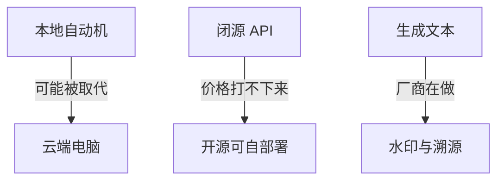

# 开源模型、廉价智能，和水印

`#0815` 复盘。最近事情不少，先把几条判断从群里捞出来，写成可以回头看的笔记。

## 三条判断

第一，现在的「小龙虾」这类本地自动机，很可能会被云端电脑取代。不是立刻，但是方向清楚。

第二，很多人已经说过：未来会用更廉价的智能提供 AI 服务。厂商走的是——相对成本更低，相对智能更高。开源模型在这里是活的：只要你有服务器，谁都可以部署。闭源模型的 API 降不下来，一方面成本巨大，另一方面不开放，你无法用更低成本自己跑。

第三，闭源里目前好用的，仍是 GPT 系以及 Claude 那一套。最近 Cursor 里大约两倍补贴的订阅，长任务一跑就很难负担；Codex 的额度也在砍。所以一边是开源把价格打下来，一边是过去那些模型的价格未必降。我不确定这是不是好事，厂商自己也未必好过。反而觉得谷歌这条路更有价值一些。

另外一件值得盯的：很多模型厂商开始认真研究 AI 生成文本的水印。这不是边角料，整理一下可能会变成后面的博客。
