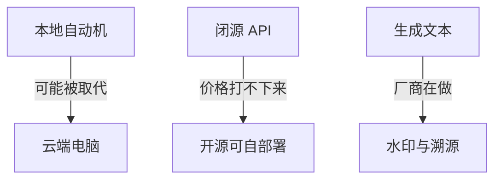

# 26-8-15 复盘 · 开源模型廉价智能和水印

感觉最近发生的事情挺多的  然后大概把最近的一些事情发在了群里，噢依次到下的是一个我的未来的判断，就是目前的小龙虾很有可能会被云端电脑类的。呃东西取代。然后第2个判断是  这个之前啊很多人都判断过，就是未来肯定会以更廉价的智能去提供ai服务，也就是越来越多的厂商，他在走的方向是在相对成本更低的情况下，给出相对智能更高的模型，以及开源模型在这里就是生命的状态，开源模型意味着任何人都可以部署，只要你有服务器，很多闭源模型它的api降不下来，一方面本身它的成本巨大，另一方面。他们不给开源，你无法用更低的成本去部署。然后第3个就是同步了一些最近的事情，认为一些值得关注的，一个就是模型的选择，一个是就是都说了，当时是开源。模型之外的闭源模型，目前确实比较好用的，像gpt以及so配个系列的模型，然后目前最近在使用，按a就是基本上是一个合理的订阅价格就是两倍左右的补贴，在Cursor中  然后实际体验下来感觉价格真的非常贵，稍微执行一些长任务就很难负担得起，然后以及codex最近的额度也在砍，所以说这方面还是会有一些担忧的，就是可能未来。啊一方面是开源模型的崛起，意味着更廉价更智能的模型起来，另一方面就意味着，可能过去的很多模型的价格一直都打不下来。啊，我不确定是不是好事情，也有可能这些厂商可能未来也不一定很好，然后我感觉谷歌走的这条路反而有更有更有价值一些。然后第3个就是还有一个就是我觉得最近值得关注的另一件事情就是水印的问题，很多模型厂商开始在研究ai生成文本的水印问题了，然后大概是最近的一些想法和判断。这个东西整理整理可能会变成明天的过两天的博客

