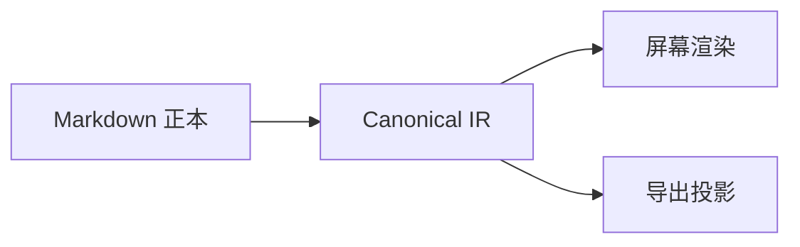

# P0 中文综合验收文章

这是一篇只包含**合法内容**的黄金文章。它同时验证中文、English、`inline code`、[站内链接](/blog/)、脚注[^note]与软换行。

## Markdown 与 GFM

- [x] 任务列表
- [ ] 待办项目
- 支持 ~~删除线~~ 与 **粗体**、*斜体*

| 能力 | 状态 | 说明 |
| --- | --- | --- |
| CommonMark | ✅ | 基础正文 |
| GFM | ✅ | 表格、任务列表、脚注 |

> 内容协议必须可读、可 diff，也必须能稳定降级。

[^note]: 脚注用于验证 GFM 扩展。

## 代码

```ts
export function greet(name: string) {
  return `你好，${name}`
}
```

## KaTeX

行内公式 $E = mc^2$ 与块级公式：

$$
\int_{0}^{1} x^2\,dx = \frac{1}{3}
$$

## Mermaid



## 图片


## 媒体与安全组件

<video-embed id="demo-video" src="./media/video/demo.mp4" title="一秒钟验收视频" poster="./media/images/poster.png" />

<audio-embed id="demo-audio" src="./media/audio/demo.mp3" title="一秒钟验收音频" />

<canvas-render id="function-plot" renderer="function-plot" data-src="./data/function-plot.json" width="720" height="360" />

<svg-embed id="safe-diagram" src="./media/svg/safe-diagram.svg" title="安全 SVG 示例" />

<html-embed id="mini-card" src="./embeds/mini-card/index.html" title="文章包内 HTML 小页" height="260">
无法加载交互小页时，显示这段安全降级说明。
</html-embed>

<web-embed id="unlisted-web" src="https://unlisted.invalid/embed" title="未进入白名单的网页" height="320">
该 URL 不在 allowlist，P0 必须显示降级卡片而不是 iframe。
</web-embed>

## 轻量问答

<choice-question id="choice-basics" data-src="./data/choice-question.json" />

<fill-blank-question id="fill-basics" data-src="./data/fill-blank-question.json" />

## 结束

当上面的内容都能稳定渲染、选择、降级和导出时，P0 内容纵向链路才算成立。
