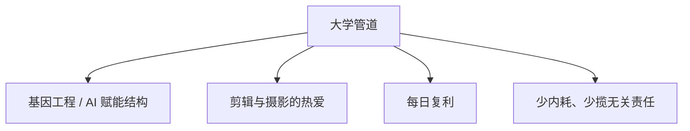

# 25-9-9 复盘 · 九月九日新的自己

写于25-9-9

真的感谢大一开学遇到滴一些事情

也真的感谢指点迷津的战友们！

核心事件再提意义不大

提炼两方面内容：

一、从此时事件可以学到的教训

1.剪视频注意素材版权及其署名问题

2.审核视频也要注意上面部分➕署名字是否正确

3.与自己无直接关系的事情，没必要闲着瞎管，更没必要因为和自己有些关联去思考内耗，珍惜年轻时间，提升效率，不要管无意义的事情

4.与自己有直接关系的事情，做错事直接了当承认错误，先给出解决方法，节约时间

5.除非对方请教，不要试图教别人做事

二、更新自己方向

『人生管道模型』- 精简版

1.大学方向核心是"基因工程"方向突破的理想，落实与AI赋能蛋白质高级结构的破解，大一核心任务之二就是多方搜集相关前沿信息，随着必修课程尽量更好滴学习编程和AI方向，大一积累基础知识，多找相关文献和渠道，多结识相关方向的大佬

大二后可能会专研AI兼编程方向，具体结合未来情况，目前无法精确规划到较远未来，但大二另一个核心就是去结交医学相关方面大佬（我们医学大二会去分校，不在一个市区）

大一自我探索与搜集相关方向时充分确立加深自己的理想，让自己相信，自己可以在相关领域有所建树甚至突破，即使只有万分之一可能，但这条科研路，也是我毕生追求，可以默默奉献一辈子的事情

2.老王人生管道模型的另一部分，送给自己，也去多多内化：

1⃣️大一发展的核心方向就是剪辑和摄影，这个是真的热爱，剪辑的素材也来源于摄影，后者不会弄得很精，但也会学并实践一些重点的基础内容，这一段时间也在充分了解相关内容，尝试列一些必要的相关计划，核心是明确每个阶段的方向，用每日积累的形式去提升，同时避免刻板的每日详细式的计划，一方面是总会有一些意外，无法精确完成反而增加压力，二是剪辑方向很难被精确的时间点规划，更多是每一阶段学什么方向并充分实践为主导

学习过程中产生的大量Vlog素材，也会在b站同步更新，先初步运营下账号，主打时间长跨度高质量滴积累视频，这一年内应该不会具体学习相关的运营内容，时间精力不可能那么多，同时也没有太多的必要，而每日大部分时间肯定会投入在学业方面

2⃣️每日复利计划。通过时间日志记录并具体化改善下每日注意力分配问题，同时给一些复利的小备忘，很多细碎的事情，用的时间其实不长就可以完成，重要的是每天的一个积累，从长期视角这些东西一定会带来很多的增益

3⃣️摒弃内耗和完美主义。和第一大点一样，我们以大学核心目标为导向，很多无关影响情绪的事情（譬如军训时一个错误的动作，帮别人军训取水杯，同学间一些无关的矛盾），尽量向可以最快解决事情的方向行动（如犯错立马认错，给出解决方案并吸收经验教训，然后立即过去，时间接着给到自己目标方向），其他人看法p用没有，一方面实际上都是NPC，二方面时间那么宝贵，每天都处理这些莫名其妙的事情，还要不要自己的目标了？自己默默向目标方向做，何必在意其他无关人的议论，专心投入自己事情就好，记住，年轻的时间宝贵，将来的一些机会，不抓住就没了！！！

之后很多事情和责任，没必要都往身上揽，譬如做某些方面的负责人，实际上对自己人生目标不仅没帮助，还时候因为一些纠纷有矛盾，影响自己，根本没必要

