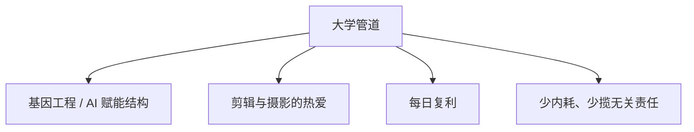

# 九月九日，新的自己

写于 25-9-9。真的感谢大一开学遇到的一些事，也感谢指点迷津的战友们。核心事件再提意义不大，只提炼两面。

## 从这件事里能学到的

1. 剪视频注意素材版权和署名。
2. 审核时同样要核对署名是否正确。
3. 与自己无直接关系的事，没必要闲着瞎管，更没必要因为有点关联就内耗。珍惜年轻时间。
4. 与自己有直接关系的事，做错就直接承认，先给出解决方法，节约时间。
5. 除非对方请教，不要试图教别人做事。

## 更新自己的方向

大学方向的核心，是基因工程上有所突破的理想，落实为 AI 赋能蛋白质高级结构。大一要多方搜集前沿，把必修课和编程、AI 学好，多找文献，多结识这个方向的人。大二以后可能会更专 AI 兼编程，也要结交医学方面的人——医学大二会去分校，不在一个市区。即使只有万分之一可能，这条科研路也是我想默默奉献一辈子的事。

剪辑和摄影是真热爱。剪辑的素材来自摄影，后者不必弄得很精，但基础要实践。以阶段方向为主，用每日积累提升，避免刻板的每日时刻表——意外一来完成不了，压力反而大；剪辑也很难被精确钟点规划。过程里的 Vlog 会在 B 站慢慢更新，这一年不打算学运营，大部分时间仍给学业。

每日复利：用时间日志改善注意力分配，把细碎但重要的事变成每天几分钟的积累。摒弃内耗和完美主义。军训里一个错动作、帮人取水杯、同学间无关的矛盾，都该以最快解决为导向：认错，给方案，吸收教训，然后把时间还给目标。其他人的看法不重要。年轻时间宝贵，将来的机会不抓就没了。很多负责人的帽子，对自己人生目标没有帮助，还容易卷入纠纷，不必都往身上揽。
