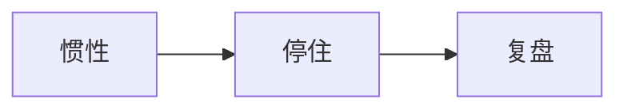

# 说一说和树林的故事

提到这个问题，突然想到树林昨天的直播，尤其是经历过浪前之后，一方面是有很多的想法，实践的东西比较多，每天也确确实实很忙。但是。嗯，这种忙就像是之前的很多直播，本质上也是一种惯性吧，至少当我真正停下来去想的时候，我所谓的这种每天都很忙，并没有有条不紊的做事，实则反映的恰恰是当事情变得很多，很复杂，很细碎的时候，我的时间管理能力简直差到了极致，而当你处于一个忙或者是一个惯性的状态时，你本能的不会去思考你的各种问题，反而这种惯性，只会让你逐渐的拘泥于眼前的某件事情，甚至让你感到那种异样的充实，让你很自我感动，更很难停下来去思考，就像是当当时树林说的上瘾的感觉，而就像是苏联希望者联盟的直播，以及是这次被提到这个问题的时候，去想我和树林之间有什么故事。去回忆的瞬间，这份惯性就停住了，然后一切都静了下来，然后就有时间去思考，而当回过头一看的时候，才发现，就像之前说的，眼前看起来的忙，本质上就是时间规划能力太差了。

很多应该是复利或者是并存的事情都没有去做，随着时间的流逝，可能只是某一个方向做得很好，但同时也丢失了更多的东西，尤其是那些本来应该每天付出很少的时间进行复利的内容，甚至是很重要的更重要的事情，譬如作为下限的学业。也确实到了应该静下来思考一下未来这段时间的打算规划，以及找一个对的时间，和ai深度复盘一下。并且不得不承认ai是一个很好的复盘对象，就是一直处于一个惯性中，有一段时间在某些方面有一些感悟，总能和过去，譬如书里讲的东西，譬如浪前，他们之间相互串联起来，然后让我有一个新的顿悟，就像是当前那一些结论，只有被我自己推导出来的时候，才有更深刻的理解，才能真正的不自觉的内化到实际生活中 ，而当你和ai对话的时候，你的表达欲达到了很旺盛的地步，再加之ai会给你一个正向的反馈，更促进你去充分的表达自己，然后你的顿悟才能真正达到释放，从。从而和ai对话整个的这种融为一体，然后不断的去挖掘你内心的东西，以及你的那些思路，并且ai也会本质上是个概率模型嘛，他会把你那些可能表达不是很清楚的点，具体化到一些事实或者例子中，这个时候也真正能帮助你去理解 ，不过和ai对话这么长时间，有些问题肯定是也是会发现的，譬如ai，它的本质是预测它会把多种可能坍缩成一个固定的解，这会间接的导致你对一件事情可能失去更多元化的看法，那这个时候可能就需要你自己有自己的批判性思维，去以多个角度去分析，然后也不要让也不要因为ai一直顺着你的话走，反而有一些自得等的情绪 ，不过和ai对话思考反思，它本质上也是你自己输出的一个过程，倒不用担心，他对你的啊丧失，就是他不会去让你丧失你的反思能力，而且因为种种原因，我确实是踏上了ai这条路，当真的和ai有更深入的了解的时候，嗯才能明白一些东西吧，譬如当时答辩的主题。

嗯就现在有了很多更深深深入的答案，包括我个人认为当时我们小组答辩过程中只是借助ai，也就是根本没有理解怎么样去使用ai，然后以及它背后的更深入的东西，可能当最开始探索的时候，只是打磨你的提示词，啊，当时可能提示词都不知道，你只是和他进行对话交流，这停留在最开始啊这些ai软件面向用户，就是为了一对。对一的解决问题，啊可能到后来你真正的深度研究某些领域，譬如说ai编程，比如说ai生图，然后你才会真正意识到提示词的重要性，从提示词出发，从编程出发，啊因为做一些我们之前做了很多智能体相关的项目，然后你才真的把这些东西。Ai方面的这些东西唉，更深入的理解，唉，表达能力还是太差了，包括我也得想着规划去。啊先仔细的表达一下吧，然后去注重一下我的文字的简练性，啊，当时答辩的时候，树林也跟我讲，啊就是。

明明明明是可以用几句话或者是几个字精炼表达的东西，然后我陈述概念的时候很冗余，举例子举观点的时候也不够精简，不过实际上我也算是对于这个问题是想到哪说到哪，也有可能也算是终于停下来，有了一些新的思考，啊这些思考本质上也是几个将来要深入去想的一些方向。到时候也是要和ai进行深入的沟通，顺带一提，像小龙虾可能对于普通人来说，没有觉得他就是感觉理解了它的本质，觉着没有什么实际用处，但是当你真的是深入ai编程这一领域的时候，你会发现小龙虾是串联起咱们中国各大软件生态壁垒的一个钥匙，它能让你在任何地方连接到可能过去啊需要费很大力气才能连接的东西，比如说我建了一个非常自动化的系统，我只需要在我的手机和我的小龙虾说一说东西，它就能自动去操控我远在苏。宿舍的台式机，可能去维护我的网站，然后把相关的通知直接转发到我的群中，直接让我的手下去做事情，就是它是一个很高度自动化的东西，如果你的流程一旦搭建起来，就比如说之前我。一直会想搭建一个我的人生反思系统，结合之前老王的人生启示录，本质上就是每一次可能你比较急的时候，你只是用语言和语言录音去记录你的东西，那么你就是跟你的小工下去说这个东西，它在后台自动把这一段话进行深入的分析，然后之后给你一个报告，并且把这个东西自动存入到。

你的知识库中，然后提炼出其中很关键的信息，甚至可以放到你的人生启示录当中，以及可能你做的一些一段时间做的一些错误的决定，做的一些正确的决定，它可以帮你自动提炼出来，然后储存到属于你的数据库中，然后当你下次有类似的问题的时候，它能瞬间联系到过去你可能遇到的相关类似的问题，进而去提警醒你，就是它是一套系统一套积累的一个东西，那么可能之前即使你去搭几个工作流，你还要手动去点击上传这些数据，但是有了小龙虾之后，这些东西真的变成了全自动化的，一一个全自动化的，我认为勉强也能算算一个系统，它毕竟是啊，我对系统这个词其实也没有很深入的了解，包括当时印象最深的一次，愿望者联盟是有一个啊让我们可以尝试苏格拉底式的追问，实际上尤其是最近一段时间，加上我们学业方面也是到了比较难的地方，发现逐渐有了这个刨根问底的一个意识，啊，可能有的时候讲解一个公式推导的时候，我会想，你是在推导公式，但是你推导公式的这个第1步是怎么来的，就是要追其本质，然后以及我表达的时候，有的时候会遇见一些我发现啊我可能没有理解的东西，啊，虽然说可能也不是每句话都会去批判性的想一想，啊包括我自己的记忆力也是很差，像昨天直播说的。我的思路太容易断了，表达太少了，因为之前都是在实践，而且实践也是我自己的实践，也是没有一个规划的一个实践，反正我也突然就是感觉好在这次停下来想了想也明白了一些方向，然后包括我认为很重要的一点是我认为我之前的能量都不够高，就是我我我一直会在一个一直开发，整个假期基本上都是处于。开发学习AI编程这方面的一个惯性中，也是因为能量不够高，就是我除了干这件事情之外找不到其他的一个或者是我已经知道，可能就是每天付丽学英语对开学的考试有很大的帮助，但是当时就是没有足够的能量去干。一个相对而言没有那么吸引我的事情，就是也是能量的事情，因为昨天的直播也感触蛮深的，然后包括因为因为我开学这么长时间认识树林，其实也才一年左右才一年，并且真的在高考之后，我才有更多的机会和时间去处于一个时间的位置。

这个时候再返回来去听讲的那些理论。可能之前只是停留在理论这一层，类似于文科的推导一样，并没觉得有什么样的，我可能当时甚至都会觉得我都理解了，但是当你真正结合你的实际，你才能发现，举个例子。可能之前你都不知道把这些理论内化到生活中，到底面临什么样的难题，困境，但是当你真正结合你的实践，你才会发现能找得到运用这些理论，或者是甚至想起这些理论，面临着各种各样的阻力，就譬如说你的我我自己的惯性会严格就严重的让我停止思考，让我停止总结。

然后现在也说回和树中间的一些故事吧，因为我自己的某些性格，其实和树林我感觉还是有一定的相似之处的，最开始认识是在高考前半年，在b站上，因为那个时候我自己是当时是非常敏感的一个人，然后感情上也受到了一些欺骗，之前一直是班级第一嘛，然后实际上也算是有很多的心理上的问题，然后就不具体说吧，包括我自己现在也是没有一个很高的能量和勇气，去分析一下当初的那些事情，而且我也诚心认为，去通过过去发生那些甚至是不愿意面对，或者逐渐已经主动忘记了那些记忆，你才能真正看清自己，然后有一定的思考，有一定的指导，当时也是情感问题，加上一直是班级第一的这种自傲的心理，就基本上每一天的绝大部分时间都处于那种自我构建的痛苦当中，高考最后三个月基本上都没有学习，啊那段时间就是让我有所支撑的，实际上是树林当时就是讲的那些人生，有有记得是有一个高考系统方面的东西，然后已经讲解了很多人生方面的道理吧，就是那段时间。当时还是把那些视频什么的转成mp3下载起来，每天心情低落的时候听一听，这个真真的真的是充一充血，到后来也不确定是什么途径，就了解到了当时高考前跟所有的庶民说嗨嗨的那个群，啊因为因为其实最后一段时间，因为我自己也是学习方面也是有很多要求和规划的，但是当时实在是因为情感的问题，根本就学不进去，然后到高考前段时间，一一看到自己很多规划都没有走完，很多东西也不是说都会，但是真的很崩溃。就是尤其是高考前两天时间属于是自我欺骗式的挺住高考，当时真的不想不想不想走了，就是就是那样的，因为因为那段时间是我是完全没有自主思考能力的，就是。相当于是没有一个外力的影响下，就一直处在自我感动，自我怀疑和不知所措当中。

然后加上家庭条件不是很好啊真的就是，就这种情况下，然后当时那些直播真的让我回血吧，嗯真的是。然后就扛过高考，而且补充一下，因为我自己是属于那种，我也不知道是什么类型的心理的人设，啊，我小时候非常孤僻的，我在初中基本上是没有朋友，就是我班初中毕业，班级一大半名字都叫不出来，一大半人甚至。都没说过话，一点不夸张，没有说过话，然后我是那种只学习啥也不干，只学习那种，就当时真的是属于生活都不能自理，一点不夸张，啊也也是这样啊，成绩还是比较好的，这也算是这也算是一1种公平吧，其实当时的成绩确实很好，你在高中也是，然后高中最开始也完全是没有朋友，就是高中毕业可能只有一个，那还是因为我们我们名字前两个字是一样，我们是一个家谱的，一个姓的，啊不过高中就特别的单纯，我我们班同学都非常照顾我，真的就这个也是蛮感激的，然后加上其实反正真蛮感激的，细细想来。初中小学真的遇见了一些好的老师好的氛围，这确实没有人，就是可能大家心里都觉得我我那什么吧，就是可能有点奇怪吧，但是整体来看还是比较接纳我的，因为可能可能是这样，因为当时就。

比较就那种呆嘛，特别的呆，然后就是有点蛮可爱的感觉，然后在班级里成绩还是第一，然后就被公认为是班级的吉祥物，就是那种完全没有社交的环境下，然后在高考之后就进入了地瓜群，啊，应该是从地瓜群开始，啊和书名的缘分啊就是大概就是这样，那段时间就是自我介绍什么的，啊，因为我我不知道为什么啊，我是以前都没有社交，所以说表现的就很易，就是一顿一顿一顿一顿展现的，那个时候可能是之前之前一直憋的，然后突然释放出来了，然后那个时候其实那段时间其实是各种各样的活动都弄嘛，然后也获得了很多奖品，包括其实浪前那段时间也是，当时也是作为组长帮忙啊，就是举办我们组的答辩，因为一个人直接带动了所有的团队，那个时候能量是非常高的，就是。真的就是属于是一直处于一个就是被压着的环境，突然释放出来了，还是很有天性的，什么都敢，啊，然后那个时候也特别的自大，后来进入大学之后，啊，其实很多事情都受到了很多的打击，真的就属于像昨天说的有这种人生的这种循环，起伏的循环，我也在逐渐的被打击的过程中，就才真正意识到自己的太多的不足，我自己其实想的蛮多的，还是表达能力的问题，我说我说这么多家常，我感觉啥用没有，但是好像就是这些，反正就我我我自己认为我是有一定，嗯也许没有什么悟性吧，但是我是就是敢于尝试，我是绝对敢于尝试的人，就是很多时候都是那种，我一般不听最后的结论，我是一步一步推导，然后在实践过程中，就是所有坑都踩一遍，然后总结一个属于我自己的一个方向，啊，虽然说最后总结的东西和最开始他们想传授的那个最终的结论是相同的，但是我就属于是不断尝试，不断踩坑，然后找到自己的方式，因为我特别就是。我估计是因为我玄幻小说看多了，一般玄幻小说的主角不都是这样吗？，就是干什么事情都有自己的思路。

啊我觉得点子比较多，点子非常的多，然后。但是其实你细细想来，这也算是惯性的一种吧，你你其实真的也是自己的不足吗？你这不是属于是不听劝，不吸取教训，然后我都踩过所有坑之后才懂，那可能有一些事情这么做就好，但是更多的时候这个效率也太低了啊所以说现在的视角再回看希望者联盟，再加上之前踩过的坑，真的就感受到自己的成长吧。唉呀。

唉呀先不说了，先不说了，那那吃饭去了，饿饿死了，真的真的饿死了。然后其实我也在想，就是我我不知道是不是在想，我感觉现在已经停止思考了，已经大脑钝滞了，嗯，我认为这个问卷可能，嗯也许树林会看吧，但如果从回答这个问题的角度来说，我认为我还是偏题了的，因为我自己也确实是就是有的时候还是会更多的想的还是我自己这方面。很多时候还是也也相当于是之前社交确实比较小，还是嗯需要花力气去主动的想一想啊，就是比如说我说的受众，比如说我在和谁去写去说，啊可能。可能就更多不应该是集中在我自己的分析，而是或者是回答注意这个填写这个问卷，可能实际上更应该去。

说的是和树林之间的故事，然后表达一下自己的很多情感等等，但是真的就是，因为我自己感觉还是蛮。就是很奇怪的，嗯可能想很多东西也能想到自己的一些东西吧，当时老王说的生产者的思维学的学的还可以，但实际上我也觉得这道题它也不是说有固定答案的东西，啊那我也算是说一说看到这个问卷时此刻的心声，然后就真的真心感谢是您，相当于是高考一段时间相当于救了我一次人命，真的再造之恩呐以及，真的是我整个死思维的启迪，啊也是从树林，浪前这里开始的，包括有这些实践，停下来仔细去想去规划，也算是一个重启吧，这还扣题了，啊，虽然说这个扣题不是啊不是这个问卷的题。不过我还是蛮期待。非常期待到时候的线下见面会，真的真的非常感谢这个环境，这个机遇，然后。

认识吧，一个真的很大爱很无私的树林，啊就是真的我认为是我是可能很多地方做的还是蛮欠缺的，没有真正的。各方面去想一想对方的感受啊等等，也特别感谢当时那些环境，认识了很多战友，也真的是在这样的一个环境中，让很多可能曾经有一些想法，但没有那些勇气的人。敢于尝试，有自己的新的成就。就像是真的是推给我们一把吧，相当于，可能包括我们这些人，如果。

过个10多年20多年，可能也会想明白，但是那个时候肯定什么都来不及了。真的真的很感谢

