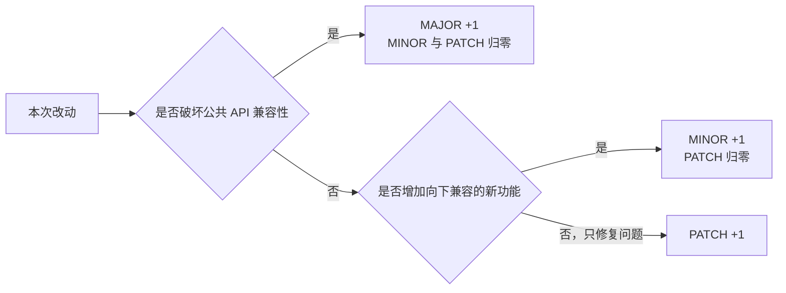
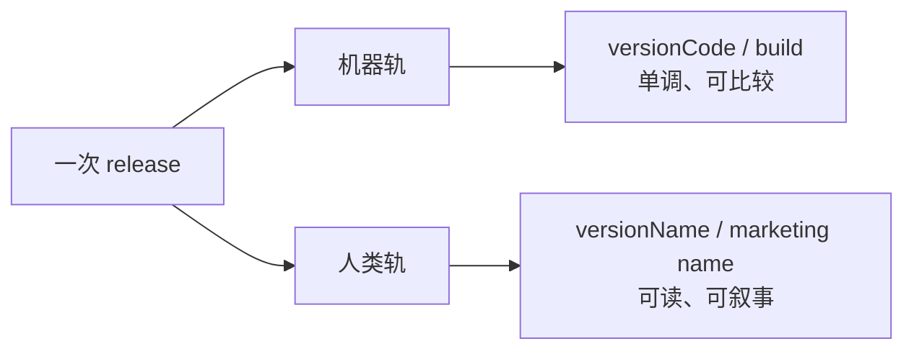

# 版本号观察：从 SemVer 到 0.1.1001

<html-embed id="version-numbering-observation" src="./embeds/version-numbering-observation/index.html" title="版本号观察 · HTML 交互版" height="720">
如果交互预览没有加载，可点击卡片右上角的「打开」进入完整页面；下方仍提供可目录导航、划词注释和导出的完整正文。
</html-embed>

> 跨平台版本号规范深度调研：版本号到底谁说了算？

<aside-note id="reading-version-note" kind="addon" title="两种阅读方式" tone="note">
上方保留了这次调研最初完成的 HTML 视觉版，包含章节导航、全文搜索、图表和印刷式排版；下方是适配本站目录、注释、搜索与导出的完整正文。两者表达同一份内容，博客中的 Markdown 正文是后续维护的权威版本。
</aside-note>

AI 每次更新都爱抬大版本号，而微信的「8」五年没动、macOS 的「10」用了十九年、TeX 的版本号则在无限逼近 π。版本号究竟是一把客观刻度，还是项目自己选择的表达方式？

这个问题来自一次很具体的版本策略讨论。我们想知道四件事：版本号的每一位究竟叫什么；业界有没有约定俗成的规则；频繁改动第一、二位到底对不对；以及，只在最后一位持续 `+1`，能不能成为一种谦虚而成立的工程姿态。

<inset-card id="research-scope" title="调研说明" eyebrow="RESEARCH" kicker="资料截至 2026-08-30" tone="muted">
**覆盖范围** — 移动应用、桌面软件、开源生态、网站与 API。

**观察方法** — 以规范和平台官方文档为骨架，再用真实项目的长期版本历史交叉验证。文中的“当前”“最新”和年限均以调研日期为界。
</inset-card>

## 术语正名：每一位的官方名称

<aside-note id="version-terms-thesis" kind="callout" title="本章论点" tone="thesis">
版本号三段式的官方名称是 major / minor / patch，第三位也叫 micro。我们观察到的 `1.x` 或 `2.1.1000` 中那个不断增长的数字，就是第三位。
</aside-note>

在讨论规则之前，先给每一位一个名字。版本号不是“一堆点分数字”，每一段都有官方术语，也有通常由谁、因为什么而调整的约定。

### 三段式：MAJOR.MINOR.PATCH

以这个版本为例：

```text
2 . 1 . 1001 -rc.1 +20260830
│   │    │      │       └─ build metadata · 构建元数据
│   │    │      └───────── pre-release · 先行版本
│   │    └──────────────── patch / micro · 修订号
│   └───────────────────── minor · 次版本号
└───────────────────────── major · 主版本号
```

语义化版本规范（Semantic Versioning 2.0.0）对三段式的定义如下：

| 位置 | 官方术语 | 中文 | 递增条件 |
| --- | --- | --- | --- |
| 第一位 | major version | 主版本号 | 出现不兼容的 API 修改 |
| 第二位 | minor version | 次版本号 | 以向下兼容的方式增加功能 |
| 第三位 | patch version | 修订号 | 做向下兼容的问题修正 |

### 第三位的别名：micro

同一个位置，在不同体系里有不同叫法。SemVer 称它为 **patch**；Python 的 `sys.version_info` 元组是 `(major, minor, micro, releaselevel, serial)`，第三位叫 **micro**；CalVer（日历版本）也使用 micro；口语里还会称它为 maintenance version。

这并非咬文嚼字。patch 暗含“修复缺陷”的语义，而 micro 只表示“最小的发布位”。如果一个项目的第三位承载每一次发布，无论内容是修复、功能还是文案调整，那么 micro 往往更准确。

### 第四位：build / revision

SemVer 没有第四个纯数字位，但其他体系有。

- **微软 .NET 四段式**：`major.minor.build.revision`，如 Windows 的内部版本 `10.0.19045.4046`。早期 .NET 还支持 `major.minor.*`，自动把 build 和 revision 映射到时间。
- **部分移动应用四段式**：第四段常被用作高频构建号，让前面的展示版本保持稳定。

### 先行版与构建元数据

SemVer 在 `X.Y.Z` 后还允许两类修饰：

- **先行版本号**：连字符后接点分标识符，如 `1.0.0-alpha`、`1.0.0-rc.1`。先行版的优先级低于对应正式版。
- **构建元数据**：加号后接点分标识符，如 `1.0.0+20130313144700`。比较版本优先级时必须忽略构建元数据。

完整的先行版排序示例是：

```text
1.0.0-alpha
< 1.0.0-alpha.1
< 1.0.0-alpha.beta
< 1.0.0-beta
< 1.0.0-beta.2
< 1.0.0-beta.11
< 1.0.0-rc.1
< 1.0.0
```

<inset-card id="version-terms-summary" title="术语结论" eyebrow="01" kicker="先把名字叫对" tone="thesis">
第一位是 **major**，第二位是 **minor**，第三位是 **patch / micro**，第四位通常是 **build / revision**。所谓 `2.1.1000` 长跑，就是冻结第一、二位，让第三位持续递增。
</inset-card>

## SemVer：约定俗成的「官方答案」

<aside-note id="semver-thesis" kind="callout" title="本章论点" tone="thesis">
SemVer 是业界最广泛书写的版本号规范，但它首先是写给“拥有公共 API 的库”的契约，而不是所有软件的统一宪法。它对 `0.y.z` 的定义，恰好为“只在低位递增”提供了规范内依据。
</aside-note>

### 起源：为「依赖地狱」而生

SemVer 由 Tom Preston-Werner 建立，要解决的是**依赖地狱**：包管理器需要知道，升级到 `1.3.0` 会不会破坏当前项目，因此版本号必须携带兼容性信号。

它的核心规则可以压缩成四条：

1. 软件必须声明公共 API。
2. 版本号必须采用 `X.Y.Z`：每一位是非负整数，禁止前导零。
3. 已发布版本的内容不可修改；任何修改都必须以新版本发布。
4. 向下兼容的修复升 PATCH；向下兼容的新功能升 MINOR 并清零 PATCH；任何不兼容改动升 MAJOR，并清零 MINOR 和 PATCH。



### 0.y.z：官方的「初始开发阶段」

<aside-note id="semver-zero-quote" kind="quote" title="SemVer 2.0.0 · 规则 4">
“主版本号为零（`0.y.z`）的软件处于开发初始阶段，一切都可能随时改变。这样的公共 API 不应该被视为稳定版。”

— [Semantic Versioning 2.0.0](https://semver.org/)
</aside-note>

换句话说，`0.x` 是一张制度化的免责声明。官方 FAQ 还给出了几个很实用的判断：

- 初始化开发可以从 `0.1.0` 开始，此后每次发行递增次版本号。
- 当软件已经用于正式环境、拥有被使用者依赖的稳定 API，并开始认真担心向下兼容时，就该考虑 `1.0.0`。
- `0.x` 本来就是为了快速开发；如果 API 每天都在变化，留在 `0.y.z` 没有问题。
- 不兼容改动不应轻易进入拥有大量依赖者的软件。升主版本号意味着要认真评估影响，而不是机械地给每次发布制造“里程碑”。

### 采用情况：库的生态事实标准

| 生态或项目 | 状态 | 关键事实 |
| --- | --- | --- |
| npm | 官方推荐 | `^1.0.4` 通常接受兼容的次版本，`~1.0.4` 通常只接受修订版本 |
| Cargo / crates.io | 事实标准 | 官方文档专设 SemVer 兼容性章节 |
| Go Modules | 规则深入模块路径 | v2 以上的主版本进入路径，如 `example.com/m/v2` |
| Kubernetes | 官方采用 | 使用 `x.y.z` 并遵循 SemVer 术语 |
| React | 自 15.0.0 起采用 | 从 `0.14.7` 跳到 `15.0.0`，把开头的 0 挪到了末尾 |
| Angular | 自 2.0 起采用 | 但主版本按固定日历节奏发布，语义会让位于排期 |

<inset-card id="semver-summary" title="SemVer 的适用边界" eyebrow="02" kicker="版本号 = 兼容性承诺" tone="thesis">
SemVer 对库作者非常自洽，但它依赖两个前提：存在清晰的公共 API，并且真的有人依赖这些接口。对一个不会被别人 `import` 的独立应用，SemVer 的约束会天然减弱，这正是后续各种“不规矩”实践能够成立的缝隙。
</inset-card>

## 冻结高位：知名软件的「1.x 长跑」

<aside-note id="frozen-major-thesis" kind="callout" title="本章论点" tone="thesis">
大量顶级软件会把第一、二位冻结数年乃至数十年，让第三位或更低位承载日常迭代。“1.x 长跑”不是不专业，而是一种非常常见的实践。
</aside-note>

### 五个标本

**微信：`8.0.x`，第一位多年未动。** 微信 8.0 在十周年时发布。此后的日常功能更新都被放进第三位，主版本号成了只在重大叙事节点使用的资源。

**macOS：`10.x` 用了十九年。** 从 2001 年的 Mac OS X 10.0 到 2019 年的 10.15，“10”逐渐成了品牌，真正的产品代际由第二位表达。Big Sur 跳到 11 时，还要通过 `SYSTEM_VERSION_COMPAT` 向旧软件自报 10.16，以兼容写死的判断。

**Minecraft：`1.x` 十五年。** 从 2011 年的 1.0 到后来的 1.21.x，许多足以改变游戏结构的大更新也没有触发 2.0。庞大的模组生态深度绑定具体版本，“不轻易 2.0”本身就是现实兼容策略。

**Microsoft Office：内部版本冻结在 `16.0`。** Office 2016 之后，Microsoft 365、Office LTSC 与多个永久版继续共享 16.0。外部用产品名与年月构建号区分，内部则借冻结版本保住 VBA、COM 加载项和注册表路径兼容性。

**OpenSSL：`0.9.x` 十二年，字母承担补丁位。** `1.0.2a` 到 `1.0.2u`、`1.1.1` 到 `1.1.1w` 都展示了同一件事：哪怕点分数字不动，发布序列仍可借更低位继续增长。

| 软件 | 高位冻结区间 | 约持续时间 | 高位承担的含义 |
| --- | --- | ---: | --- |
| MAME | `0.x` | 29 年以上 | 对“完成”的保守判断 |
| macOS | `10.x` | 19 年 | 品牌标识 |
| Minecraft | `1.x` | 15 年以上 | 生态兼容与产品连续性 |
| OpenSSL | `0.9.x` | 12 年 | 治理保守 |
| Office | `16.0` | 11 年以上 | 插件和内部路径兼容 |
| 微信 | `8.x` | 5 年以上 | 营销叙事节点 |

### 更多长跑者

- **React Native** 长期处在 0.x，但早已进入大量生产项目。
- **three.js** 仍以 0.x 迭代，minor 实际承担破坏性变更的角色。
- **手机 QQ** 从 8.0 到 9.0 间隔多年，9.0 对应 QQNT 跨平台架构换代；技术代际才足以触发第一位。

<inset-card id="frozen-major-summary" title="高位是叙事权，低位是节奏权" eyebrow="03" kicker="冻结不等于停滞" tone="thesis">
营销叙事、品牌惯性、生态绑定、兼容性自保和治理保守会导向同一个结果：高位只在“这次真的不一样”时调整，日常发布则在低位继续前进。
</inset-card>

## 通胀派：当版本号变成日历

<aside-note id="version-inflation-thesis" kind="callout" title="本章论点" tone="thesis">
与高位冻结相反，另一种选择是让主版本号按发布节奏持续上涨。此时它不再表示“重大变化”，而是退化成时间刻度，这被称为 major version inflation。
</aside-note>

### Chrome：每年 +8 的版本号通胀

Chrome 在 2008 年发布，经历了六周一版、四周一版等节奏。自动更新让用户逐渐不再关心主版本号，真正用于定位构建的反而是完整四段号与 release notes。这就是 evergreen browser：版本号主要记录列车到了哪一站，而非产品跨越了什么时代。

<compare-block id="browser-release-trains" title="两条快速发布列车">
<compare-side role="a" title="Chrome">
主版本持续随发布列车增长，用户通常无感升级。数字更接近里程碑序号。
</compare-side>
<compare-side role="b" title="Firefox">
早期六年才到 4.0，转向快速发布后主版本迅速增长；企业用户另有节奏更慢的 ESR 通道。
</compare-side>
</compare-block>

### v100 危机：通胀引发的迷你 Y2K

2022 年 Chrome 与 Firefox 接近第 100 版时，一批网站和 UA 解析库暴露出“两位数主版本”的硬编码假设：`Chrome/100` 可能被错误识别为 `Chrome/10`。浏览器团队不得不提前做兼容实验，甚至准备冻结或伪装主版本号。

这件事很讽刺：版本号原本服务于兼容判断，通胀后的版本号却反过来击穿了兼容代码。

### 跟随者与排期制

- Firefox 在 2011 年转向快速发布，主版本开始按发布列车增长。
- Angular 虽然采用 SemVer，却按半年或年度节奏发布主版本；排期本身逐渐成为升位理由。
- Node.js 的主版本也承载着发布线和支持周期，而不仅是不兼容改动。

### Linux 内核：「手指和脚趾」规则

Linux 内核的跳位更直白：数字变长不好管理，就换一位继续数。Linus 多次说明，这些跳变没有技术里程碑含义。

| 跳变 | 年份 | 给出的理由 |
| --- | ---: | --- |
| `2.6.39 → 3.0` | 2011 | 内核二十周年，同时 `.39` 已经太长；不是技术里程碑 |
| `3.19 → 4.0` | 2015 | “手指和脚趾快数不过来了” |
| `4.20 → 5.0` | 2019 | 同样是数字管理，不表示特殊变化 |
| `5.19 → 6.0` | 2022 | 延续同一规则 |
| `6.x → 7.0` | 2026 | 再次按计数习惯换位 |

真正稳定的承诺是“不破坏用户空间”，而不是某一位数字必须表达什么。

### 其他通胀样本

- 抖音的主版本随长期迭代快速增长，主要反映发布节奏。
- systemd 在合并 udev 后直接接续其序号，从此每次发布只做单调 `+1`。
- 支付宝采用四段版本号，把不同节奏拆到不同位。

<inset-card id="version-inflation-summary" title="通胀与冻结其实同源" eyebrow="04" kicker="主版本一旦不承诺重大性" tone="thesis">
当主版本号不再承诺“这次有重大变化”，它上涨还是不动就只剩组织习惯。每次更新都升大版本，只存在于明确选择了日历化发布的场景，并不是普遍惯例。
</inset-card>

## 永远的 0.x：1.0 恐惧症与谦虚文化

<aside-note id="zerover-thesis" kind="callout" title="本章论点" tone="thesis">
觉得软件“还不够格”，因此不肯升高位，是一种真实而普遍的工程文化。它甚至有自己的名字：ZeroVer。
</aside-note>

### ZeroVer：一个专门为 0.x 而办的网站

<aside-note id="zerover-quote" kind="quote" title="0ver.org">
“如果一个项目已经有 logo 或维基百科条目，却还没有主版本号，它就正式属于 0ver。”

— [ZeroVer](https://0ver.org/)
</aside-note>

这句戏仿揭示了一个严肃现实：许多核心基础设施在 0.x 阶段已经被生产环境广泛依赖，而 SemVer 仍把它们描述成“一切都可能改变”。

### 长期 0.x 的荣誉成员

| 项目 | 0.x 停留 | 结局或现状 |
| --- | --- | --- |
| Terraform | 约 7 年 | 已成为 IaC 事实标准后才发布 1.0 |
| Node.js | 约 6 年 | 与 io.js 合并后直接进入 4.0，跳过 1.0 |
| Bitcoin Core | 12 年 | 从 `0.21.0` 进入 `22.0`，跳过 1.0 |
| OpenSSL | 12 年 | `0.9.8` 系列长期维护后才到 1.0.0 |
| React Native | 11 年以上 | 在大量生产项目使用的同时仍处于 0.x |
| Solidity | 长期 0.x | Web3 生态在 `0.8.x` 上持续构建 |
| Apache Kafka | 约 6 年 | 已是生产核心后才到 1.0 |
| MAME | 近 30 年 | “永远 0.x”阵营的标志性项目 |

### Wine 的 15 年：1.0 恐惧症标本

<timeline-block id="wine-road-to-one" title="Wine 从立项到 1.0">
- **1993：项目立项** — 目标是让 Windows 程序运行在类 Unix 系统上。
- **长期 0.x** — 功能已经可用，却仍因兼容覆盖面和完成标准长期推迟 1.0。
- **2008-06-17：Wine 1.0** — 经过十五年开发，1.0 本身成为社区历史事件。
</timeline-block>

项目为什么不肯发 1.0？因为在工程文化里，1.0 往往意味着：承诺向后兼容、接受长期维护责任，并承认产品已经可以被按“稳定软件”的标准评判。它像一次心理上的签字画押。

### 反向操作：跳过 1.0 的「虚无主义」

另一类项目对 1.0 毫不执着：Bitcoin Core 从 `0.21.0` 跳到 `22.0`，Node.js 从 `0.12` 跳到 `4.0`，React 从 `0.14.7` 跳到 `15.0.0`。

<aside-note id="react-versioning-quote" kind="quote" title="React 的解释">
“如果主版本号代表 API 稳定，那我们早就到了。`v1.0` 被赋予了太多先入为主的想象。我们仍然遵循 SemVer，只是把 0 从开头挪到了结尾。”

— [React：New Versioning Scheme](https://legacy.reactjs.org/blog/2016/02/19/new-versioning-scheme.html)
</aside-note>

<inset-card id="zerover-summary" title="谦虚可以成为明文规则" eyebrow="05" kicker="0.x 不是原罪" tone="thesis">
“自评还不够好，所以停在低位”有官方术语、有代表项目，也有真实的维护心理。把它写进规则并一致执行，比嘴上谦虚、手上随意升位更专业。
</inset-card>

## 时间即版本：CalVer 与滚动发布

<aside-note id="calver-thesis" kind="callout" title="本章论点" tone="thesis">
SemVer 之外，另一条成熟路线是 CalVer：版本号直接编码发布时间。再向前一步，滚动发布甚至会消灭对外的版本号。
</aside-note>

### CalVer：版本号 = 发布日历

[CalVer](https://calver.org/) 的组件可以自由组合：年份 `YYYY` / `YY` / `0Y`，月份 `MM` / `0M`，周数 `WW` / `0W`，再加该时段内的 micro 和可选后缀。常见形式包括 `YYYY.MM.MICRO` 与 `YY.0M.MICRO`。

<compare-block id="semver-calver-axes" title="两根版本坐标轴">
<compare-side role="a" title="SemVer · 语义轴">
承诺的是**兼容性**。主要读者是依赖解析器、库使用者和 API 客户端。
</compare-side>
<compare-side role="b" title="CalVer · 时间轴">
承诺的是**新鲜度与维护窗口**。主要读者是发行版用户、运维团队和市场。
</compare-side>
</compare-block>

### 采用者：Ubuntu、pip 与 JetBrains 全家桶

- **Ubuntu** 使用 `YY.0M`，`24.04` 就是 2024 年 4 月。它的第一个版本是 4.10，从未需要 1.0。
- **pip** 在 2018 年转向 `YY.MINOR.MICRO`。破坏性变化由弃用周期管理，不依赖主版本信号。
- **Twisted / Black** 采用 `YY.MM.MICRO`，适合包含多个独立演进部件的项目。
- **PyCharm / IntelliJ** 用年份加年内序号，例如 2025.2。
- **NixOS** 使用类似 24.05、24.11 的发布刻度。

### Stripe：日期版本的教科书

Stripe API 曾经为每次破坏性变化发布一个日期版本，并把账户固定在第一次调用时的版本；升级是用户的显式行为，也可以用请求头逐次覆盖。后来它又引入命名主版本，将“月度无破坏更新”和“半年一次的破坏性代际”拆开。

<timeline-block id="stripe-versioning-evolution" title="Stripe 的版本分层">
- **账户固定** — 用户首次调用时固定到当时的日期版本，旧版本长期可用。
- **显式升级** — 用户自行选择升级时间，并可通过请求头做逐请求覆盖。
- **双层节奏** — 日期版本承担常规更新，命名主版本承担破坏性变化。
</timeline-block>

### 网站没有版本号

当网站每天向生产环境部署多次，版本号对普通用户会失去意义。SaaS 更需要 changelog 告诉用户“发生了什么”，而不是要求用户记住某个数字。Arch Linux 则把这种思路推到滚动发布：仓库的当前状态就是系统，安装镜像日期只是快照。

但 **API 必须有版本**。网站自身可以持续滚动，对外契约却会被别人的代码写死。Google AIP-185 因此要求 API 提供主版本号，并将它放在 `/v1/...` 这样的路径中；同时不建议暴露 minor/patch，让小变化在主版本内持续演进。

<inset-card id="calver-summary" title="选择坐标轴，先看谁在读" eyebrow="06" kicker="兼容性或新鲜度" tone="thesis">
库和包管理器偏爱语义轴，因为依赖解析器需要兼容性信号；长期维护的发行版和平台 API 常偏爱时间轴，因为任意计数很难跨越十年。先识别读者，再决定版本号承诺什么。
</inset-card>

## 跳号：营销、避讳与对齐

<aside-note id="version-skipping-thesis" kind="callout" title="本章论点" tone="thesis">
版本号跳变在业界司空见惯，理由从营销震撼到历史避讳、包版本对齐，应有尽有。版本号是沟通工具，并不是必须连续的数学对象。
</aside-note>

### 著名跳号案例

| 案例 | 跳变 | 实际原因 |
| --- | --- | --- |
| Java | `1.2 → 5 → 6` | Java 5 加入泛型、枚举和注解，市场团队认为 1.5 不够体现跨代；内部命名仍曾保留 1.5 |
| PHP | `6 → 7` | PHP 6 的 Unicode 改造项目失败，为避开已出版资料造成的混淆而跳到 7 |
| Windows | `8.1 → 10` | 兼有营销跨代和避免遗留 Windows 9x 字符串判断的考虑 |
| Angular | `2 → 4` | Router 已到 3.x，为统一 monorepo 内各包版本而整体对齐到 4 |
| Node.js | `0.12 → 4.0` | 与已发布 1.x–3.x 的 io.js 合并，跳号避免冲突 |
| macOS | `15 → 26` | Apple 全平台转向年份制命名 |

### 营销名与工程号的割裂

Java 的市场名与内部名长期并行；Windows 同时拥有“Windows 11”这样的营销名、`24H2` 这样的功能更新名，以及 26100、26200 这样的 build 号。版本号不是只有一条轨道，营销承诺也随商业决策改变。

### curl 8.0.0：because we freaking can

<aside-note id="curl-eight-quote" kind="quote" title="curl 8.0.0">
“curl 8.0.0——因为我们就是想这么做。”

— [Daniel Stenberg，2023-03-20](https://daniel.haxx.se/blog/2023/03/20/curl-8-0-0-because-we-freaking-can/)
</aside-note>

curl 长期承诺不破坏 ABI/API，因此主版本号并不承担“破坏性变更”职能。7.x 持续二十多年后，8.0.0 被安排在项目二十五周年当天，并不表示发生了不兼容的大改。

### TeX 与 METAFONT：趋近 π 与 e 的渐近版本号

Donald Knuth 为两个作品设计了一套数学浪漫主义规则：TeX 的版本号逐步逼近 π，METAFONT 则逼近 e。每修一个 bug，就在小数后增加一位；他去世后，版本最终定格为对应常数。

<compare-block id="knuth-convergent-versions" title="两条永不进位的版本序列">
<compare-side role="a" title="TeX → π">
`3 → 3.1 → 3.14 → 3.141 → 3.1415 → 3.141592653`
</compare-side>
<compare-side role="b" title="METAFONT → e">
`2 → 2.7 → 2.71 → 2.718 → 2.7182 → 2.71828182`
</compare-side>
</compare-block>

这是一种天然单调、天然有界的无限序数。它和“第三位持续 `+1`、永不进位”的规则在哲学上完全同构：版本号记录的是第几次认真修订，而不是制造一个越来越大的里程碑。

<inset-card id="version-skipping-summary" title="跳号是在更换沟通对象" eyebrow="07" kicker="数字服务于读者" tone="thesis">
当目标读者从依赖解析器变成市场和货架，数字就会承载跨代感、整齐感、避讳和纪念日；兼容性则交给 LTS 标签、支持矩阵与迁移指南表达。
</inset-card>

## 反对的声音：SemVer 批判与幽默规范

<aside-note id="semver-critique-thesis" kind="callout" title="本章论点" tone="thesis">
SemVer 并非没有对手：理论上有 Hyrum 定律，实践中违规普遍存在，哲学上有人认为兼容性承诺本身就是幻觉，社区还创造了更诗意的版本规范。
</aside-note>

### Hyrum's Law：SemVer 的理论天敌

<aside-note id="hyrums-law-quote" kind="quote" title="Hyrum's Law">
“一旦 API 的用户足够多，你在契约里承诺了什么并不重要——系统的一切可观察行为都会被某些人依赖。”

— [Hyrum's Law](https://www.hyrumslaw.com/)
</aside-note>

它推导出一条残酷的隐式接口定律：使用者足够多时，不存在真正的私有实现。用户会依赖未文档化的怪癖、错误消息文本、时序乃至性能特征，形成 bug-for-bug compatibility。于是，对某人而言只是 PATCH 的修复，对另一个依赖旧行为的人而言却可能是 breaking change。

### 实证：违规是常态

对大型包生态的研究发现，SemVer 违规并非偶发。问题不一定在维护者不够认真，而在于“所有兼容影响都能被提前看见”这个前提过于理想。

<inset-card id="semver-violations-release" title="发布维度" eyebrow="EMPIRICAL" kicker="约 1/31">
研究样本中，约每 31 次发布就有一次 SemVer 违规；对一个长期发布的项目而言，这并不是极小概率。
</inset-card>

<inset-card id="semver-violations-ecosystem" title="生态维度" eyebrow="EMPIRICAL" kicker="政策无法自动强制">
SemVer 能给出共同语言，却不能凭一个版本字符串验证所有真实兼容性。工具、测试、弃用期和维护者判断仍不可替代。
</inset-card>

### Rich Hickey：「Spec-ulation」（2016）

<aside-note id="rich-hickey-quote" kind="quote" title="Spec-ulation">
“这是个谎言。级联式版本递增无时无刻不在发生。”

— [Rich Hickey，Spec-ulation](https://github.com/matthiasn/talk-transcripts/blob/master/Hickey_Rich/Spec_ulation.md)
</aside-note>

他的替代主张是：软件演进应该做 accretion（只增不改）、relaxation（放宽要求）和 fixation（固化）；如果必须破坏，就给新东西一个新名字，而不是在原地改写旧承诺。

### 语言社区的两种极端答案

<compare-block id="go-python-versioning" title="兼容承诺与断裂迁移">
<compare-side role="good" title="Go：让 v1 长久有效">
Go 1 承诺旧程序继续编译运行。演进尽量通过模块、工具链和开关逐步消化，而不是期待一次破坏所有人的 Go 2。
</compare-side>
<compare-side role="bad" title="Python：2 → 3 的十年之痛">
Python 3 是有意的不兼容发布；Python 2.7 的生命被多次延长，迁移耗费整个社区十年以上。
</compare-side>
</compare-block>

### 幽默规范：版本号的诗意一派

<compare-block id="poetic-versioning" title="当版本号不再假装客观">
<compare-side role="a" title="Sentimental Versioning">
有时版本只是数字，有时作者真正想要的是一首诗。唯一硬要求是：这个版本对作者本人有意义。
</compare-side>
<compare-side role="b" title="Pride Versioning">
骄傲的改动升 PROUD，平庸发布升 DEFAULT，修复羞于启齿的 bug 升 SHAME，把项目情绪直接写入数字。
</compare-side>
</compare-block>

### 版本号是一面镜子

| 态度 | 代表 | 版本哲学 |
| --- | --- | --- |
| 完美主义焦虑 | Wine、MAME | 还不够格 |
| 承诺型 | Go、curl | 数字即契约 |
| 日历型 | Chrome、Firefox、Node、systemd | 数字即时间 |
| 虚无或跳号型 | Bitcoin Core、PHP、Windows | 数字不必携带连续语义 |
| 诗意型 | TeX、Sentimental Versioning、Pride Versioning | 数字即表达 |
| 批判型 | Rich Hickey 等 | 完整兼容承诺无法由数字保证 |

<inset-card id="semver-critique-summary" title="规则重要，一致执行更重要" eyebrow="08" kicker="版本号映照项目心态" tone="thesis">
版本号不是兼容度的客观仪器。认清这一点以后，“选哪一种规则”的重要性会让位于“把规则写下来、让所有发布者理解并长期一致执行”。
</inset-card>

## 双轨制：给机器一个号，给人类一个名

<aside-note id="dual-track-thesis" kind="callout" title="本章论点" tone="thesis">
移动平台强制的双轨制是各种版本实践中最稳健的母版：给机器一个严格单调的内部号，给人类一个有意义、可阅读、可营销的版本名。
</aside-note>

### Android：versionCode 与 versionName

Android 的 `versionCode` 是正整数，只用于判断哪一个构建更新。后续发布必须递增，低 code 的 APK 不能覆盖高 code 应用。`versionName` 则是用户看见的自由字符串，可以采用语义化版本，但主要承担展示职能。

### iOS：CFBundleShortVersionString 与 CFBundleVersion

`CFBundleShortVersionString` 是面向用户的三段发布版本；`CFBundleVersion` 是内部构建迭代号。同一个用户版本之下可以上传多个 build，机器排序与人类理解互不绑架。

### Windows 的三轨

Windows 同时保留营销名、功能更新名与 build 号：Windows 11 告诉用户产品代际，24H2/25H2 表示发布周期，22000/26100/26200 等内部号供系统和支持工具精确判断。Windows 10 和 11 的内核版本仍可同属 `NT 10.0`。

### macOS 10.16：一次跳变背后的兼容妥协

Big Sur 跳到 11.0 时，为兼容写死“10.x”的旧软件，系统通过 `SYSTEM_VERSION_COMPAT` 对部分旧程序和浏览器 UA 自报 10.16。这种“对机器撒一个向后兼容的谎”说明，给人看的跨代号和给程序看的兼容号，本来就不该强行共用。

### 版本号的四种职能



| 职能 | 回答的问题 | 常见载体 |
| --- | --- | --- |
| 升级排序 | 新还是旧？ | Android versionCode、iOS CFBundleVersion、Windows build |
| 兼容契约 | 升级会坏吗？ | SemVer、API `/v1`、Go v1 承诺、内核“不破坏用户空间” |
| 营销叙事 | 这次重要吗？ | 微信 8.0、Windows 11、macOS 26、curl 8.0.0 |
| 时间刻度 | 是什么时候的？ | Ubuntu 24.04、Stripe 日期版本、浏览器里程碑 |

<inset-card id="dual-track-summary" title="先分轨，再谈规则" eyebrow="09" kicker="机器和人需要不同答案" tone="thesis">
任何版本策略设计都应该先拆开“升级排序、兼容契约、营销叙事、时间刻度”四种职能。让一个三段数字同时完美承担四种任务，通常只会制造误会。
</inset-card>

## 结论：玄览的版本规则在业界坐标系中

<aside-note id="xuanlan-thesis" kind="callout" title="本章论点" tone="thesis">
玄览目前采用的规则——`versionName` 第三位持续 `+1` 且不进位，第一、二位只在明确决定后调整，`versionCode` 每次发布单调 `+1`——在业界坐标系中完全成立。
</aside-note>

这里的玄览是一套具体应用版本策略的落点。它不试图用展示版本告诉机器一切，而是把发布排序交给 `versionCode`，把项目对自身成熟度和发布节奏的表达交给 `versionName`。

### 回答四个原始问题

<inset-card id="answer-major-every-time" title="AI 每次更新都升大版本号，符合惯例吗？" eyebrow="QUESTION A" kicker="不符合">
这是把为公共 API 库设计的 SemVer 机械套到独立应用上。应用更常见的是明确日历化，或冻结高位、让低位承担日常迭代。“每次必升大版本”不属于自动成立的通用规范。
</inset-card>

<inset-card id="answer-third-number-name" title="1.x 或 2.1.1000 中的数字叫什么？" eyebrow="QUESTION B" kicker="patch / micro">
它是第三位。SemVer 称 patch，Python 和 CalVer 称 micro。如果它记录每一次发布而不限于 bug 修复，micro 更贴切。
</inset-card>

<inset-card id="answer-high-bits" title="每次更新都动第一、二位，有问题吗？" eyebrow="QUESTION C" kicker="会稀释信号">
第一、二位在产品文化中往往代表“这次不一样”。频繁改动会让版本号失去叙事价值，甚至对外制造并不存在的里程碑。
</inset-card>

<inset-card id="answer-humble-versioning" title="只更新最后一位，作为谦虚表达成立吗？" eyebrow="QUESTION D" kicker="完全成立">
ZeroVer、TeX、Linux、微信、Office、MAME 都提供了不同层面的先例。谦虚不是版本策略的缺陷；只要规则公开、可预测，它就是有工程传承的姿态。
</inset-card>

### 玄览规则的对照表

| 玄览规则 | 业界对应 | 说明 |
| --- | --- | --- |
| `versionName` 第三位 `+1`，不进位 | TeX 渐近 π、Linux 数字管理、微信低位长跑 | 让低位承担发布节奏 |
| 第一、二位只按明确决定调整 | 微信十周年、macOS Big Sur、QQNT 换代 | 把高位留给真正的叙事节点 |
| `versionCode` 单调 `+1` | Google Play 的平台硬约束 | 把机器排序与展示语义分离 |
| 规则写入版本文档并一致执行 | 版本号作为沟通协议 | 可预期性比“神圣数字”重要 |

### 两点补强建议

<inset-card id="xuanlan-call-it-micro" title="把第三位称为 micro" eyebrow="01" kicker="命名与职能一致" tone="note">
玄览的第三位不只承载 bug 修复，叫 patch 会暗示不存在的内容约束。micro 更准确地描述“第 N 次微版本发布”。
</inset-card>

<inset-card id="xuanlan-graduation-rule" title="给谦虚规则补一条毕业条件" eyebrow="02" kicker="谦虚，但保持诚实" tone="note">
当项目已进入生产、形成稳定契约，并开始真正担心向下兼容时，第一、二位的调整通道应保持开放。规则不必承诺永远停在低位，而应说明什么时候值得跨越。
</inset-card>

### 一句话总纲

<aside-note id="versioning-final-thesis" kind="callout" title="版本号的本质" tone="thesis">
版本号的本质不是数学，而是沟通。规则本身没有绝对对错；可预期、可文档化，并且被一致执行，才是版本号真正的“语义”。
</aside-note>

```text
## [0.1.1001] - 第三位 +1，不进位
这不是不规范，是有血统的。
```

## 附录：主要来源

### 规范原文

- [Semantic Versioning 2.0.0](https://semver.org/) · [中文版](https://semver.org/lang/zh-CN/)
- [CalVer](https://calver.org/)
- [ZeroVer](https://0ver.org/)
- [Sentimental Versioning](https://github.com/dominictarr/sentimental-versioning)
- [Pride Versioning](https://pridever.org/)

### 平台官方文档

- [Android：对应用进行版本控制](https://developer.android.com/tools/publishing/versioning)
- [Apple Bundle 配置](https://developer.apple.com/documentation/bundleresources/bundle-configuration)
- [Microsoft Office 版本对照](https://learn.microsoft.com/microsoft-365-apps/deploy/install-different-office-visio-and-project-versions-on-the-same-computer)
- [.NET AssemblyVersion](https://learn.microsoft.com/dotnet/api/system.reflection.assemblyversionattribute)
- [Google AIP-185：API Versioning](https://google.aip.dev/185)
- [Stripe API Versioning](https://docs.stripe.com/api/versioning)

### 项目与社区资料

- [React 版本政策](https://react.dev/community/versioning-policy) · [从 0.14.7 到 15.0.0](https://legacy.reactjs.org/blog/2016/02/19/new-versioning-scheme.html)
- [Angular 发布政策](https://angular.dev/reference/releases)
- [Kubernetes Releases](https://kubernetes.io/releases/)
- [Node.js 历代版本](https://nodejs.org/en/about/previous-releases)
- [Go 1 兼容性承诺](https://go.dev/doc/go1compat) · [Go and Compatibility](https://go.dev/blog/compat)
- [Python 2 Sunset](https://www.python.org/doc/sunset-python-2/)
- [Ruby Version Policy](https://www.ruby-lang.org/en/news/2013/12/21/ruby-version-policy-changes-with-2-1-0/)
- [OpenSSL Release Strategy](https://openssl-library.org/policies/releasestrat/index.html)
- [curl 8.0.0](https://daniel.haxx.se/blog/2023/03/20/curl-8-0-0-because-we-freaking-can/)
- [Wine 1.0](https://www.winehq.org/announce/1.0)
- [Bitcoin Core 生命周期](https://bitcoincore.org/en/lifecycle/)
- [Ubuntu 发布节奏](https://ubuntu.com/about/release-cycle)
- [Arch Linux](https://wiki.archlinux.org/title/Arch_Linux)
- [TeX 与 Knuth](https://www-cs-faculty.stanford.edu/~knuth/abcde.html) · [TUG](https://tug.org/)
- [Minecraft Java Edition 1.21](https://www.minecraft.net/en-us/article/minecraft-java-edition-1-21)
- [微信 8.0.0 发布页](https://weixin.qq.com/cgi-bin/readtemplate?lang=zh_CN&t=page/faq/android/800/index&faq=android_800)

### 批判与实证

- [Hyrum's Law](https://www.hyrumslaw.com/)
- [Rich Hickey：Spec-ulation](https://github.com/matthiasn/talk-transcripts/blob/master/Hickey_Rich/Spec_ulation.md)
- [The Broken Promise of Semantic Versioning](https://aaronmanning.net/blog/the%20broken%20promise%20of%20semantic%20versioning.html)
- [SemVer violations are common](https://predr.ag/blog/semver-violations-are-common-better-tooling-is-the-answer)
- [Version 100 in Chrome and Firefox](https://hacks.mozilla.org/2022/02/version-100-in-chrome-and-firefox/)
- [Linux 5.0 公告](https://lkml.org/lkml/2019/3/3/236)
- [Flickr：10+ Deploys Per Day](https://code.flickr.net/2009/06/26/slides-from-velocity-2009/)
- [Rust 社区关于长期 0.x 的讨论](https://users.rust-lang.org/t/too-many-low-level-crates-are-still-at-0-x-x-and-unstable/61718)
