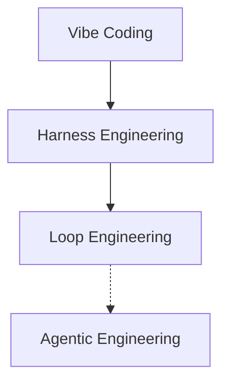
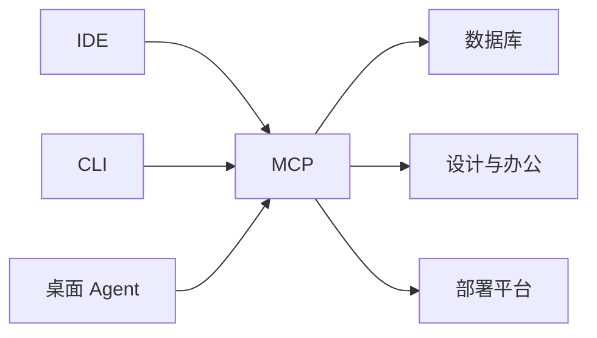
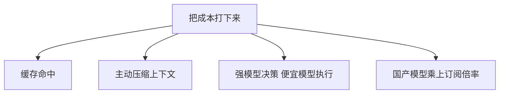

# 当我们在聊 AI 编程的时候，我们到底在聊什么

1037SOLO · Field Notes No.04 · 2026 / 07

本稿整理自作者口述，讨论对象包括 GPT-5.6 / Codex、Claude Code、Cursor、Devin 等编程工具的实测体感，以及 harness engineering、loop engineering 等工程范式。文中价格、速度、榜单信息经过检索核实，时效以 **2026 年 7 月 13 日** 为准；个人体感数据未逐一核实，已在文末单列。

口述整理：羽升 / 孔德羽，华中科技大学同济医学院基础医学强基计划，独立全栈开发者。

这篇笔记要说清楚四件事：

1. **范式篇** —— 从一句话到一个系统
2. **协议篇** —— IDE、CLI、桌面 Agent，以及把它们连起来的 MCP
3. **选型篇** —— 这半年用过的编程工具全记录
4. **省钱篇** —— Token 经济学，以及怎么把成本打下来

附录是一份可以直接抄的启动提示词。

## 写在前面

起因并不工整。本来是在聊游戏开发，聊到 GPT-5.6 在 Codex 里的表现，随后落到模型分工、架构、harness engineering、loop engineering，再落到各家编程工具的定价、token 怎么算钱、国产模型怎么把成本压下来。这些判断平时散落在对话里，其中不少属于信息差：不是搜一下就有的公开资料，而是真金白银烧出来的体感。

本稿尽量通俗，但该专业的地方不绕开。例子基本是自己踩过的坑；没有实测的地方会标明。搜索核实过的信息会给来源，个人体感也老实说是体感，不装权威。

> 反正 AI 是个放大器。你把听过的这些东西告诉它，它就能帮你迭代出一套新的范式，去更好地做事。



从左到右不是口号升级，而是约束在变：自然语言许愿能否撑住项目，取决于模型外那一层规则、校验与循环有没有被工程化。

## 一、范式篇：从一句话到一个能跑一整天的系统

这一部分讲编程范式怎么一路演化过来——从最早「我说你做」的 vibe coding，到现在动辄能跑几个小时甚至一整天的智能体系统。中间这几道坎，harness engineering、loop engineering，都不是唬人的名词，是这半年试出来的分野。

### 1.1 先说结论：模型越强，跑起来反而越慢

最近用 GPT-5.6 在 Codex 里做事，一个明显的体感是：这模型和别的比起来，会自动把一个任务拆成好几个子任务，派出去几个子智能体分头干，同时在测试和回归验证上花的功夫特别多。好处很直接——哪怕需求比较模糊、简单，它自己也能把任务拆清楚。问题同样直接：开发速度会被拖慢，大部分时间花在测试、验证、以及它自己「想」上面。

再叠加一个很实际的数字：GPT-5.6 的 token 输出速度大概在每秒 50 个左右。上面几条叠在一起，游戏开发、网站开发这种要疯狂堆代码量的活，用它做起来会明显偏慢。

GPT-5.6 是 OpenAI 在 2026 年 7 月 9 日正式全量发布的一代模型，对外分成三档能力 / 成本梯队：Sol 旗舰档、Terra 均衡档、Luna 最省成本档；另外还有面向长任务的 max，以及面向复杂任务、多智能体拆分的 ultra。这套「数字标世代、代号标能力档」的命名，是 GPT-5.6 这一代才开始用的；之前 GPT-5.3-Codex、GPT-5.4 都还是单一模型。

这次发布还把 Codex 合并进了 ChatGPT 桌面端——原来的 Codex 桌面应用直接变成新版 ChatGPT 桌面端。国内讨论里常说的「GPT-5.6 在 Codex 里」，现在其实等价于在这个合并后的客户端里选 Codex 模式。[^1]

### 1.2 更现实的分工：谁决策，谁执行

大部分游戏开发真正的做法，是把前面的基建做扎实，等到后面要写大量代码的时候，把活交接给别的模型去跑。交接有个前提：任务必须尽可能拆得少、拆得细。其他模型拆解任务的能力确实不行，但这不代表它们执行一个边界明确的任务时也不行。

强模型负责想清楚「要干什么」，弱一点、便宜一点的模型负责把想清楚的事情「做出来」。这条分工线后面会反复出现——它几乎是所有省钱思路的起点。

### 1.3 Codex 真正在拼的东西：长任务能力

GPT-5.6 在 Codex 里最强的一点，其实是长任务能力。除了 Claude Code 能勉强长时间干活以外，市面上 AI 辅助编程的工具少说也有几十个，但基本没有一个能连续工作哪怕几天、而且最终效果还不错。

原因大概是三个叠加：第一，5.6 这个模型本身确实强；第二，Codex 里 5.6 会自动把长任务拆分交给子智能体，防止长任务下上下文一点点丢失；第三，它每一步的思考和决策都拉得很长，并且大部分时间和 token 都花在测试和验证上——写完代码要审查一遍有没有问题，然后自动把这个东西跑起来，还会一步一步截图，自己看效果对不对。

### 1.4 拿游戏开发举例：完整链条长什么样

游戏开发主要无非这五步：

1. **想清楚** —— 游戏内容、机制这些先用自然语言想好
2. **转架构** —— 把自然语言的需求，转化成代码层面的整体架构
3. **写代码** —— 把架构再转成真正能跑的代码
4. **审代码** —— 代码审查加测试
5. **端到端测试** —— 页面有没有问题，真人上去试玩、找 bug、改 bug，然后继续往里加内容、加关卡、加机制

五步说起来简单，真正决定项目能不能撑到后期的，其实是第二步——架构。

### 1.5 为什么架构这么重要：单文件别超过 300 行

用 AI 开发为什么一定要讲究架构？道理很朴素：项目越来越复杂之后，不可能是几千行代码就能搞定的体量，而所有 AI 单次能输出、单次能输入的代码量都是有限的。更适合 AI 的方式，是把不同模块拆开。拿游戏举例：登录系统、商城系统、关卡系统、判断系统……每一个体系放一个文件夹；每个文件夹里，这个体系下的每个小板块只对应一个文件，单文件最好不要超过 300 行，文件名就直接写清楚这段代码是干什么用的。

这样做的好处很实际：等游戏开发到后期，要新增某个关卡，肯定要同步加相关的道具、boss、商城里对应的东西——这时候 AI 只需要检索文件夹名字，就能准确定位到这几个板块在哪儿，不用把整个项目塞进上下文里现翻。

更好的开发流程，业内管它叫 **harness engineering**：提前把游戏的所有机制想清楚，同时文件夹怎么布局、文件怎么排布，也提前规划好。像「新增关卡」「新增角色」这类会反复出现的操作，在代码层面无非是各个模块都要同步新增一些东西——这时候就可以专门写一份 SOP（在 harness engineering 里，这类东西也被称为一种 harness）：这份 SOP 说清楚要跨越哪些文件夹、在哪些文件里新增什么样的东西。

为什么从长期视角看，这套规范特别重要？一个游戏刚开始做的时候，架构乱一点没关系，靠模型能力硬塞上下文也能顶住。但游戏做到后期，可能有 100 多个关卡，代码行数十几万甚至更多，这时候 AI 的上下文根本吞不下所有东西，尤其容易把不同板块的东西混到一起——越到后期修 bug 越难，连新增关卡都容易出岔子。反过来，如果前期架构打得好，这些问题能避开一大半，而且越到后期开发反而越快。关键在于：一旦把 harness、SOP 这套东西制定出来了——跟 skills 其实是一个逻辑——普通模型也能把活干得不错。

**概念卡 · Harness Engineering：一个公式 `Agent = Model + Harness`**

这是 Martin Fowler 那篇文章里给出的定义，业内现在基本认这个说法：模型是原始能力，harness 是模型之外的所有东西——告诉 agent 在你的代码库里该怎么表现的规则文件、拦住烂输出的校验循环、防止已知失败模式重演的质量关卡。模型决定这个 agent 有多聪明，harness 决定它靠不靠谱。这个词最早来自软件测试里的「测试挟具」（test harness），现在被借用来描述整套围绕 AI agent 的运行时基础设施：怎么管上下文、怎么调工具、怎么记项目记忆、怎么追责失败、怎么验证完成。

LangChain 有个很直观的案例：同一个模型不动，只是把 harness 换掉，在 Terminal-Bench 2.0 上的得分就从 52.8% 冲到 66.5%，排名从前 30 冲进前 5。模型没变，变的是模型外面那层系统——这也是为什么「架构比模型更重要」不是一句空话。[^2]

### 1.6 别的模型，长上下文之后基本守不住规矩

其他几个模型放在不同的编程工具里，基本都做不到「长上下文之后仍然遵守规范」。有时候 harness 定得很细，但只要任务一拉长，很多模型就开始出错。这半年用 5.6 开发的很多东西，哪怕连续跑了几个小时甚至一整天，遵守规范这件事做得都挺好。

结合前面说的游戏开发全流程，5.6 在 Codex 里基本都能扛住——也就是说，只要最前面的游戏设计做得足够好、token 也管够，完全可以直接基于自然语言把游戏做出来。但从长期视角看，想把游戏做大，前期定好项目规范依然很重要，也就是要去做 harness engineering。而这件事，现在完全可以交给 Codex 自己来做。

### 1.7 四个名词，一条演化线

真要开发很多游戏的时候，大部分开发者不会把全部工作都交给 Codex。原因很现实：第一，速度太慢；第二，token 消耗太贵。所以一般的做法是：用最强的模型去做决策分析、制定 harness，把大任务拆解成一个个小任务——可以通过撰写 docs / plans 的方式，把一个大需求尽量拆成几个不相互耦合、便于执行的小 task——然后逐步交给便宜一些的模型去跑，每完成一个阶段，自己手动做端到端检查。

现在大部分编程工具都支持子智能体调用，传统「写方案」的方式，就可以变成「每个 plan 交给一个子智能体执行，执行完再分配另一个子智能体做验证测试」。主智能体用最强的模型，子智能体用差一点的模型——这样不仅速度更快，质量也更高，还更省 token。业内把「一个任务对应几个子智能体」这套范式，简单地叫做 loop，对应的就是一个新概念：**loop engineering**——把一个需求拆分成多个 loop 逐一执行。

再往前倒，最古老的名词是 **vibe coding**——单纯描述自然语言，然后不管别的，让 AI 去做。在 GPT-5.6 出来之前，大家基本一致认为这种方式很难做出正经项目，顶多是个 demo。但现在有了 5.6，单纯的 vibe coding 已经完全可以撑起一个几万行的小型项目——一个小型项目基本能实现一个垂直领域的功能，或者一个小型游戏。

还有一个当时听过、自己没试过的说法，好像叫 agent engineering，前段时间挺火，现在也不怎么提了——指的是类似 Claude Code 里那种「agent team」，也是主智能体带一堆子智能体，不过它又升级了一点：多个「组」智能体，通过提示词优化，把它们变成各个领域的专家，一起讨论，一起分配工作。这套范式大概是六个月前提出的，那时候模型都还太差，长任务执行能力也很弱，所以这套范式大概率是废了——不过 5.6 出来之后，也许可以再试试。

核实一下这段的说法：「agent engineering」这个词本身在英文语境里不算通用叫法，更接近的应该是 Karpathy 今年提的 **agentic engineering**——他把这个说法定义成 vibe coding 的「进化版」：速度和严谨不再是二选一。而「主智能体带一堆专家子智能体互相讨论」这个具体形态，现在更常被归到 Claude Code / OpenClaw 那套 subagent 机制和 loop engineering 底下，不是一个单独还在用的独立范式名词。这块记忆比较模糊，按体感写的，仅供参考。

四个词的公开时间线大致如下：[^3]

| 名词 | 出处与要点 |
| --- | --- |
| Vibe Coding | 2025 年 2 月 2 日，Andrej Karpathy 在 X 上一条帖子里造的词，形容「完全放弃阅读 diff、报错直接复制粘贴进去」的写代码状态。后来被 Merriam-Webster 收进俚语词条。 |
| Harness Engineering | 2026 年上半年由 Martin Fowler、Thoughtworks 等一批工程博客系统化，核心公式是 `Agent = Model + Harness`，讨论的是模型之外那层运行时基础设施该怎么设计。 |
| Loop Engineering | 由 Claude Code 的作者 Boris Cherny、OpenClaw 的作者 Peter Steinberger 在社交媒体上带火，Andrew Ng 还专门写了一期 Batch 通讯讨论它。核心是把「响应一次」的模型调用，升级成「动作 → 观察结果 → 决定下一步 → 重复直到达成目标」的循环，并且用子智能体把循环控制器和具体执行者分开，防止主循环的上下文被写满。 |
| Agentic Engineering | Karpathy 本人在 2026 年年初对 vibe coding 说法的「正名」和升级，想把这套工作流和「不读代码、图一乐」的刻板印象剥离开，强调速度和工程严谨性可以同时要。 |

### 1.8 再往深一层：5.6 强，但真正厉害的是 Codex 这套壳

单纯的 5.6，其实并没有传得那么离谱。真正厉害的是——5.6 这个模型放在 Codex 里，而 Codex 本身，是经过很多工程师不断调优出来的东西。一个 Codex，本质上对应的就是一整套非常完善的 harness engineering：上下文管理、功能设计、提示词优化……这些 Codex 其实都替你做得清清楚楚了。

简单讲，就是通过不断优化提示词、以及 Codex 后端这些智能体的多步调用和编排，指挥 Codex 把你最开始那句原始需求，拆分成多个任务，再多步调用子智能体去干规划、执行、测试验证这些活。如果用账号管理工具去看后台，会发现你的一个任务，实际上可能在后台调用了几百次模型——包括 Claude Code 也是这样。

为什么非要多步调用？第一点很直接：如果把所有事情——思考决策、改写代码、截图、验证——都塞进一次模型调用里，上下文直接就爆了。1M token 的上下文，撑不过几轮对话，更别说撑几个小时甚至几天的长任务。

所以实际的流程更像是这样：分析你输入语言的意图，这是一次调用；分析完之后，把结果传给下一次调用，这次调用可能还要回头看看你的代码文件，再分析一遍；分析完再交给下一次调用——这次主要是调用 Codex 里的工具去增删代码；更新完之后，可能还要进行下一次调用，比如启动服务器、截个图，看看实际效果怎么样，发现有问题，再把参数传给下一次调用，继续分析，就这么不断循环下去。这整套机制，背后可能是 Codex 的工程师们花了上百次、甚至好几个月的调参调优，才做出一个真正好用的产品。

> 一个任务，后台可能调用了几百次模型——这套多步调用的编排能力，才是 Codex 真正的护城河，不是 5.6 这一个模型。

这套「多步调用 + 子智能体编排」的机制，靠的就是模型能稳定地跟外部系统对话——数据库、终端、浏览器。这一层协议是什么、怎么工作的，是下一部分要讲的东西。

### 1.9 为什么最开始跑得慢，值得单独强调

慢的核心原因，是它把大量精力放在了端侧验证和测试上——但实际算下来，它做游戏开发的效率其实很低。至少到目前为止，我没见过哪个有经验的人，把编程工具系统性地组合起来，把开发速度真正提上去。所以对有能力的人，值得专门花时间研究一下编程工具本身。提升编程速度和开发速度这件事真的很重要，不是可有可无的细节。

一个游戏从零开始，做出 demo 是最简单的一步；但前期的架构规划，其实是最复杂、最容易被忽略的一步。规划做得好，后面确实会更快——但即使更快，也还是需要好几天的时间去持续迭代，因为你要不断往里加东西。而随着往里加的东西越来越多，你会逐渐发现，你要做的很多模块其实是成体系、相互依赖的：前面架构搭得不好，你对整个项目的了解程度就会越来越低；了解程度越低，你就越理不清楚自己到底要做什么，各个模块之间到底怎么勾连。

到这一步，你就只能把项目丢给更强的模型去帮你分析——但如果连模型都分析不清楚，那基本就废了，这个项目大概率会在某个时间点卡死，进也进不去、退也退不出。所以从长期视角看，前期那些看起来「耽误时间」的准备工作，其实才是真正省时间的地方。

## 二、协议篇：IDE、CLI、桌面 Agent，以及把它们连起来的协议

上一节从游戏架构一路扯到范式演化。拉回来接着讲：编程工具现在长什么样、AI 怎么连到数据库和别的服务上、还有这几周刚冒出来的两个速度怪物模型该摆在梯队的哪一层。

### 2.1 广度比精通更重要——AI 是个放大器

个人判断是，至少到目前为止，还是要提升自己在技术方面的知识广度。不用说你真的会这些东西，至少得知道一下——知道之后，反正 AI 是个放大器，你把听过的这些东西跟它一说，它就能帮你迭代出一套新的范式，去更好地做事。而 AI 编程里最重要的两个东西，一个是 skills，另一个其实是 MCP 或者 CLI——这两个功能上感觉是很像的。

### 2.2 三种形态，各管一段

目前的编程工具，主要分三种：一种是 IDE（VS Code 是代表），一种是 CLI（Claude Code 是代表），另一种我称之为桌面端 Agent（Codex 是代表）。



桌面端 Agent 除了编程工作之外，还能操控你的电脑，干别的任何事。它有两个最关键的属性：第一，界面上只有一个对话框，看不到任何劝退新手的专业页面，一切都极简化，但能力照样很强；第二，可以同时运行很多个任务，在左侧任务栏统一管理。这种形态非常适合日常办公、一次性任务，以及任务方向明确之后，让 AI 自己一路推进下去。

但桌面端 Agent 的坏处也很明显：真涉及到比较复杂的游戏开发或者网站开发，到了后期，肯定要实时盯着文件夹结构，更新日志也得随时留存在项目 docs 里——每一次任务交接、每一次任务拆分，一般都放在项目 docs 文件夹里，这时候就得经常回去看整个项目的文件夹树结构。这就是 IDE 派上用场的时候。对需要看代码的人来说，也必须在 IDE 里实时观测；而且在 IDE 里可以直接打开内置浏览器查看项目情况（现在桌面端 Agent 也开始支持这个了，这个功能挺重要的，能让你实时看到效果，然后定点指出哪里不对、该怎么改）。

再说 CLI——在桌面端 Agent 出现之前，CLI 和 IDE 其实搭配得挺好：IDE 里有各种插件，可以在里面调用 Codex 或 Claude Code，属于「一个页面、不同模型和工具」的集成环境；甚至在 IDE 里点开终端（一般在页面下方），就能直接敲 Claude Code 召唤 CLI——相当于在一个集成开发环境里，既能用最好的模型去决策，又能把活分给不同的模型去干。

所以一般情况下，正经开发一个项目，配置是 **IDE + 桌面端 Agent**：后者能同时派遣多个任务、跨文件夹工作很方便；前者主要负责看文件夹树结构、看文档这些。

### 2.3 从一个登录系统说起：MCP 到底解决什么问题

一个具体例子：一个游戏想从单机变成多人、从只是本地使用变成一个真正面向更多人的产品，一定需要至少一个登录系统；而只要涉及登录，就一定涉及数据库，用来存用户信息。传统配置数据库非常麻烦，配完之后要挂到生产环境，更麻烦。

这时候就会用到一类云端服务——最经典、也最适合 AI 开发的，是 Supabase 这种云端数据库。它完全挂在云端，更重要的是它有 MCP，可以接入 AI：就像你本地电脑上的 AI，可以通过 MCP 这个协议，直接打通到你云端账号的 Supabase 数据库上。这样一来，要加一个用户登录系统，AI 除了写本地代码，还能直接通过接口在云端建好数据库表格，项目部署也就顺理成章了。

不只是数据库——PS、3D 建模，以及更多别的服务，都可以很好地接入 MCP 或 CLI。把 AI 连到飞书，或者连到 OpenClaw 这类工具再接入各种 App，本质上走的都是 MCP 或者 CLI 这条路。理论上 Codex 甚至可以连到 Vercel（一个能把项目一键部署的代码托管平台）——再加上能连数据库，这么组合下来，基本就能让 Codex 写完代码之后自己部署、自己搭用户系统。

CLI 的覆盖面更广一些，翻译过来是「终端命令行工具」，可以简单理解成：AI 能在终端里敲指令，连到一堆服务上。Claude Code 就是一个 CLI。

**概念卡 · MCP：USB-C 接口，接的是 AI 和外部世界**

MCP（Model Context Protocol，模型上下文协议）是 Anthropic 在 2024 年 11 月开源的一套标准，目的是打通 AI 应用和外部工具、数据源之间的连接。业内最常用的比喻是：MCP 就像 AI 世界的 USB-C 接口——没有它之前，M 个 AI 应用要接 N 个外部系统（数据库、GitHub、Slack……），得写 M × N 份定制集成；有了 MCP，工具方只需要做一次 MCP Server，AI 应用只需要做一次 MCP Client，问题从「M × N」降成了「M + N」。这跟「以后每加一个新工具，各家 AI 都要重新适配一遍」的老办法比，省事程度不是一星半点。

落到咱们的场景里：Supabase、Figma、Slack、飞书……只要它们提供了 MCP Server，Claude Code、Codex 这些工具就能直接「看懂」并操作它们，不需要再单独写一套接口胶水代码。[^4]

### 2.4 速度怪物：Grok 4.5 fast 和 SWE-1.7

很多国产模型的速度其实比 GPT 快很多，甚至有些模型是专门为速度准备的，比如 Grok 4.5 fast；还有些高速模型，比如 SWE-1.7 fast，能达到每秒输出上千 token，编程起来那速度简直逆天。最关键的是，这两个模型是最近这两周才更新的，能力已经追到了顶级模型的档位——放在几个月前，高速模型基本都是「快是快，但笨」，没人真拿它当主力用；现在不一样了。

在任务拆分得比较好的前提下，能力强，意味着返工率低——你的需求能真正转化成可运行的代码；速度快，意味着一个需求刚提出来，可能几分钟这个功能就做出来了，接下来几分钟你自己测试，看看有没有问题，同时还能继续指挥模型去更新另一个功能——这样开发速度是真的快。

Grok 4.5 是 Cursor 和 xAI 在 2026 年 7 月 8 日联合发布的模型，定位就是「Opus 级、但更快更便宜」：基础档 2 美元 / 百万输入、6 美元 / 百万输出，快速档 4 美元 / 18 美元；对照 Claude Opus 4.8 的 5 美元 / 25 美元，价格确实低出一截。它是在 Cursor 真实用户的代码交互数据上训练的，这块数据是别家模型厂拿不到的。[^5]

SWE-1.7 是 Devin 背后 Cognition 公司的模型，基于 Moonshot 的 Kimi K2.7 Code 打底，配合 Cerebras 芯片做推理，实测能跑到每秒 1000 token，在多个 agent 编程基准上追近 GPT-5.5 和 Claude Opus 4.8 的水平。

按最新的体感对标，这两个模型放在梯队里，大致够得上 Opus 4.7 一档的位置。

### 2.5 模型天梯图——截至 2026 年 7 月 13 日

这张梯队图是 7 月 4 日发的一版客观总结，现在按最新体感补进了 Grok 4.5 和 SWE-1.7 的位置，同时把几个随时间变化的事实更新到了今天。排序按性能大致降序，同梯队内不严格分先后。梯队判断是结合实际使用体感给出的综合排名，不是单一跑分榜单的排序——跑分和真实好用程度经常对不上。

| 梯队 | 模型 |
| --- | --- |
| 第一梯队 | 全球最强：Claude Fable 5 / Mythos 5、ChatGPT 5.6（Sol） |
| 第二梯队 | Claude Opus 4.8、Claude Opus 4.7、ChatGPT 5.5、Grok 4.5（Cursor，新）、SWE-1.7（Devin，新） |
| 第 2.5 梯队 | 春节档最强：GLM 5.2、Claude Opus 4.6、ChatGPT 5.4、Claude Sonnet 5 |
| 第三梯队 | Claude Sonnet 4.6、Kimi K2.7 Code、GLM 5.1、Qwen 3.7 Max、DouBao Code 2.1、DeepSeek V4 Pro、Xiaomi MiMo V2.5 Pro、Gemini 3.1 Pro |
| 第四梯队 | 未列出的其余模型，大部分归入此档 |

两条随时间变化的信息，今天更新一下。

先说 Fable 5：10 美元 / 百万输入、50 美元 / 百万输出这个价位是对的，换算成人民币输出侧大约就是 350 元 / 百万 token。但「数日后订阅将无法使用」这句话，从 7 月 4 日写到今天，Anthropic 已经把这个「断供」的日子往后拖了两次：原定 7 月 7 日切断按额度计费，先延到 7 月 12 日，7 月 13 日（也就是今天）又临时延到了 7 月 19 日。简单说：Fable 5 目前还没真正掉出订阅额度，但这个「随时可能断」的状态本身没变。

再说 ChatGPT 5.6：7 月 4 日那会儿确实还只对部分企业开放试用，但 7 月 9 日已经全量上线，Sol / Terra / Luna 三档面向所有付费等级铺开了——「预计最早下周可能扩大范围」这句预判，已经应验。

## 三、选型篇：我这半年用过的编程工具全记录

下面是实测过的各家编程工具汇总，以及它们价格上的对比。每家计费方式都不一样，所以统一换算成「倍率」——相对于直接调 API、完全按量计费，这家工具的订阅制度大概能给到官方价的几倍额度。数字都是这半年自己充值、自己烧出来的体感，不是官方公示的精确数据，仅供参考，波动会比较大。

### 3.1 IDE 合集

**① 字节跳动 TRAE**

TRAE 分国内版和国际版。国内版，国产模型可以无限免费排队使用，但排队人数动辄上千；基础会员大概 90 元左右，能拿到 100 次免排队调用，比较适合结合 loop engineering 用——提前让顶级模型做好十几份 plan 文档，每份 plan 文档当一个 loop、调用一个子 Agent，一个任务大概能稳定跑几个小时，换算成 token 的话至少得消耗 100M 以上，这一次消耗如果换算成 GLM 5.2 的价格，大概要五十多块钱。

国际版是纯按量计费，里面最好的模型是 Opus 4.7——受出口管制影响，字节跳动走的是亚马逊那边的 Claude 模型，没有最新的 Opus 4.8、Fable 5 和 GPT-5.6，不过国外几个经典模型都还在。TRAE 里的 Solo 模型做 harness engineering，个人感觉还不错，编排执行短任务和基础的长任务（几个小时左右）应该是可以的。订阅分 3 美元、10 美元、20 美元、200 美元四档，购买后分别给 5 美元、20 美元、80 美元、400 美元的基础 token 成本 + 赠金，赠金的量会随时间和他们自己的成本浮动，但按前段时间的平均水平看，赠金大概等于基础额度——简单粗暴地理解，算上赠金，这四档大概能用出 10 美元、40 美元、160 美元、800 美元的 API 额度，相当于 7 倍补贴。跟 Claude 或 Codex 动辄几十甚至上百倍的补贴比，明显差了不少。

**② 腾讯 CodeBuddy / 美团 CatPaw / 阿里 Qoder**

这几个各自的缺点都挺明显，不是很推荐。腾讯的 CodeBuddy 能力比较一般，他们做得比较好的其实是桌面端 Agent（后面会提到）。美团的 IDE 能力估计不太行——毕竟美团主业是送外卖，这个 IDE 怎么看都不太靠谱——不过它给新人送 500 次免费调用，能调用基本所有国产模型，对成本敏感的可以试试。

Qoder 能力确实不错，甚至他们的 harness 工程能让国产模型通过编排媲美 Opus 4.8 的能力，但把所有东西都开到极致，价格比直接调 Claude API 还高，倍率甚至跌破 1。整体不太推荐，不过他们自己的模型 Qwen 3.7 Max 夜间有 2 折优惠，算上这个，倍率能到 5；再加上他们模型本身也便宜，综合成本倍率能到 5–10，这个模型能力顶多能跟 Sonnet 4.6 打平。

**③ VS Code Copilot**

微软旗下的编程工具，最开始是按次计费，比如开个 10 美元会员大概能调 100 多次，但问题是国外模型太贵了，平均价格差不多是国内的 10 倍。国内模型按次计费勉强还行，国外模型按次计费——估计是把微软的羊毛薅秃了——现在基本变成纯按量计费，而且是所有编程工具里按量计费最贵的一个，倍率很难达到 3 倍以上，相当不推荐。

**④ 最经典的 IDE：Cursor**

首先性价比很高，能力也非常强——前面讲过 harness engineering 这套编排能力，直接决定模型在一个开发工具里能发挥出几成实力，这方面目前最顶尖的就 5 家：Codex、Claude Code、Devin、Cursor、OpenCode，具体谁比谁强没细测过，但都足够顶尖。

Cursor 对专业开发者最友好，专业向的功能很多；而且最近这些编程工具基本都支持右上角一键切换成桌面端 Agent 形态，样式跟 Codex 大同小异——互相抄嘛——功能也差不多。Cursor 的生态也不错，能通过 SSH 直接把电脑端 IDE 连到手机上，也支持云端运行，不只是本地跑。综合能力很强。

价格方面，它把额度分成两个池子：一个是 Auto + Composer 2.5 + Cursor Grok 4.5 的模型池，一个是 API 额度池。前者是 10 倍以上的补贴，后者 2–3 倍补贴，且只有月限额。第一个池子看着补贴少（10 倍），但摊到多次任务上消耗并不多，而且速度快，很适合即时开发。主要是自动池子里模型也便宜：Auto 能力大概对标 Sonnet 4.5；Composer 2.5 执行任务能力不错，决策层面不如 Sonnet 4.6；Cursor Grok 4.5 速度非常快，真实能力能对标 Opus 4.7，价格却只要几分之一。

Token 消耗这块确实复杂，得看模型、场景、任务类型三个维度一起算——这里实在总结不动了。大致规律是：国产模型能力上很多能打，成本大概是国外模型的几分之一，一般在 1/3 到 1/5 左右；大部分编程工具给的补贴在 5–10 倍。简单理解：走官方正规渠道，用国产模型比用国外模型能省下大约 30 倍成本。

**⑤ Devin**

和 Cursor 逻辑差不多，同样是 IDE，计费是 20 美元会员，能用出将近 80 美元的额度。里面国内外模型也基本都有，这一点跟 Cursor 一样——国内外模型都有其实对省钱很重要，比如决策层交给最强的模型、前端设计交给设计强的模型、简单快速的任务交给最便宜的模型，剩下那些边界明确、任务清楚的活，交给代码能力强又便宜的模型。

> Cursor 和 Devin 这里要单独补一句：能在一个工具里调用所有厂商的模型，这本身就是个很重要的卖点——不用来回切工具，决策、执行、前端这些活直接在一个地方分给不同模型去干。

Devin 还有一个好处：可以直接把你的项目连到它的云端环境，做端到端测试——不只是跑单元测试，是真的起一个沙盒环境，把你的应用跑起来，用浏览器点一遍，截图记录每一步操作，这个云端沙盒能力比很多工具的「本地跑一下看看」要扎实。

它分日限额和周限额，周限额大概是日限额的 2 倍。日限额对 Pro 账号（20 美元）来说，每天大概能用 5–10 美元的 API 等值额度。Devin 里的 SWE 模型免费用，不确定有没有上限；GLM 5.2 的 200k 上下文 High 思考模式限时免费，前两次免费周期结束后又延长了一周，不知道后面还会不会接着延。Kimi 模型一直免费，Kimi 是国产模型里前端设计最强的，能力大概对标 Sonnet 4.6，代码能力一般般，不算强——但靠这个部分免费的机制，其实也挺划算。

**⑥ 亚马逊 Kiro**

更新一下：Pro 账号 20 美元一个月，给的是 1000 积分（不是之前记的 100，查了官网确认过了），简单对话大概消耗几个积分，复杂长任务能到几十甚至上百积分。

按自己的工程量反推过一次汇率：同样去执行一些复杂度差不多的任务，在 TRAE 里大概消耗 10 元人民币左右的成本，换到 Kiro 里大概要吃掉 100–200 积分。一个 Pro 账号 1000 积分，粗暴换算下来大概能支撑将近 50 次这种量级的任务。简单粗暴地把这个补贴估成 2–6 倍——但这里面有个核心原因：Kiro 的 harness engineering 做得让 token 效率比较高，同时它的模型思考深度感觉偏低，所以比较省 token；说白了，省下来的钱，一部分是拿模型的思考深度换的——整体上模型在这个 IDE 里发挥出来的能力，感觉是有一定下降的。

查证下来，Kiro 目前的公开定价是 Free（50 积分）、Pro（20 美元 / 1000 积分）、Pro+（40 美元 / 2000 积分）、Power（200 美元 / 10000 积分），超出部分按 0.04 美元 / 积分补差。积分按任务复杂度做到小数点后两位的精细计费，简单编辑可能不到 1 积分。这个数字和反推出来的体感是对得上的。[^6]

### 3.2 CLI 合集

上面提到的每个 IDE 基本现在都配了自己的 CLI，Claude Code 本身就是 CLI，Codex 也有自己的 CLI。最有名的 CLI 是 OpenCode——这里更新一下，OpenCode 官方其实有两套订阅体系，叫 Zen 和 Go，之前把这两个混在一起讲了，拆开说清楚：

**OpenCode Zen** 是官方的按量计费网关，零加价，直接对接 OpenAI、Anthropic、Google 等厂商挑选过的模型，相当于一个官方中转版的 API 调用——就是正常按 token 计费，没有额外补贴也没有额外加价，胜在省心、不用自己管一堆 API key。

**OpenCode Go** 才是那个订阅制度：新用户第一个月 5 美元，之后 10 美元 / 月，打包了 GLM-5.2 / 5.1、Kimi K2.7 Code / K2.6、MiMo-V2.5-Pro、Qwen 3.7 Max、MiniMax M2.7、DeepSeek V4 Pro 等十几个开源模型，限额是按美元价值算的（不是按次数）：每 5 小时 12 美元、每周 30 美元、每月 60 美元，具体能跑多少次要看你用的是哪个模型（模型越贵，同样额度能跑的次数越少）。每个工作区只能有一个人订阅 Go。

闲鱼上那些标「OpenCode go 会员」、大概 25 元左右的号，卖的就是通过新人注册 / 邀请等方式拿到折扣价的官方 Go 账号——这条链路本身是真实存在的官方机制，不是山寨或者撞名的服务，这点之前判断错了，在这里更正。

查了 opencode.ai 的官方文档：Zen 和 Go 都是 sst/opencode 团队自己做的一等公民服务，不是社区包装的中转。Go 的限额确认是「每 5 小时 12 美元 / 每周 30 美元 / 每月 60 美元」这套美元价值池，跟「日限额、周限额、月限额」逻辑一致，只是之前查到的具体数字有出入，已经按官方文档改过来。上一版这里质疑「可能撞名」，是核实不到位，在此更正。[^7]

### 3.3 桌面端 Agent：Workbuddy

国产做得比较好的桌面端 Agent 是 Workbuddy，执行常识性任务其实一般，不过里面有专家团，而且技能库很多，一定程度上能让国产模型变得挺强，值得试试。

补一个更具体的成本体感：新人注册加上各种活动，大概能攒到 3000 多积分。实测下来，主要靠专家团去执行一个中等复杂度的任务，大概要消耗 500–1000 积分，而且积分消耗的速度是真的快——因为是积分制，没法精确摸清换算倍率，但可以确定的是：这东西比直接调用 API 肯定要贵，目前的估计是大概贵 3–5 倍。就是说，Workbuddy 不是一个省钱工具，是一个「用积分换省心」的工具——专家团、技能库这些东西方便是方便，但账要算清楚，别指望它比直接调 API 便宜。

### 3.4 倍率总台账

「倍率」指的都是同一件事：花订阅的钱，相对直接按量调 API，大概能买到官方标价几倍的额度；小于 1 倍说明这工具比直接调 API 还贵。数字是体感估算，不是官方精确公示，仅供横向比较。

| 工具 | 形态 | 计费方式 | 大致倍率 | 备注 |
| --- | --- | --- | --- | --- |
| TRAE 国内版 | IDE | 会员 + 免排队额度 | 约 7× | 约 90 元 / 100 次；适合配 loop engineering |
| TRAE 国际版 | IDE | 纯按量 | 1× | 走亚马逊 Claude，无 Fable / 5.6 |
| CodeBuddy（腾讯） | IDE | — | — | 能力偏弱，桌面 Agent 更值得看 |
| CatPaw（美团） | IDE | 新人 500 次免费 | — | 能力存疑，适合薅一轮 |
| Qoder（阿里） | IDE | 极致配置下小于 1×；吃自家 Qwen 夜间 2 折约 5–10× | 见左 | Qwen 3.7 Max 能力顶多打平 Sonnet 4.6 |
| VS Code Copilot | IDE | 按次 / 纯按量 | 小于 3× | 国外模型贵约 10 倍，最不推荐 |
| Cursor | IDE | 双池：自动池 / API 池 | 10×+ / 2–3× | 可调全部模型；Grok 4.5 对标 Opus 4.7 |
| Devin | IDE | 20 美元会员 → 约 80 美元额度 | 约 4× | 可调全部模型；支持云端端到端测试 |
| Kiro（亚马逊） | IDE | 20 美元 → 1000 积分（官方确认） | 约 2–6× | 省 token 但模型思考深度感觉打折 |
| OpenCode Zen | CLI | 官方按量，零加价 | 1× | 正规 API 中转，胜在省心 |
| OpenCode Go | CLI | 5–10 美元 / 月，美元池限额 | 约 6–7× | 打包 GLM / Kimi / DeepSeek 等开源模型 |
| Workbuddy | 桌面 Agent | 积分制，消耗快 | 约 0.2–0.3× | 比直接调 API 贵 3–5 倍，图省心不图省钱 |

整体上：Claude / Codex 系的官方补贴通常在几十到上百倍，TRAE、Devin 这类大概在 5–10 倍，纯按量或者国外模型为主的工具（VS Code Copilot、Qoder 极致配置）补贴很少甚至倒贴。落地一句话：国产模型 + 官方正规渠道，比国外模型能省下大约 30 倍成本；具体怎么把这 30 倍抠出来，下一部分细讲。

## 四、省钱篇：Token 经济学，以及怎么把成本打下来

各家工具的倍率说完了，但真正决定账单长什么样的，其实是怎么用 token——怎么管理上下文、怎么吃到缓存折扣、怎么把便宜的活派给便宜的模型。



### 4.1 缓存命中：同一件事，付十分之一的钱

比起纠结哪个工具的 bug 能省钱，更重要的是怎么高效利用 token、怎么省成本、怎么编排。AI 计费分输入、输出、缓存命中三块。输出一般是输入的好几倍，缓存命中一般是输入的 0.1 倍。

缓存命中可以简单理解成：在同一个页面的多轮对话里，以大部分海外模型为例，只要在 5 分钟之内继续对话，前面所有 AI 输出过的东西、以及所有上下文，都已经缓存过一遍了，这时候计费按输入价格的 0.1 倍算——能极大程度地省成本。

在编程这个场景里，一般常见的缓存命中率在 95%–98%。同样都是用某个顶级模型，平均一次中长的编程任务，大概会消耗 10M token。没有缓存命中、缓存命中 95%、缓存命中 98% 相比，按常见的输入输出比 3:1 来算，真实消耗的 API 额度大概分别是：

| 情形 | 约计 API 额度 |
| --- | --- |
| 无缓存 | 200 美元 |
| 接近未命中 | 105 美元 |
| 命中 95% | 19.5 美元 |
| 命中 98% | 13.8 美元 |

这组数字是按经验估算的，不同模型、不同工具的具体倍数会有出入，就是个数量级参考——但结论很稳：能不能吃到缓存折扣，成本能差出十倍以上。

Anthropic 的 Prompt Caching 机制确实是把命中的缓存内容按标准输入价的 10% 计费——也就是原文说的 0.1 倍。但缓存不是白来的：第一次把内容写入缓存时，要多付一笔「写入费」——5 分钟有效期的缓存写入费是标准输入价的 1.25 倍，1 小时有效期是 2 倍。简单说：只要同一段上下文在有效期内被命中一次，写入的溢价就已经赚回来了，之后每一次命中都是纯赚。所以「5 分钟内继续对话就能吃到折扣」，前提是这段对话确实产生了至少一次命中——只调用一次不算，不然只有写入费，没有折扣。[^8]

### 4.2 国内外模型的缓存窗口，差得不是一星半点

更关键的省钱点，也是国产模型便宜的另一个原因：缓存的有效窗口，国产模型普遍比国外模型长得多。国外模型的缓存命中窗口一般在 5 分钟左右——Claude 默认就是 5 分钟，要是愿意多付一笔写入成本，可以把这个窗口提到 1 小时。根据网友实测，Codex 这边的缓存命中窗口大概在 5 到 20 分钟，具体多长要看他们内部服务器的压力情况。

所以用国外模型的时候有个坑：如果你的两次调用之间间隔超过了缓存窗口——比如完成一个任务之后，五分钟内没有布置新任务，五分钟后才继续——那本来该按 0.1 倍计费的缓存命中，会直接变回 1 倍计费，你的额度一下子就会激增。

所以缓存命中率真的很重要。一般在 API 调用或者订阅面板里能看到一个综合的缓存命中数据，这个数字推荐保持在 95% 以上，最好能到 98% 左右，这样最省钱——这是编程场景下的平均水平。如果是执行一般任务，或者跟 OpenClaw 这类工具对话，缓存命中率大概只有 50%–80%，明显偏低，所以长期挂着 OpenClaw 这类工具跑，其实是比较费钱的。

反过来，以 DeepSeek 为代表的国产模型，缓存留存时间甚至能长到几个小时到一天之久——这个可以自己搜资料确认，是挺恐怖的一件事，极大程度上压缩了实际成本。不过其他国产模型能缓存多长时间，没有一个个去研究过，不能一概而论。

数字都能对上。Anthropic 官方文档确认：默认缓存有效期是 5 分钟，早前默认是 1 小时，2026 年初悄悄改成了 5 分钟默认，愿意多付写入费（2 倍标准输入价）可以选回 1 小时档。OpenAI 这边，GPT-5.6 之前的模型型号，缓存「一般 5–10 分钟失效，服务器不忙的时候最长能撑 1 小时」，GPT-5.6 及之后的模型型号提升到了「至少 30 分钟」——跟「5 到 20 分钟、看服务器压力」是同一个机制。DeepSeek 官方文档原话是缓存「通常在几个小时到几天内自动清除」——比国外模型的分钟级窗口确实长了一个数量级，这也是它能把 cache 命中价格压到每百万 token 0.0028 美元这种地步的原因之一。[^9] [^10]

### 4.3 上下文一长，缓存也救不了你

怎么高效管理上下文非常重要。还有一点：一旦上下文过长，比如到了 200k 以上，这时候应该经常主动压缩，不然哪怕算上缓存命中，每一次对话依然是把全部上下文一起计费，花的钱照样会直线上升。

另外，有些任务天生很难拿到高缓存命中率——比如一直在输入各种新文件然后做总结，随着输入的东西越来越多，花的钱肯定也越来越多。这种场景就别指望靠缓存兜底了，该拆分任务、该分批处理，还是得老老实实做。

### 4.4 国产模型的价格优势，具体有多大

国产模型能力上很多确实能打，成本大概是国外模型的几分之一，一般在 1/3 到 1/5 左右；而大部分编程工具给的订阅补贴在 5–10 倍。也就是说，走官方正规渠道、用国产模型，大概能比用国外模型省下 30 倍左右的成本。

这个 30 倍不是一次性省出来的，是「模型本身便宜 3–5 倍」×「订阅补贴 5–10 倍」叠加出来的结果——这也是为什么前面反复强调「强模型决策、弱模型执行」这条分工线：把能省的环节，派给便宜又够用的模型去干，账单差距会被迅速拉开。

### 4.5 新人羊毛，和一个不算太稳的中转市场

很多编程工具都会给新用户一个月免费试用，这种机制很容易被拿来批量注册账号薅羊毛，所以现在对这类试用账号，大部分工具都上了限流之类的措施，玩法越来越难。

目前看相对稳定的是 OpenCode 邀请新人的机制——邀请一个新人，双方各得 5 美元资金，新人另外还有折扣，最低大概 1.99 美元就能换到 70 美元额度，而且用的是比较稳定的官方模型。

闲鱼上也有不少号称稳定的中转渠道，价格大概在 25 元左右，卖的是「OpenCode go 会员」这类东西——因为这类会员是通过 API key 的方式使用，自己编程工具里额度用完了就换一把新 key，或者搞本地中转，中转搞好了就不用担心额度问题。折算下来大概 25 元能买到将近 70 美元成本，倍率在 18 倍左右；再叠加国产模型本身 3–4 倍的价格优势，还有省 token 的空间，理论上能压缩到很低的实际成本。

这块如实记录，但得说句实话：这类二手中转渠道的稳定性、账号来源是否合规，没法替你打包票——闲鱼这类市场变化很快，今天稳定不代表下个月还稳定，也存在违反对应平台服务条款的风险。想省钱可以，但账号安全和数据安全自己要有数，别为了省小钱把项目代码交到不知道底细的中转手里。

### 4.6 验证测试这一环，普通模型完全够用

最后一点：Codex 里大量时间花在验证测试上——说白了就是运行几个特定指令、写点测试文件、最后看编译结果对不对，这种活普通模型完全够用。把这一段单独摘出来交给便宜模型跑，也是实打实能省钱的一块。

这条其实呼应了第一部分那条分工线：决策交给强模型，执行、测试、验证这些边界清楚的活，交给便宜的模型——账单和效果，两头都能兼顾。

## 尾声

写到这儿，从范式怎么演化、工具怎么分类、到钱怎么花怎么省，基本捋完了一遍。回头看，这些判断其实一直是成体系的，只是平时讲的时候太散。这次借着这篇笔记彻底理一遍，也算是把这半年攒的信息差，正式沉淀成一份能反复翻的东西。

AI 编程这个方向要总结的点还有很多，很多东西都可以继续细化、继续沉淀成方法论——简单的就是 skills，复杂一点的还有更多。这篇先到这儿，后面想到哪块该补，再单独开一篇细讲。

### 待核实清单

这几处没法百分百打包票：

1. 已解决：经确认，「小龙虾」指的是 OpenClaw，已在 4.2 节里按这个所指改过来了。
2. 缓存命中那组数字（200 / 105 / 19.5 / 13.8 美元）是自己的估算口径，对应「无缓存 / 缓存但接近未命中 / 命中 95% / 命中 98%」四种情形的具体归类，是按最合理的方式反推的，不同模型定价下这组数字会变。
3. 已解决：经核实并确认，OpenCode Zen（按量）和 OpenCode Go（订阅）都是官方真实服务，不是撞名或中转，3.2 节已经更正并附上官方文档来源。
4. TRAE 赠金比例、美团 CatPaw 新人 500 次、Qoder 夜间折扣这几项，以及 Workbuddy 3000 积分 / 消耗速度这些具体数字，都是个人体感总结，没能找到对应的官方公示数据核实——这类国产工具的定价策略变动也快，建议使用前自己上官网确认一遍（Kiro 的积分数已核实过，见 3.1 节）。
5. 闲鱼中转渠道的价格和稳定性是市场行情，非官方数据，随时可能变化，且存在合规风险，已在 4.5 节标注。
6. 「Agent Engineering」这个说法，在公开资料里没找到和描述完全对应的独立范式名词，已在 1.7 节标注了核实到的最接近说法（Karpathy 的 agentic engineering，以及 Claude Code / OpenClaw 的 subagent 机制），供对照。

> 反正 AI 是个放大器——你把听过的东西告诉它，它就能帮你迭代出一套新的范式。

## 附录：一份可以直接抄的启动提示词

很多刚上手的人，习惯打开工具直接开聊，需求一出口 AI 立刻就开始写代码——这其实跳过了最关键的一步。下面这段提示词，作用类似一个 skill：贴给 AI 之后，它不会立刻动手写代码，而是先跟你把项目内容聊清楚，帮你把技术栈和 harness engineering（模块划分、架构规范、模型分工）定下来，最后才进入真正的开发。

这版和上一版最大的区别是：不再把「每个模块一个文件夹、单文件 300 行」当成放之四海皆准的铁律。那套说法是简化讲法，真实生产环境里，架构规范必须先由项目类型和技术栈决定——写网站用 TS 大概率是 Next.js 或 React，写 App 常见的是 Kotlin，写后端如果是 Python 生态大概率落到 FastAPI，如果后端也用 TS，那更可能是 Express.js 或 NestJS。所以这一版把「定技术栈」单独提成第二步，而且明确要求 AI 自己去搜索确认，而不是凭训练数据里的旧印象拍脑袋。

```text
# 角色设定：开发前置顾问，不是代码生成器
你现在是我这个项目的开发前置顾问，不是代码生成器。在我们写下第一行正式代码之前，请你严格按下面六步来，不要跳步，不要一上来就直接写代码，也不要把下面任何一条当成不假思索套用的模板——每一步的产出都应该是你结合我的具体需求分析出来的，不是背出来的。

第一步 · 摸清需求
用自然语言问我：这个项目核心内容 / 机制是什么，目标用户是谁，大概规模量级（demo / 几万行小项目 / 成体系大项目），预计要迭代多久，有没有已经确定不能改的技术限制。别急着给技术方案，先把我脑子里的东西问清楚、问完整。

第二步 · 定技术栈（先搜索，再推荐）
根据第一步聊出来的项目类型，判断这更接近哪一类，并联网搜索当前（不是你训练数据里旧的）该类项目的主流技术栈组合，再给出推荐，附一句理由：
网站 / Web 应用，团队用 TS —— 优先考虑 Next.js（要 SSR / SEO / 全栈一体）或纯 React（只做前端、后端独立）
移动 App —— 原生 Android 优先 / 想跨端共享业务逻辑，考虑 Kotlin（或 Kotlin Multiplatform）；追求跨平台开发速度和一套 UI，对比 Flutter 或 React Native 再定
后端服务，团队用 Python，尤其涉及 AI / 数据处理 —— 优先 FastAPI
后端服务，团队用 TS —— 轻量中间层用 Express.js，需要更强的模块化 / 依赖注入用 NestJS
这份清单是判断起点，不是终点 —— 如果搜到的最新信息和这里不一样，以你搜到的为准，并且要跟我确认这个选择，不要替我拍板。

第三步 · 画模块边界
基于第一步的内容和第二步定下的技术栈，列出这个项目大概有哪些相对独立的模块，并且按这个技术栈的社区惯例来组织（比如 Next.js 项目通常按路由 / 功能区分目录，FastAPI 项目常见按 routers / services / models 分层）—— 不要套用另一个技术栈的目录习惯。把这份划分列给我看，跟我确认有没有遗漏、有没有可以合并的。

第四步 · 定 harness，写进 AGENTS.md
基于前三步，给出这个项目具体的架构规范：文件 / 目录组织方式、单文件的合理体量参考（这个数字应该来自你对该技术栈惯例的判断，不是固定抄 300 行）、命名约定、哪些文件 / 目录属于「AI 不能碰」的边界。把这些写进项目根目录的 AGENTS.md—— 这是目前 Codex、Claude Code、Cursor 等主流工具都支持读取的标准格式，纯 Markdown，没有固定字段。只写真正非显而易见、AI 猜不到的东西（构建 / 测试命令、代码风格、架构约束、边界），不要把这个项目本身看一眼代码就知道的信息也塞进去 —— 这类「看似详尽」的自动生成内容，反而会拖慢 AI 的执行、推高 token 成本。如果项目分成多个包 / 服务，可以在每个子目录下也放一份 AGENTS.md，只写这个子模块特有的规则，工具会自动逐级合并。同时把「新增一个功能 / 关卡需要跨越哪些文件」这类可复用 SOP，写进 docs/sop.md。

第五步 · 定 token 预算
告诉我：哪些环节应该用最强的模型做决策（整体架构、复杂 bug 分析、跨模块的判断），哪些环节可以派给便宜 / 开源模型执行（照着 SOP 清单增删代码、跑测试脚本、截图验证）。给我一个具体的分工建议，不要笼统地说「看情况」。

第六步 · 等我确认
把 1–5 步的结果汇总成一份简短方案给我看。在我明确说「可以开始」之前，不要动手写正式代码—— 可以写一个最小 demo 验证方向，但不要直接开始搭建完整项目。

# 使用方式：把以上内容整段复制，粘贴到对话开头，或存成 AGENTS.md / CLAUDE.md 之类的规则文件
```

这份提示词本身也是「先想清楚再动手」这条原则的实践——它逼着 AI（和你自己）在写代码之前，先把范式篇、协议篇里讲的那些东西过一遍：技术栈怎么选、模块怎么分、harness 怎么定、钱花在哪个模型上。用惯了直接开聊的人，第一次用这个可能会觉得「怎么还不让我写代码」，但这一步磨叽的时间，远比后期返工省下来的时间少得多。

### 技术栈怎么选：一张起点参考表

这张表是第二步提示词里那四条判断的展开版，核实过当前（2026 年）的社区共识——但记住它只是起点，真正落地前，还是应该让 AI 结合你的具体需求联网确认一遍，技术圈的「主流选择」半年就会挪一次位置。

| 项目类型 | 常见语言 | 推荐框架 / 技术栈 | 为什么 |
| --- | --- | --- | --- |
| 网站 / Web 应用 | TypeScript | Next.js（全栈一体、要 SSR/SEO）或 React（纯前端） | 生态最成熟，AI 训练语料最多，出错率低 |
| 移动 App | Kotlin / Dart / JS | Kotlin（Multiplatform）为主；Flutter / React Native 备选 | Android 原生质量优先选 Kotlin；纯跨端求快可以比较 Flutter 或 RN |
| 后端服务（通用 / AI 相关） | Python | FastAPI | 异步、自动生成接口文档、AI/数据生态最好 |
| 后端服务（团队用 TS） | TypeScript | 轻量用 Express.js；需要强模块化用 NestJS | 和前端同语言，降低上下文切换成本 |

这张表背后有个通用逻辑：选一门 AI 训练语料里覆盖最广、社区约定最统一的语言 / 框架，不是选「最强」或者「最潮」的那个。AI 辅助开发时代，语言的受欢迎程度本身就是一种生产力——越主流的技术栈，AI 犯错的概率越低，能抄的现成模式也越多。

### 概念卡 · AGENTS.md 到底怎么写

一个 Linux 基金会在管的标准，重点是「少而准」。

AGENTS.md 最早是 OpenAI 在 2025 年 8 月发起的约定，2025 年底并入 Linux 基金会旗下的 Agentic AI Foundation（跟 MCP 协议归在同一个基金会下面），到 2026 年年中已经有 28 个以上的工具原生支持、6 万多个开源仓库在用——Codex、Cursor、Devin、Copilot、Claude Code 都会读它。格式上没有任何强制字段，就是一份放在项目根目录的纯 Markdown，社区总结出来比较有效的几块是：项目概览、构建 / 测试命令、代码风格、测试方式、安全注意事项、提交 / PR 规范。

有个反直觉但很重要的研究结论：AI 自动生成的 AGENTS.md，反而会让任务成功率下降、成本上升两成左右——原因是 AI 会把项目里一看代码就知道的信息也啰嗦地写进去，模型会老老实实照着这些冗余内容去理解、去探索，拖慢速度还不解决问题。真正有效的 AGENTS.md，写的是「不看这份文件、AI 猜不到」的东西：非标准的构建命令、团队特有的代码风格约定、哪些文件绝对不能碰。项目大了以后，可以在每个子项目 / 包目录下各放一份 AGENTS.md，工具会自动从当前文件逐级往上合并，各管各的那一块就行，不用把整个项目的规范都堆在根目录那一份里。[^11]

> 反正 AI 是个放大器——你把听过的东西告诉它，它就能帮你迭代出一套新的范式。

[^1]: OpenAI 官方发布页 [gpt-5-6](https://openai.com/index/gpt-5-6)；9to5Mac、QATechTools 等多方报道，核实于 2026-07-13。
[^2]: Martin Fowler, [Harness Engineering](https://martinfowler.com/articles/harness-engineering.html)；NxCode、Augment Code 相关技术文章，核实于 2026-07-13。
[^3]: vibe coding 语义史 [arxiv.org/html/2506.23253](https://arxiv.org/html/2506.23253)；martinfowler.com；labs.adaline.ai、adtmag.com（loop engineering 溯源）；coderabbit.ai（agentic engineering），核实于 2026-07-13。
[^4]: Anthropic, [Model Context Protocol](https://www.anthropic.com/news/model-context-protocol)；philschmid.de 的 MCP 解读，核实于 2026-07-13。
[^5]: Cursor, [Grok 4.5](https://cursor.com/blog/grok-4-5)；devops.com；kucoin.com、vktr.com（SWE-1.7 报道），核实于 2026-07-13。
[^6]: [Kiro 定价](https://kiro.dev/pricing)；morphllm.com/kiro-pricing，核实于 2026-07-13。
[^7]: OpenCode 文档 [Go](https://opencode.ai/docs/go)、[Zen](https://opencode.ai/docs/zen)，核实于 2026-07-13。
[^8]: [Anthropic Prompt Caching](https://platform.claude.com/docs/en/build-with-claude/prompt-caching)，核实于 2026-07-13。
[^9]: [OpenAI Prompt Caching](https://developers.openai.com/api/docs/guides/prompt-caching)，核实于 2026-07-13。
[^10]: [DeepSeek KV Cache](https://api-docs.deepseek.com/guides/kv_cache)，核实于 2026-07-13。
[^11]: [agents.md](https://agents.md)；morphllm.com/agents-md-guide；codersera.com、augmentcode.com（AGENTS.md 研究与最佳实践），核实于 2026-07-13。
