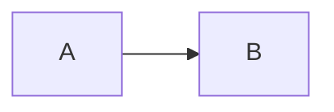

# 博客整体架构设计（滚动总览）

> Created: 2026-08-14
> Updated: 2026-08-17
> Status: accepted baseline（已拍板原则可实施；阶段进入门见文末）
>
> 本文档记录全站架构与已经对齐的产品边界。已拍板的决策标 ✅，方向已定但实现细节仍需规格化的标 🔶，完全待讨论的事项收录在文末。

## 问题陈述

本项目是羽升的公开个人博客与电子分身，不是论坛、多人投稿平台、协作知识库或在线考试系统。
博客在普通公开阅读能力之上增加四项核心能力：

1. 以 Markdown 为权威源、可通过注册表扩展的文档渲染内核；
2. 文章级评论与选区级注释；
3. 轻量、无后台统计的文章内自测组件；
4. Markdown、TXT、DOCX、PDF 多格式直接导出。

系统设计必须同时满足：中文 UTF-8 不损坏、Git diff 可读、静态部署稳定、用户内容安全、组件可独立升级、导出语义一致，以及后续登录/编辑能力可接入但不提前复杂化。

## 整体架构画像 ✅

```text
content/posts/<slug>/index.md（正式文章唯一权威源）
        │
        │ 构建期：解析、校验、收集资产、生成静态路由
        ▼
Canonical Document IR（统一文档中间模型）
        ├─ article profile ──────> EdgeOne 静态阅读页面
        ├─ discussion profile ───> 评论/注释安全富文本
        └─ export projection ────> Markdown / TXT / DOCX / PDF

Supabase（运行时公开增量）
        ├─ 登录身份（后期接入，邮箱登录弹窗）
        ├─ 文章级评论与回复
        ├─ 选区级注释与回复
        └─ 在线编辑草稿（后期接入）
```

- 部署形态维持 `output: 'export'` 纯静态导出；所有正式文章默认公开。
- 正式文章不以数据库为权威源；Supabase 只承载运行时增量和未来草稿。
- 评论与注释不写回 `index.md`，只在阅读和导出时叠加。
- 每次消费动作都通过同一 parser/Canonical IR/registry 契约编译；同一次消费中的屏幕、目录、选择和导出投影复用 IR，不为不同输出维护不同语法实现。讨论内容仍须在写入和每次读取时复验，不能把“统一管线”误解成永久信任一次解析结果。
- 当前 `src/app/api/ping/route.ts` 与 export 模式的兼容性仍需在实现期处理。

## 决策记录

### D1 公开内容与最小身份模型 ✅

当前博客没有私密文章、私人注释或仅自己可见的评论。所有文章、评论、注释和回复都对访客公开。

身份只用于写入权限，不用于阅读权限：

| 身份 | 阅读 | 评论/注释/回复 | 编辑自己发布的内容 | 编辑文章 | 删除任意讨论内容 |
|---|:---:|:---:|:---:|:---:|:---:|
| 匿名读者 | ✅ | ❌ | ❌ | ❌ | ❌ |
| 普通成员（已登录） | ✅ | ✅ | ✅ | ❌ | ❌ |
| 作者（白名单邮箱） | ✅ | ✅ | ✅ | ✅ | ✅ |

- 登录后才能创建评论、注释或回复；未登录时由弹窗式登录入口承接，不设置独立 `/login/` 页面。
- 权限身份固定使用“匿名读者 / 普通成员 / 作者”；“作者/访客”只是一组讨论展示徽标，其中普通成员显示“访客”，不要把展示文案反推成权限。
- “作者/访客”徽标由认证系统的已验证邮箱与服务端白名单派生，不接受客户端传入的 `isAuthor`。
- 普通用户和作者都只能编辑自己创建的评论、注释或回复；作者不能篡改其他人的文字。
- 作者可以删除任意评论、注释和回复。
- 编辑只更新正文与 `updatedAt`，不保存编辑历史。
- 删除采用硬删除；删除根评论或根注释时级联删除全部回复，不保留墓碑或回收站。
- 真实认证提供方、白名单存放方式和邮件登录流程后续单独规格化；文章编辑权长期只授予作者白名单。

### D2 内容存放：仓库正本 + 运行时增量 ✅

- 正式文章 = `content/posts/<slug>/index.md`，构建时打进静态站。
- 文章专属数据、媒体和嵌入页面与文章共居。
- 评论、注释、回复、登录身份和未来草稿 = Supabase。
- 在线编辑保存只形成云端草稿；正式发布必须回写仓库 Markdown 并重新部署。
- Supabase 故障不应导致正式文章正文丢失或不可恢复。

### D3 权威内容格式：Markdown + 内置语法 + XML 风格标签 ✅

一篇文章由以下部分组成：

1. frontmatter 元信息；
2. CommonMark/GFM 风格 Markdown；
3. KaTeX 行内公式与块级公式；
4. Mermaid 围栏代码块（支持官方图类型，使用严格安全配置）；
5. 白名单 XML 风格自定义标签；
6. `data/`、`media/`、`embeds/` 中的外置资源。

````markdown
---
title: 三体运动的混沌之美
date: 2026-08-15
---

# 三体运动的混沌之美

行内公式 $E = mc^2$。

$$
E = \frac{1}{2}mv^2
$$



<canvas-render id="three-body" renderer="three-body" data-src="./data/three-body.json" />
<video-embed id="experiment-video" src="./media/video/experiment.mp4" poster="./media/images/poster.webp" />
````

标签语法规则：

- 名称统一为小写 kebab-case；
- 每个自定义组件必须有文章内唯一且稳定的 `id`；
- 纯引用组件使用自闭合标签；包含正文或降级说明的组件使用成对标签；
- 少量字符串、数字、布尔值和枚举放属性；复杂配置外置到 `data/`；
- 属性可换行以保持可读，但不允许 JavaScript 表达式、事件处理器或任意动态 import；
- 未注册、属性非法或资源缺失的标签必须安全降级并输出可定位诊断，不得使整篇文章崩溃。

普通图片继续保留标准 Markdown 图片语法；只有画廊、对比、缩放等高级图片能力才使用自定义标签。

### D4 评论与注释是两个清晰的产品概念 ✅

**评论（comment）**针对整篇文章，不需要选区。右侧评论区显示文章级评论线程。

**注释（annotation）**只针对正文中的稳定选区。用户通过划词助手创建，右侧注释区按正文位置展示注释线程。

- 已登录用户都可创建评论、注释和回复；不再用白名单限制注释创建。
- 评论根线程的目标是文章；注释根线程的目标是文本锚点。
- 回复继承根线程目标，不创建新的文章或选区锚点。
- 前端不再提供“发布注释/发布评论”模式切换：划词入口只创建注释，评论区输入框只创建评论。
- 每条内容按发布者已验证邮箱显示“作者”或“访客”徽标。
- 评论和注释使用不同面板、查询和排序规则，但共享回复、编辑、删除、权限和富文本渲染基础设施。
- 注释默认按正文锚点从上到下排序；同一锚点内按创建时间排序。该排序细节在实现验收前仍可微调。

### D5 注释锚定：源内容坐标 + Web Annotation 多重选择器 ✅

浏览器 Selection/Range 只是捕获入口，持久化锚点必须映射回文档源节点，不能绑定易变的 DOM 层级。

每个注释锚点至少记录：

- 文章 slug 与正文指纹；
- 起止稳定块 ID 与字符偏移；
- 精确引语 `exact`；
- 前后文 `prefix/suffix`；
- 标题路径；
- 当前锚定状态。

支持划词的内容：标题、段落、引用、列表、表格、行内文本、代码块和 KaTeX 公式。

不支持划词的内容：Mermaid 节点文字、Canvas、SVG、HTML/网页 iframe、图片、视频、音频、问答组件和其他自定义渲染结果。

第一版选择范围限制在单个语义块内：允许跨粗体、链接等多个 DOM Text Node，但不跨段落、标题、列表项或自定义组件边界。KaTeX 以整条行内公式或整个块级公式作为最小锚定单元，并在导出时引用原始 TeX。

正文变化后的重连顺序为：稳定块和位置 → 精确引语与上下文 → 标题路径辅助消歧 → 失锚待认领。

### D6 文档引擎：统一 IR、注册表与渲染档位 ✅

底层采用 unified/remark/rehype 生态解析 Markdown，不自造通用 Markdown 解析器。Markdown、KaTeX 和 Mermaid 是内置语法节点；Canvas、SVG、HTML、网页、媒体和问答题通过自定义标签注册。

注册项不是简单的“标签名 → React 组件”，而是完整内容能力契约：

```text
name / version / schema / compile / assets
screen renderer / hydration / selectable
markdown export / text export / docx export / pdf export
fallback / security / accessibility / allowed profiles
```

统一渲染入口通过 profile 控制能力，而不是复制组件：

```tsx
<DocumentRenderer source={articleSource} profile="article" />
<DocumentRenderer source={commentBody} profile="discussion" />
<DocumentRenderer source={annotationBody} profile="discussion" />
```

- `article`：仓库内受信任内容，可使用完整注册能力；高风险 HTML/网页仍必须在沙箱中运行。
- `discussion`：登录用户提交的不可信内容，只允许安全富文本，以及同时通过集中 allowlist 和安全审查的注册组件；组件自报能力不能直接放行。
- `editor-preview`：未来源码编辑预览，与文章 schema 一致但具有清晰错误诊断。
- `export`：从统一文档模型投影到 Markdown/TXT/DOCX/PDF，不重新解析页面 DOM。

评论/注释默认允许 Markdown、代码、表格、KaTeX、严格模式 Mermaid；默认禁止原始 HTML、任意 JS/CSS、图片、音视频、SVG/HTML/网页嵌入和任意动态模块路径。v1 不开放 discussion Canvas；后续组件必须进入集中 allowlist、参数 schema 有界且通过专项安全审查后才能开放。

不可信讨论内容必须在写入前验证，并在每次读取渲染时再次经过 profile 校验和最终 sanitize；数据库中的已存内容不能被视为可信 HTML。

### D7 Canvas、SVG、HTML 与网页嵌入的安全层级 ✅

| 能力 | 正文实现 | 讨论区 | 静态导出 |
|---|---|---|---|
| Canvas | 注册键映射仓库内受审查代码，参数/数据外置 | v1 禁止；以后仅集中安全清单 | 组件提供 PNG/SVG 快照 |
| SVG | 构建期清洗后以独立资源/`img` 加载，不内联父 DOM | 禁止 | 复用同一安全投影，优先矢量 |
| 本地 HTML | 只允许 `<html-embed>` 引用 `embeds/`；sandbox iframe 可运行脚本但不授予同源能力 | 禁止 | 截图或降级卡片 |
| 站内网页 | P0 一律降级；不放开全站 `DENY`，也不使用会让相对资源按父页解析的 `srcdoc` | 禁止 | 标题 + 域名 + 打开链接 |
| 自有外部页面 | `web-embed` 集中 allowlist；P0 空名单即降级 | 禁止 | 标题 + 域名 + 打开链接 |
| 第三方网页 | `web-embed` 集中 allowlist；未命中或 4 秒内未加载即降级 | 禁止 | 标题 + 域名 + 打开链接 |

导出不抓取远端预览图：规格 12.4 禁止服务端代抓作者提供的任意 URL，静态站也没有运行时可抓。

iframe 的默认 sandbox 仅含 `allow-scripts`；表单、弹窗、下载、顶层导航、modals、剪贴板、同源能力和其他浏览器权限均默认关闭。额外能力只能由受审 renderer 固定声明，不能由文章属性任意开启。`postMessage` 必须校验 iframe window、随机 capability nonce 和消息 schema。

**v1 安全门（方案 A，已 accepted，详见 issue #25）**

- **不引入独立子域**。`output: 'export'` + EdgeOne Pages 没有运行时，独立源需要第二套 DNS/证书/站点。隔离性由 sandbox **不含 `allow-same-origin`** 提供的 opaque origin 承担；独立子域后置到 P1。
- 因为是 opaque origin，`event.origin` 恒为 `"null"`，`postMessage` 校验必须落在 `event.source` 比对 + 一次性 capability nonce + 严格消息 schema 上。
- **嵌入页公开 URL 固定为单一前缀 `/embeds/<slug>/<embed-id>/`**，不落在 `/blog/<slug>/` 之下。原因是 EdgeOne `edgeone.json` 的 `source` 最多只能含一个 `*`，`/blog/*/embeds/*` 非法，而 `/blog/*` 会连带放开整站文章页的点击劫持保护。
- 全局 `X-Frame-Options: DENY` 保留；`/embeds/*` 用**同 key 覆盖**为 `SAMEORIGIN` 并补 `Content-Security-Policy: frame-ancestors 'self'; sandbox allow-scripts`。`frame-ancestors` 只允许本站父页面，文档级 `sandbox` 也约束顶层直接访问；EdgeOne 的 header `value` 长度下限是 1，无法用空值删除已有响应头，所以只能覆盖不能撤销。
- `web-embed` 走集中 allowlist；未命中或远端拒绝嵌入时降级为预览卡片（标题 + 域名 + 打开链接）。
- 顶层直接访问 `/embeds/.../index.html` 时同样受文档级 CSP `sandbox allow-scripts` 约束，不能借顶层导航绕过 iframe sandbox。独立子域仍后置到 P1。

“允许脚本运行”不等于“允许读取博客登录态和父页面 DOM”。沙箱内容与父页面通信时只能使用有来源校验和消息 schema 的 `postMessage` 协议。

### D8 媒体与轻量问答组件 ✅

- 普通图片使用标准 Markdown；高级图片、视频和音频使用注册组件。
- 视频/音频不自动播放，必须提供标题；视频推荐提供 poster，音频推荐提供转写或摘要。
- 媒体文件计入 EdgeOne 单文件 ≤25 MB 和总文件数 ≤20,000 限制。
- 选择题和填空题是纯前端自测组件：不登录、不上报、不统计、不排行、不保存成绩，刷新后可重置。
- 题目复杂数据优先放 `data/*.json`；正文只引用组件 ID 和数据路径。
- 问答组件的讨论区使用默认关闭，未来有真实场景时须经集中 allowlist 与专项审查开放，不能只由组件自报安全。

### D9 导出：一份 Export Document IR，多种格式 ✅

所有导出从 Canonical Document IR、编译结果保存的不可变 `originalSource` 与公开评论/注释生成统一 Export Document IR，再投影到具体格式。不得让每个导出器重写 Markdown 语法或抓取当前页面 DOM；Markdown 纯正文直接返回已校验的 `originalSource`，其他格式消费语义 IR。

Markdown 导出保留原始 frontmatter、Markdown、KaTeX、Mermaid 和自定义标签。运行时讨论内容不插入原句内部，而以带稳定目标、精确引语、作者、时间和回复关系的审阅附录追加，避免破坏列表、表格、代码和公式。

Markdown 提供四种组合：

1. 纯正文；
2. 正文 + 注释；
3. 正文 + 评论；
4. 正文 + 注释 + 评论。

TXT、DOCX 和 PDF 默认可选择相同内容范围。DOCX 是结构化 OOXML 文档，不是伪装成 Word 的纯文本。

PDF 必须点击后直接生成并下载文件，不调用 `window.print()` 或系统打印对话框。PDF 追求语义与结构保真，不要求动态网页逐像素复刻：Canvas 用快照，Mermaid/SVG 优先矢量，音视频用封面/标题/链接，网页嵌入用预览卡片，问答题用静态题面并可选择是否包含答案与解析。

浏览器端 Blob 生成是第一候选，具体 PDF/DOCX 库必须经过中文字体、分页、公式、SVG、长文档、包体积和 active-content 安全验证后再锁定；导出实现动态加载，不进入普通阅读首屏包。不可信讨论在每种目标格式中都必须重新经过 discussion profile 与格式专用编码，导出器不得服务端抓取用户控制 URL。

### D10 在线编辑：后期接入、白名单独占 ✅

- 阅读页顶部“编辑”未来切换渲染/源码模式，不新建编辑路由。
- 只有作者白名单邮箱可以编辑文章；评论用户不能投稿或编辑正文。
- 编辑保存为 Supabase 全文草稿 + 正本基线指纹，不存 diff、不存历史版本。
- 正式发布必须回写仓库 `index.md` 并重新部署。
- 第一阶段不接入真实登录或在线编辑，但接口和模块边界必须预留。

### D11 动画 / 3D 技术栈分层 ✅

| 层 | 用途 | 选型 |
|---|---|---|
| L1 UI 微交互 | 按钮、面板收展、导航渐隐 | CSS transition + Tailwind |
| L2 编排动画 | 滚动叙事、文字效果 | GSAP + ScrollTrigger |
| L3 3D 场景 | 立体书、摄像机、金光 | Three.js via R3F + drei |
| 绳挂导航 | 绳子慢摆 | 轻量 verlet 或 SVG+GSAP |

**UI 动效语言**：阻尼、慢、ease-out，用来塑温馨书卷。大位移默认 `cubic-bezier(.22, .82, .28, 1)`（`--ease-damp`）；连续量每帧约 0.035 追赶。大块栏与页尾禁止弹簧回弹。含义菜单（导出、设置、弹窗）统一 `--ease-pop` 缓动放大，只允许一次很小的过冲；Tab 切换用短骨架懒载，不用整栏时长。首页 3D 叙事可以更有戏剧性，入门后的绳挂、通知、面板仍走这套语言。细则见 [frontend-design.md 第三节](../conventions/frontend-design.md)。

首页滚动叙事的详细决策继续由 `home-journey-storyboard.md` 管理；博客文档引擎不得与首页 3D 运行时耦合。

### D12 组件库与配套选型 ✅

| 用途 | 方向 |
|---|---|
| 无样式交互基座 | Radix UI（按需拷贝源码） |
| 目录图形模式 | React Flow / @xyflow/react |
| 左右栏拉动 | react-resizable-panels |
| 全局设置状态 | zustand |
| 音效 | howler.js |
| Markdown 管线 | unified / remark / rehype |
| 公式 | KaTeX |
| 图表 | Mermaid |
| 评论/注释/身份/草稿 | Supabase 适配层 |

PDF 与 DOCX 库尚未锁定；不得在没有中文长文档验证的情况下把候选库写成既定依赖。

### D13 主题与首页范围 ✅

- 常规页面使用宣纸黄、浅蓝、米白、纯黑四套主题。
- 首页 3D 叙事固定一套视觉；首页 UI 挂件仍走主题 token。
- 文档渲染器、评论、注释和导出预览不能硬编码颜色。

### D14 移动端与阅读布局 ✅

- 首页移动端使用卡片入口，不加载 3D 资源。
- 阅读页桌面端为左目录 / 中正文 / 右工作区三栏，下接整幅页尾评论区。
- 右工作区至少包含评论、注释和未来 Agent 入口；评论和注释是两个明确面板。
- 中小屏将左右栏收成抽屉，划词工具条与右侧面板必须适配触摸操作。
- `/blog/` 与 `/blog/<slug>/` 的布局、交互与视觉 **1:1 对标** [blog-reader-prototype.html](./blog-reader-prototype.html)；文字说明见 [blog-reader-design.md](./blog-reader-design.md)。架构本文只定产品边界，不为博客页另写一套外观。
- 左栏图形模式是文章的骨架屏缩略，不是第二棵标题树：只画一级标题 + 正文骨架条，条数按篇内正文篇幅相对映射（文字越长条越多）。原则写入 [frontend-design.md](../conventions/frontend-design.md)。
- 进入博客页先盖一层跟主题走的书册遮罩；右栏展开/收起先出骨架再缓出真内容。形态以原型为准。

### D15 路由与未来板块 ✅

- `/blog/`：文章列表。
- `/blog/<slug>/`：文章阅读页。
- `/notes/`、`/works/`、`/about/`：平行一级路由，当前预留。
- 不设置 `/login/`，登录使用弹窗。
- 导出是阅读页动作，直接下载文件，不为每种格式建立公开页面路由。

### D16 文章分享 ✅

- 移动端优先 Web Share API，不支持时复制链接。
- 标题锚点深链保持稳定。
- frontmatter 为每篇文章提供标题、摘要、封面等 OG 元信息。

### D17 云端草稿：快照 + 基线指纹 ✅

每篇文章最多一份云端草稿：改后全文 + 编辑时正本指纹。保存覆盖，不存历史。需要查看修改时，用草稿与当前正本现算 diff。

### D18 content/ 与 EdgeOne 部署兼容性 ✅

EdgeOne 构建期可读取根目录 `content/`，只上传 `out/`。文章媒体和嵌入资产必须由受控构建步骤复制到输出产物，并验证路径、单文件大小、总文件数和来源。

### D19 首页活字引擎：Pretext ✅

Pretext 服务两处，都不进正文包：首页活字用它算字符位置（GSAP 管时间线，Canvas/WebGL 绘制）；阅读页进页书册遮罩只用 **Pretext Two**（`prepareWithSegments` + `layoutNextLineRange`）在 Canvas 上铺浅印章，绕开中间的书，揭开后卸掉。正文与讨论渲染不用 Pretext。

### D20 执行位置与性能预算 ✅

性能不是实现期的优化技巧，而是"哪一段代码在哪里执行"的架构决定：默认在构建期完成，构建期做不到的推迟到用户真正需要它的那一刻，进入浏览器的一律按需加载。

- 公式在构建期渲染为 HTML；图片响应式尺寸与现代格式由构建期流水线产出——`output: 'export'` 关闭了 Next.js 图片优化，原图会原样投放。
- 讨论解析必须在浏览器执行：安全模型要求每次读取重新验证，不能预编译或把清洗结果当作可信 HTML。因此讨论面板未打开时不加载解析器、公式运行时与数据。
- 同一套 parser/IR/registry 在两个位置执行，共享实现保证规则一致，但两侧成本不同，不能因为"是同一套内核"就假定讨论渲染是免费的。
- 阅读路径与其他一切分账：正文首屏必须便宜；3D、讨论、导出可以重，但只在用户主动触发时付费。
- 中文字体按 `unicode-range` 切片经云字体服务加载（不自托管，字体不进仓库与 `out/`），不按站内已用字整体裁剪（讨论字符集构建期不可知）；导出所需的完整字体与阅读切片分开计量，导出时从 CDN 拉取。
- 讨论、注释与登录是增强能力，其数据来自境外服务；较高延迟与偶发失败属预期，任何情况下不得阻塞正文渲染。
- DOCX/PDF 导出在 Web Worker 中执行，否则"可取消"无法成立。
- 具体预算数字与实测要求见功能规格 13.1–13.3；每阶段验收必须实测并记录首屏体积。

### D21 全站共用外壳：以阅读页原型为模板 ✅

绳挂导航、下落便签通知、弹窗、抽屉、滚动条、便笺提示、正文组件卡片，全站只此一套。`/notes/` `/works/` `/about/`、404、登录未另出原型前，只换内容，不换外壳。实现 1:1 对标 [blog-reader-prototype.html](./blog-reader-prototype.html)，禁止按页面再做一套通知栏或顶栏。清单见 [frontend-design.md 四之四](../conventions/frontend-design.md)。

### D22 本地改稿草稿：创作期草稿，不是私人注释 ✅

架构 D1 声明站内无私密内容。本机 `localStorage` 里的注释不是注释的可见性等级，而是创作期草稿（类比 D17 已允许的云端草稿）：走同一套 `DiscussionRepository` 接口和 `discussion` profile 校验，但存储实现在本机，语义上从不进入公开讨论库。

- 默认关闭；设置面板的「本地作者模式」打开后才出现可写 UI（生产构建上 `DISCUSSION_WRITES_OPEN` 仍代表公开写入，保持关闭）。
- 数据只存在本机；清除站点数据会丢失。导出的 `.review.md` 才是可带走的持久产物。
- D1 不因此修改。Supabase 公开写入仍归 P1，落地时不存在「本地这批要不要同步上去」的糊涂账。

### D23 `/blog/` 目录 3D 书库：纯 CSS 3D 复刻原型 09，目录树兜底 ✅

目录页的信息架构是两级：板块（大方向）→ 文章。视觉对应为：每个板块一本横向「方向书」（左窄书脊 + 右侧大书页），垂直堆叠；点击后书页绕左书脊平转 174° 翻开，露出该板块的文章书脊架（竖排书脊、参差高度、金带封头、横向滚动、悬浮整本抽出并下落书签展示完整标题）。技术路线曾引入 Three.js via R3F 做真 3D，因翻页形态与光影始终无法 1:1 还原原型 09，最终回退为**纯 CSS 3D**（`shelf-stack.tsx`：perspective + preserve-3d + rotateY），理由：

- 验收标准是「与原型 09 一模一样」，原型本身就是 CSS 3D 实现，CSS 移植是 1:1 的最短路径；
- 不依赖 WebGL，无 chunk 懒载负担，所有主题 token 天然随 CSS 变量切换；
- 交互全部原生复刻：一次只展开一册、点空白/其他方向/Esc 收合、滚轮转横向、两端渐隐提示、hash 深链（`#<section-slug>`）。

边界与降级：

- 降级路径是目录树视图（`tree-index.tsx`，手风琴）：`prefers-reduced-motion`、窄屏（<768px）、粗指针设备自动落入；用户可经右上角「视图」按钮手动切换，`localStorage` 记忆选择。
- 文档级收合监听不依赖 `stopPropagation`（React 根委托下不可靠），改为 document 侧 `closest('[data-book-slug]')` 命中判断。
- 阅读页 chrome 保持原型 1:1，3D 不泄漏；外壳与阻尼动效仍归 D21。

## 模块边界总览 ✅

```text
doc-engine      文档解析、注册表、profile、安全、屏幕渲染与节点级导出投影
export-service  组合文章 IR 与规范化讨论快照，生成各格式文件
discussions     评论/注释共享的线程、回复、权限、仓储和富文本基础
comments        文章级评论面板与评论输入
annotations     选区捕获、锚点、高亮、注释面板与注释输入
reader-layout   三栏阅读布局、面板收展和响应式抽屉
toc             目录树与图形目录
auth-shell      后期登录弹窗、身份接口与作者白名单策略
article-editor  后期源码编辑、草稿和正式发布流程
agent-shell     未来选区询问与电子分身接口外壳
```

完整目标目录树以 [项目结构与文件组织](../conventions/project-structure.md) 为准；详细字段与行为以 [博客内容引擎功能规格](../specs/blog-content-engine.md) 为准；实施顺序以 [P0–P3 工程计划](../plans/plan-blog-foundation.md) 为准。

## 阶段进入门与后置事项

- [x] frontmatter v1 最小字段、slug 归属、首批标签名/最小属性、错误分级、原始 Markdown 保存方式与锚点 offset 协议已锁定，见功能规格；
- [x] `discussion` v1 允许 Markdown/代码/表格/KaTeX/严格 Mermaid，图片、媒体、HTML、iframe、SVG 和 Canvas 均不开放；
- [ ] P0 所需解析/schema/测试依赖安装授权；
- [ ] 各注册组件的扩展属性、错误码和综合黄金 fixture；
- [ ] 注释列表排序和同一锚点聚合的最终交互；
- [x] iframe 隔离源、CSP/Permissions Policy/响应头与当前 `X-Frame-Options: DENY` 的协调 —— 见 D7「v1 安全门（方案 A）」，issue #25；
- [ ] P2 前完成登录提供方、作者白名单私有配置、阿里云邮件推送独立规格；
- [ ] P2 前完成 Supabase 表结构、RLS/RPC、不变量、anchor manifest 同步、删除级联和限流；
- [ ] PDF/DOCX 技术验证、中文字体与目标格式安全策略；
- [ ] 在线编辑回写仓库的发布流程；
- [ ] Agent “询问”接口上下文协议；
- [ ] `src/app/api/ping/route.ts` 与 export 模式冲突处理；
- [ ] 首页分镜、文案和音效的独立待决项。

## 总纲原则

1. **博客优先**：这是公开个人博客，不把评论、测验或编辑扩张成独立平台。
2. **正本不动**：仓库 Markdown 是正式文章唯一权威源；运行时增量不污染正本。
3. **一套内核，多种档位**：文章、讨论和预览复用同一文档模型与注册表，通过屏幕 profile 控制权限；导出在同一 IR 上做目标格式投影。
4. **代码复用不等于权限复用**：不可信评论可以调用安全能力，但不能执行任意 HTML、JS、CSS 或远程模块。
5. **组件自证完整**：每个注册组件同时声明屏幕、失败降级、选择、安全和导出能力。
6. **语义导出优先**：导出从统一 IR 生成；PDF/DOCX 是结构化投影，不抓取当前页面碰运气。
7. **按真实需求演进**：不预建论坛、审核状态机、测验后台、私密可见性和复杂角色系统。
