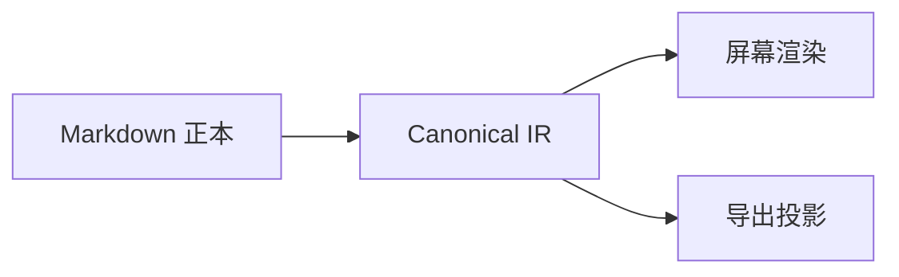

# P0 中文综合验收文章

这是一篇只包含**合法内容**的黄金文章。它同时验证中文、English、`inline code`、[站内链接](/blog/)、脚注[^note]与软换行。

## Markdown 与 GFM

- [x] 任务列表
- [ ] 待办项目
- 支持 ~~删除线~~ 与 **粗体**、*斜体*

| 能力 | 状态 | 说明 |
| --- | --- | --- |
| CommonMark | ✅ | 基础正文 |
| GFM | ✅ | 表格、任务列表、脚注 |

> 内容协议必须可读、可 diff，也必须能稳定降级。

[^note]: 脚注用于验证 GFM 扩展。

## 代码

```ts
export function greet(name: string) {
  return `你好，${name}`
}
```

## KaTeX

行内公式 $E = mc^2$ 与块级公式：

$$
\int_{0}^{1} x^2\,dx = \frac{1}{3}
$$

## Mermaid



## 图片


## 媒体与安全组件

<video-embed id="demo-video" src="./media/video/demo.mp4" title="一秒钟验收视频" poster="./media/images/poster.png" />

<audio-embed id="demo-audio" src="./media/audio/demo.mp3" title="一秒钟验收音频" />

<canvas-render id="function-plot" renderer="function-plot" data-src="./data/function-plot.json" width="720" height="360" />

<svg-embed id="safe-diagram" src="./media/svg/safe-diagram.svg" title="安全 SVG 示例" />

<html-embed id="mini-card" src="./embeds/mini-card/index.html" title="文章包内 HTML 小页" height="260">
无法加载交互小页时，显示这段安全降级说明。
</html-embed>

<web-embed id="unlisted-web" src="https://unlisted.invalid/embed" title="未进入白名单的网页" height="320">
该 URL 不在 allowlist，P0 必须显示降级卡片而不是 iframe。
</web-embed>

## 轻量问答

<choice-question id="choice-basics" data-src="./data/choice-question.json" />

<choice-question id="choice-multiple" data-src="./data/choice-question-multiple.json" />

<fill-blank-question id="fill-basics" data-src="./data/fill-blank-question.json" />

## 结束

当上面的内容都能稳定渲染、选择、降级和导出时，P0 内容纵向链路才算成立。

<!-- blog-review-appendix:v1 -->

## 审阅附录

> 本节由导出器生成，不属于文章正文；正文原文在本节之前，逐字节未改动。
> 给 AI 的说明：每条是作者对正文某处的改稿意见。用 `exact` 配合 `prefix`/`suffix`
> 在正文中定位——`startOffset`/`endOffset` 是渲染后纯文本坐标，不能直接切原文。
> 改完请删除本节。

- 文章：`p0-kitchen-sink`
- 文档指纹：`22f4fb117829eed5b793eb88c91cf444274c92c99226e5d13452b69ee68cbaaa`
- 快照时间：`2026-08-17T00:00:00.000Z`
- 注释：3 条（失锚 1 条）

### 注释 1 · 已锚定

**位置**：p0-中文综合验收文章

```blog-review-locator
{"kind":"annotation","threadId":"anno-locus-a-1","anchorState":"attached","protocolVersion":1,"articleSlug":"p0-kitchen-sink","documentFingerprint":"22f4fb117829eed5b793eb88c91cf444274c92c99226e5d13452b69ee68cbaaa","startBlockId":"block-paragraph-b9a4cffa8f0fcabe","startOffset":4,"endBlockId":"block-paragraph-b9a4cffa8f0fcabe","endOffset":16,"exact":"只包含合法内容的黄金文章","prefix":"这是一篇","suffix":"。它同时验证中文、English、inline code、站内链","headingPath":["p0-中文综合验收文章"]}
```

**普通成员（访客）· 2026-08-16T02:00:00.000Z · 第 1 层**

```blog-review-entry
这里同时验证中文与协议正文。
```

### 注释 2 · 已锚定

**位置**：p0-中文综合验收文章

```blog-review-locator
{"kind":"annotation","threadId":"anno-locus-a-2","anchorState":"attached","protocolVersion":1,"articleSlug":"p0-kitchen-sink","documentFingerprint":"22f4fb117829eed5b793eb88c91cf444274c92c99226e5d13452b69ee68cbaaa","startBlockId":"block-paragraph-b9a4cffa8f0fcabe","startOffset":4,"endBlockId":"block-paragraph-b9a4cffa8f0fcabe","endOffset":16,"exact":"只包含合法内容的黄金文章","prefix":"这是一篇","suffix":"。它同时验证中文、English、inline code、站内链","headingPath":["p0-中文综合验收文章"]}
```

**羽升（作者）· 2026-08-16T02:10:00.000Z · 第 1 层**

```blog-review-entry
同一选区的第二条注释。
```

### 注释 3 · 失锚

**位置**：p0-中文综合验收文章 / 代码

```blog-review-locator
{"kind":"annotation","threadId":"anno-orphaned-1","anchorState":"orphaned","protocolVersion":1,"articleSlug":"p0-kitchen-sink","documentFingerprint":"22f4fb117829eed5b793eb88c91cf444274c92c99226e5d13452b69ee68cbaaa","startBlockId":"ghost-block-removed","startOffset":0,"endBlockId":"ghost-block-removed","endOffset":8,"exact":"早期版本中被引用的一段文字","prefix":"","suffix":"","headingPath":["p0-中文综合验收文章","代码"]}
```

**普通成员（访客）· 2026-08-16T01:00:00.000Z · 第 1 层**

```blog-review-entry
这段已经从正文消失，卡片必须保留。
```

<!-- /blog-review-appendix:v1 -->
